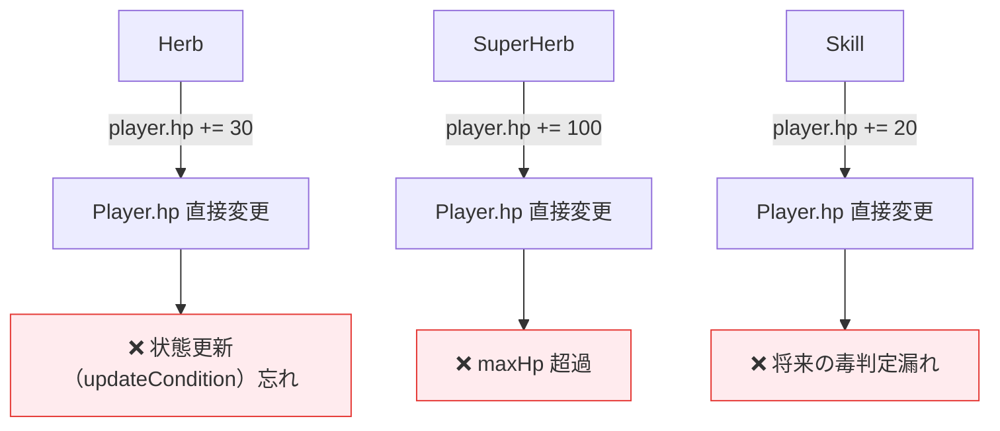
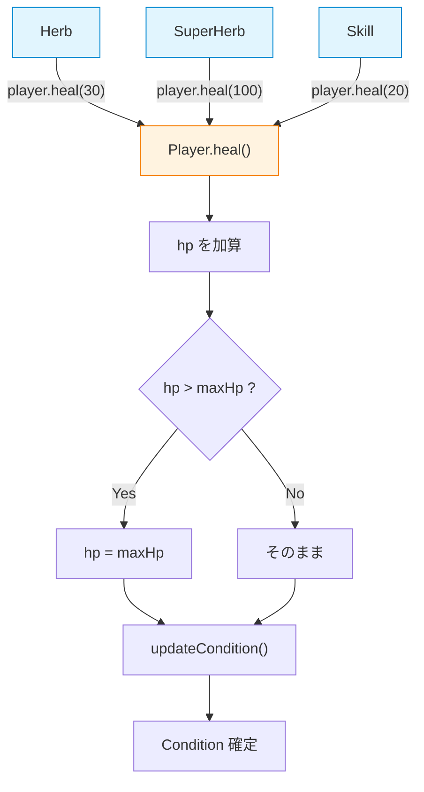
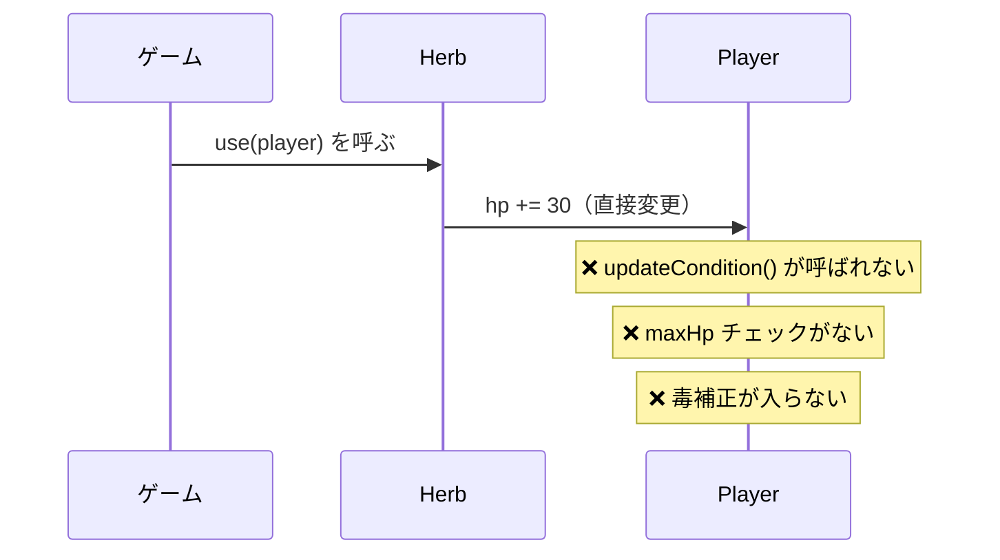
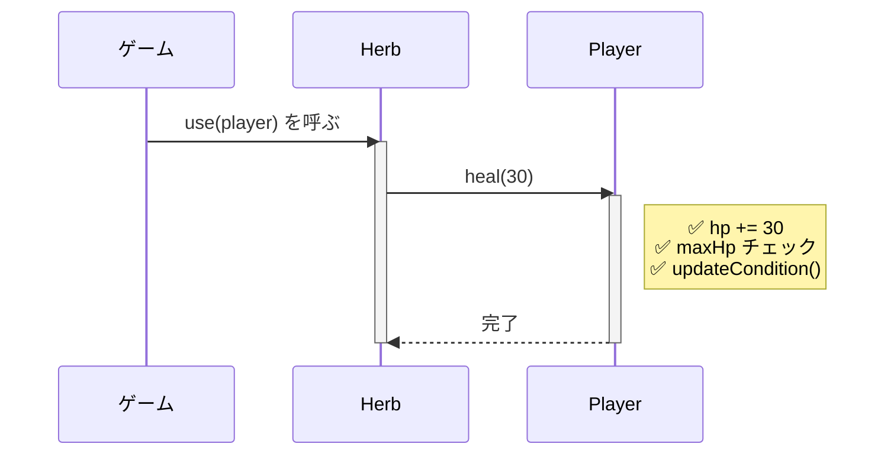
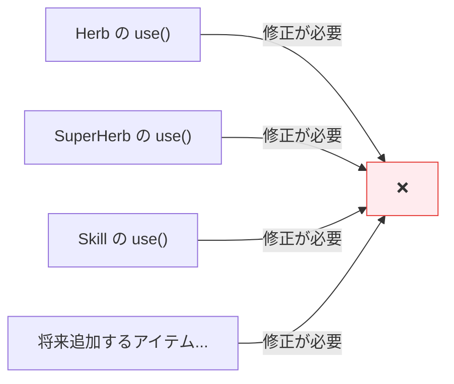
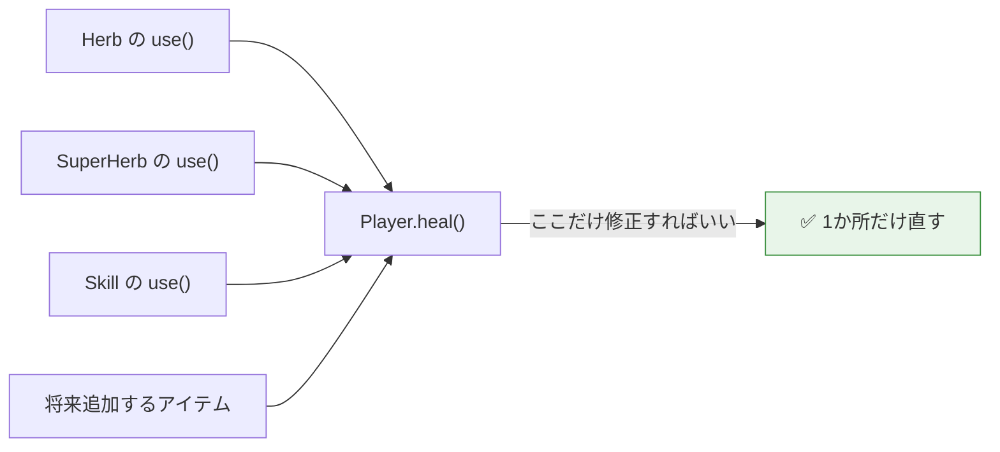
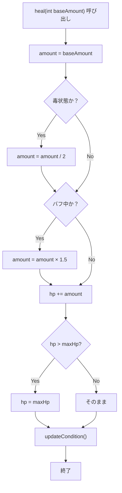
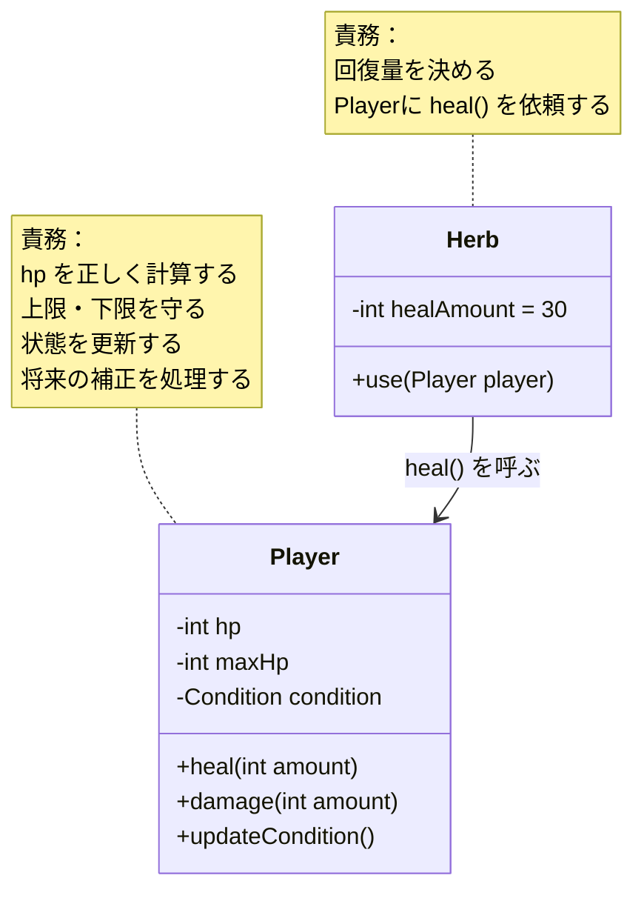
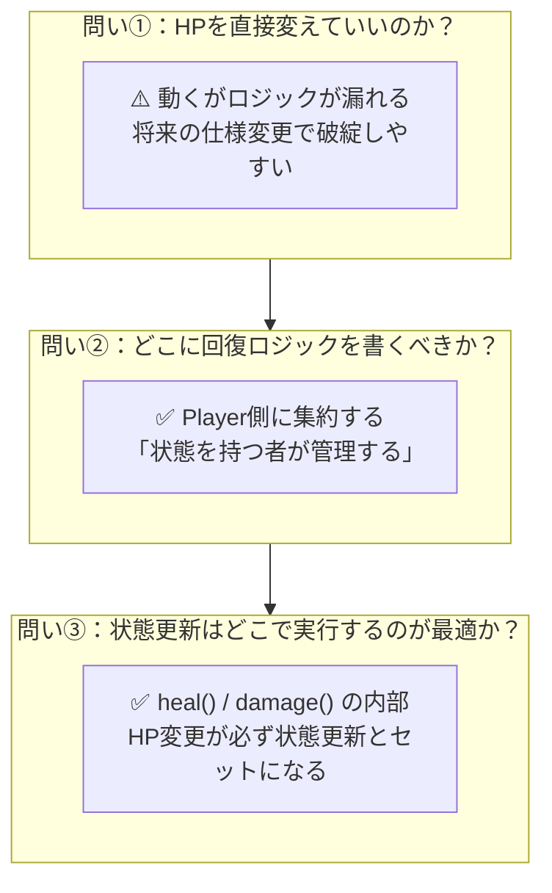

# 第2章：設計を考える

---

## 2-1 問いかけ

第1章で `Player` クラスを作った。`heal()` という関数があり、HP変更はそこを通じて行う。

ここで一度立ち止まって考えよう。

---

> **「なぜ `heal()` を経由しないといけないのか？**
> **`player.hp += 30` と直接書いてはダメなのか？」**

---

答えだけ先に言うとこうだ。

> **「ダメではない。でも、設計として壊れやすい。」**

なぜ壊れやすいのか。具体的に見ていく。

---

## 2-2 ダメな設計：ロジックが散らばる

「直接変える」設計でコードを書いたとする。

```cpp
// グリーンハーブを使うとき
player.hp += 30;

// スーパーハーブを使うとき
player.hp += 100;

// スキルで回復するとき
player.hp += 20;
```

これの何が問題か？



3種類の「回復する処理」が、バラバラな場所に書かれている。

- `updateCondition()` を呼び忘れると、HPが変わっても表示状態が変わらない
- `maxHp` のチェックを忘れると、HP が 130/100 になる
- 将来「毒状態なら回復半減」という仕様が追加されたとき、**3か所全部を書き直す**必要がある

「今は動く。でも、後で必ず壊れる。」

---

## 2-3 王道設計：Playerに集約する

正しい設計はこうだ。



**全ての回復処理が `heal()` という1つの窓口を通る。**

- 上限チェック：`heal()` の中で **1回だけ** 書けばいい
- 状態更新：`heal()` が **必ず** 呼んでくれる
- 仕様変更：`heal()` を **1か所だけ** 直せばいい

---

## 2-4 設計の原則

このような考え方をひとことで表すとこうなる。

---

> ### 「状態を持つクラスが、その状態変更の責任を持つ」

---

`hp` を持っているのは `Player` だ。
だから HP を変えるロジックも `Player` が持つべきだ。

`Herb` は「回復量」というデータを持っている。
でも「HPをどう変えるか」は知らなくていい。
知っているのは `Player` だけでいい。

---

## 2-5 シーケンス図で比較する

### ダメな設計：Herb が Player の内部に直接触る



### 王道設計：Herb は heal() を呼ぶだけ



`Herb` が知っているのは「`player.heal(30)` と呼ぶ」という事実だけ。
`Player` の内部でどんな処理が起きているかは、`Herb` は知らなくていい。

これを **情報隠蔽（カプセル化）** と呼ぶ。

---

## 2-6 仕様変更に強い設計

ここが設計のもっとも重要なポイントだ。

ゲーム開発では、仕様は**必ず変わる**。

「毒状態なら回復量が半減する」という仕様が追加されたとする。

### ダメな設計の場合



**回復するものが増えるほど、修正箇所が増える。**

### 王道設計の場合



`Player::heal()` を1か所修正するだけで、**全ての回復処理に自動的に適用される。**

---

## 2-7 仕様変更後の `heal()` の姿

「毒状態なら回復半減」「バフがあれば1.5倍」が追加された場合、`heal()` はこうなる。



この複雑なロジックが `heal()` の中に**1か所だけ**ある。

`Herb` も `SuperHerb` も `Skill` も、**全く変更しなくていい。**

---

## 2-8 責務の整理

「誰が何の責任を持つか」を表にまとめる。



| クラス | 知っていること | 知らなくていいこと |
|---|---|---|
| `Herb` | 回復量（30点）| HP の上限チェック、状態更新の仕組み |
| `Player` | HPを安全に変える方法 | どのアイテムが使われたか |

これが **責務の分離** だ。

---

## 2-9 「設計とは何か」

ここまでで、設計について重要なことが見えてきた。

---

> ### 設計とは「未来の変更コストを下げる行為」だ。

---

「今動く」だけなら、`player.hp += 30` でいい。

でも設計を考えるということは、

- 「3ヶ月後に毒状態が追加されたとき、どこを直すか」
- 「アイテムが100種類になったとき、コードは崩壊しないか」

を先に想像して、コードを組む。

プログラムの品質は「今の動作」だけでは測れない。

---

## 2-10 まとめ：3つの問いの答え

第2章の冒頭で立てた問いに答える。



---

## 2-11 確認問題

1. `player.hp -= 20;` と直接書いた場合、何が問題になる可能性があるか？
   具体的に2つ挙げよ。

2. 「毒状態では `damage()` を毎秒自動で呼ぶ」という仕様が追加された場合、
   今の設計ではどこを変更すればよいか？

3. `Herb` が `player.heal()` を呼ぶとき、`Player` の内部実装を知る必要はあるか？
   その理由は？

4. 以下の2つのコードを比較して、「設計として優れているのはどちらか」とその理由を説明せよ。

   **A案：**
   ```cpp
   class Herb {
       void use(Player& p) {
           p.hp += 30;
           if (p.hp > p.maxHp) p.hp = p.maxHp;
           p.updateCondition();
       }
   };
   ```

   **B案：**
   ```cpp
   class Herb {
       void use(Player& p) {
           p.heal(30);
       }
   };
   ```

---

## 次の章へ

設計の考え方が整理できた。

次の第3章では、実際に `Herb` クラスを実装する。
「回復量を持ち、`Player::heal()` を呼ぶだけ」というシンプルな設計だ。

その中で **参照渡し（`&`）** という C++ の重要な仕組みを学ぶ。
