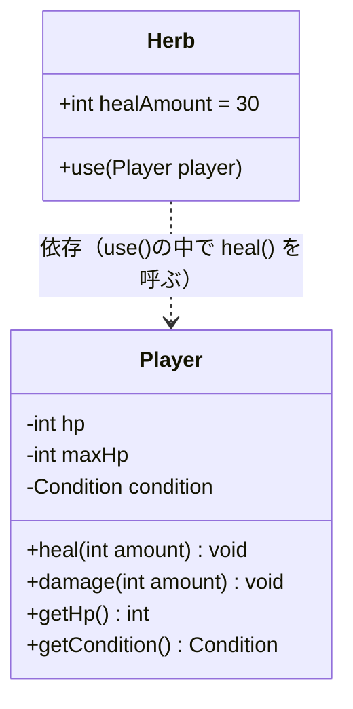
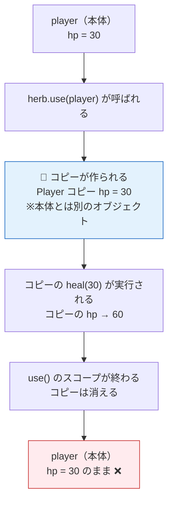
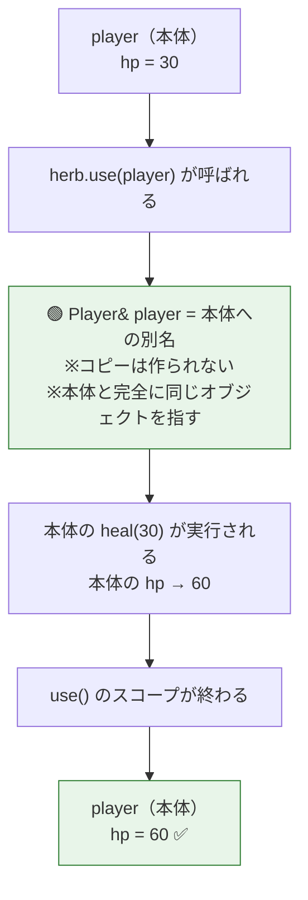
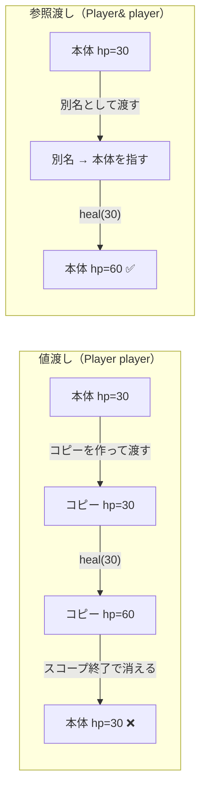
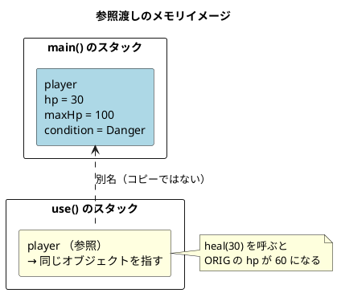
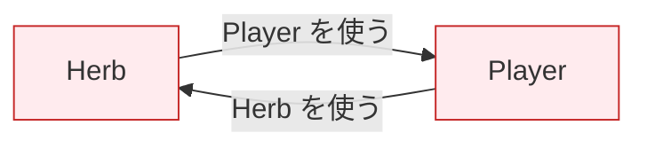
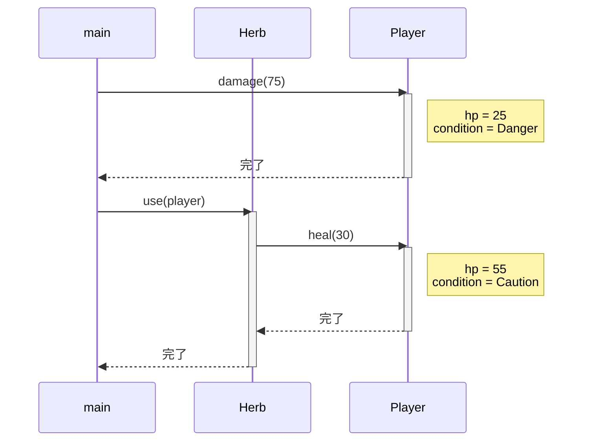
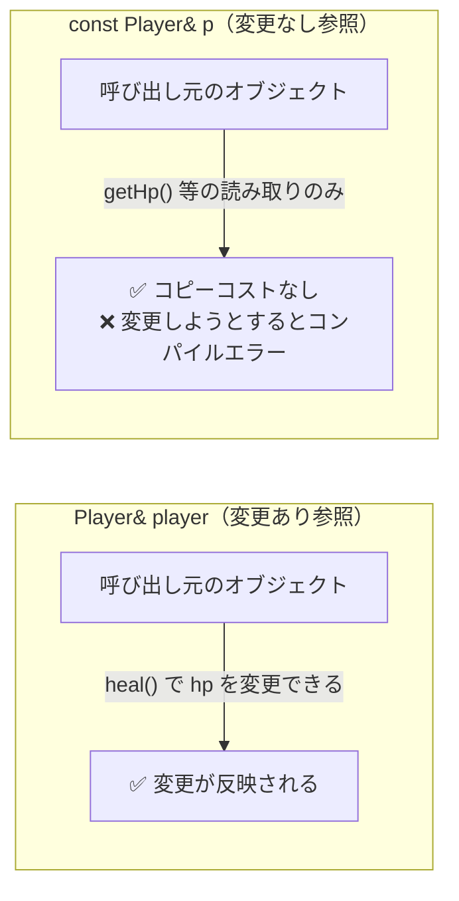

# 第3章：Herbクラスを作ろう

---

## 3-1 設計を決める

`Herb` に必要なものは何か。シンプルに考えよう。

- **持つもの：** 回復量（`healAmount`）
- **できること：** プレイヤーに使う（`use()`）



`..>` は「依存関係」を表す。
`Herb` は `Player` の `heal()` を呼ぶので、`Player` のことを知っている。
逆に `Player` は `Herb` のことを知らない。**一方向の依存** だ。

---

## 3-2 まず動かしてみる（問題のあるコードから）

`Herb::use()` の引数を、とりあえずこう書いてみる。

```cpp
struct Herb {
    int healAmount = 30;

    void use(Player player) {   // ← & がない
        player.heal(healAmount);
    }
};
```

これをメインで動かすとこうなる。

```cpp
Player player;
player.damage(70);   // HP: 30

Herb herb;
herb.use(player);    // 回復のはず…

std::cout << player.getHp();  // 30 のまま！？
```

`heal()` を呼んだのに、HPが変わっていない。なぜか？

---

## 3-3 値渡し：コピーが作られる

`Player player`（`&` なし）と書いたとき、何が起きているかを追う。



関数に渡すとき、`&` をつけないと **コピーが作られる**。
コピーを回復しても、本体には何も伝わらない。

---

## 3-4 参照渡し（`&`）の正体

`&` をつけると、コピーではなく **本体への別名** が作られる。

```cpp
void use(Player& player) {  // ← & をつける
    player.heal(healAmount);
}
```



`Player&` は「Player型のオブジェクトへの参照」を意味する。
「コピーを渡す」のではなく「本体の場所を教える」イメージだ。

---

## 3-5 値渡しと参照渡しの比較



| | 値渡し `Player player` | 参照渡し `Player& player` |
|:--:|---|---|
| 渡すもの | コピー | 本体への別名 |
| コピーのコスト | あり（オブジェクト全体をコピー） | なし |
| 呼び出し元への影響 | なし | あり（本体が変わる） |
| 用途 | 変更させたくないとき | 変更してほしいとき |

---

## 3-6 参照渡しのメモリイメージ



参照は「本体の住所を持っているだけ」のイメージだ。
住所を頼りに本体の部屋に入り、直接 hp を書き換える。

---

## 3-7 依存関係の方向性

`Herb` が `Player` に依存している ── これは問題ないのか？


**一方向の依存** は問題ない。

問題になるのは **循環依存** だ。



`Herb` が `Player` を知り、`Player` が `Herb` を知る ── これは避けるべき設計だ。
ファイルのインクルードが循環し、コンパイルできなくなることもある。

今の設計は `Herb → Player` の一方向だけ。問題ない。

---

## 3-8 実装コード

### `Herb.h`

```cpp
#pragma once
#include "Player.h"

struct Herb {
    int healAmount = 30;

    void use(Player& player) {
        player.heal(healAmount);
    }
};
```

`#include "Player.h"` が必要な理由：
`Herb` は `Player` の `heal()` を呼ぶため、`Player` の定義を知っておく必要がある。

### `main.cpp`（動作確認）

```cpp
#include <iostream>
#include "Player.h"
#include "Herb.h"

std::string conditionName(Condition c) {
    switch (c) {
        case Condition::Fine:   return "Fine";
        case Condition::Caution: return "Caution";
        case Condition::Danger: return "Danger";
    }
    return "Unknown";
}

void printStatus(const Player& p) {
    std::cout << "HP: " << p.getHp() << "/" << p.getMaxHp()
              << "  [" << conditionName(p.getCondition()) << "]"
              << std::endl;
}

int main() {
    Player player;
    Herb   greenHerb;

    player.damage(75);
    printStatus(player);    // HP: 25/100  [Danger]

    greenHerb.use(player);
    printStatus(player);    // HP: 55/100  [Caution]

    return 0;
}
```

**期待される出力：**
```
HP: 25/100  [Danger]
HP: 55/100  [Caution]
```

---

## 3-9 全体の処理フロー（シーケンス図）



---

## 3-10 `const` 参照について（補足）

参照渡しには2種類ある。

```cpp
void use(Player& player);        // 変更あり参照
void printStatus(const Player& p); // 変更なし参照（読み取り専用）
```



`printStatus()` は HP を読むだけで変えない。
だから `const Player&` が正しい。
「コピーコストなし、変更もなし」 ── 一番安全で効率的な渡し方だ。

---

## 3-11 確認問題

1. `void use(Player player)` と `void use(Player& player)` の違いを、
   「何が渡されるか」という観点で説明せよ。

2. 次のコードは意図どおりに動くか？動かない場合、何が問題か。

   ```cpp
   void addHp(Player player, int amount) {
       player.heal(amount);
   }
   ```

3. 循環依存とは何か。
   `Player` が `Herb` を `#include` したらどんな問題が起きる可能性があるか？

4. `Herb` の `healAmount` を `30` から `60` に変えたとき、
   変更が必要なファイルはどれか？

---

## まとめ

```mermaid
mindmap
    root((第3章まとめ))
        Herb クラス
            healAmount を持つ
            use() で heal() を呼ぶ
        参照渡し
            & をつける
            コピーではなく別名
            本体に変更が反映される
        値渡しとの違い
            値渡し → コピーが作られる
            参照渡し → 本体を指す
        const 参照
            読み取り専用
            コピーコストなし
        依存関係
            Herb → Player（一方向）
            循環依存は避ける
```

次の第4章では、プレイヤーが複数のアイテムを持てるよう **インベントリ** を実装する。
`std::vector` という STL コンテナの登場だ。
