# 第5章：設計の限界

---

## 5-1 現状を確認する

第4章までで出来上がったのはこんな設計だ。

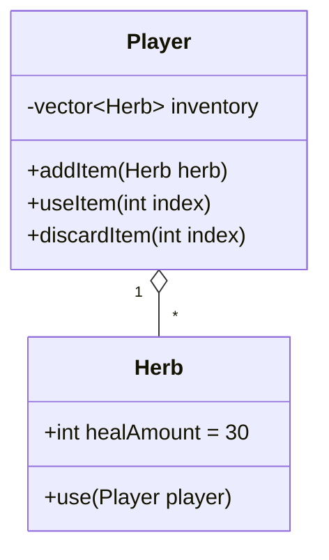

これで「ハーブを持って使う」は動く。

---

ここで、ゲームの仕様が変わったとしよう。

---

> **「グリーンハーブの他に、レッドハーブとミックスハーブも追加したい」**

---

さてどうする？

---

## 5-2 問い①：ハーブが複数種類になったら

各ハーブの仕様はこうだ。

| アイテム | 回復量 | 特殊効果 |
|---|---|---|
| GreenHerb | 30 | なし |
| RedHerb | 60 | なし |
| MixedHerb | 30 | 毒を解除する |

`healAmount` が違うだけなら、今の `Herb` の値を変えれば対応できそうに見える。

```cpp
Herb greenHerb;  greenHerb.healAmount = 30;
Herb redHerb;    redHerb.healAmount   = 60;
Herb mixedHerb;  mixedHerb.healAmount = 30;  // 毒解除は？
```

しかし `MixedHerb` の「毒を解除する」という動作はどこに書く？
`Herb` に `bool removesPoison` を追加？

```cpp
struct Herb {
    int  healAmount   = 30;
    bool removesPoison = false;  // ← これを追加？
};
```

`use()` の中でこう書くことになる。

```cpp
void Herb::use(Player& player) {
    player.heal(healAmount);
    if (removesPoison) {
        player.removePoison();  // ← Playerにも追加が必要
    }
}
```

これでアイテムが増えるたびに `Herb` に `bool` フラグを足し続ける？

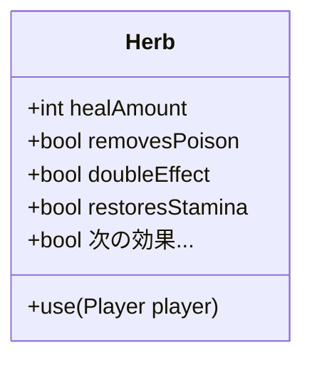

フラグだらけの `Herb` クラス。
「グリーンハーブとレッドハーブは全然違うもの」なのに、同じクラスで表現しようとしている。

これは設計の悪化サインだ。

---

## 5-3 問い②：Key（鍵）を追加したら

次の仕様追加が来た。

> **「ボスの部屋には鍵が必要。鍵もインベントリに入れたい。」**

`Key` は回復しない。扉を開ける。全く別の動作だ。

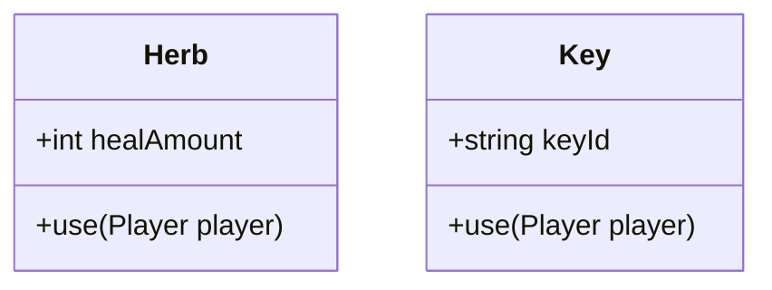

**`std::vector<Herb>` の中に `Key` は入るか？**

```cpp
std::vector<Herb> inventory;
Key bossRoomKey;
inventory.push_back(bossRoomKey);  // ← コンパイルエラー！
```

入らない。`vector<Herb>` は `Herb` 型しか受け付けない。

---

## 5-4 ダメな解決策 A：ベクターを増やす

「型ごとにベクターを用意すればいい」という発想。

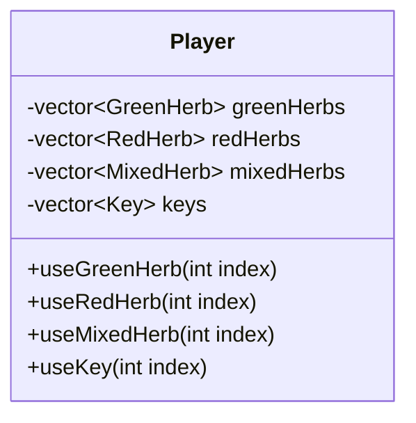

**何が問題か？**

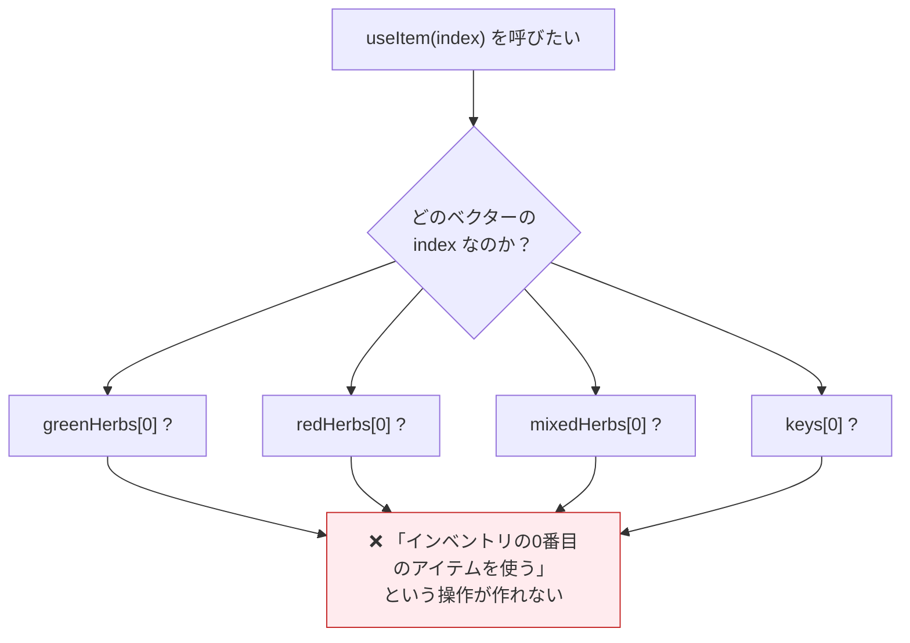

「プレイヤーの持ち物一覧」というひとつの概念が、複数のベクターに**バラバラに分散**してしまう。

アイテムが10種類になれば、`Player` に10本のベクターが並ぶ。
仕様追加のたびに `Player` を変更しなければならない。

---

## 5-5 ダメな解決策 B：enum で種類を管理する

「1つの `Item` 構造体に種類を表すフラグを持たせる」という発想。

```cpp
enum class ItemType { GreenHerb, RedHerb, MixedHerb, Key };

struct Item {
    ItemType    type;
    int         healAmount;  // Key には無意味
    std::string keyId;       // Herb には無意味
};
```

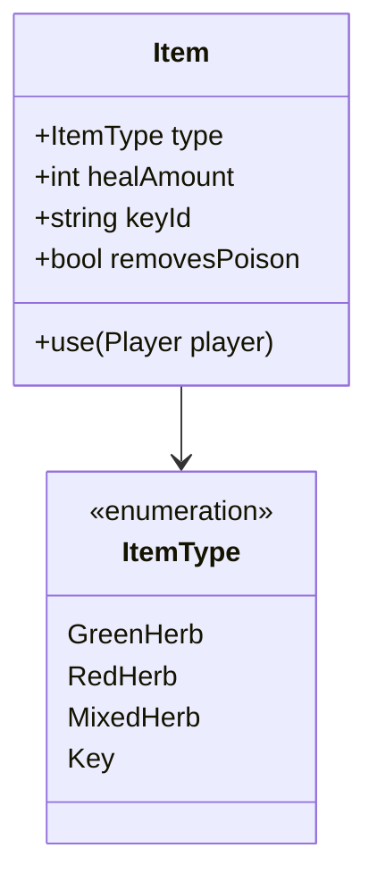

`use()` の中はこうなる。

```cpp
void Item::use(Player& player) {
    switch (type) {
        case ItemType::GreenHerb:
            player.heal(healAmount);
            break;
        case ItemType::RedHerb:
            player.heal(healAmount);
            break;
        case ItemType::MixedHerb:
            player.heal(healAmount);
            player.removePoison();
            break;
        case ItemType::Key:
            // 扉を開ける処理
            break;
    }
}
```

アイテムが1つ増えるたびに、**この `switch` 文を必ず書き直す**。

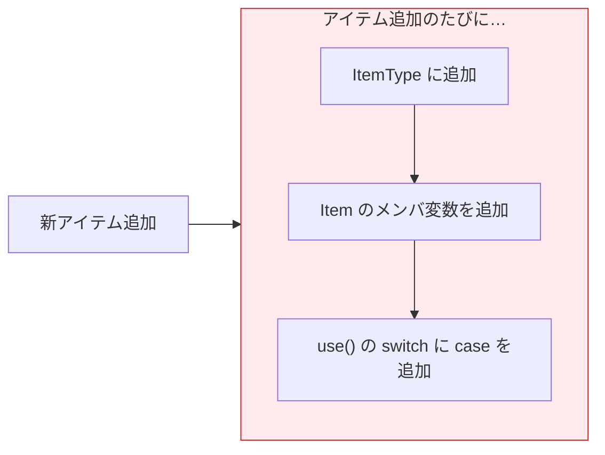

しかも `Item` が持つメンバ変数は無意味なものだらけになる。
`Key` に `healAmount` は要らない。`Herb` に `keyId` は要らない。

---

## 5-6 本質的な問題の整理

2つのダメ解決策の根っこには、同じ問題がある。

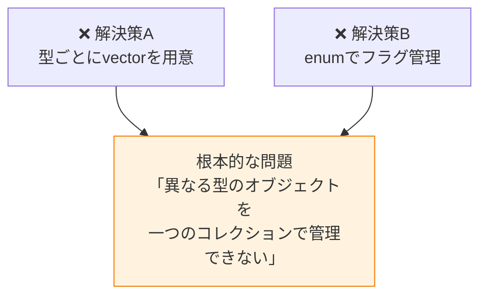

`std::vector<Herb>` は `Herb` **だけ**を格納できる。
`Herb` と `Key` と `Potion` を一緒に扱う手段がない。

---

## 5-7 本当に欲しいものは何か

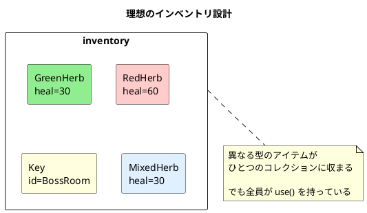

必要なのは、

> **「種類は違っても、`use()` という操作で統一的に扱える」**

という仕組みだ。

---

## 5-8 解決策の方向性

「共通の操作（`use()`）を持つ基底クラスを作り、そこから派生させる」

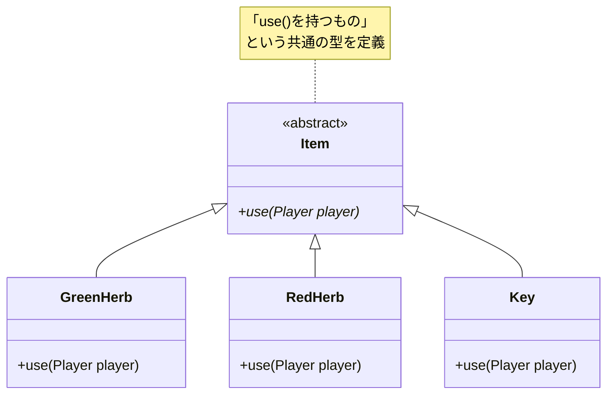

`std::vector<Item*>` のように、**基底クラスのポインタ**でまとめて持てる。
`use()` を呼べば、それぞれの動作が実行される。

これを **ポリモーフィズム（多態性）** と呼ぶ。

---

## 5-9 3つの設計の比較まとめ

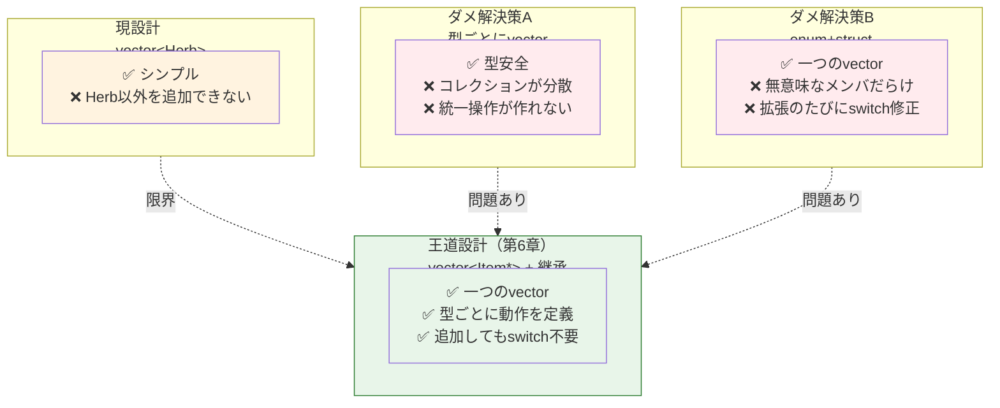

---

## 5-10 確認問題

1. `std::vector<Herb>` に `Key` オブジェクトを `push_back` しようとすると、
   何が起きる？なぜそうなるのか？

2. ダメ解決策B（enum + struct）の場合、
   アイテムが20種類に増えたとき `use()` 関数はどうなるか？

3. 次の設計は何章で学んだ概念と矛盾しているか。
   また、どこが問題か。
   ```cpp
   class Player {
       std::vector<Herb> herbInventory;
       std::vector<Key>  keyInventory;
   public:
       void useItem(/* ??? */);  // ← 引数をどう設計するか？
   };
   ```

4. 「ポリモーフィズム（多態性）」という言葉を調べて、
   どういう意味か自分の言葉で説明してみよう。
   （次の章で答え合わせをする）

---

## まとめ

```mermaid
mindmap
    root((第5章まとめ))
        設計の限界
            vector は同一型しか格納できない
            型ごとのvectorは分散する
            enumフラグは拡張に弱い
        問題の本質
            異種オブジェクトを統一して扱えない
        必要なもの
            共通インターフェース
            use() を持つすべてのアイテムを同列に扱う
        次章の予告
            継承
            純粋仮想関数
            ポリモーフィズム
```

「動くコードを作る」ことと「設計として正しい」ことは別だ。

動くが壊れやすい設計を体験したことで、次に学ぶ「ポリモーフィズム」の価値がわかるはずだ。

第6章では、この問題を **継承** と **仮想関数** で解決する。
