# 第6.5章：抽象クラスとinventory設計

---

## はじめに：新たな疑問が生まれた

第6章でポリモーフィズムを学んだ。`Item&` で受け取れば、どの派生クラスでも `use()` が正しく呼ばれることがわかった。

でも、実際に inventory を作ろうとしたとき、こんな疑問が湧いてくる。

> 「`vector<Item>` に GreenHerb を入れれば全部まとめて管理できるんじゃないの？」

この疑問は自然だ。そして、その先に C++ 特有の落とし穴と、最終的に `unique_ptr` が必要になる理由の答えがある。

この章では、その疑問を一つひとつ丁寧に潰していく。

---

## 6.5-1 そもそも抽象クラスとは何か

第6章で作った `Item` クラスを振り返ろう。

```cpp
class Item {
public:
    virtual void use(Player& player) = 0;  // ← これが純粋仮想関数
    virtual ~Item() = default;
};
```

`= 0` がついた関数を **純粋仮想関数** という。
純粋仮想関数を1つでも持つクラスを **抽象クラス（abstract class）** と呼ぶ。

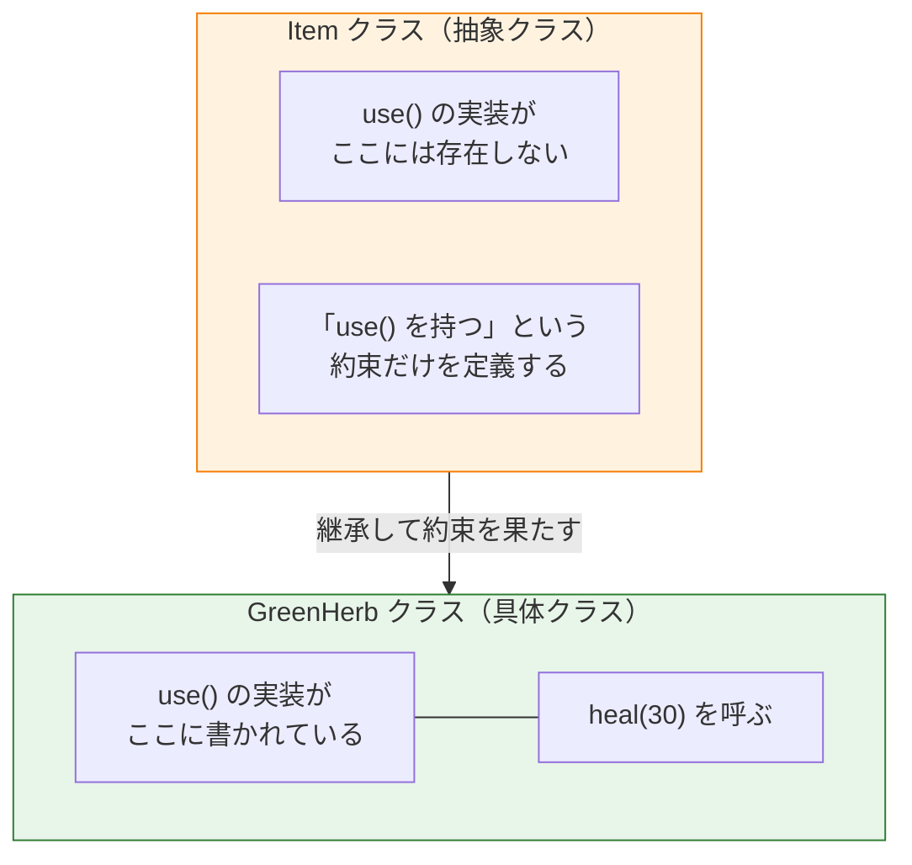

抽象クラスは「設計図（インターフェース）」だ。設計図そのものから直接モノは作れない。

---

## 6.5-2 なぜ抽象クラスはインスタンス化できないのか

```cpp
Item item;  // ❌ コンパイルエラー！
```

なぜエラーになるのか？

`item.use(player)` を呼んだとして、**その中身がどこにも書かれていない** からだ。
CPU がその関数アドレスへジャンプしようとしても、行き先がない。

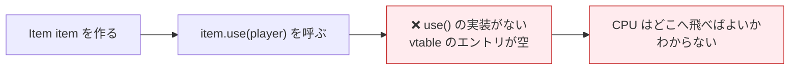

コンパイラはこれを**事前に検知してエラーにする**。これは C++ の安全機構だ。

> **初心者が引っかかるポイント：**
> 「`= 0` を書いたら、コンパイラが守ってくれる」と覚えよう。
> 純粋仮想関数が残っているクラスをインスタンス化しようとすると、必ずコンパイルエラーになる。

---

## 6.5-3 Item / GreenHerb の継承関係

継承によって `Herb` は `Item` の「約束」を引き受ける。
そして `GreenHerb` / `RedHerb` は `Herb` の一種として表現できる（`Item → Herb → GreenHerb` という多段継承）。

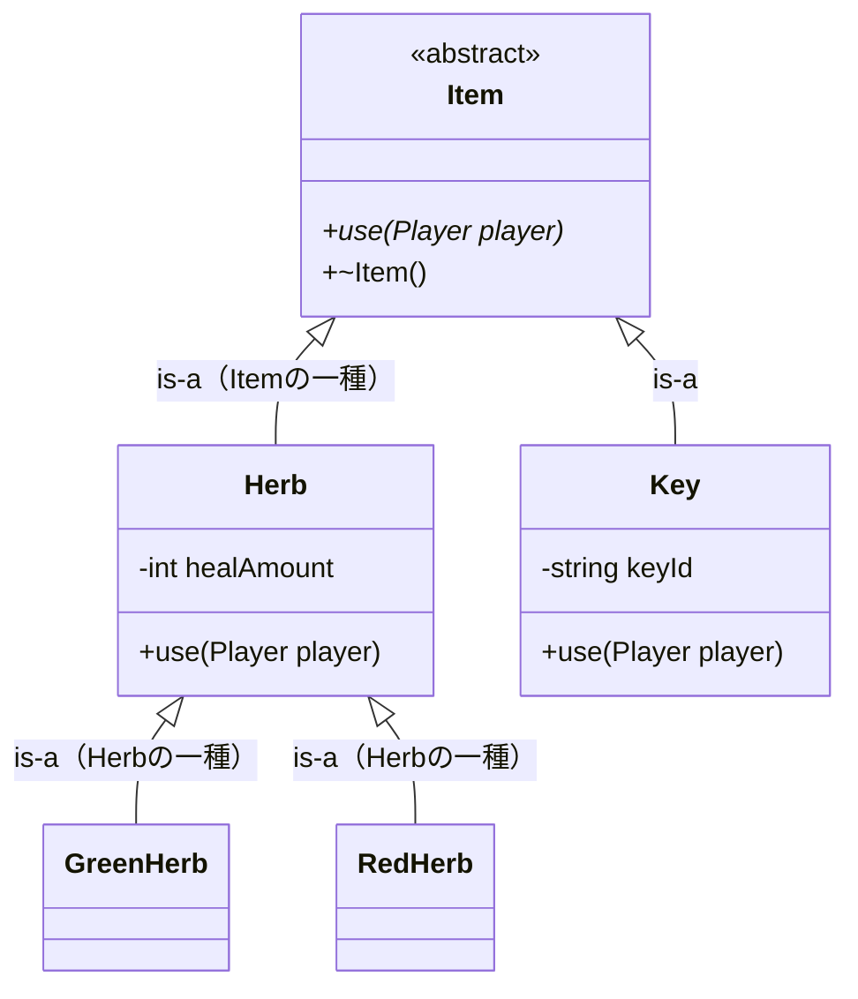

`GreenHerb` は `Item` の一種（is-a 関係）だ（`Herb` を経由しているだけ）。
`use()` の実装は `Herb` に集約できるので、`GreenHerb` は「初期化だけ」のクラスにできる。

**メモリ上のオブジェクトレイアウト：**

```
┌─────────────────────────────────────────────────┐
│  GreenHerb オブジェクト（スタックorヒープ）     │
├─────────────────────────────────────────────────┤
│  vtable*  ─────────────────────→  GreenHerb の vtable
│                                       use → Herb::use()
│                                       ~GreenHerb → ...
├─────────────────────────────────────────────────┤
│  healAmount = 30  （Herb 側のデータ）           │
└─────────────────────────────────────────────────┘
 ↑ここまでが Item 部分（継承した領域）
 ↑healAmount から下が Herb 側の領域（GreenHerb はここに値を設定するだけ）
```

---

## 6.5-4 ポリモーフィズムとは何か

**ポリモーフィズム（多態性）** とは、「同じ呼び出し方で、実際の型に応じた動作をする」性質だ。

```cpp
void useItem(Item& item, Player& player) {
    item.use(player);  // GreenHerb でも RedHerb でも Key でも同じコード
}
```

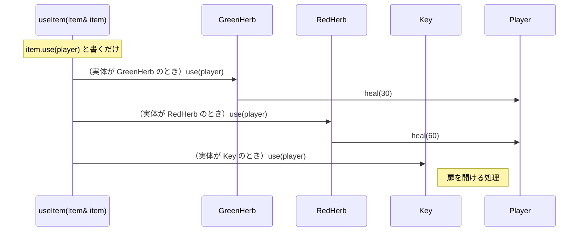

呼び出し側は実際の型を知らなくていい。これがポリモーフィズムの力だ。

---

## 6.5-5 「inventory に全部入れたい！」という当然の発想

第6章で確認できたこと。

```cpp
GreenHerb g;
RedHerb   r;
Key       k("ボスの鍵");
Player    player;

useItem(g, player);  // ポリモーフィズムで正しく動く
useItem(r, player);
useItem(k, player);
```

でも実際のゲームでは「複数のアイテムをまとめて vector で管理」したい。

```cpp
// 自然な発想
std::vector<Item> inventory;
inventory.push_back(GreenHerb{});
inventory.push_back(RedHerb{});
inventory.push_back(Key{"ボスの鍵"});

for (Item& item : inventory) {
    item.use(player);  // ← これで動くはず？
}
```

---

## 6.5-6 `vector<Item>` の問題：オブジェクトスライシング

実はこれは**動かない**。コンパイルエラーすら出ないのに、期待した動作をしない。

何が起きているか、メモリから見てみよう。

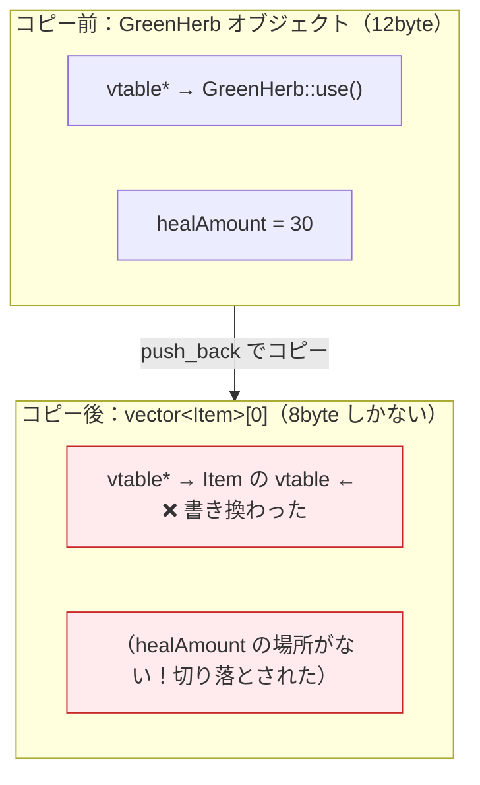

これを **オブジェクトスライシング（Object Slicing）** という。

> **「まるでハーブがスライスされて、中の有効成分だけ消えたようなもの。」**

GreenHerb を入れたつもりが、`healAmount` のない壊れた Item が入っている。
vtable も Item のものに上書きされるので、`use()` を呼んでも `GreenHerb::use()` は呼ばれない。

---

## 6.5-7 スライシングが起きる根本原因

なぜスライシングが起きるのか？

`vector<T>` は「T のサイズのデータ」を連続して並べたコンテナだ。
全スロットのサイズは **コンパイル時点で固定** される。

```
vector<Item> の連続メモリイメージ：

┌────────┬────────┬────────┬──────
│ Item   │ Item   │ Item   │  ...
│ 8byte  │ 8byte  │ 8byte  │
└────────┴────────┴────────┴──────

GreenHerb = 12byte → 8byte スロットに入りきらない → 4byte 切り落とし
RedHerb   = 12byte → 同様
Key       = 24byte → さらに大量に切り落とし
```

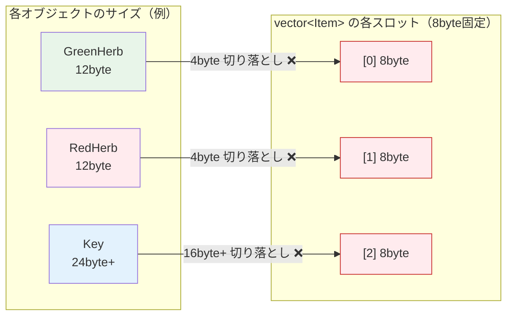

**値を直接 vector に入れる限り、この問題は避けられない。**

> **初心者が引っかかるポイント：**
> `push_back` はコンパイルエラーにならない。「なんかおかしい」という症状が実行時に出る。
> これが C++ で最も気づきにくいバグの一つだ。

---

## 6.5-8 解決策：`vector<Item*>` でポインタを管理する

スライシングの原因は「オブジェクト本体を vector に入れる」からだ。

**ポインタ（アドレス）を入れれば？**

どんなオブジェクトのアドレスも、64bit 環境では **サイズが 8byte で一定** だ。

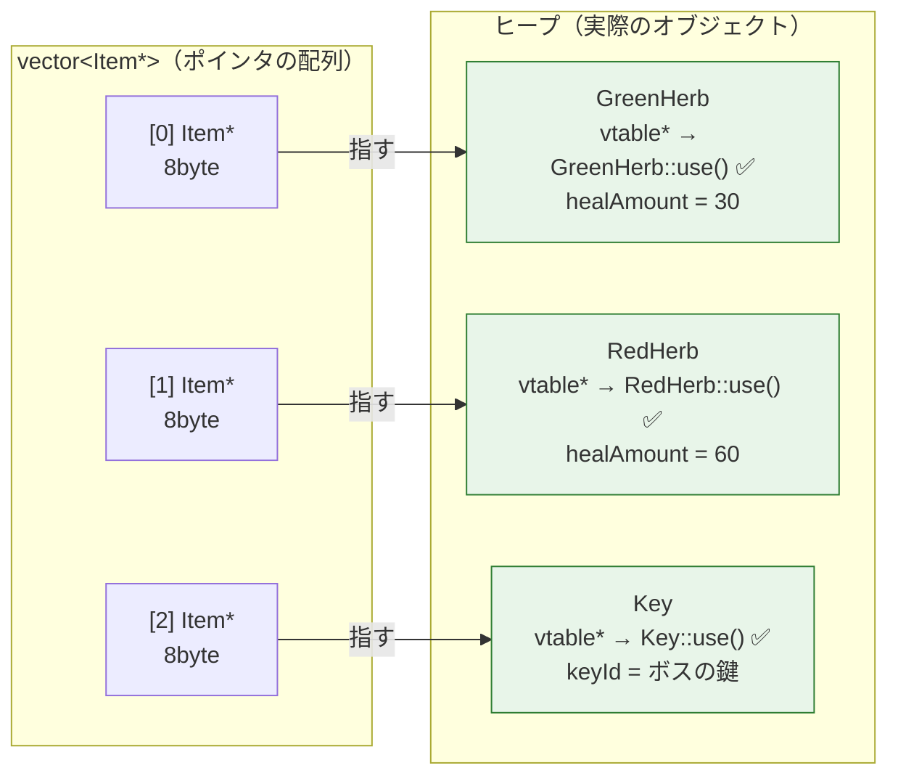

ポインタを格納するので、オブジェクト本体はそのまま。vtable も破壊されない。
`inventory[0]->use(player)` で正しい `use()` が呼ばれる。

**実際のコード：**

```cpp
std::vector<Item*> inventory;

GreenHerb* g = new GreenHerb();  // ヒープに確保
RedHerb*   r = new RedHerb();
Key*       k = new Key("ボスの鍵");

inventory.push_back(g);
inventory.push_back(r);
inventory.push_back(k);

// ポリモーフィズムが正しく動く！
for (Item* item : inventory) {
    item->use(player);  // vtable を通じて正しい use() が呼ばれる ✅
}
```

---

## 6.5-9 `vector<Item*>` が正しく動く理由

なぜポインタ経由だと vtable が機能するのか？

`item->use(player)` の実行ステップを追ってみる。

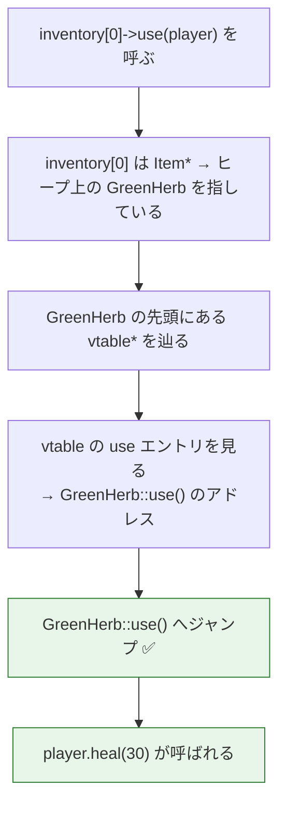

ポインタを通じてアクセスすれば、オブジェクト本体の vtable が正しく機能する。
スライシングは「コピーするとき」に起きる問題で、ポインタ経由では起きない。

---

## 6.5-10 でも生ポインタには重大な問題がある

`vector<Item*>` は動く。しかし、新たな問題が生まれる。

```cpp
{
    std::vector<Item*> inventory;
    inventory.push_back(new GreenHerb());  // ヒープに確保
    inventory.push_back(new RedHerb());

    // ... 処理 ...

}   // ← このスコープを抜けると...
    //   vector 本体（ポインタの配列）は解放される
    //   ❌ しかし GreenHerb / RedHerb の実体はヒープに残ったまま！
    //   ❌ 誰も delete していない → メモリリーク
```

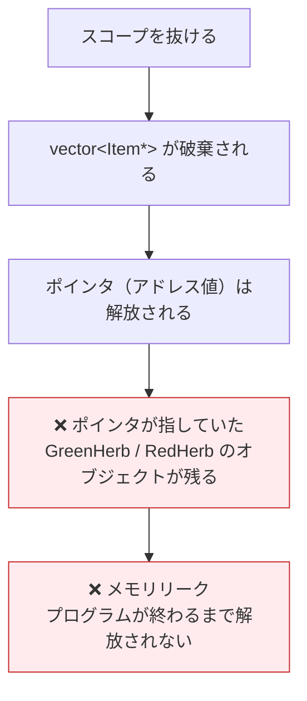

---

## 6.5-11 生ポインタの3つの問題

| 問題 | 内容 | 症状 |
|---|---|---|
| メモリリーク | `delete` を忘れるとオブジェクトが解放されない | じわじわメモリを食いつくす |
| 所有権の不明確さ | 「誰が delete する責任を持つか」が不明 | コードが複雑になると判断不能 |
| 二重解放 | 同じポインタを2回 `delete` すると未定義動作 | クラッシュ・データ破壊 |

**所有権の不明確さ** がとくに深刻だ。

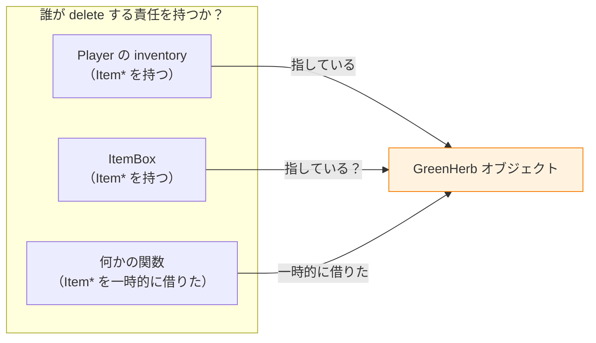

誰が delete すべき？　全員が delete したら二重解放、誰もしなければリーク。
これが「所有権の不明確さ」だ。

---

## 6.5-12 手動で delete すれば解決？

「最後に for ループで delete すればいいんじゃないの？」

```cpp
// 最後にクリーンアップ
for (Item* item : inventory) {
    delete item;
}
inventory.clear();
```

これは「動く」。しかし、落とし穴がある。

```mermaid
flowchart TB
    subgraph trap1["落とし穴1：例外が発生したら"]
        E1["new GreenHerb() の後で例外発生"]
        E2["delete のコードに到達しない"]
        E3["❌ メモリリーク"]
        E1 --> E2 --> E3
    end

    subgraph trap2["落とし穴2：早期 return したら"]
        R1["処理の途中で return"]
        R2["delete のループに到達しない"]
        R3["❌ メモリリーク"]
        R1 --> R2 --> R3
    end

    subgraph trap3["落とし穴3：所有権が複雑になったら"]
        C1["Player と ItemBox で同じポインタを持つ設計"]
        C2["どちらが delete すべきかわからなくなる"]
        C3["❌ 二重解放 or リーク"]
        C1 --> C2 --> C3
    end

    style E3 fill:#ffebee,stroke:#c62828
    style R3 fill:#ffebee,stroke:#c62828
    style C3 fill:#ffebee,stroke:#c62828
```

> **初心者が引っかかるポイント：**
> `new` と `delete` のペア管理は、コードが単純なうちはできる。
> しかし設計が複雑になるにつれて、必ずどこかでミスが起きる。
> C++ の歴史は「生ポインタのバグとの戦い」の歴史でもある。

---

## 6.5-13 なぜ `unique_ptr` が必要になるのか

問題の本質は何か？

> **「オブジェクトの所有権（誰が管理して、いつ解放するか）が不明確」**

これを解決するのが **スマートポインタ**、特に `std::unique_ptr` だ。

`unique_ptr` は「スコープを抜けると自動で delete する賢いポインタ」だ。

```cpp
#include <memory>

{
    std::vector<std::unique_ptr<Item>> inventory;
    inventory.push_back(std::make_unique<GreenHerb>());
    inventory.push_back(std::make_unique<RedHerb>());

    // ポリモーフィズムも正しく動く
    for (auto& item : inventory) {
        item->use(player);
    }

}   // ← スコープを抜けると...
    //   ✅ vector が破棄される
    //   ✅ 各 unique_ptr のデストラクタが呼ばれる
    //   ✅ GreenHerb / RedHerb が自動で delete される
    //   ✅ メモリリークなし！
```

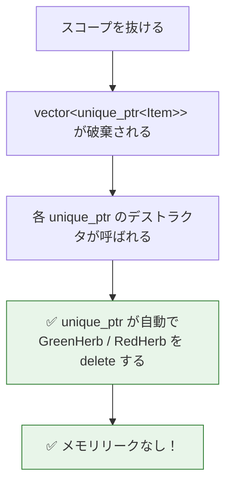

---

## 6.5-14 ここまでの設計の変遷

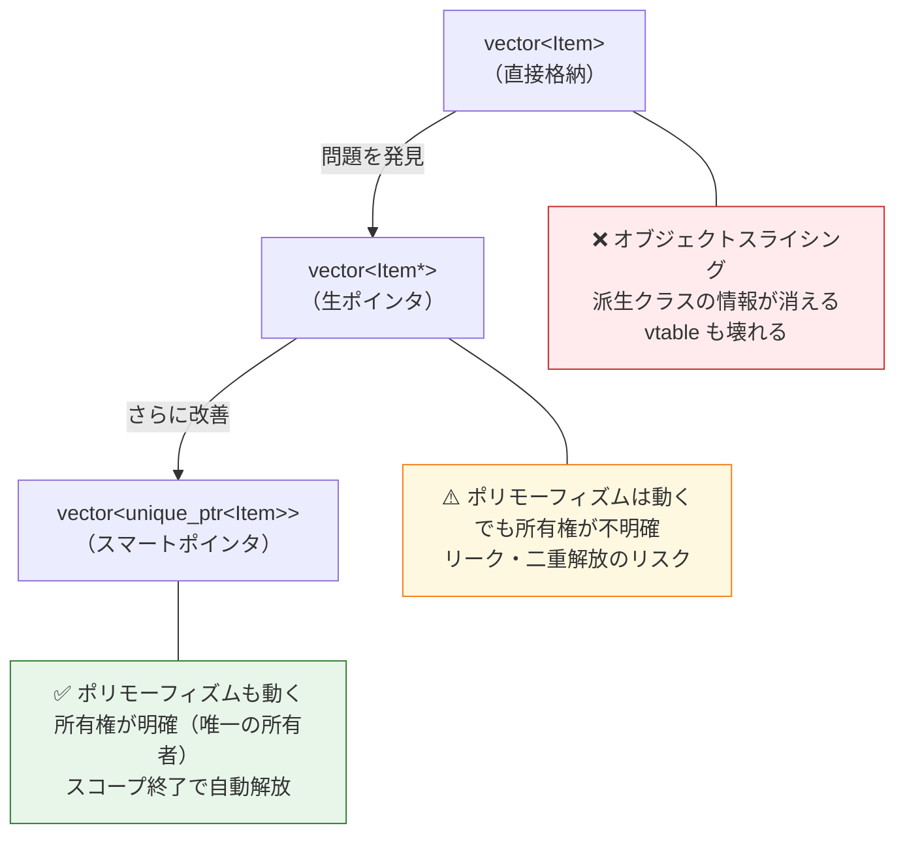

---

## 6.5-15 設計の全体像（第6.5章時点）

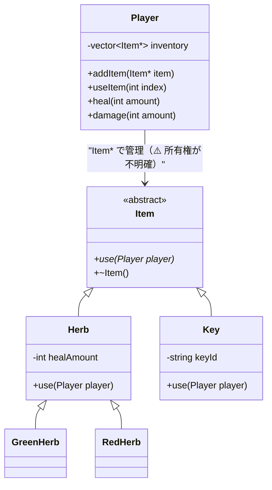

次章では `unique_ptr` を使い、この設計を完成形に持っていく。

---

## 6.5-16 確認問題

1. 次のコードはコンパイルできるか？　できない場合、なぜか。
   ```cpp
   Item item;
   ```

2. 次のコードを実行すると `use()` は（本来期待する形で）正しく呼ばれるか？　理由も答えよ。
   ```cpp
   std::vector<Item> inventory;
   GreenHerb g;
   inventory.push_back(g);
   inventory[0].use(player);
   ```

3. オブジェクトスライシングが起きる根本原因を説明せよ。
   「vector のスロットサイズ」という言葉を使うこと。

4. `vector<Item*>` に変えるとスライシングが起きない理由を説明せよ。
   「ポインタのサイズ」という言葉を使うこと。

5. 次のコードにはどんな問題があるか？　2つ以上答えよ。
   ```cpp
   std::vector<Item*> inventory;
   inventory.push_back(new GreenHerb());
   inventory.push_back(new RedHerb());
   // スコープを抜ける
   ```

6. `unique_ptr` を使うことで、生ポインタのどの問題が解決されるか。

---

## まとめ

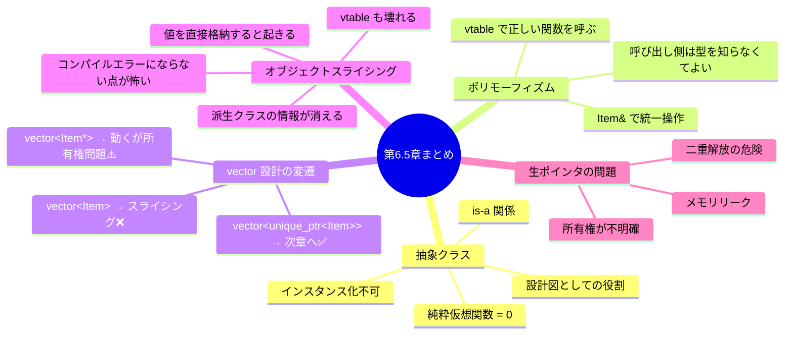

---

第6章で「`Item&` で統一的に扱える」ことを学んだ。
第6.5章で「`vector` に入れようとすると何が起きるか」を理解した。

> 「ポインタを使えば動く。でもそれを安全に管理する方法がまだない。」

次章（第7章）では、この問題の完全な解決策 **`std::unique_ptr`** を学ぶ。
所有権という C++ の重要概念と、それを安全に扱うスマートポインタの全貌を見ていこう。
