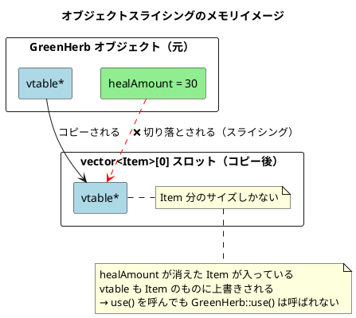
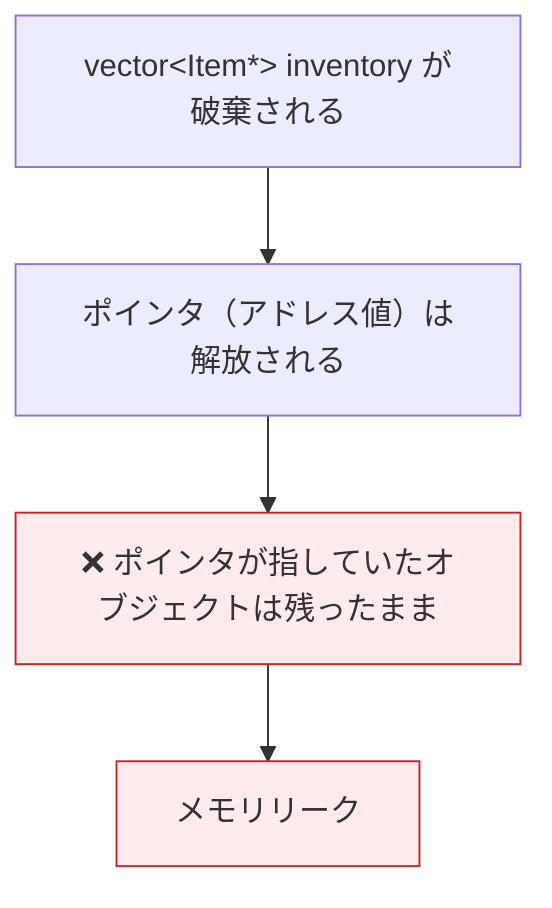
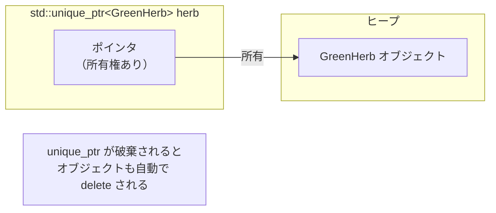
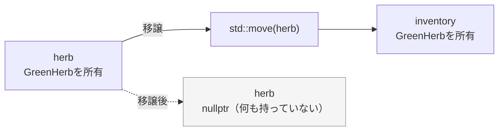
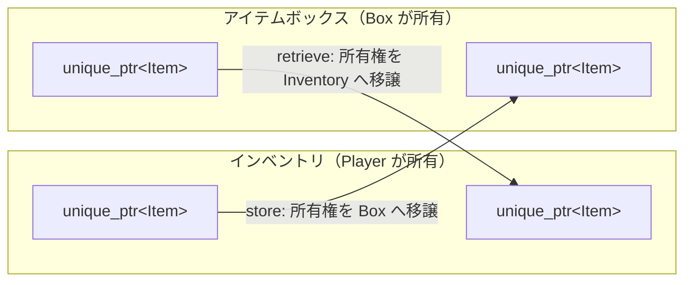
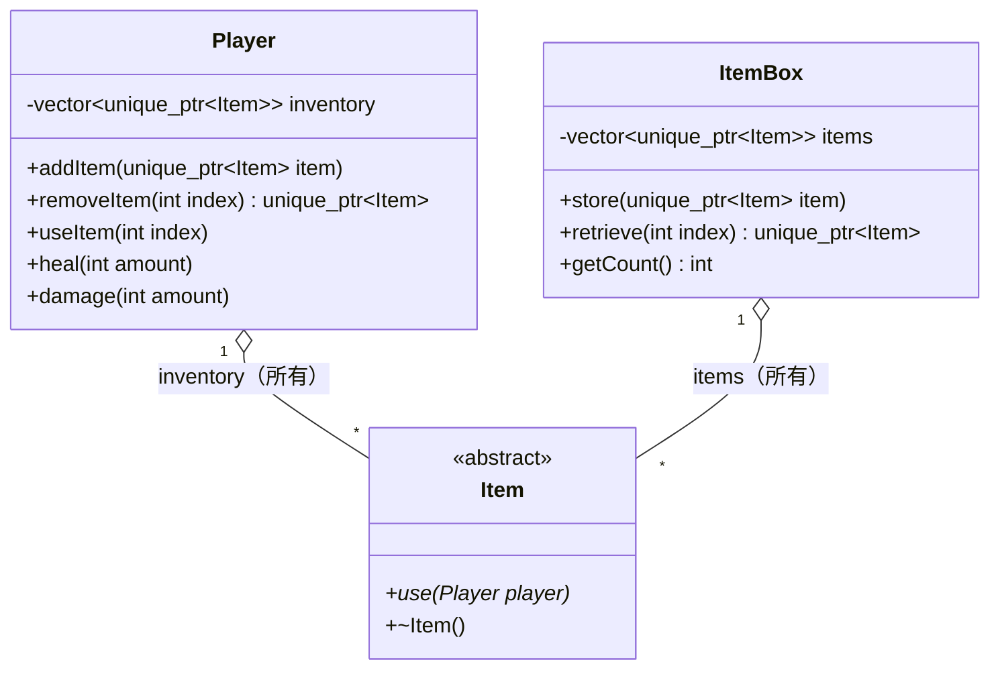
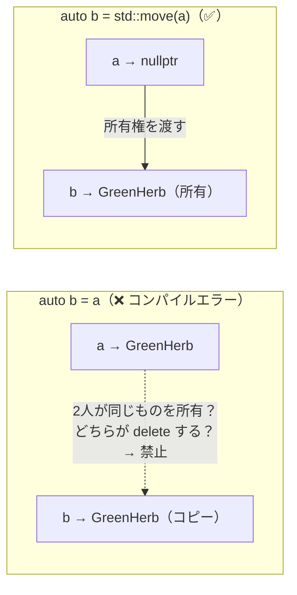
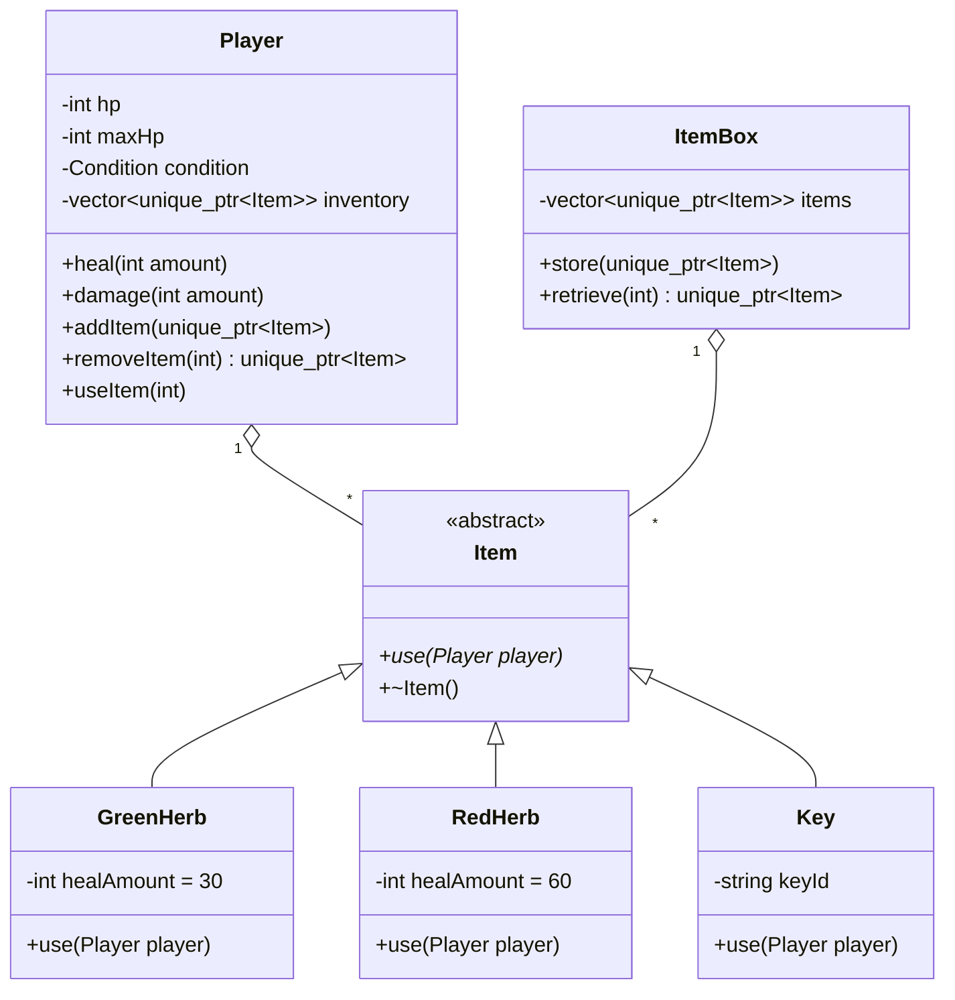
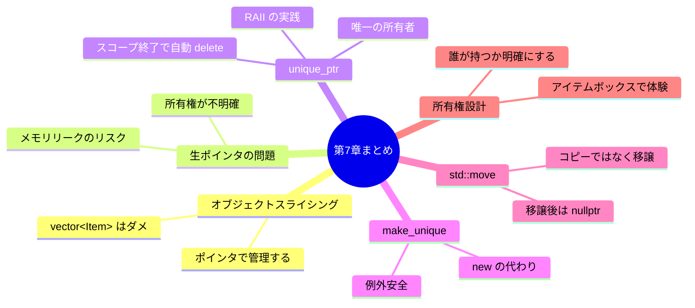

# 第7章：アイテムボックスと所有権

---

## 7-1 前章の残った問いから始める

第6章の最後にこんな問いが残った。

> 「`Item&`（参照）で統一的に使えることはわかった。
> でも参照は `vector` に入れられない。どうやって `vector` で管理する？」

単純に考えると `std::vector<Item>` とすれば良さそうだ。
ところがここに、C++ 特有の落とし穴がある。

---

## 7-2 `vector<Item>` がなぜダメか：オブジェクトスライシング

`GreenHerb` は `Item` を継承している。
だから `vector<Item>` に入れられそうに見える。

```cpp
std::vector<Item> inventory;
GreenHerb greenHerb;
inventory.push_back(greenHerb);  // コンパイルは通る
```

しかし、実際に何が起きているかを見よう。



**`vector<Item>` の各スロットは `Item` のサイズしか持てない。**
`GreenHerb` を入れようとすると、`Item` 部分だけコピーされ、
`healAmount` など派生クラス固有のデータは**切り落とされる（スライシング）**。

これを **オブジェクトスライシング** と呼ぶ。

---

## 7-3 解決策：ポインタで管理する

スライシングが起きる原因は「値そのもの」を vector に格納しようとするからだ。
**オブジェクトへのポインタ** を格納すれば、どのサイズのオブジェクトでも同じポインタサイズで扱える。

```mermaid
flowchart LR
    subgraph vector~Item ptr~["vector&lt;Item*&gt;"]
        P0["[0] Item*"]
        P1["[1] Item*"]
        P2["[2] Item*"]
    end

    subgraph heap["ヒープ（実際のオブジェクト）"]
        G["GreenHerb<br/>vtable*<br/>healAmount=30"]
        R["RedHerb<br/>vtable*<br/>healAmount=60"]
        K["Key<br/>vtable*<br/>keyId=Boss"]
    end

    P0 -->|"指す"| G
    P1 -->|"指す"| R
    P2 -->|"指す"| K
```

ポインタのサイズは一定（64bit環境で8バイト）。
実際のオブジェクトはヒープ上に置き、ポインタ経由でアクセスする。

vtable も正しく機能するので、`item->use(player)` で正しい実装が呼ばれる。

---

## 7-4 生ポインタ（raw pointer）の問題

`Item*` をそのまま使うと、別の問題が起きる。

```cpp
std::vector<Item*> inventory;
inventory.push_back(new GreenHerb());  // ヒープに確保
inventory.push_back(new RedHerb());
```



`vector` が破棄されるとき、格納していた `Item*`（アドレスの値）は消えるが、
**ヒープ上のオブジェクト本体は誰も `delete` しない**。これがメモリリークだ。

さらに、「誰がオブジェクトを delete する責任を持つか」がコードを読んでも分からない。
これを **所有権が不明確** な状態という。

---

## 7-5 `std::unique_ptr`：所有権を明確にするスマートポインタ

`std::unique_ptr` は「オブジェクトを唯一所有するポインタ」だ。



**スマートポインタの3つの特性：**

| 特性 | 内容 |
|---|---|
| 自動解放 | スコープを抜けると自動で `delete`（RAII）|
| 唯一の所有者 | コピー不可。所有者は常に1つ |
| 所有権の移譲 | `std::move` で所有権を別の `unique_ptr` に渡せる |

---

## 7-6 所有権の状態遷移

```mermaid
stateDiagram-v2
    direction LR

    [*] --> 所有中 : make_unique&lt;T&gt;() で作成
    所有中 --> 移譲済み : std::move() で手放す
    移譲済み --> 所有中 : 受け取り側が所有
    所有中 --> [*] : スコープ終了 or reset()<br/>→ オブジェクト自動 delete
    移譲済み --> [*] : nullptr のまま破棄<br/>（何も delete しない）
```

`std::move` は「所有権の引き渡し」だ。
引き渡した後の `unique_ptr` は `nullptr` になる。**コピーではない。**



---

## 7-7 `make_unique` と基本操作

### オブジェクトの生成

```cpp
// new を使う書き方（非推奨）
Item* raw = new GreenHerb();   // 手動 delete が必要

// make_unique を使う書き方（推奨）
auto herb = std::make_unique<GreenHerb>();  // 自動管理
```

`std::make_unique<T>(args...)` はヒープに `T` 型オブジェクトを作り、
それを所有する `unique_ptr<T>` を返す。

### 主な操作

```cpp
auto herb = std::make_unique<GreenHerb>();

// メンバにアクセス（-> を使う）
herb->use(player);

// 生ポインタを借りる（所有権は移らない）
Item* raw = herb.get();

// 所有権を手放す
auto other = std::move(herb);  // herb は nullptr に
```

---

## 7-8 アイテムボックスの設計

「預ける・引き出す」操作を通じて所有権の移譲を体験する。



所有者は常に1つ。インベントリが持っているとき、ボックスは持っていない。
ボックスへ移したとき、インベントリからは消える。

### クラス図



---

## 7-9 実装コード

### `Player.h`（最終版）

```cpp
#pragma once
#include <vector>
#include <memory>
#include "Item.h"

enum class Condition { Fine, Caution, Danger };

class Player {
public:
    void heal(int amount);
    void damage(int amount);
    void updateCondition();

    void                  addItem(std::unique_ptr<Item> item);
    std::unique_ptr<Item> removeItem(int index);
    void                  useItem(int index);

    int       getHp()        const;
    int       getMaxHp()     const;
    Condition getCondition() const;
    int       itemCount()    const;

private:
    int                                hp        = 100;
    int                                maxHp     = 100;
    Condition                          condition = Condition::Fine;
    std::vector<std::unique_ptr<Item>> inventory;
};
```

### `Player.cpp`（最終版・抜粋）

```cpp
#include "Player.h"

// ... heal / damage / updateCondition は第1章から変わらない ...

void Player::addItem(std::unique_ptr<Item> item) {
    inventory.push_back(std::move(item));  // 所有権を vector へ
}

std::unique_ptr<Item> Player::removeItem(int index) {
    if (index < 0 || index >= static_cast<int>(inventory.size())) {
        return nullptr;
    }
    auto item = std::move(inventory[index]);  // 所有権を取り出す
    inventory.erase(inventory.begin() + index);
    return item;                              // 呼び出し元へ所有権を渡す
}

void Player::useItem(int index) {
    if (index < 0 || index >= static_cast<int>(inventory.size())) return;
    inventory[index]->use(*this);            // -> でアクセス
    inventory.erase(inventory.begin() + index);  // unique_ptr が破棄 → 自動 delete
}

int Player::itemCount() const {
    return static_cast<int>(inventory.size());
}
```

### `ItemBox.h`

```cpp
#pragma once
#include <vector>
#include <memory>
#include "Item.h"

class ItemBox {
public:
    void                  store(std::unique_ptr<Item> item);
    std::unique_ptr<Item> retrieve(int index);
    int                   getCount() const;

private:
    std::vector<std::unique_ptr<Item>> items;
};
```

### `ItemBox.cpp`

```cpp
#include "ItemBox.h"

void ItemBox::store(std::unique_ptr<Item> item) {
    items.push_back(std::move(item));
}

std::unique_ptr<Item> ItemBox::retrieve(int index) {
    if (index < 0 || index >= static_cast<int>(items.size())) {
        return nullptr;
    }
    auto item = std::move(items[index]);
    items.erase(items.begin() + index);
    return item;
}

int ItemBox::getCount() const {
    return static_cast<int>(items.size());
}
```

### `main.cpp`（アイテムボックス動作確認）

```cpp
#include <iostream>
#include "Player.h"
#include "ItemBox.h"
#include "GreenHerb.h"
#include "RedHerb.h"
#include "Key.h"

std::string conditionName(Condition c) {
    switch (c) {
        case Condition::Fine:   return "Fine";
        case Condition::Caution: return "Caution";
        case Condition::Danger: return "Danger";
    }
    return "Unknown";
}

void printStatus(const Player& p) {
    std::cout << "HP: " << p.getHp() << "/" << p.getMaxHp()
              << "  [" << conditionName(p.getCondition()) << "]"
              << "  所持アイテム数: " << p.itemCount()
              << std::endl;
}

int main() {
    Player  player;
    ItemBox box;

    // ボックスにアイテムを預ける
    box.store(std::make_unique<GreenHerb>());
    box.store(std::make_unique<RedHerb>());
    box.store(std::make_unique<Key>("ボスルームの鍵"));

    std::cout << "--- ボックス: " << box.getCount() << "個" << std::endl;

    // ボックスから引き出してインベントリへ
    player.addItem(box.retrieve(0));  // GreenHerb を取り出す
    player.addItem(box.retrieve(0));  // RedHerb を取り出す（0番に詰まる）

    std::cout << "--- ボックス: " << box.getCount() << "個（鍵だけ残る）" << std::endl;

    // 戦闘
    player.damage(80);
    printStatus(player);  // HP: 20/100  [Danger]  所持: 2

    // アイテムを使う
    player.useItem(0);    // GreenHerb 使用
    printStatus(player);  // HP: 50/100  [Caution]  所持: 1

    player.useItem(0);    // RedHerb 使用
    printStatus(player);  // HP: 100/100  [Fine]   所持: 0

    // インベントリから1つボックスへ戻す（今は空なので試せないがコードは動く）
    // auto item = player.removeItem(0);
    // box.store(std::move(item));

    return 0;
}
```

**期待される出力：**
```
--- ボックス: 3個
--- ボックス: 1個（鍵だけ残る）
HP: 20/100  [Danger]  所持アイテム数: 2
HP: 50/100  [Caution]  所持アイテム数: 1
HP: 100/100  [Fine]   所持アイテム数: 0
```

---

## 7-10 全体の処理シーケンス

```mermaid
sequenceDiagram
    participant main
    participant box as ItemBox
    participant player as Player
    participant herb as GreenHerb（ヒープ）

    main  ->> box    : store(make_unique&lt;GreenHerb&gt;())
    note right of box : box が所有

    main  ->> box    : retrieve(0)
    box   -->> main  : unique_ptr（所有権を返す）
    main  ->> player : addItem(std::move(item))
    note right of player : player が所有

    main  ->> player : useItem(0)
    activate player
    player ->> herb  : use(*this) → heal(30)
    player ->> player: erase → unique_ptr 破棄
    note right of herb : 自動 delete ✅
    deactivate player
```

---

## 7-11 `unique_ptr` をコピーしようとすると

```cpp
auto a = std::make_unique<GreenHerb>();
auto b = a;              // ❌ コンパイルエラー：コピー不可
auto b = std::move(a);  // ✅ 移譲は可能。a は nullptr に
```



「2人が同じものを所有する」状態は、二重 delete を引き起こすので禁止されている。
所有者は常に1人。これが `unique_ptr` の根本的な設計だ。

---

## 7-12 設計の全体像（最終完成形）



---

## 7-13 確認問題

1. `std::vector<Item>` に `GreenHerb` を入れると何が起きるか。
   「オブジェクトスライシング」という言葉を使って説明せよ。

2. 次のコードはメモリリークするか。理由も答えよ。
   ```cpp
   {
       auto herb = std::make_unique<GreenHerb>();
   }  // ← ここで何が起きる？
   ```

3. 次のコードはコンパイルできるか。できない場合、どう直せばよいか。
   ```cpp
   auto a = std::make_unique<GreenHerb>();
   player.addItem(a);
   ```

4. `removeItem()` の実装で `std::move` を使っている。
   使わずに `return inventory[index];` と書いた場合、何が起きるか？

5. `ItemBox` と `Player` が同じ `GreenHerb` を同時に所有することはできるか。
   なぜそういう設計になっているのか説明せよ。

---

## まとめ



---

## コース全体の振り返り


| 章 | 習得した概念 |
|:--:|---|
| 第1章 | クラス、カプセル化、enum class |
| 第2章 | 責務分離、「状態を持つ者が管理する」|
| 第3章 | 参照渡し（`&`）、循環依存、前方宣言 |
| 第4章 | `std::vector`、イテレータ、`*this`|
| 第5章 | 設計の限界を問いで発見する力 |
| 第6章 | 継承、仮想関数、ポリモーフィズム、vtable |
| 第7章 | スマートポインタ、所有権、`std::move`|

このコースで実装した「バイオ風ハーブ回復システム」は、
現代 C++ のエッセンス ── **カプセル化・責務分離・多態性・所有権** ── を全て含んでいる。

同じ設計の考え方は、ゲーム以外のソフトウェアでも変わらず通用する。
