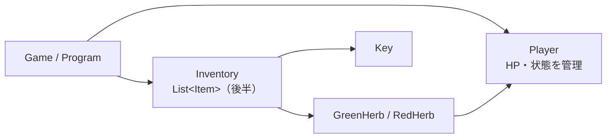
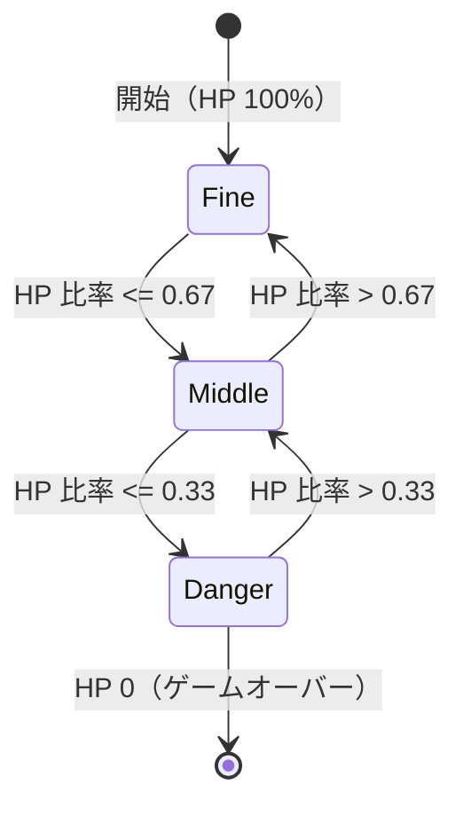
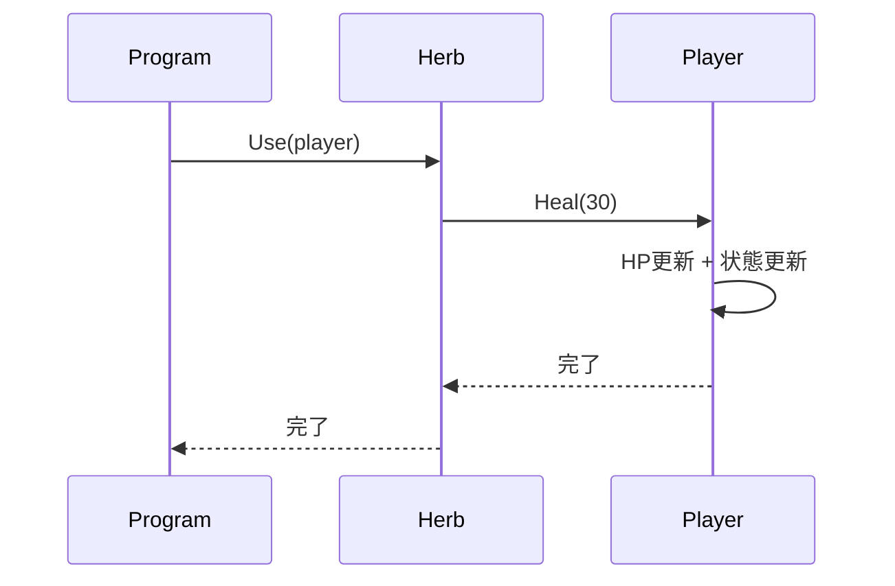

# 第0章：ゴールを確認しよう（C#版）

このコースの C# 版では、コンソール RPG を題材にして次の設計を段階的に作る。

- `Player` が HP と状態（Fine / Middle / Danger）を管理する
- `Herb` や `Key` などのアイテムを使える
- インベントリを `List<T>` で管理する
- 継承 / ポリモーフィズムで拡張しやすくする
- C++ 版の `unique_ptr` の代わりに、C# では GC と `IDisposable` を正しく理解する

## 何を作るのか

最終的に作るイメージは次の通り。

- プレイヤーは HP を持つ
- ハーブを使うと HP が回復する
- HP に応じて状態（Condition）が変わる
- アイテムボックスとインベントリ間でアイテムをやり取りできる

## システム全体の設計図



## HP状態（Condition）の遷移



`Condition` は `Player` 自身が管理する。外部のクラスが `hp` を直接いじる設計にすると、状態更新の漏れが起きやすい。

## ハーブを使ったときの処理フロー



## 学習ロードマップ


## C#版での読み替えポイント（C++版との差分）

| C++版 | C#版 |
|---|---|
| `std::vector<T>` | `List<T>` |
| `enum class` | `enum` |
| `.h / .cpp` 分割 | 通常は `.cs` 1ファイル（クラス単位） |
| 参照渡し `Player&` | `class` は参照型（引数は値渡しでも同じインスタンスを操作可能） |
| `unique_ptr` | GC + `IDisposable` / `using` |

## まず動かしてみよう

```csharp
using System;

int hp = 100;
int maxHp = 100;

Console.WriteLine($"HP: {hp}/{maxHp}");

hp -= 70; // ダメージ
Console.WriteLine($"HP: {hp}/{maxHp}");

hp += 30; // 回復
if (hp > maxHp) hp = maxHp;
Console.WriteLine($"HP: {hp}/{maxHp}");
```

この段階ではまだクラスを使っていない。第1章で `Player` クラスを作って、HPと状態管理をまとめる。
