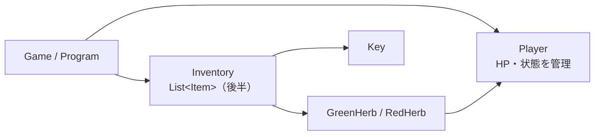
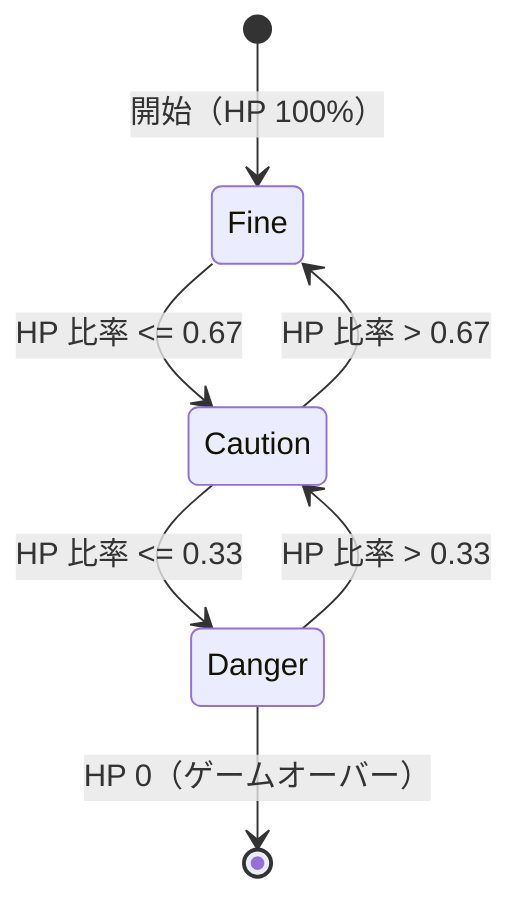
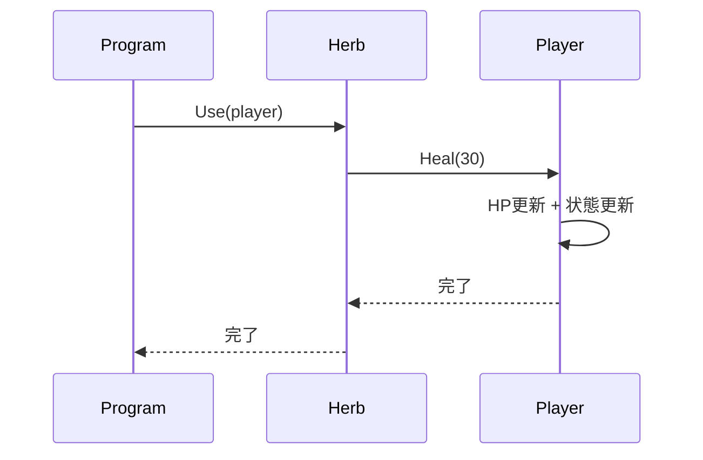
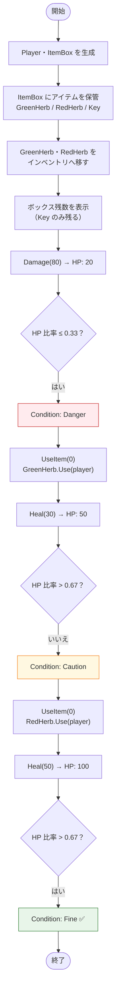
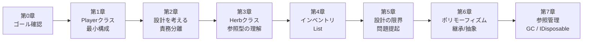

# 第0章：ゴールを確認しよう

このコースでは、コンソール RPG を題材にして次の設計を段階的に作る。

- `Player` が HP と状態（Fine / Caution / Danger）を管理する
- `Herb` や `Key` などのアイテムを使える
- インベントリを `List<T>` で管理する
- 継承 / ポリモーフィズムで拡張しやすくする
- メモリ管理（GC）とリソース解放（IDisposable）を正しく理解する

## 何を作るのか

最終的に作るイメージは次の通り。

- プレイヤーは HP を持つ
- ハーブを使うと HP が回復する
- HP に応じて状態（Condition）が変わる
- アイテムボックスとインベントリ間でアイテムをやり取りできる

## システム全体の設計図



## HP状態（Condition）の遷移



`Condition` は `Player` 自身が管理する。外部のクラスが `hp` を直接いじる設計にすると、状態更新の漏れが起きやすい。

## ハーブを使ったときの処理フロー



## 最終プログラムの全体シーケンス

```mermaid
sequenceDiagram
    participant P as Program
    participant Box as ItemBox
    participant Player
    participant item as Item（GreenHerb / RedHerb）

    P->>Box: Store(new GreenHerb())
    P->>Box: Store(new RedHerb())
    P->>Box: Store(new Key("ボスルームの鍵"))
    Note over Box: 3アイテム保管中

    P->>Box: Retrieve(0)
    Box-->>P: GreenHerb
    P->>Player: AddItem(GreenHerb)

    P->>Box: Retrieve(0)
    Box-->>P: RedHerb
    P->>Player: AddItem(RedHerb)
    Note over Box: Key のみ残る（1個）

    P->>Player: Damage(80)
    Player->>Player: HP: 100 → 20 / UpdateCondition()
    Note over Player: HP: 20/100 [Danger]

    P->>Player: UseItem(0)
    activate Player
    Player->>item: Use(player)
    item->>Player: Heal(30)
    Player->>Player: HP: 20 → 50 / UpdateCondition()
    deactivate Player
    Note over Player: HP: 50/100 [Caution]

    P->>Player: UseItem(0)
    activate Player
    Player->>item: Use(player)
    item->>Player: Heal(50)
    Player->>Player: HP: 50 → 100 / UpdateCondition()
    deactivate Player
    Note over Player: HP: 100/100 [Fine]
```

## 最終プログラムのアクティビティ図



## 学習ロードマップ



## 本コースで扱う主要な C# の機能

| 機能 | 内容 |
|---|---|
| `List<T>` | 動的な配列（リスト） |
| `enum` | 列挙型。状態の定義に使用 |
| `.cs` ファイル | 通常はクラス単位でファイルを構成 |
| 参照型（class） | オブジェクトを「参照」として扱う仕組み |
| GC / IDisposable | メモリの自動回収とリソースの明示的解放 |

## まず動かしてみよう

```csharp
using System;

int hp = 100;
int maxHp = 100;

Console.WriteLine($"HP: {hp}/{maxHp}");

hp -= 70; // ダメージ
Console.WriteLine($"HP: {hp}/{maxHp}");

hp += 30; // 回復
if (hp > maxHp) hp = maxHp;
Console.WriteLine($"HP: {hp}/{maxHp}");
```

この段階ではまだクラスを使っていない。第1章で `Player` クラスを作って、HPと状態管理をまとめる。
