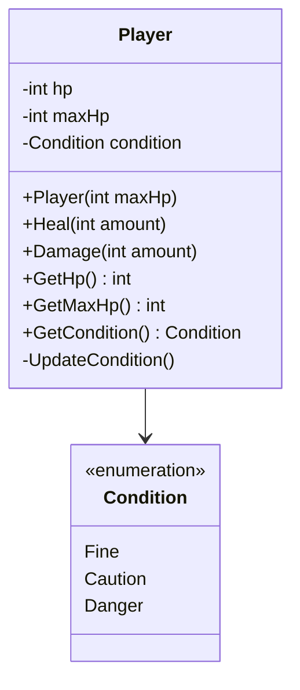
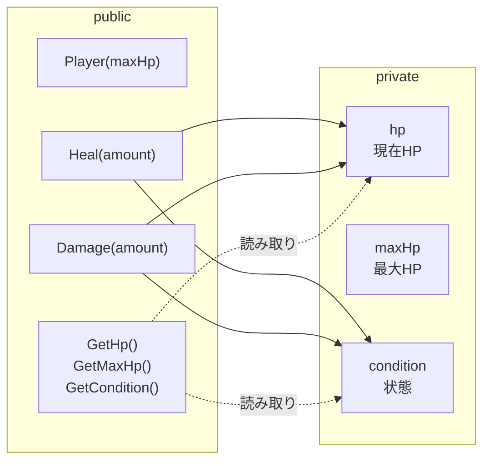
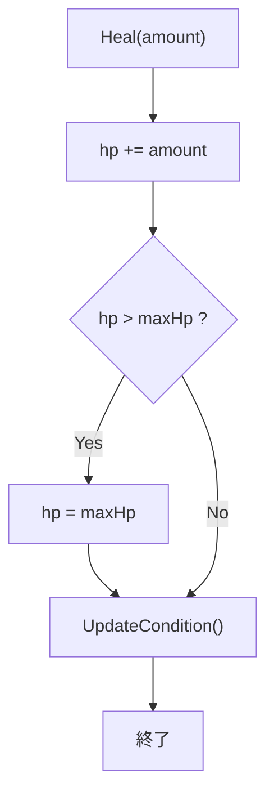
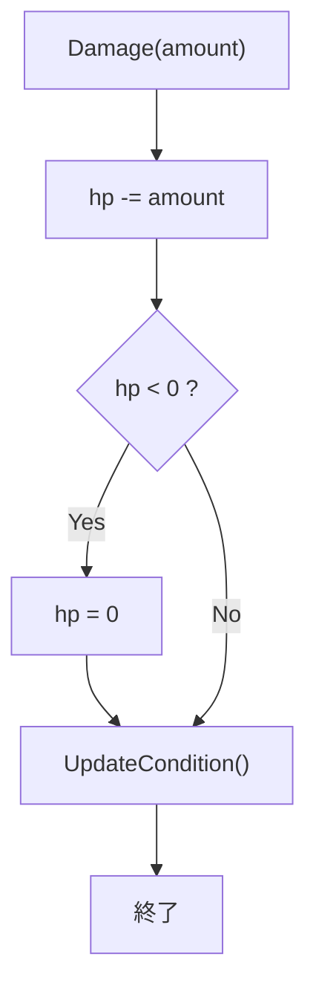
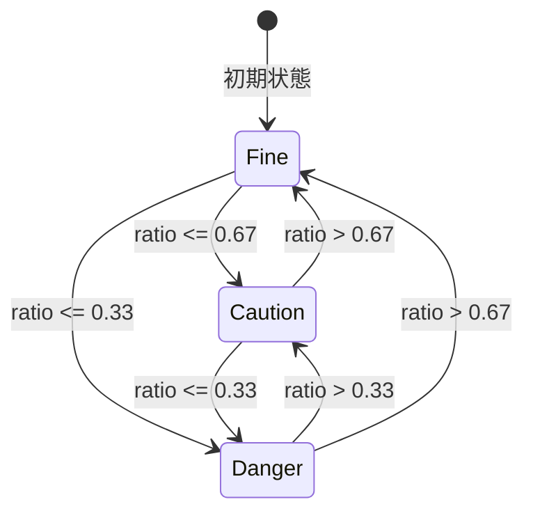
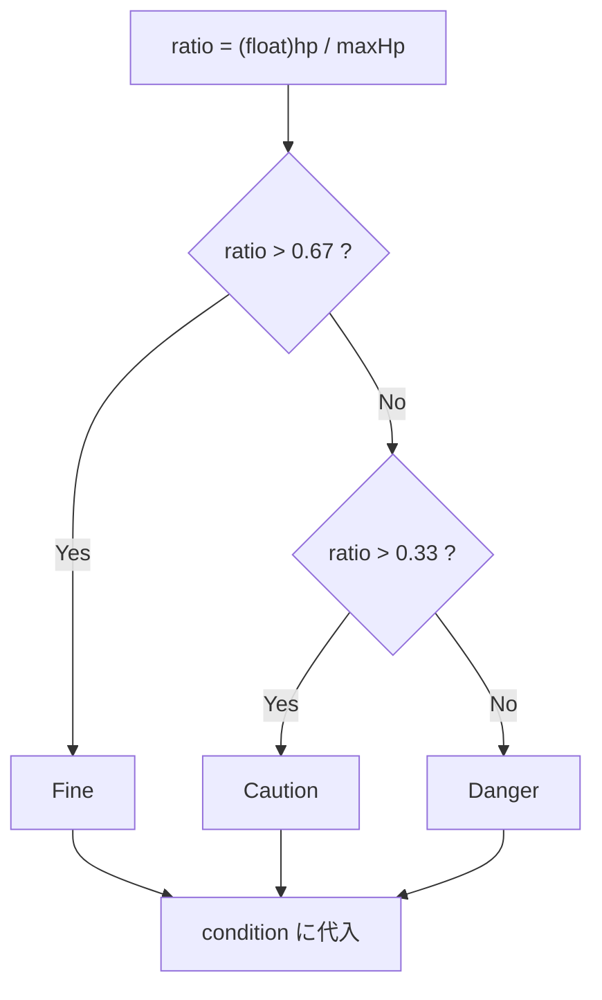
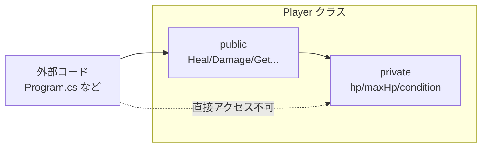

# 第1章：Playerクラスを作ろう

## 1-1 なぜクラスが必要か

HP・最大HP・状態は常にセットで動く。別々の変数にして外から自由に変更できると、次のような不整合が起きやすい。

- `hp` が `maxHp` を超える
- `hp` を変えたのに `Condition` を更新しない
- `hp` が負の値になる

そこで `Player` クラスにまとめ、変更用のメソッドだけを公開する。

## 1-2 struct と class の違い

C# では `class` は参照型、`struct` は値型。
このコースではゲーム内のプレイヤーを 1 つの実体として扱いたいので `class` を使う。



## 1-3 Playerクラスの設計

設計の基本方針は以下。

- フィールドは `private`
- 変更操作はメソッド経由（`Heal`, `Damage`）
- 読み取りは getter（またはプロパティ）
- HP変更時は必ず `UpdateCondition()` を呼ぶ



## 1-4 `Heal()` の処理フロー



## 1-5 `Damage()` の処理フロー



## 1-6 `UpdateCondition()` と状態遷移

### 状態遷移図



### 分岐フロー



## 1-7 カプセル化のまとめ



- 外部は「何をしたいか」を伝える（回復する / ダメージを与える）
- `Player` は「どう変更するか」を責任持って実装する

## 1-8 実装コード

### `Player.cs`

```csharp
public enum Condition
{
    Fine,
    Caution,
    Danger
}

public class Player
{
    private int hp;
    private int maxHp;
    private Condition condition;

    public Player(int maxHp)
    {
        this.maxHp = maxHp;
        hp = maxHp;
        condition = Condition.Fine;
    }

    public void Heal(int amount)
    {
        hp += amount;
        if (hp > maxHp) hp = maxHp;
        UpdateCondition();
    }

    public void Damage(int amount)
    {
        hp -= amount;
        if (hp < 0) hp = 0;
        UpdateCondition();
    }

    public int GetHp() => hp;
    public int GetMaxHp() => maxHp;
    public Condition GetCondition() => condition;

    private void UpdateCondition()
    {
        float ratio = (float)hp / maxHp;

        if (ratio > 0.67f)
            condition = Condition.Fine;
        else if (ratio > 0.33f)
            condition = Condition.Caution;
        else
            condition = Condition.Danger;
    }
}
```

### `Program.cs`（動作確認用）

```csharp
using System;

static string ConditionName(Condition c) => c.ToString();

static void PrintStatus(Player p)
{
    Console.WriteLine($"HP: {p.GetHp()}/{p.GetMaxHp()}, Condition: {ConditionName(p.GetCondition())}");
}

var p = new Player(100);
PrintStatus(p);

p.Damage(40);
PrintStatus(p);

p.Damage(40);
PrintStatus(p);

p.Heal(30);
PrintStatus(p);
```

## 1-9 確認問題

1. `hp` フィールドを `public` にすると、どんな不具合が起きやすくなるか。
2. `Heal()` / `Damage()` の最後で `UpdateCondition()` を呼ぶ理由は何か。
3. `ratio` 計算で `(float)` キャストを入れる理由は何か。

## まとめ

- `Player` に HP 管理を集約した
- カプセル化で不整合を防ぎやすくした
- 次章では「なぜこの設計が拡張に強いのか」を設計の観点から整理する
