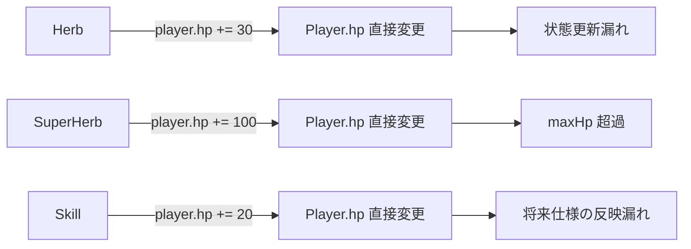
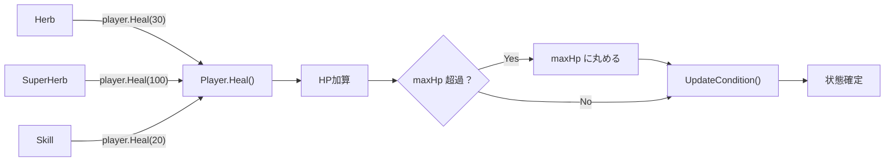
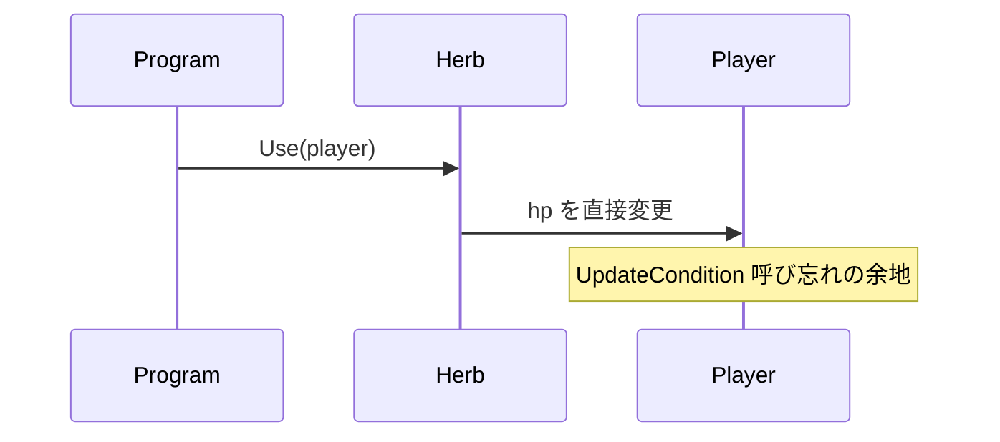
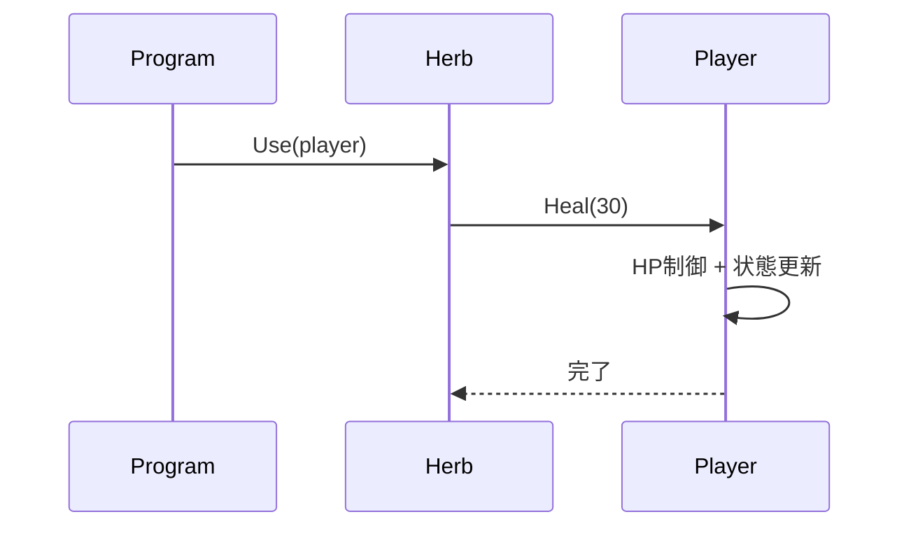
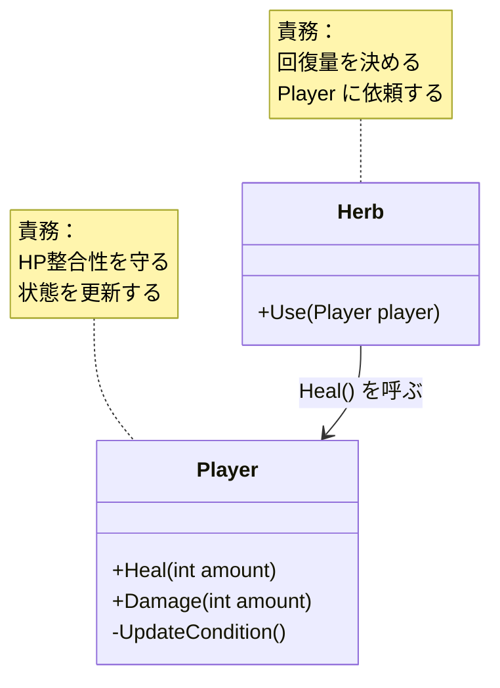
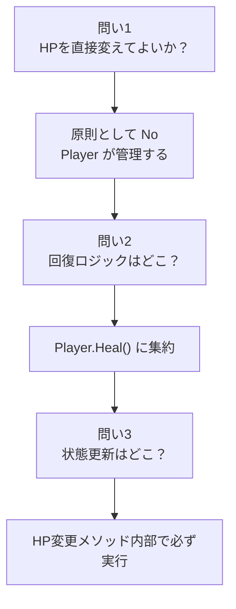

# 第2章：設計を考える

## 2-1 問いかけ

ハーブが `player.hp += 30` のように直接 HP を変更しても、動くことはある。
それでも `Player.Heal()` を経由する設計にしたのはなぜか。

この章では次の3つの問いに答える。

1. HP を直接変えてよいか
2. 回復ロジックはどこに書くべきか
3. 状態更新はどこで実行するべきか

## 2-2 ダメな設計：ロジックが散らばる

```csharp
// ダメな例（説明用）
player.Hp += 30; // public にしていたと仮定
```



問題は「動くかどうか」ではなく、仕様変更に耐えられるかどうか。

## 2-3 王道設計：Playerに集約する



## 2-4 設計の原則

この章で使っている原則はシンプル。

- 状態を持つクラスが、その状態の整合性を守る
- 外部は結果を要求し、内部ルールは隠す
- 変更されやすいロジックは 1 箇所に集約する

## 2-5 シーケンス図で比較する

### ダメな設計



### 良い設計



## 2-6 仕様変更に強い設計

将来、次の仕様が入るとする。

- 毒状態では回復量が半減する
- 回復時にログを出力する
- オーバーヒールを別扱いにする

このとき `Player.Heal()` に集約されていれば、修正箇所は基本的に 1 つで済む。


## 2-7 仕様変更後の `Heal()` の姿（例）

```csharp
public void Heal(int amount)
{
    int actual = amount;

    // 例: 将来ここで状態補正が入る
    // if (isPoisoned) actual /= 2;

    hp += actual;
    if (hp > maxHp) hp = maxHp;

    UpdateCondition();
    // 例: ログ出力
    // logger.LogHeal(actual);
}
```

## 2-8 責務の整理



## 2-9 「設計とは何か」

このコースでの設計は、次の判断の積み重ね。

- どこに責務を置くか
- どこを公開し、どこを隠すか
- 変更が起きたとき、何箇所直すことになるか

## 2-10 まとめ：3つの問いの答え



## 2-11 確認問題

1. `Herb.Use()` の中で `player` の内部状態を直接変更しないほうがよい理由を説明せよ。
2. 「変更されやすいロジックを集約する」とは、この章の例で何を指すか。
3. `Player.Heal()` にログ出力を追加する場合、どこに書くのが自然か。

## 次の章へ

次章では `Herb` クラスを作り、`Player` を引数に受け取って回復させる処理を実装する。
そのとき C# の「参照型」の挙動も整理する。
