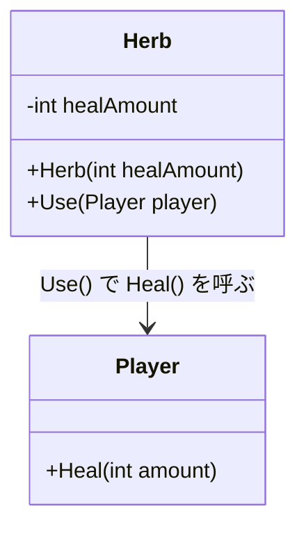
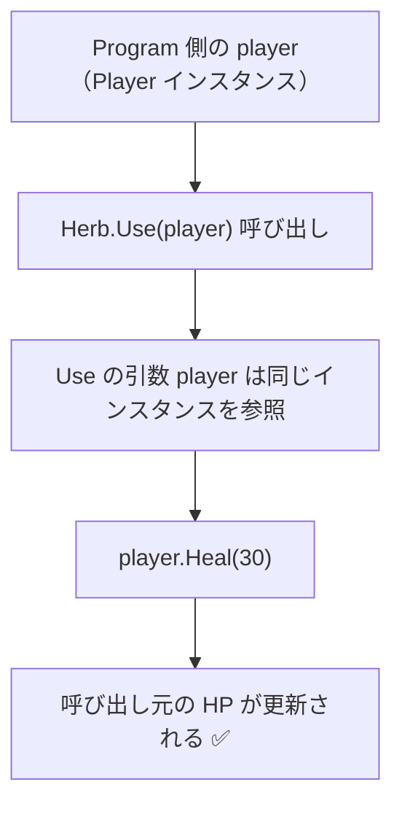
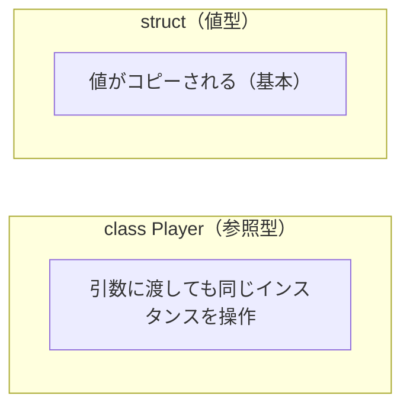
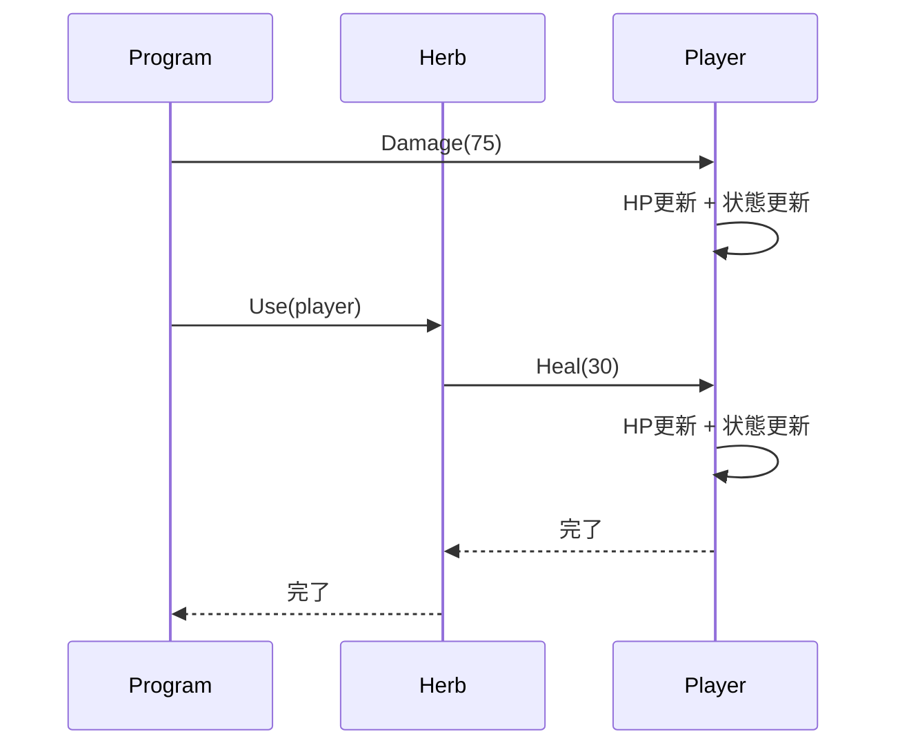

# 第3章：Herbクラスを作ろう（C#版）

## 3-1 設計を決める

`Herb` の役割は単純にする。

- どれだけ回復するかを持つ
- `Use(Player player)` で `Player.Heal()` を呼ぶ
- HP の整合性ルールは `Player` 側に任せる



## 3-2 まず押さえる：C# の `class` は参照型

C++版では値渡しと参照渡し（`&`）の違いが大きなテーマだった。
C# では `Player` を `class` にしているので、引数 `Player player` は「参照そのもの」が値渡しされる。

つまり、`player.Heal(30)` は呼び出し元の同じ `Player` インスタンスを変更する。

## 3-3 参照型の引数で何が起きるか



## 3-4 `ref` は何のためにあるのか（補足）

C# の `ref` は「参照型の中身を変更する」ためではなく、**変数そのものの参照先を入れ替えたい** ときに使う。

- `Player player` で `player.Heal()` を呼ぶ: `ref` 不要
- `player = new Player(999);` を呼び出し元にも反映したい: `ref` が必要

この章の `Herb.Use(Player player)` では `ref` は不要。

## 3-5 `class` と `struct` の違い（この章の文脈）



このコースはプレイヤーを `class` として扱うので、「ハーブ使用で HP が反映される」実装が自然に書ける。

## 3-6 依存関係の方向性

`Herb` は `Player` を使うが、`Player` は `Herb` を知らなくても HP 管理ができる。
この依存方向にしておくと、`Player` を汎用的に保ちやすい。


## 3-7 実装コード

### `Herb.cs`

```csharp
public class Herb
{
    private readonly int healAmount;

    public Herb(int healAmount = 30)
    {
        this.healAmount = healAmount;
    }

    public void Use(Player player)
    {
        player.Heal(healAmount);
    }
}
```

### `Program.cs`（動作確認）

```csharp
using System;

static void PrintStatus(Player p)
{
    Console.WriteLine($"HP: {p.GetHp()}/{p.GetMaxHp()}, Condition: {p.GetCondition()}");
}

var player = new Player(100);
var herb = new Herb(30);

player.Damage(75);
PrintStatus(player);

herb.Use(player);
PrintStatus(player);
```

## 3-8 全体の処理フロー（シーケンス図）



## 3-9 `readonly` と不変性（補足）

`healAmount` を `readonly` にしているのは、生成後に回復量を変えたくないから。
この小さな制約でも、バグ混入を減らせる。

## 3-10 確認問題

1. `Herb.Use(Player player)` に `ref` が不要な理由を説明せよ。
2. `Player` 側に HP 管理を残す設計にした理由は何か。
3. `healAmount` を `readonly` にするメリットは何か。

## まとめ

- `Herb` は「回復量を決めて依頼する」役割に絞る
- `Player` は HP の整合性を守る
- C# の `class` は参照型なので、C++版の `Player&` に近い意図を自然に表現できる

次章では `List<Herb>` を使ってインベントリを作る。
