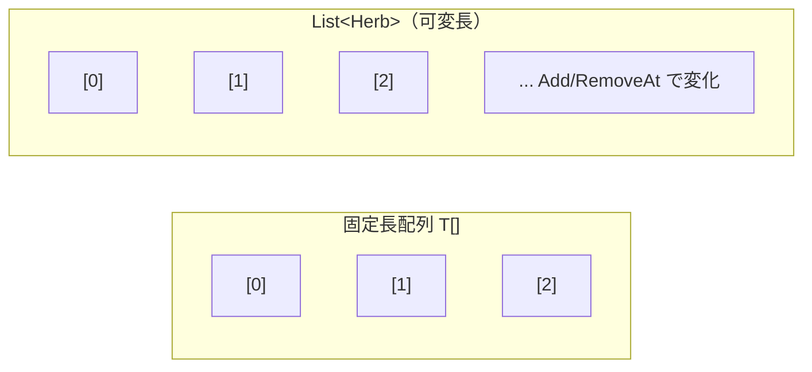
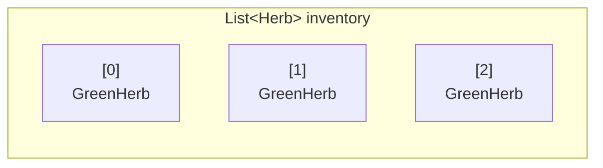
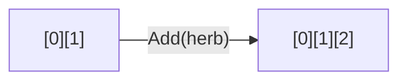
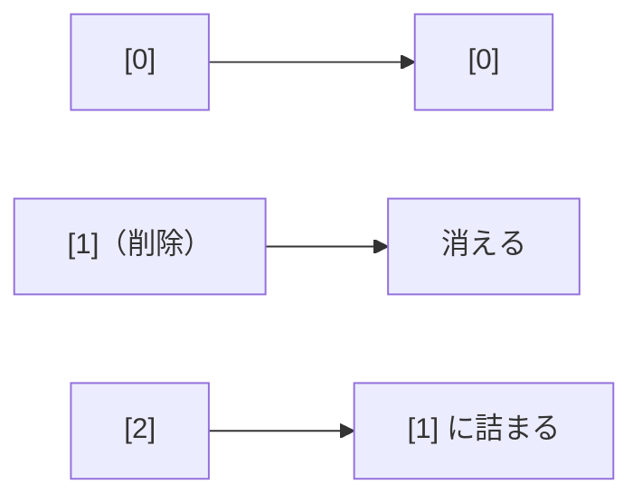
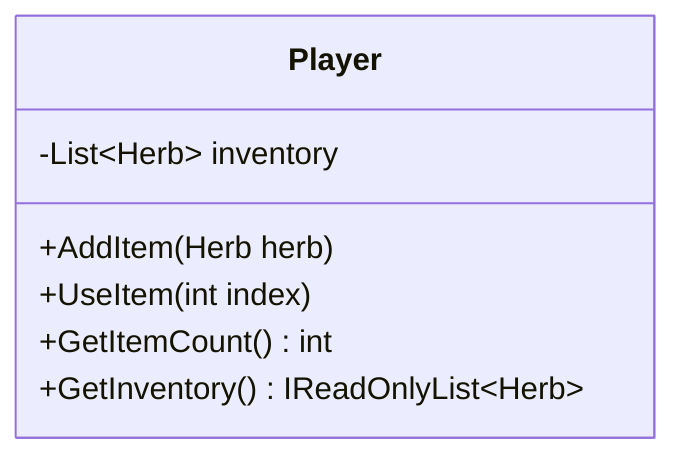
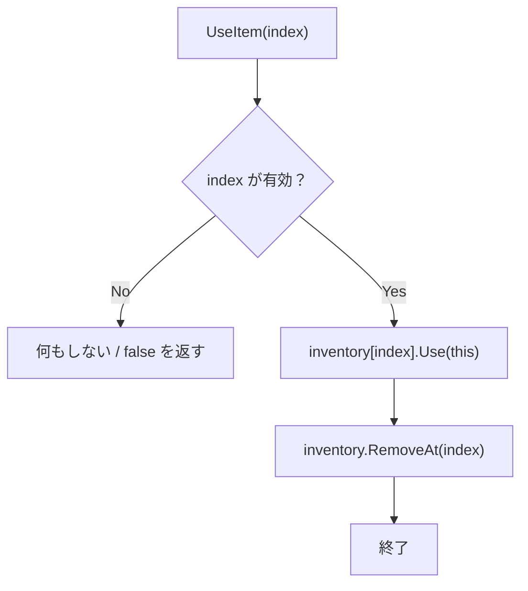
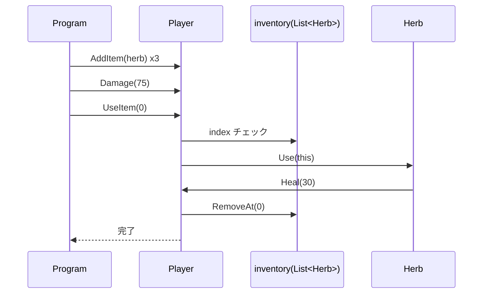

# 第4章：インベントリを作ろう（C#版）

## 4-1 インベントリとは何か

インベントリは「持ち物の一覧」。
この章ではまず `Herb` だけを扱う単純なインベントリを作る。

- 追加する
- 使う
- 使ったら消す
- 個数を確認する

## 4-2 `List<T>` とは何か（C#版の `vector`）

C++版の `std::vector<T>` に相当するものとして、C# では `List<T>` を使う。

- サイズ可変
- 添字（index）でアクセス
- `Add()` で末尾追加
- `RemoveAt()` で削除
- `Count` で要素数取得



### 主な操作

```csharp
var inventory = new List<Herb>();

inventory.Add(new Herb(30));
inventory.Add(new Herb(30));

int count = inventory.Count;
var first = inventory[0];

inventory.RemoveAt(0);
```

## 4-3 インデックスは 0 から始まる



`Count == 3` のとき、有効な index は `0, 1, 2`。`3` は範囲外。

## 4-4 `Add` と `RemoveAt` のイメージ

### `Add`



### `RemoveAt(1)`



削除後は後ろの要素が前に詰まる。保持していた index はずれる可能性がある。

## 4-5 設計：Playerクラスに何を追加するか

この章では `Player` に以下を追加する。

- `List<Herb> inventory`
- `AddItem(Herb herb)`
- `UseItem(int index)`
- `GetItemCount()`
- `GetInventory()`（読み取り専用で返す）



## 4-6 `UseItem()` の処理フロー



### `this` について

C# の `this` は「今このメソッドが動いている `Player` インスタンス」を指す。

`inventory[index].Use(this)` とすることで、アイテムに「自分（Player）」を渡せる。

## 4-7 依存関係の注意点（C#版）

C++版では `#include` と前方宣言の都合で循環依存が大きな話題になる。
C# ではコンパイル単位の仕組みが違うため、同じ種類の問題は起きにくい。

ただし設計上の依存の循環は依然として注意が必要。

- `Player` が `Herb` を強く知りすぎる
- `Herb` が `Player` の内部ルールを知りすぎる

この章ではまだ `List<Herb>` なので結合は強めだが、第6章で改善する。

## 4-8 実装コード

### `Player.cs`（更新版）

```csharp
using System.Collections.Generic;

public enum Condition
{
    Fine,
    Middle,
    Danger
}

public class Player
{
    private int hp;
    private int maxHp;
    private Condition condition;
    private readonly List<Herb> inventory = new();

    public Player(int maxHp)
    {
        this.maxHp = maxHp;
        hp = maxHp;
        condition = Condition.Fine;
    }

    public void Heal(int amount)
    {
        hp += amount;
        if (hp > maxHp) hp = maxHp;
        UpdateCondition();
    }

    public void Damage(int amount)
    {
        hp -= amount;
        if (hp < 0) hp = 0;
        UpdateCondition();
    }

    public void AddItem(Herb herb) => inventory.Add(herb);

    public bool UseItem(int index)
    {
        if (index < 0 || index >= inventory.Count)
            return false;

        inventory[index].Use(this);
        inventory.RemoveAt(index);
        return true;
    }

    public int GetItemCount() => inventory.Count;
    public IReadOnlyList<Herb> GetInventory() => inventory;

    public int GetHp() => hp;
    public int GetMaxHp() => maxHp;
    public Condition GetCondition() => condition;

    private void UpdateCondition()
    {
        float ratio = (float)hp / maxHp;
        if (ratio > 0.67f) condition = Condition.Fine;
        else if (ratio > 0.33f) condition = Condition.Middle;
        else condition = Condition.Danger;
    }
}
```

### `Program.cs`（動作確認）

```csharp
using System;

static void Print(Player p)
{
    Console.WriteLine($"HP: {p.GetHp()}/{p.GetMaxHp()}, Condition: {p.GetCondition()}, Items: {p.GetItemCount()}");
}

var p = new Player(100);
p.AddItem(new Herb(30));
p.AddItem(new Herb(30));
p.AddItem(new Herb(30));

p.Damage(75);
Print(p);

p.UseItem(0);
Print(p);
```

## 4-9 全体のシーケンス図



## 4-10 ここまでの限界（次章への橋渡し）

今の設計は `List<Herb>` なので、`Key` のような別種類のアイテムは入れられない。

- `Herb` は使える
- `Key` は使えない（型が違う）

この問題を次章で整理する。

## 4-11 確認問題

1. `UseItem()` で範囲チェックが必要な理由は何か。
2. `RemoveAt(index)` 後に index がずれるとはどういう意味か。
3. `GetInventory()` を読み取り専用で返す意図は何か。

## まとめ

- C# では `List<T>` を使ってインベントリを作る
- `Player` に在庫管理を追加した
- ただし `List<Herb>` は拡張性に限界がある
