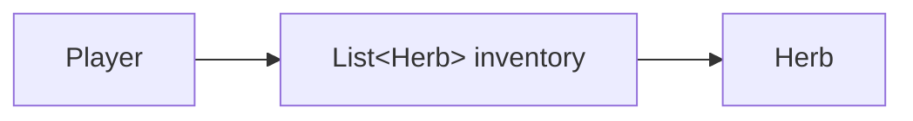
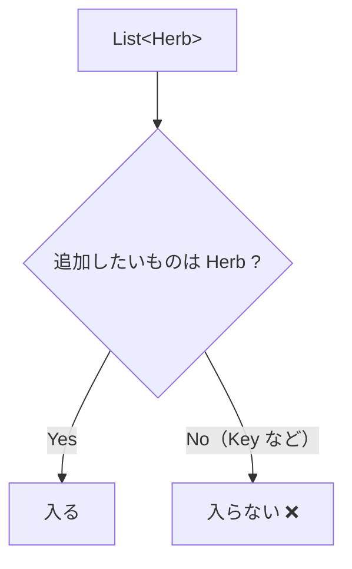
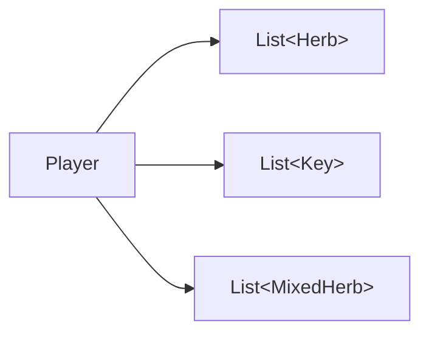
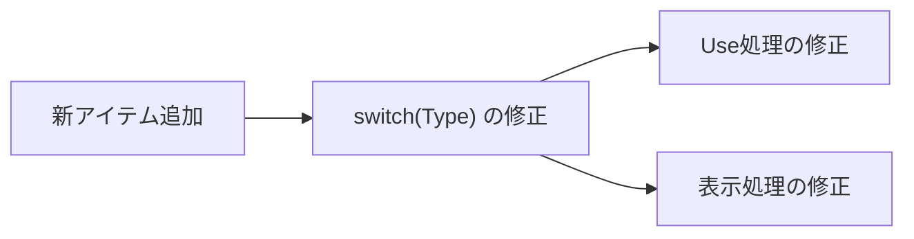
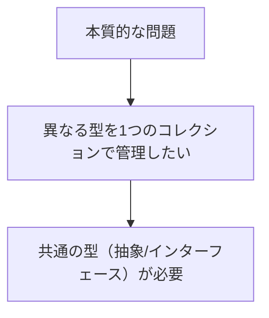
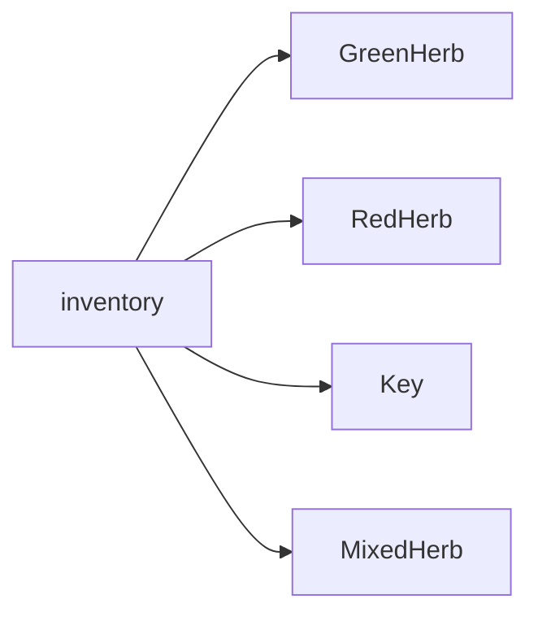
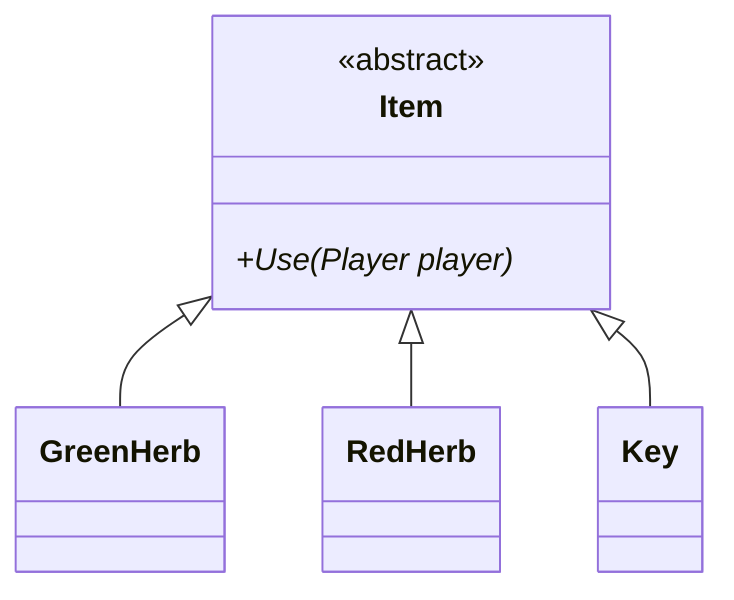
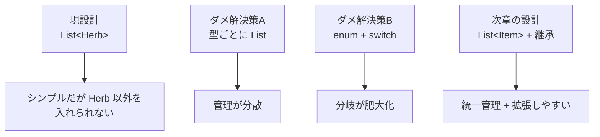

# 第5章：設計の限界（C#版）

## 5-1 現状を確認する

第4章の `Player` は `List<Herb>` を持っている。
これは「ハーブだけ」の世界では十分だが、ゲームとしてはすぐ限界が来る。



## 5-2 問い①：ハーブが複数種類になったら

`GreenHerb`, `RedHerb`, `MixedHerb` のように種類が増えるとどうなるか。

- `Herb` を汎用クラスとしてパラメータで表現する方法はある
- でも「回復アイテム以外」が入った瞬間に破綻する

```csharp
// まだ Herb 系だけなら何とかなる
var inventory = new List<Herb>();
inventory.Add(new Herb(30));
inventory.Add(new Herb(60));
```

## 5-3 問い②：Key（鍵）を追加したら

`Key` は `Herb` ではないので、`List<Herb>` に入らない。

```csharp
var inventory = new List<Herb>();
// inventory.Add(new Key("BossRoom")); // コンパイルエラー
```



## 5-4 ダメな解決策 A：リストを増やす

`List<Herb>` と `List<Key>` を別々に持つ案。



問題点。

- コレクションが分散する
- 「インベントリの 0 番目を使う」が表現しづらい
- UI/並び順/共通操作の実装が複雑になる

## 5-5 ダメな解決策 B：`enum` と分岐で管理する

1つの `struct` / `class` に全部押し込んで、`Type` で分岐する案。

```csharp
public enum ItemType { GreenHerb, RedHerb, MixedHerb, Key }

public class ItemData
{
    public ItemType Type;
    public int HealAmount;   // Key には無意味
    public string? KeyId;    // Herb には無意味
}
```



問題点。

- 無意味なフィールドが増える
- 分岐が増え続ける
- 新しい型の追加に弱い

## 5-6 本質的な問題の整理

欲しいのは「型が違っても同じ操作で扱えること」。

- どのアイテムも `Use(Player)` を持つ
- インベントリは一つで管理したい
- 新しいアイテムを増やしても `switch` を増やしたくない



## 5-7 本当に欲しいものは何か



この構造を C# で自然に表現するには、基底クラスまたはインターフェースを使う。

## 5-8 解決策の方向性

候補は2つ。

- `abstract class Item` を作る
- `interface IItem` を作る

このコースでは、共通のデータや既定動作も持ちやすいので `abstract class Item` を採用する。



## 5-9 3つの設計の比較まとめ



## 5-10 確認問題

1. `List<Herb>` に `Key` を入れられない理由は何か。
2. 型ごとに別リストを持つ案の問題点を2つ挙げよ。
3. `enum + switch` 案が拡張に弱い理由は何か。

## まとめ

- `List<Herb>` の限界は「型の固定」にある
- 欲しいのは「共通操作で扱える抽象化」
- 次章で `Item` を導入し、ポリモーフィズムに進む
