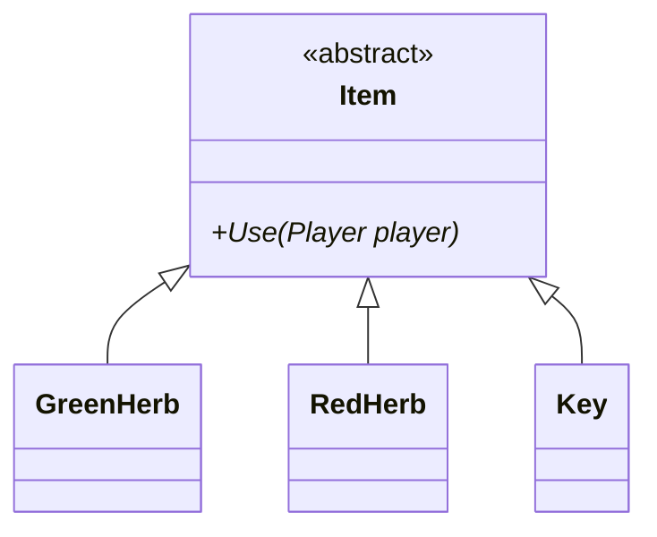
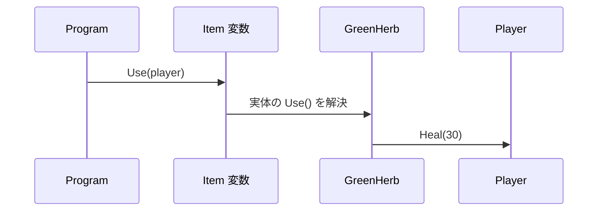
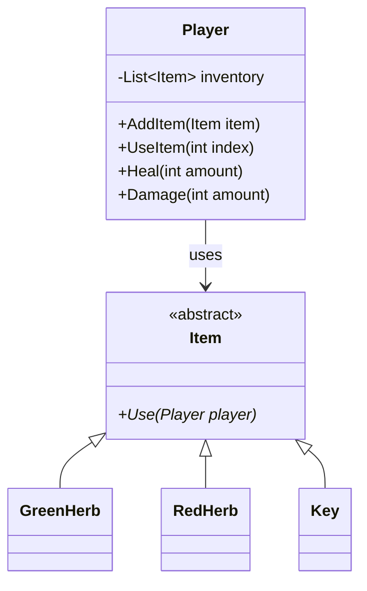

# 第6章：王道設計へ進化（ポリモーフィズム）（C#版）

## 6-1 前章の問題を整理する

前章で分かったこと。

- `List<Herb>` は Herb しか入らない
- `Key` など別種アイテムを混ぜたい
- `switch` を増やす設計は避けたい

必要なのは「共通の呼び出し口」と「型ごとの実装」。

## 6-2 共通インターフェースを作る

C#版では `abstract class Item` を使う。

```csharp
public abstract class Item
{
    public abstract void Use(Player player);
}
```

`Player` は `List<Item>` を持てば、`GreenHerb` / `RedHerb` / `Key` を一緒に管理できる。



## 6-3 3つのキーワードを理解する（C#版）

### `abstract`

- クラスを直接インスタンス化できない
- 派生クラスに実装を強制できる

### `virtual`

- 基底クラスに既定実装を持たせるときに使う
- 派生クラスが `override` で上書きできる

### `override`

- 基底クラスの `virtual` / `abstract` メソッドを上書きする
- シグネチャ不一致をコンパイラが検出しやすい


## 6-4 動的ディスパッチのイメージ

`Item item = new GreenHerb();`
として `item.Use(player)` を呼ぶと、実行時に `GreenHerb.Use()` が呼ばれる。



## 6-5 継承と `override` の書き方

```csharp
public class GreenHerb : Item
{
    private readonly int healAmount;

    public GreenHerb(int healAmount = 30)
    {
        this.healAmount = healAmount;
    }

    public override void Use(Player player)
    {
        player.Heal(healAmount);
    }
}
```

## 6-6 ポリモーフィズムの実演

```csharp
var items = new List<Item>
{
    new GreenHerb(),
    new RedHerb(),
    new Key("Boss")
};

foreach (var item in items)
{
    item.Use(player);
}
```

呼び出し側は `item.Use(player)` しか書かない。
何が起きるかは各型に委ねる。

## 6-7 継承前後の設計比較


改善点。

- 一つのインベントリで管理できる
- 新アイテム追加時に `Player` の `switch` を増やさなくてよい
- 責務が各クラスに分散される（良い意味で）

## 6-8 C#版の注意：デストラクタより `IDisposable`

C++版では仮想デストラクタが重要だったが、C# は GC があるので事情が異なる。

- メモリ解放は主に GC が担当
- ただしファイル・ソケット等の外部リソースは `IDisposable` を使う

このコースの `Item` は通常 `IDisposable` 不要。
第7章で「参照管理」と合わせて整理する。

## 6-9 実装コード

### `Item.cs`

```csharp
public abstract class Item
{
    public abstract void Use(Player player);
}
```

### `GreenHerb.cs`

```csharp
public class GreenHerb : Item
{
    private readonly int healAmount;

    public GreenHerb(int healAmount = 30)
    {
        this.healAmount = healAmount;
    }

    public override void Use(Player player)
    {
        player.Heal(healAmount);
    }
}
```

### `RedHerb.cs`

```csharp
public class RedHerb : Item
{
    private readonly int healAmount;

    public RedHerb(int healAmount = 60)
    {
        this.healAmount = healAmount;
    }

    public override void Use(Player player)
    {
        player.Heal(healAmount);
    }
}
```

### `Key.cs`

```csharp
using System;

public class Key : Item
{
    private readonly string keyId;

    public Key(string keyId)
    {
        this.keyId = keyId;
    }

    public override void Use(Player player)
    {
        Console.WriteLine($"[{keyId}] を使った。扉が開いた。");
    }
}
```

### `Player.cs`（`List<Item>` 版・抜粋）

```csharp
using System.Collections.Generic;

public class Player
{
    private readonly List<Item> inventory = new();
    private int hp;
    private int maxHp;
    private Condition condition;

    public Player(int maxHp)
    {
        this.maxHp = maxHp;
        hp = maxHp;
        condition = Condition.Fine;
    }

    public void AddItem(Item item) => inventory.Add(item);

    public bool UseItem(int index)
    {
        if (index < 0 || index >= inventory.Count) return false;
        inventory[index].Use(this);
        inventory.RemoveAt(index);
        return true;
    }

    public void Heal(int amount)
    {
        hp += amount;
        if (hp > maxHp) hp = maxHp;
        UpdateCondition();
    }

    public void Damage(int amount)
    {
        hp -= amount;
        if (hp < 0) hp = 0;
        UpdateCondition();
    }

    private void UpdateCondition()
    {
        float ratio = (float)hp / maxHp;
        if (ratio > 0.67f) condition = Condition.Fine;
        else if (ratio > 0.33f) condition = Condition.Middle;
        else condition = Condition.Danger;
    }

    public int GetHp() => hp;
    public int GetMaxHp() => maxHp;
    public Condition GetCondition() => condition;
}
```

### `Program.cs`（ポリモーフィズム確認）

```csharp
using System;

static void Print(Player p)
{
    Console.WriteLine($"HP: {p.GetHp()}/{p.GetMaxHp()}, Condition: {p.GetCondition()}");
}

var p = new Player(100);
p.Damage(80);
Print(p);

p.AddItem(new GreenHerb());
p.AddItem(new RedHerb());
p.AddItem(new Key("BossRoom"));

p.UseItem(0); // GreenHerb
Print(p);

p.UseItem(0); // RedHerb
Print(p);

p.UseItem(0); // Key
```

## 6-10 設計の全体像（第6章時点）



## 6-11 確認問題

1. `abstract class Item` にした理由は何か。
2. `override` を使うと、どのような設計上のメリットがあるか。
3. `List<Item>` に `GreenHerb` / `Key` を一緒に入れられる理由を説明せよ。

## まとめ

- 共通抽象 `Item` を導入した
- `List<Item>` で異種アイテムを統一管理できるようになった
- ポリモーフィズムで分岐の一部を型側へ移動できた

次章では、C# における参照管理・GC・`IDisposable` とアイテムボックス設計を扱う。
