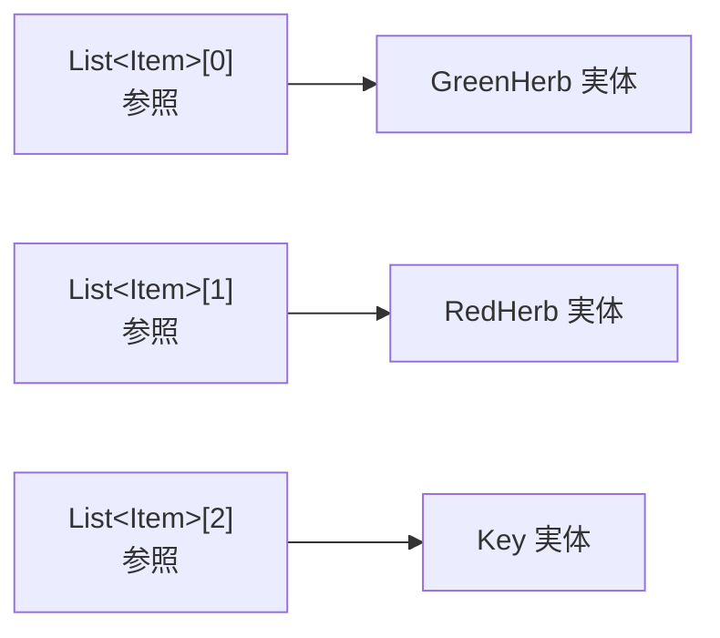
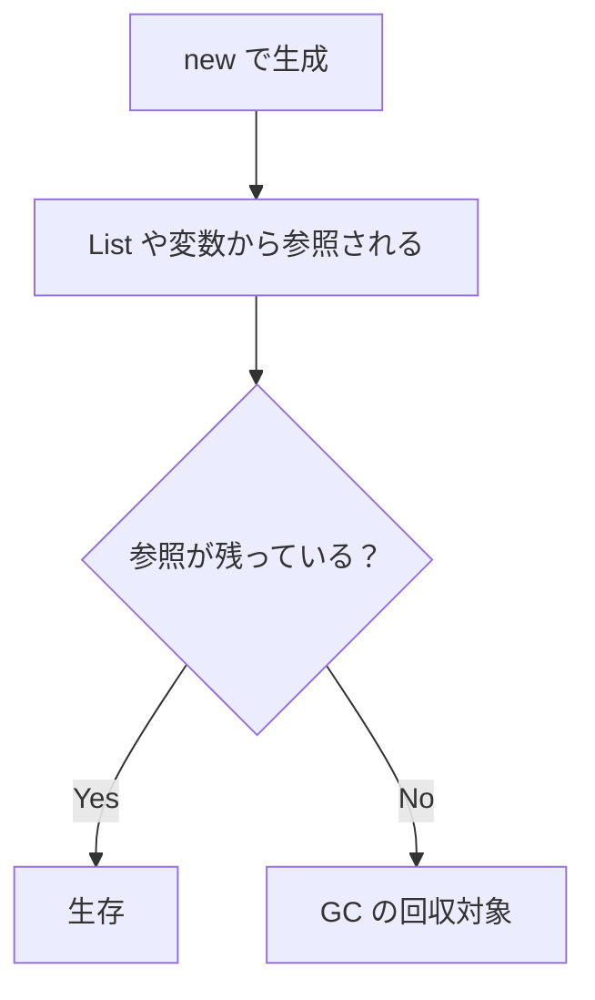
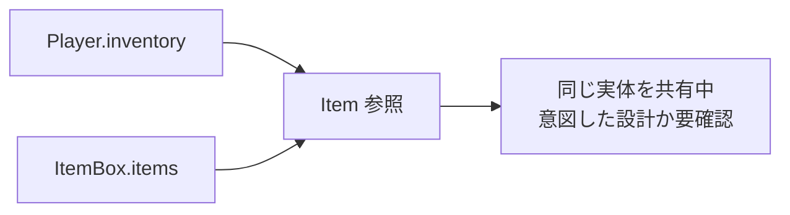
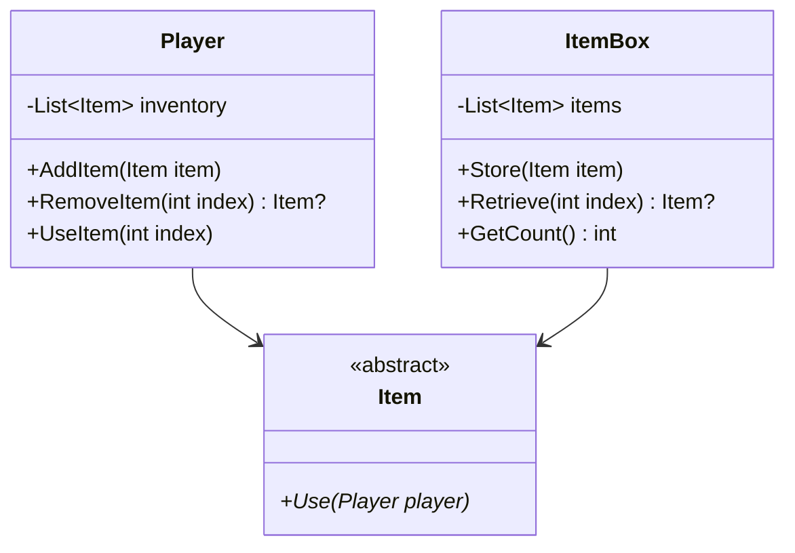
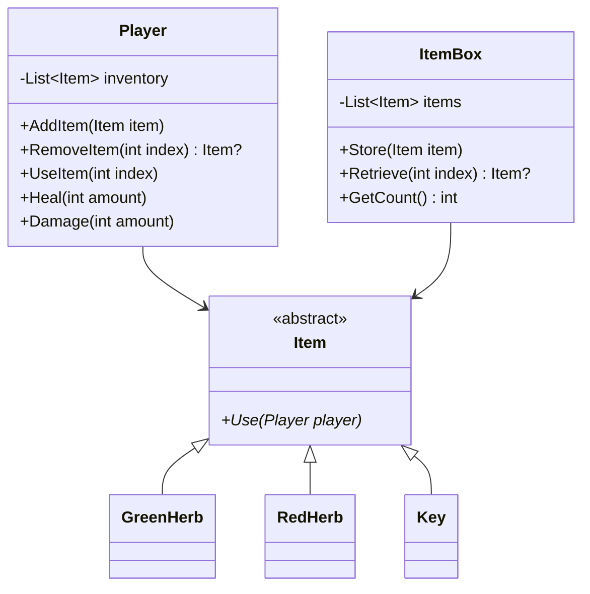
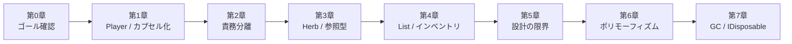

# 第7章：アイテムボックスと参照管理

## 7-1 前章の残った問いから始める

第6章で `List<Item>` に進化した。次に考えたいのは次の問い。

- アイテムボックスを追加したい
- ボックスからプレイヤーへアイテムを移したい
- メモリ解放は誰が担当するのか

## 7-2 `List<Item>` が自然に使える仕組み

C# の `class` は参照型なので、`List<Item>` の各要素には「`Item` 型の参照」が入る。

そのため、`GreenHerb` / `RedHerb` / `Key` の実体はそのまま維持される。



## 7-3 メモリ管理：GC の基本

C# では通常、`new` したオブジェクトを明示的に破棄する必要はない。

- 参照されなくなったオブジェクトは GC（ガベージコレクション）の回収対象になる
- 回収タイミングはシステムが決める（即時とは限らない）
- 開発者は「誰がこのメモリを消すか」を意識せずにコードが書ける



## 7-4 それでも注意が必要な点（参照共有）

メモリ解放は自動だが、問題がすべて消えるわけではない。特に注意するのは「参照の共有」。

- 同じインスタンスを複数の場所から参照できる
- どこで状態を変更したか追いづらくなる
- 「インベントリからボックスへ移す」操作などで、二重保持を避けたい



## 7-5 オブジェクトの参照管理と「所有」の考え方

C# の標準的な参照型では、一つのオブジェクトを複数の変数から同時に指し示すことができる。
そのため、「このオブジェクトは現在誰が管理しているのか」を設計段階で明確にしておくことが重要になる。

このコースでは以下のルールにする。

- `AddItem(item)` / `Store(item)` の呼び出し後は、呼び出し側で同じ参照を持ち続けない運用にする
- 「移動」は `RemoveAt` で取り出してから `Add` することを徹底する
- 必要なら `null` を代入して参照を手放したことを明示する

## 7-6 `IDisposable` と `using`（外部リソースの管理）

GC はメモリ回収を助けるが、ファイルやネットワーク接続などの外部リソースは `IDisposable` で明示的に解放する。

```csharp
using var stream = File.OpenRead(path);
// ここで stream を使う
// スコープ終了時に自動的に Dispose() が呼ばれ、リソースが解放される
```

ゲームのアイテム自体は通常 `IDisposable` である必要はないが、
将来的に画像・音声・ハンドルなどを直接保持するクラスを作る際には重要になる。

## 7-7 アイテムボックスの設計

プレイヤーとは別に、アイテムを保管する `ItemBox` を作る。

- `Store(Item item)`
- `Retrieve(int index)`
- `GetCount()`

`Retrieve` は参照を取り出し、呼び出し側で `Player.AddItem()` する。



## 7-8 実装コード

### `Player.cs`（最終版）

```csharp
using System.Collections.Generic;

public class Player
{
    private readonly List<Item> inventory = new();
    private int hp;
    private int maxHp;
    private Condition condition;

    public Player(int maxHp)
    {
        this.maxHp = maxHp;
        hp = maxHp;
        condition = Condition.Fine;
    }

    public void AddItem(Item item)
    {
        inventory.Add(item);
    }

    public Item? RemoveItem(int index)
    {
        if (index < 0 || index >= inventory.Count) return null;
        Item item = inventory[index];
        inventory.RemoveAt(index);
        return item;
    }

    public bool UseItem(int index)
    {
        if (index < 0 || index >= inventory.Count) return false;

        inventory[index].Use(this);
        inventory.RemoveAt(index);
        return true;
    }

    public int GetItemCount() => inventory.Count;
    public void Heal(int amount)
    {
        hp += amount;
        if (hp > maxHp) hp = maxHp;
        UpdateCondition();
    }

    public void Damage(int amount)
    {
        hp -= amount;
        if (hp < 0) hp = 0;
        UpdateCondition();
    }

    private void UpdateCondition()
    {
        float ratio = (float)hp / maxHp;
        if (ratio > 0.67f) condition = Condition.Fine;
        else if (ratio > 0.33f) condition = Condition.Caution;
        else condition = Condition.Danger;
    }

    public int GetHp() => hp;
    public int GetMaxHp() => maxHp;
    public Condition GetCondition() => condition;
}
```

### `ItemBox.cs`

```csharp
using System.Collections.Generic;

public class ItemBox
{
    private readonly List<Item> items = new();

    public void Store(Item item)
    {
        items.Add(item);
    }

    public Item? Retrieve(int index)
    {
        if (index < 0 || index >= items.Count) return null;

        Item item = items[index];
        items.RemoveAt(index);
        return item;
    }

    public int GetCount() => items.Count;
}
```

### `Program.cs`（アイテムボックス動作確認）

```csharp
using System;

static void PrintStatus(Player p, ItemBox box)
{
    Console.WriteLine($"HP: {p.GetHp()}/{p.GetMaxHp()}, Condition: {p.GetCondition()}, PlayerItems: {p.GetItemCount()}, BoxItems: {box.GetCount()}");
}

var player = new Player(100);
var box = new ItemBox();

player.Damage(80);

box.Store(new GreenHerb());
box.Store(new RedHerb());
box.Store(new Key("BossRoom"));

PrintStatus(player, box);

var item = box.Retrieve(0);
if (item is not null)
{
    player.AddItem(item);
    item = null; // 呼び出し側の参照を手放す（運用ルールの明示）
}

player.UseItem(0);
PrintStatus(player, box);
```

## 7-9 全体の処理シーケンス

```mermaid
sequenceDiagram
    participant Main as Program
    participant Box as ItemBox
    participant Player
    participant Item as GreenHerb

    Main->>Box: Store(new GreenHerb())
    Main->>Box: Retrieve(0)
    Box-->>Main: Item 参照を返す
    Main->>Player: AddItem(item)
    Main->>Player: UseItem(0)
    Player->>Item: Use(this)
    Item->>Player: Heal(30)
    Player->>Player: inventory.RemoveAt(0)
```

## 7-10 メモリ管理とリソース管理の使い分け

重要なのは、GC が自動的にメモリを回収する範囲と、`IDisposable` を使って明示的にリソースを解放すべき範囲を正しく区別すること。

- メモリ（`class` のインスタンスなど）：参照がなくなれば GC が回収する
- 外部リソース（ファイル、ネットワーク、ハンドル）：`using` や `Dispose()` で即座に解放する

この使い分けができるようになると、C# での安定したアプリケーション開発が可能になる。

## 7-11 設計の全体像（最終完成形）



## 7-12 確認問題

1. C# の `List<Item>` で、要素を追加・削除した際のオブジェクトの生存期間はどう決まるか。
2. GC があるのに `IDisposable` / `using` が必要になるのはどんなときか。
3. `ItemBox.Retrieve()` 後に、呼び出し側で参照の扱いを意識すべき理由は何か。

## まとめ

- 参照型と GC により、メモリ管理の多くが自動化されている
- ただし、参照共有のルール（誰がそのオブジェクトを所有・管理するか）の設計は依然として重要
- 外部リソースは `IDisposable` / `using` で適切に管理する
- `Player` / `Item` / `ItemBox` を組み合わせた、柔軟なアイテム管理システムが完成した

## コース全体の振り返り


