# 第7章：アイテムボックスと参照型の設計

---

## 7-1 前章の成果と次の目標

第6章で `List<Item>` に異種アイテムを入れ、ポリモーフィズムが動くようになった。

```csharp
var items = new List<Item> { new GreenHerb(), new RedHerb(), new Key("Boss") };
foreach (var item in items) item.Use(player);  // 自然に動く ✅
```

次の目標は2つ。

- **アイテムボックスを追加する**（インベントリと別の保管場所）
- **C# の参照型がなぜこれほど自然に扱えるのかを理解する**

---

## 7-2 なぜ C# の `List<Item>` はそのまま動くのか

C# の `class` は **参照型** だ。`List<Item>` の各スロットには「実体そのもの」ではなく「実体へのアドレス（参照）」が入る。

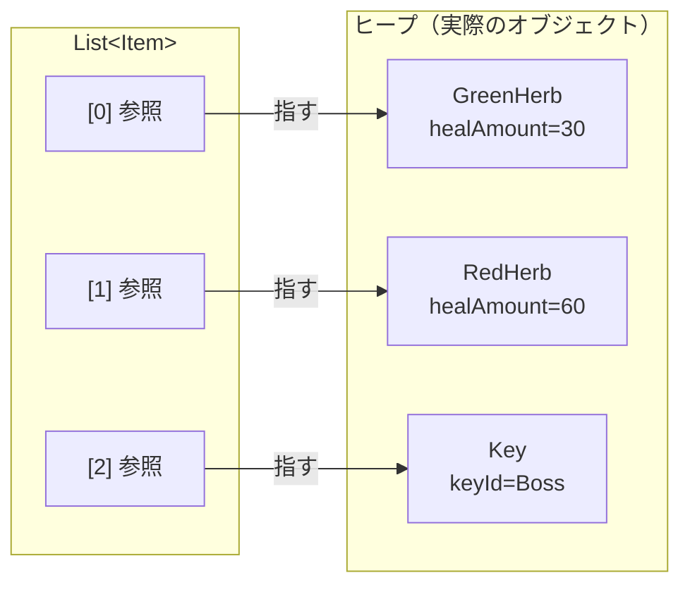

`GreenHerb` を `Item` 型の変数に代入しても、**実体は GreenHerb のまま**だ。
参照が入っているだけなので、情報が切り落とされることはない。

```csharp
Item item = new GreenHerb();  // 参照が Item 型の変数に入る
item.Use(player);             // 実体は GreenHerb → GreenHerb.Use() が呼ばれる ✅
```

> **C# ならではの強み：**
> `List<Item>` に `GreenHerb` を入れても、実体はそのまま。
> ポリモーフィズムが「自然に」動くのは、C# が参照型を基本設計にしているからだ。

---

## 7-3 GC（ガベージコレクション）の基本

C# では `new` したオブジェクトを明示的に破棄する必要はない。

```csharp
{
    var herb = new GreenHerb();
    // herb を使う
}
// スコープを抜けても明示的な削除は不要
// GC が「参照されなくなった」タイミングで自動回収する
```

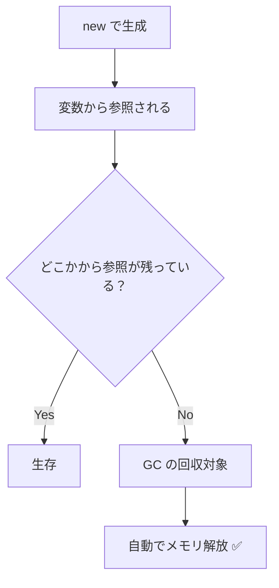

**GC の特性：**

| 特性 | 内容 |
|---|---|
| 自動回収 | 参照がなくなれば GC が回収する |
| タイミング | 即時ではなく、GC が決定する |
| 対象 | ヒープ上の通常オブジェクト（`class`）|

C# 開発者は「誰がいつメモリを解放するか」をほとんど意識しなくてよい。

---

## 7-4 参照共有には気をつける

GC がメモリを管理してくれる一方で、**参照の共有** には設計上の注意が必要だ。

C# では同じインスタンスを複数の変数から参照できる。

```csharp
var herb = new GreenHerb();
var a = herb;  // 同じ GreenHerb インスタンスを参照
var b = herb;  // こちらも同じ

// a を通じて状態を変えると b からも見える
```

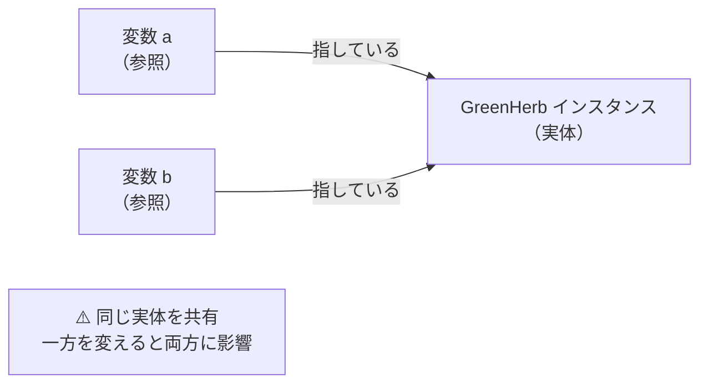

「インベントリからボックスへアイテムを移す」操作では、**同じ参照を2箇所で持ち続けることを避けたい**。

---

## 7-5 アイテムの「移動」を正しく設計する

C# でアイテムを「移動」するとは、**一方のリストから取り出して、もう一方に追加する** ことだ。

```csharp
// ❌ 悪い例：同じ参照を2箇所に追加してしまう
var item = inventory[0];
itemBox.Add(item);       // ボックスにも追加
// inventory[0] はまだ残っている → 2箇所が同じ実体を参照

// ✅ 良い例：取り出してから追加する
var item = inventory[0];
inventory.RemoveAt(0);   // インベントリから削除してから
itemBox.Add(item);       // ボックスに追加
// 所在は常に1箇所
```

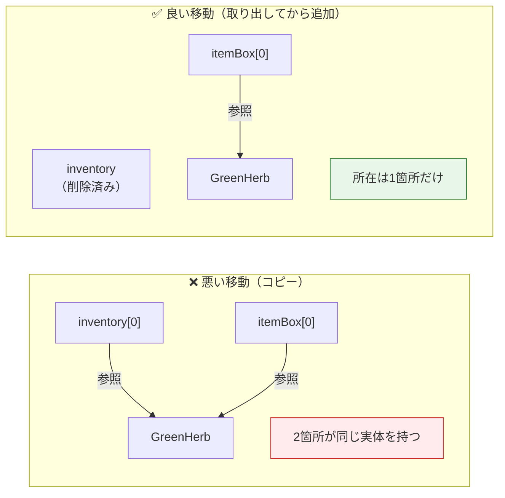

**このコースでの設計ルール：**

- `AddItem(item)` / `Store(item)` を呼んだ後は、呼び出し側で同じ変数を使い続けない
- 「移動」は `RemoveAt` で取り出してから `Add` することを徹底する
- 必要なら `null` を代入して「参照を手放した」ことをコードで明示する

```csharp
var item = box.Retrieve(0);  // ボックスから取り出す
if (item is not null)
{
    player.AddItem(item);
    item = null;  // 参照を手放したことを明示（任意だが意図を表せる）
}
```

---

## 7-6 `IDisposable` と `using`（外部リソースの管理）

GC はメモリを自動回収するが、**ファイルやネットワーク接続などの外部リソース** は明示的に解放する必要がある。

そのために C# では `IDisposable` インターフェースと `using` 構文が用意されている。

```csharp
// using を使うと、スコープ終了時に自動で Dispose() が呼ばれる
using var stream = File.OpenRead("save.dat");
// ここで stream を使う
// スコープ終了時に自動で閉じられる ✅
```

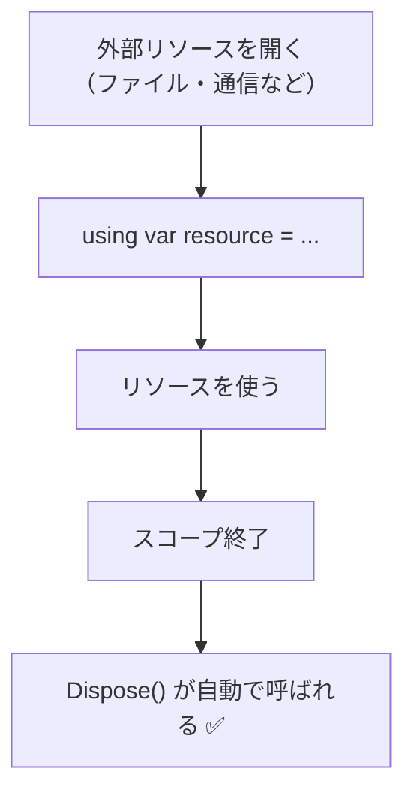

**GC と IDisposable の使い分け：**

| 対象 | 管理方法 |
|---|---|
| 通常のオブジェクト（`class`）| GC が自動で回収 |
| ファイル・通信・ハンドルなど | `using` / `Dispose()` で明示的に解放 |

このコースのアイテムクラス（`GreenHerb` / `Key` など）は通常 `IDisposable` を実装する必要はない。
将来、画像データや音声ファイルを直接保持するクラスを作るときに重要になる。

---

## 7-7 アイテムボックスの設計

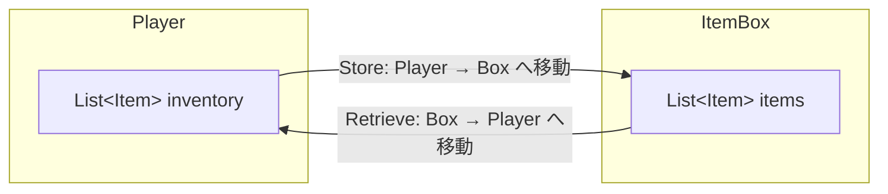

### クラス図

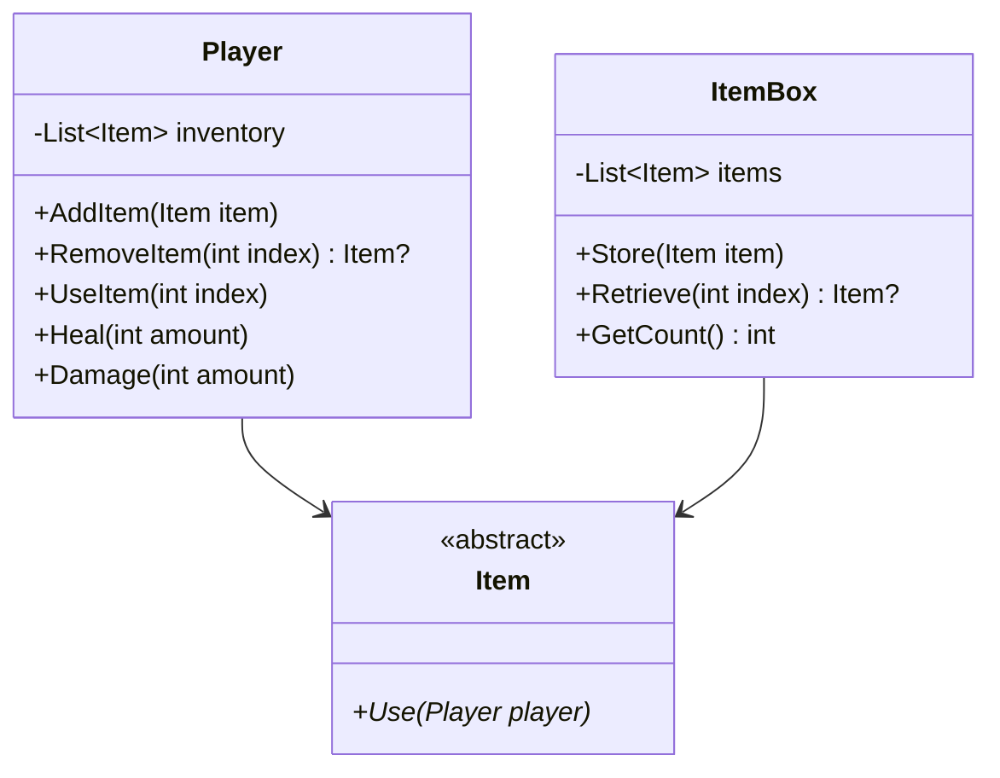

---

## 7-8 実装コード

### `Player.cs`（最終版）

```csharp
using System.Collections.Generic;

public class Player
{
    private readonly List<Item> inventory = new();
    private int hp;
    private int maxHp;
    private Condition condition;

    public Player(int maxHp)
    {
        this.maxHp = maxHp;
        hp = maxHp;
        condition = Condition.Fine;
    }

    public void AddItem(Item item)
    {
        inventory.Add(item);
    }

    public Item? RemoveItem(int index)
    {
        if (index < 0 || index >= inventory.Count) return null;
        Item item = inventory[index];
        inventory.RemoveAt(index);
        return item;
    }

    public bool UseItem(int index)
    {
        if (index < 0 || index >= inventory.Count) return false;
        inventory[index].Use(this);
        inventory.RemoveAt(index);
        return true;
    }

    public int GetItemCount() => inventory.Count;

    public void Heal(int amount)
    {
        hp += amount;
        if (hp > maxHp) hp = maxHp;
        UpdateCondition();
    }

    public void Damage(int amount)
    {
        hp -= amount;
        if (hp < 0) hp = 0;
        UpdateCondition();
    }

    private void UpdateCondition()
    {
        float ratio = (float)hp / maxHp;
        if (ratio > 0.67f) condition = Condition.Fine;
        else if (ratio > 0.33f) condition = Condition.Caution;
        else condition = Condition.Danger;
    }

    public int GetHp() => hp;
    public int GetMaxHp() => maxHp;
    public Condition GetCondition() => condition;
}
```

### `ItemBox.cs`

```csharp
using System.Collections.Generic;

public class ItemBox
{
    private readonly List<Item> items = new();

    public void Store(Item item)
    {
        items.Add(item);
    }

    public Item? Retrieve(int index)
    {
        if (index < 0 || index >= items.Count) return null;

        Item item = items[index];
        items.RemoveAt(index);
        return item;
    }

    public int GetCount() => items.Count;
}
```

### `Program.cs`（アイテムボックス動作確認）

```csharp
using System;

static void PrintStatus(Player p, ItemBox box)
{
    Console.WriteLine(
        $"HP: {p.GetHp()}/{p.GetMaxHp()}, " +
        $"Condition: {p.GetCondition()}, " +
        $"所持: {p.GetItemCount()}, " +
        $"ボックス: {box.GetCount()}");
}

var player = new Player(100);
var box = new ItemBox();

// ボックスにアイテムを預ける
box.Store(new GreenHerb());
box.Store(new RedHerb());
box.Store(new Key("BossRoom"));

PrintStatus(player, box);

// ボックスからインベントリへ移動
var item = box.Retrieve(0);
if (item is not null)
{
    player.AddItem(item);
    item = null;  // 参照を手放す
}

player.Damage(80);
PrintStatus(player, box);

player.UseItem(0);  // GreenHerb 使用
PrintStatus(player, box);
```

---

## 7-9 全体の処理シーケンス

```mermaid
sequenceDiagram
    participant Main as Program
    participant Box as ItemBox
    participant Player
    participant Item as GreenHerb

    Main->>Box: Store(new GreenHerb())
    Note right of Box: GreenHerb の参照を保持

    Main->>Box: Retrieve(0)
    Box-->>Main: Item 参照を返す（Boxからは削除）

    Main->>Player: AddItem(item)
    Note right of Player: Player が参照を保持

    Main->>Player: UseItem(0)
    Player->>Item: Use(this)
    Item->>Player: Heal(30)
    Player->>Player: inventory.RemoveAt(0)
    Note right of Player: 参照がどこからも消える → GC が回収
```

---

## 7-10 GC と IDisposable の整理

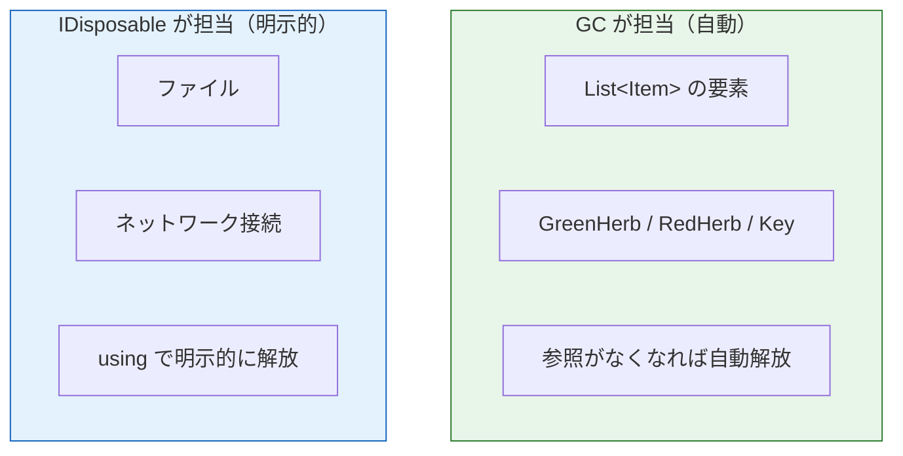

このコースのアイテムクラスは GC 任せでよい。
`IDisposable` が必要になるのは、外部リソースを直接持つクラスを作るときだ。

---

## 7-11 設計の全体像（最終完成形）

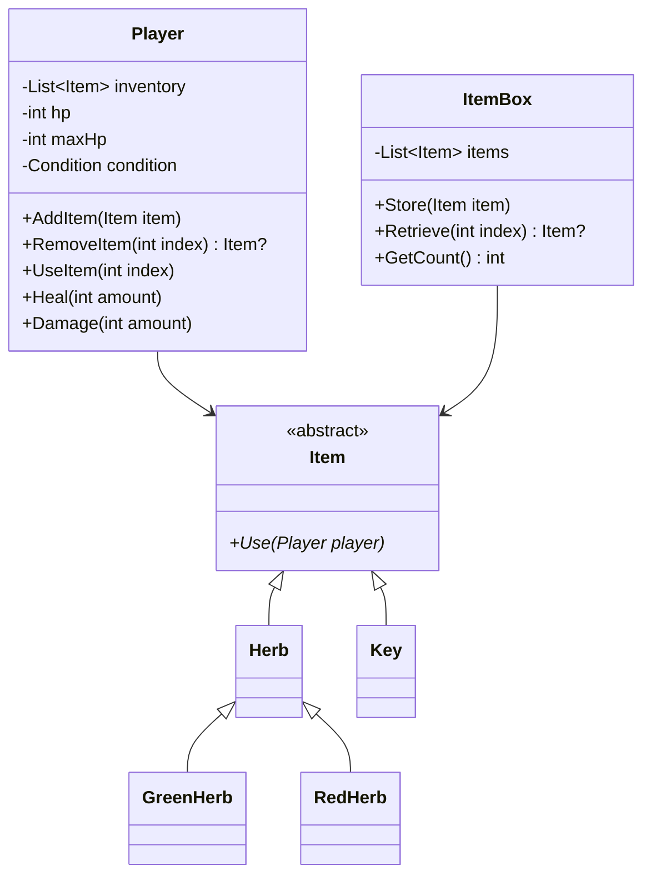

---

## 7-12 確認問題

1. C# の `List<Item>` に `GreenHerb` を追加したとき、実体の型は何になるか。
   「参照型」という言葉を使って説明せよ。

2. GC があるのに `IDisposable` / `using` が必要になるのはどんなときか。

3. 次のコードの問題点を説明せよ。
   ```csharp
   var item = inventory[0];
   itemBox.Store(item);
   // inventory.RemoveAt(0) を呼ばずにそのままにしている
   ```

4. `ItemBox.Retrieve()` が `Item?`（nullable）を返す理由は何か。

5. 次のコードで GreenHerb インスタンスは GC に回収されるか。理由も答えよ。
   ```csharp
   {
       var herb = new GreenHerb();
       player.AddItem(herb);
   }
   // スコープを抜けた後
   ```

---

## まとめ

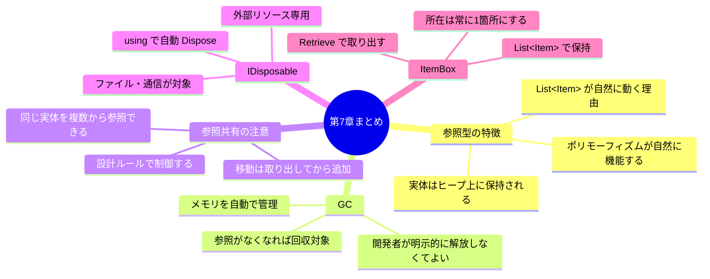

---

## コース全体の振り返り

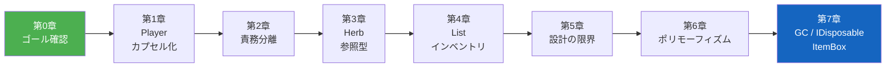

| 章 | 習得した概念 |
|:--:|---|
| 第1章 | クラス、カプセル化、enum |
| 第2章 | 責務分離、変更に強い設計 |
| 第3章 | 参照型、class と struct の違い |
| 第4章 | `List<T>`、インベントリの基本 |
| 第5章 | 設計の限界を問いで発見する力 |
| 第6章 | abstract class、override、ポリモーフィズム |
| 第7章 | 参照型の仕組み、GC、IDisposable、ItemBox設計 |

このコースで実装した「バイオ風ハーブ回復システム」は、
C# のエッセンス ── **カプセル化・責務分離・多態性・参照型の理解** ── を全て含んでいる。
