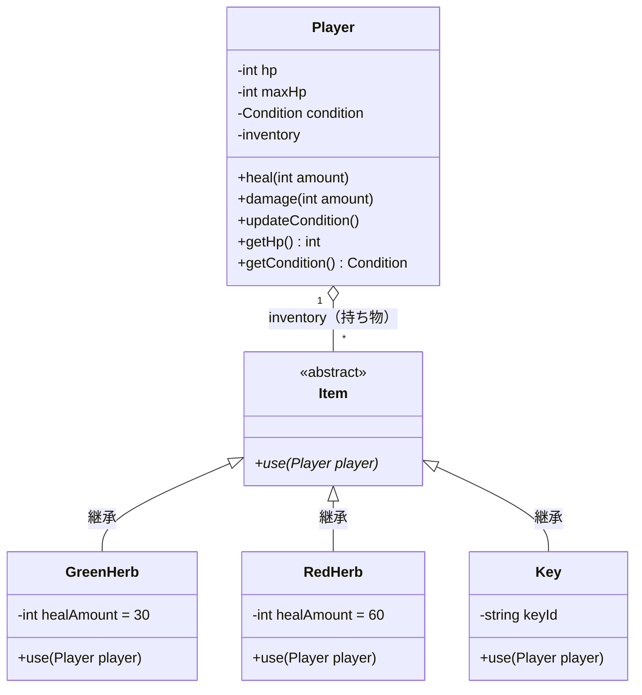
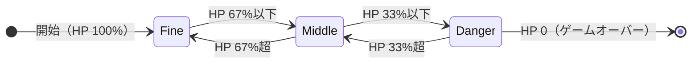
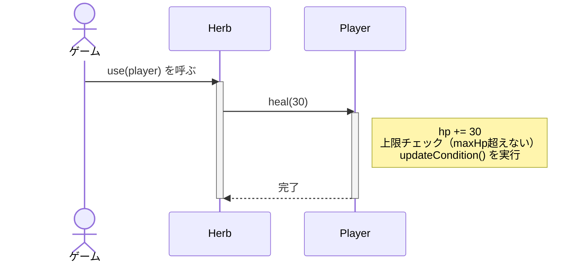

# 第0章：ゴールを確認しよう

---

## 何を作るのか

このコースでは、**バイオハザード風のアイテム使用システム**をC++で実装する。

作るのはゲームの「ロジック」だ。画面には何も出ないかもしれないが、ゲームの核心部分を作る。

完成したら、こんな動作が実現できる：

```
初期状態 : HP 100/100 [Fine]
ダメージ後: HP 25/100  [Danger]
ハーブ使用: HP 55/100  [Middle]
```

---

## システム全体の設計図

「どんな部品が必要か」を先に把握しておこう。
これが **クラス図** ── プログラムの設計図に相当するものだ。



今はこの図を完全に理解しなくていい。
「最終的にこういう設計になる」というゴールを頭に入れておけば十分だ。

---

## HP状態（Condition）の遷移

プレイヤーのHPが変化すると、**状態（Condition）** も連動して変わる。



この「状態が切り替わる」という仕組みを **ステートマシン（状態機械）** と呼ぶ。
ゲームロジックでは頻繁に登場する考え方だ。

---

## ハーブを使ったときの処理フロー

「ハーブを使う」という1アクションで、内部ではこんな処理が走る。



ここで重要なのは **責務の分離** だ。

- `Herb` は「何点回復するか」だけを知っている
- `Player` は「HPを正しく計算し、状態を更新する」責務を持つ
- 互いに **相手の内部実装を知らなくていい**

この分離の考え方がC++設計の核心になる。

---

## 学習ロードマップ


| 章 | テーマ | 主なキーワード |
|:--:|---|---|
| 第0章 | ゴール確認 | クラス図、状態遷移図 |
| 第1章 | Playerクラス | class、カプセル化、enum class |
| 第2章 | 設計を考える | 責務分離、シーケンス図 |
| 第3章 | Herbクラス | 参照渡し（&）、依存関係 |
| 第4章 | インベントリ | vector、STL |
| 第5章 | 設計の限界 | 問題発見、設計の問いかけ |
| 第6章 | ポリモーフィズム | 継承、純粋仮想関数 |
| 第7章 | 所有権 | unique_ptr、move |

---

## まず動かしてみよう

第1章に入る前に、素朴なコードを動かして「出発点」を体感しておこう。

```cpp
#include <iostream>

int main() {
    int hp    = 100;
    int maxHp = 100;

    // ダメージを受ける
    hp -= 75;
    std::cout << "HP: " << hp << "/" << maxHp << std::endl;

    // ハーブを使う（30回復）
    hp += 30;
    if (hp > maxHp) hp = maxHp;
    std::cout << "HP: " << hp << "/" << maxHp << std::endl;

    return 0;
}
```

**出力：**
```
HP: 25/100
HP: 55/100
```

動く。でも、何が問題だろう？

- プレイヤーが2人になったら `hp1`, `hp2` ... と変数が増える
- `hp += 30` は「上限チェックしなければならない」というルールが、コードの外に漏れている
- 状態（Fine / Middle / Danger）をどこで管理するのか？

次の章で、C++の「クラス」を使ってこれを整理していく。
