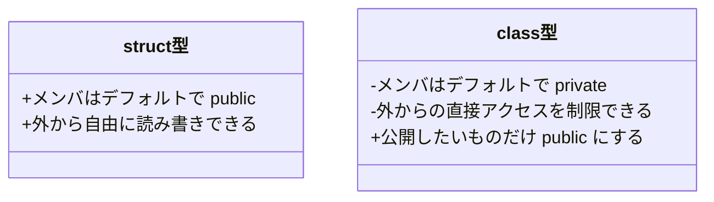
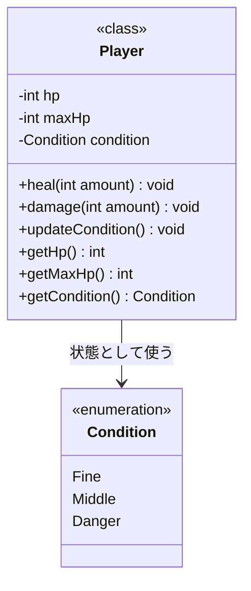
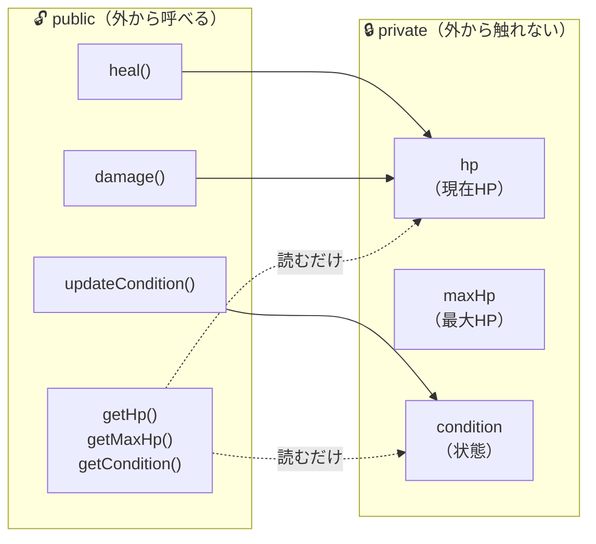
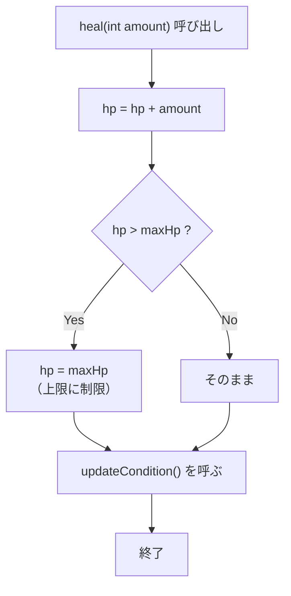
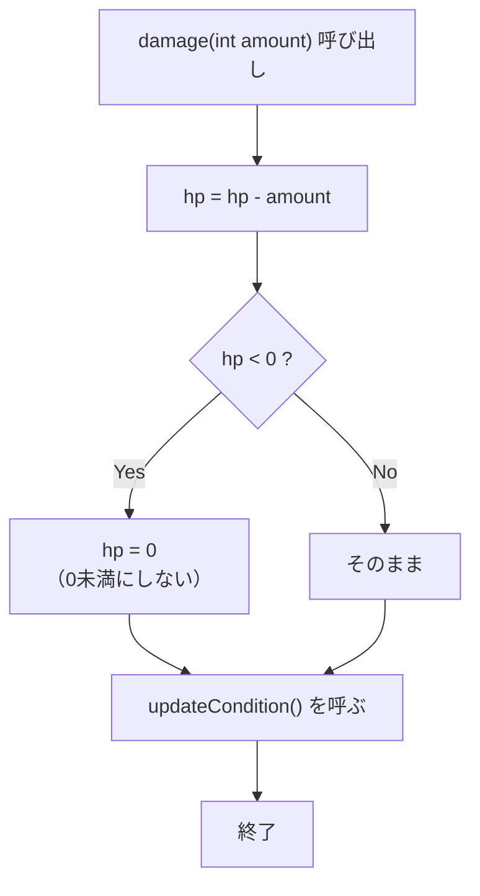
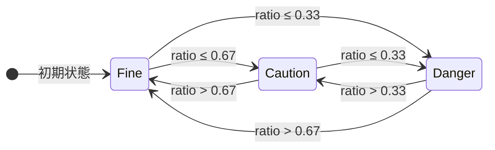
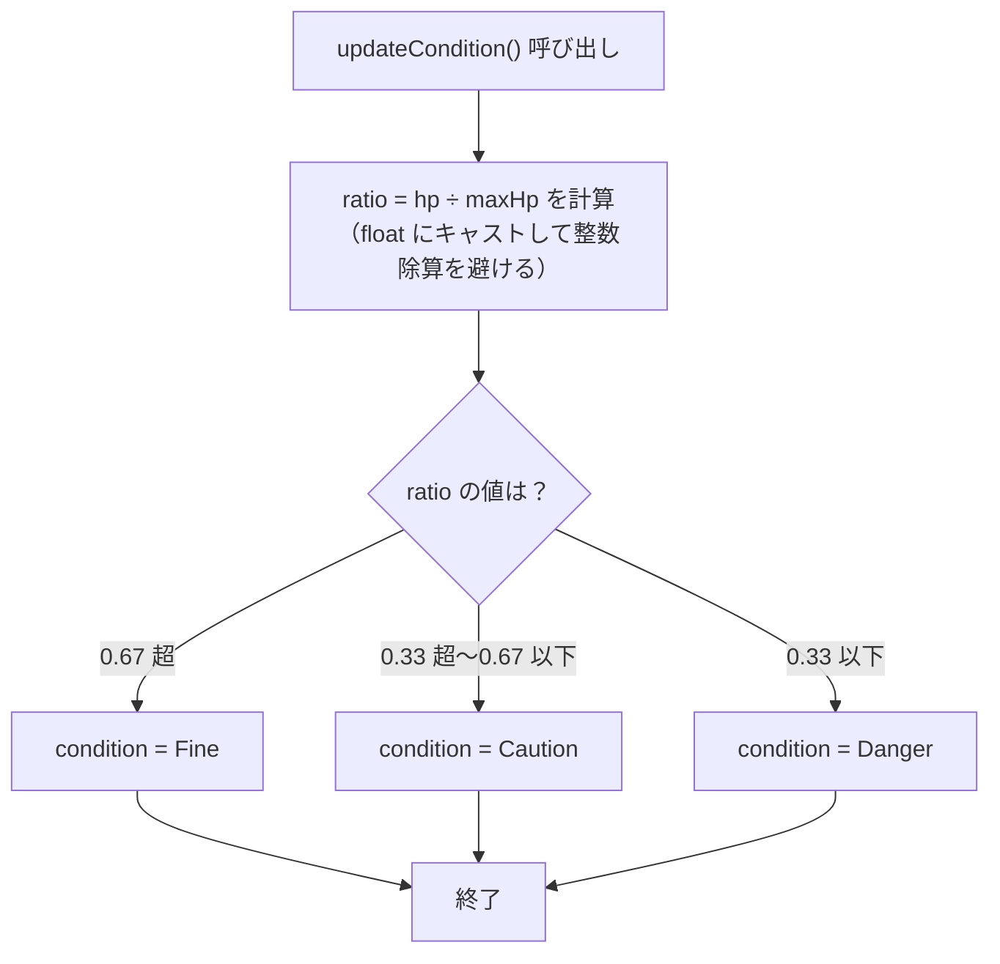
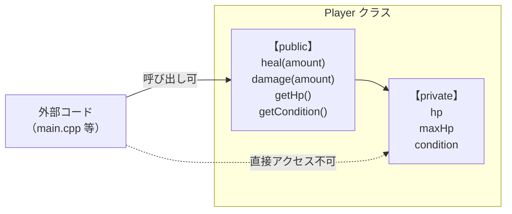
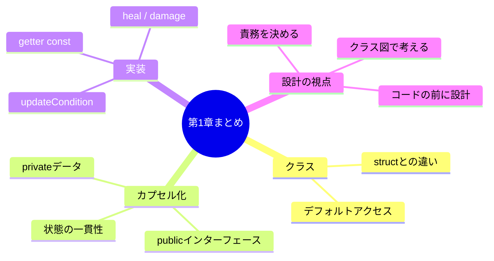

# 第1章：Playerクラスを作ろう

---

## 1-1 なぜクラスが必要か

前章の最後に書いたコードを思い出そう。

```cpp
int hp    = 100;
int maxHp = 100;
```

これで動く。でも、プレイヤーが2人になったら？

```cpp
int hp1    = 100;
int maxHp1 = 100;

int hp2    = 80;
int maxHp2 = 100;
```

10人になったら？ 管理しきれなくなる。

**クラス** を使うと、「関連するデータ」と「それに対する操作」をひとまとめにできる。
これが C++ でのゲームロジック設計の第一歩だ。

---

## 1-2 `struct` と `class` の違い

C++ には `struct` と `class` という、似たような2つの仕組みがある。



実際のコードで比べてみよう：

```cpp
// struct の場合：外から直接変えられる
struct PlayerS {
    int hp    = 100;
    int maxHp = 100;
};

PlayerS p;
p.hp = 9999;  // 何でも入れられてしまう
```

```cpp
// class の場合：外からは直接変えられない
class PlayerC {
private:
    int hp    = 100;
    int maxHp = 100;

public:
    void heal(int amount);  // 操作はメソッドを通じて行う
};

PlayerC pc;
pc.hp = 9999;  // コンパイルエラー！
```

ゲームシステムでは `class` を使い、
「HPは必ず `heal()` や `damage()` を通じてしか変更できない」ようにするのが王道だ。

---

## 1-3 Playerクラスの設計

コードを書く前に、まず **設計** をする。

> 「何を持つか」「何ができるか」を先に決める。



クラス図の記号の意味：

| 記号 | 意味 |
|:--:|---|
| `-` | `private`（クラス外からアクセス不可） |
| `+` | `public`（クラス外からアクセス可） |
| `<<enumeration>>` | enum class（列挙型） |

### なぜこの設計か？



- **データを `private`** にすることで、HPが `9999` や `-100` になる事故を防げる
- **操作を `public`** にすることで、「どうHPを変えられるか」が明確になる
- **getter は `const`** をつけて「読むだけ」と明示する

---

## 1-4 `heal()` の処理フロー

`heal()` は単純に足すだけではない。「上限チェック」が必要だ。



---

## 1-5 `damage()` の処理フロー



---

## 1-6 `updateCondition()` と状態遷移

HPの割合（`hp / maxHp`）に応じて、Conditionを切り替える。

### 状態遷移図



### `updateCondition()` の分岐フロー



> **注意点：整数の割り算**
>
> `int hp = 30; int maxHp = 100;` のとき、
> `hp / maxHp` は C++ では `0` になる（整数同士の割り算は小数点以下が切り捨て）。
>
> `static_cast<float>(hp) / maxHp` と書くことで `0.3f` が得られる。

---

## 1-7 カプセル化のまとめ

ここまでの設計をひとつの図にまとめる。



`heal()` を経由することで：

1. `hp` が `maxHp` を超えることが **絶対に** 起きない
2. `hp` が変わるたびに `updateCondition()` が **必ず** 呼ばれる
3. 「HPの更新ルール」が Player クラスの **内部に集約** される

これが **カプセル化** の本質だ。

---

## 1-8 実装コード

### `Player.h`

```cpp
#pragma once

enum class Condition {
    Fine,    // HP 67% 超
    Caution,  // HP 34〜67%
    Danger,  // HP 33% 以下
};

class Player {
public:
    void heal(int amount);
    void damage(int amount);
    void updateCondition();

    int       getHp()        const;
    int       getMaxHp()     const;
    Condition getCondition() const;

private:
    int       hp        = 100;
    int       maxHp     = 100;
    Condition condition = Condition::Fine;
};
```

### `Player.cpp`

```cpp
#include "Player.h"

void Player::heal(int amount) {
    hp += amount;
    if (hp > maxHp) {
        hp = maxHp;
    }
    updateCondition();
}

void Player::damage(int amount) {
    hp -= amount;
    if (hp < 0) {
        hp = 0;
    }
    updateCondition();
}

void Player::updateCondition() {
    float ratio = static_cast<float>(hp) / maxHp;

    if (ratio > 0.67f) {
        condition = Condition::Fine;
    } else if (ratio > 0.33f) {
        condition = Condition::Caution;
    } else {
        condition = Condition::Danger;
    }
}

int       Player::getHp()        const { return hp; }
int       Player::getMaxHp()     const { return maxHp; }
Condition Player::getCondition() const { return condition; }
```

### `main.cpp`（動作確認用）

```cpp
#include <iostream>
#include "Player.h"

std::string conditionName(Condition c) {
    switch (c) {
        case Condition::Fine:   return "Fine";
        case Condition::Caution: return "Caution";
        case Condition::Danger: return "Danger";
    }
    return "Unknown";
}

void printStatus(const Player& p) {
    std::cout << "HP: " << p.getHp() << "/" << p.getMaxHp()
              << "  [" << conditionName(p.getCondition()) << "]"
              << std::endl;
}

int main() {
    Player player;

    printStatus(player);   // HP: 100/100  [Fine]

    player.damage(75);
    printStatus(player);   // HP: 25/100   [Danger]

    player.heal(30);
    printStatus(player);   // HP: 55/100   [Caution]

    player.heal(100);      // 上限チェックが機能するか確認
    printStatus(player);   // HP: 100/100  [Fine]

    return 0;
}
```

**期待される出力：**
```
HP: 100/100  [Fine]
HP: 25/100   [Danger]
HP: 55/100   [Middle]
HP: 100/100  [Fine]
```

---

## 1-9 確認問題

1. `p.hp = 200;` と書いたら何が起きる？その理由は？

2. `heal(-10)` を呼んだ場合、今の実装ではHPはどう変わるか？
   バグがあるとしたら、どこを直せばいい？

3. Condition に `Poison`（毒）状態を追加したいとき、
   どのファイルのどこを変更する必要があるか？

4. `updateCondition()` を `private` にしても動作する。
   なぜ `private` にするほうが設計として自然か？

---

## まとめ



次の章では「設計をどう考えるか」に踏み込む。
「HPを直接変えてはいけない」だけでなく、「どこに何のロジックを置くか」という問いに向き合う。
