# 第4章：インベントリを作ろう

---

## 4-1 インベントリとは何か

ゲームにおける「インベントリ」は、プレイヤーが持ち歩けるアイテムの袋だ。

今回実装するのはこういう動作だ。

```
インベントリ: [グリーンハーブ(30), グリーンハーブ(30), グリーンハーブ(30)]

useItem(0) を呼ぶ
→ HP が回復
→ 使ったアイテムはインベントリから消える

インベントリ: [グリーンハーブ(30), グリーンハーブ(30)]
```

これを実現するために `std::vector` を使う。

---

## 4-2 `std::vector` とは何か

`std::vector` は「サイズが可変な配列」だ。
普通の配列は宣言時にサイズを固定する必要があるが、`vector` は後から要素を追加・削除できる。

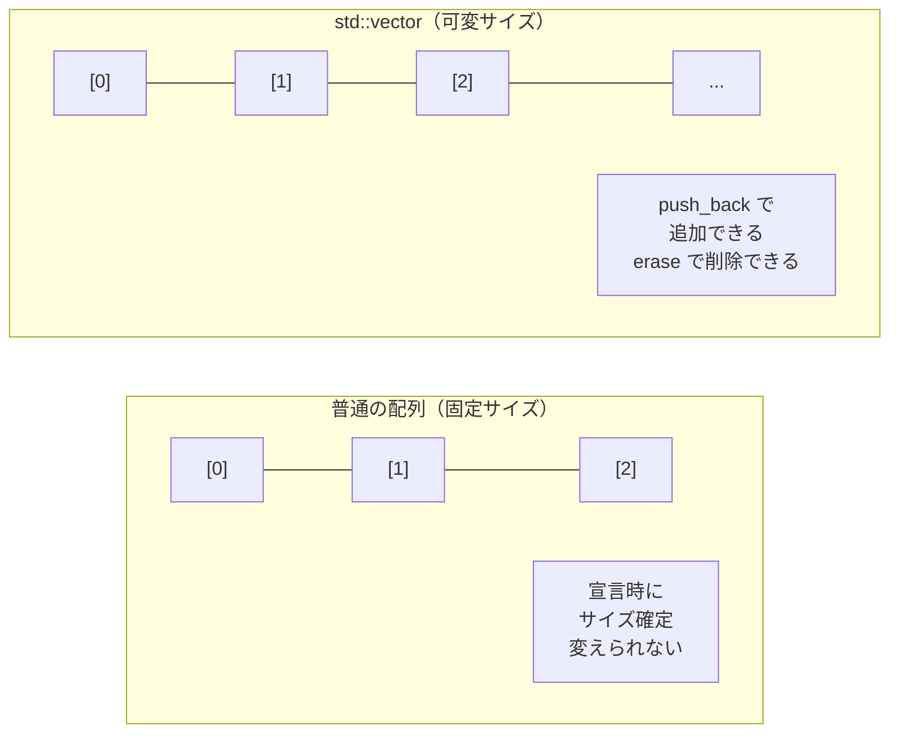

### 主な操作

| 操作 | コード例 | 意味 |
|---|---|---|
| 追加 | `v.push_back(x)` | 末尾に要素を追加 |
| アクセス | `v[i]` | i番目の要素を取得（0始まり）|
| サイズ | `v.size()` | 要素数を返す |
| 削除 | `v.erase(v.begin() + i)` | i番目の要素を削除 |
| 空チェック | `v.empty()` | 要素が0個なら `true` |

---

## 4-3 インデックスは 0 から始まる

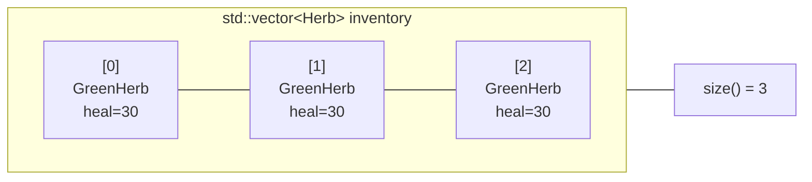

3つ入っているとき：
- 最初の要素は `inventory[0]`
- 最後の要素は `inventory[2]`（= `inventory[size()-1]`）
- `inventory[3]` は **存在しない** → アクセスすると未定義動作（クラッシュ等）

---

## 4-4 `push_back` と `erase` のイメージ

### `push_back`

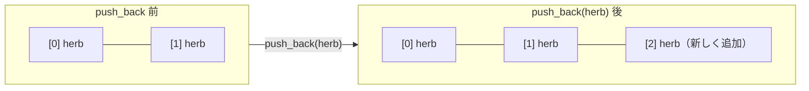

### `erase`（index 1 を削除する場合）

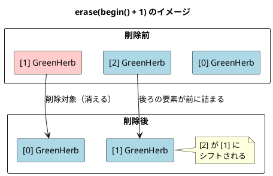

`erase()` に渡すのは「インデックスの数字」ではなく **イテレータ** だ。
`inventory.begin()` が先頭を指すイテレータ。そこに `+ index` して目的の位置を指す。

```cpp
inventory.erase(inventory.begin() + 1);  // index 1 を削除
```

---

## 4-5 設計：Playerクラスに何を追加するか

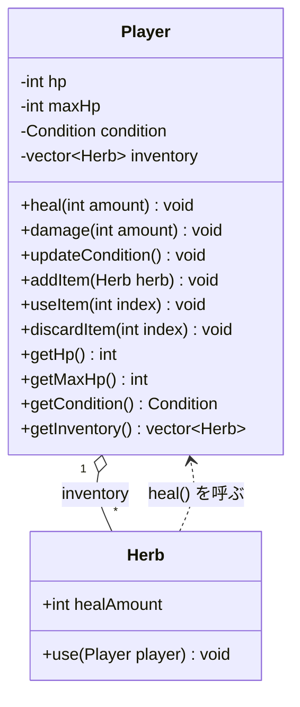

`Player` が `Herb` を持ち、`Herb` が `Player` を使う。
この **双方向の関係** は、ファイルのインクルードで問題を起こす可能性がある。
後ほど詳しく説明する。

---

## 4-6 `useItem()` の処理フロー

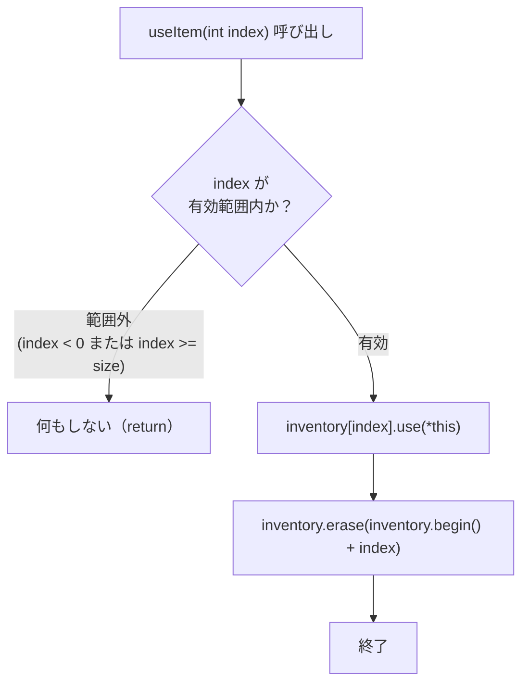

### `*this` について

`use()` は `Player&` を引数に取る。
`useItem()` は `Player` クラスの中にあるので、自分自身を渡すには `*this` と書く。

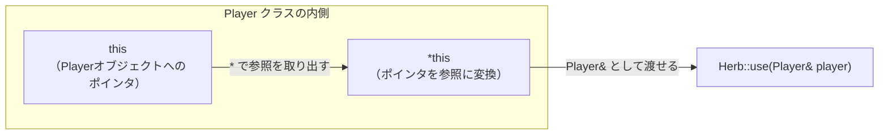

| 書き方 | 型 | 意味 |
|:--:|:--:|---|
| `this` | `Player*` | 自分自身へのポインタ |
| `*this` | `Player` | ポインタを参照外しした実体 |
| `Player&` への引数 | `Player&` | `*this` を渡せば自動的に参照になる |

---

## 4-7 循環依存の問題と解消

`Player.h` が `Herb.h` をインクルードし、
`Herb.h` が `Player.h` をインクルードすると循環する。

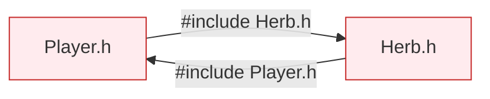

これはコンパイルエラーになる。

**解決策：前方宣言（Forward Declaration）**

`Herb.h` で `Player` の定義が必要な部分（`use()` の実装）を `.cpp` に移動する。
ヘッダーには「`Player` というクラスが存在する」という宣言だけ書けばよい。


`Herb.h` はもう `Player.h` をインクルードしないので、循環が消える。

---

## 4-8 実装コード

### `Herb.h`（前方宣言版）

```cpp
#pragma once

class Player;  // ← 前方宣言：「Playerというクラスがある」とだけ伝える

struct Herb {
    int healAmount = 30;
    void use(Player& player);  // 宣言だけ。実装は Herb.cpp へ
};
```

### `Herb.cpp`（実装）

```cpp
#include "Herb.h"
#include "Player.h"  // ← ここで初めて Player の全定義を取り込む

void Herb::use(Player& player) {
    player.heal(healAmount);
}
```

### `Player.h`（更新版）

```cpp
#pragma once
#include <vector>
#include "Herb.h"  // Herb の定義が必要（Herb.h は Player を前方宣言するだけなので循環しない）

enum class Condition {
    Fine,
    Middle,
    Danger,
};

class Player {
public:
    void heal(int amount);
    void damage(int amount);
    void updateCondition();

    void addItem(Herb herb);
    void useItem(int index);
    void discardItem(int index);

    int                  getHp()        const;
    int                  getMaxHp()     const;
    Condition            getCondition() const;
    const std::vector<Herb>& getInventory() const;

private:
    int                hp        = 100;
    int                maxHp     = 100;
    Condition          condition = Condition::Fine;
    std::vector<Herb>  inventory;
};
```

### `Player.cpp`（更新版）

```cpp
#include "Player.h"

void Player::heal(int amount) {
    hp += amount;
    if (hp > maxHp) hp = maxHp;
    updateCondition();
}

void Player::damage(int amount) {
    hp -= amount;
    if (hp < 0) hp = 0;
    updateCondition();
}

void Player::updateCondition() {
    float ratio = static_cast<float>(hp) / maxHp;
    if      (ratio > 0.67f) condition = Condition::Fine;
    else if (ratio > 0.33f) condition = Condition::Middle;
    else                    condition = Condition::Danger;
}

void Player::addItem(Herb herb) {
    inventory.push_back(herb);
}

void Player::useItem(int index) {
    if (index < 0 || index >= static_cast<int>(inventory.size())) {
        return;
    }
    inventory[index].use(*this);
    inventory.erase(inventory.begin() + index);
}

void Player::discardItem(int index) {
    if (index < 0 || index >= static_cast<int>(inventory.size())) {
        return;
    }
    inventory.erase(inventory.begin() + index);
}

int                       Player::getHp()        const { return hp; }
int                       Player::getMaxHp()     const { return maxHp; }
Condition                 Player::getCondition() const { return condition; }
const std::vector<Herb>&  Player::getInventory() const { return inventory; }
```

### `main.cpp`（動作確認）

```cpp
#include <iostream>
#include "Player.h"

std::string conditionName(Condition c) {
    switch (c) {
        case Condition::Fine:   return "Fine";
        case Condition::Middle: return "Middle";
        case Condition::Danger: return "Danger";
    }
    return "Unknown";
}

void printStatus(const Player& p) {
    std::cout << "HP: " << p.getHp() << "/" << p.getMaxHp()
              << "  [" << conditionName(p.getCondition()) << "]"
              << "  アイテム数: " << p.getInventory().size()
              << std::endl;
}

int main() {
    Player player;

    // アイテムを3つ追加
    Herb herb1; herb1.healAmount = 30;
    Herb herb2; herb2.healAmount = 30;
    Herb herb3; herb3.healAmount = 30;

    player.addItem(herb1);
    player.addItem(herb2);
    player.addItem(herb3);

    player.damage(75);
    printStatus(player);    // HP: 25/100  [Danger]  アイテム数: 3

    player.useItem(0);      // index 0 を使う
    printStatus(player);    // HP: 55/100  [Middle]  アイテム数: 2

    player.useItem(0);
    printStatus(player);    // HP: 85/100  [Fine]    アイテム数: 1

    player.discardItem(0);  // 捨てる
    printStatus(player);    // HP: 85/100  [Fine]    アイテム数: 0

    player.useItem(0);      // 存在しないindex → 何も起きない
    printStatus(player);    // HP: 85/100  [Fine]    アイテム数: 0

    return 0;
}
```

**期待される出力：**
```
HP: 25/100  [Danger]  アイテム数: 3
HP: 55/100  [Middle]  アイテム数: 2
HP: 85/100  [Fine]    アイテム数: 1
HP: 85/100  [Fine]    アイテム数: 0
HP: 85/100  [Fine]    アイテム数: 0
```

---

## 4-9 全体のシーケンス図

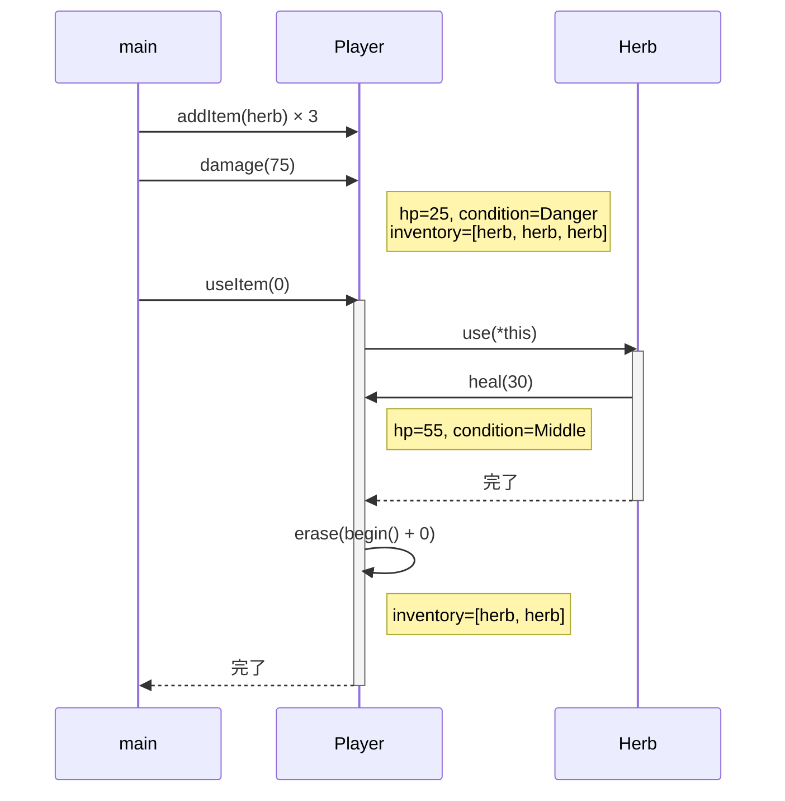

---

## 4-10 ファイル構成のまとめ

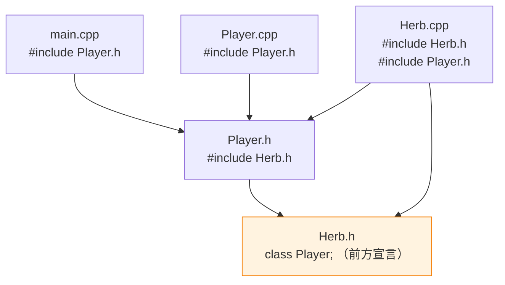

循環が消えている。`Herb.h` は `Player.h` をインクルードしていない。

---

## 4-11 確認問題

1. `inventory[3]` を 3要素のvectorに対して呼び出すと何が起きる可能性があるか？

2. `useItem()` で `erase()` を呼ぶとき、なぜ `inventory.begin() + index` という書き方をするのか？

3. `getInventory()` の戻り値型が `const std::vector<Herb>&` になっている理由は何か。
   `std::vector<Herb>` （`const` なし・`&` なし）と何が違うか？

4. `*this` を使わず、次のように書くことはできるか？その理由は？
   ```cpp
   inventory[index].use(this);
   ```

---

## まとめと次章への橋渡し

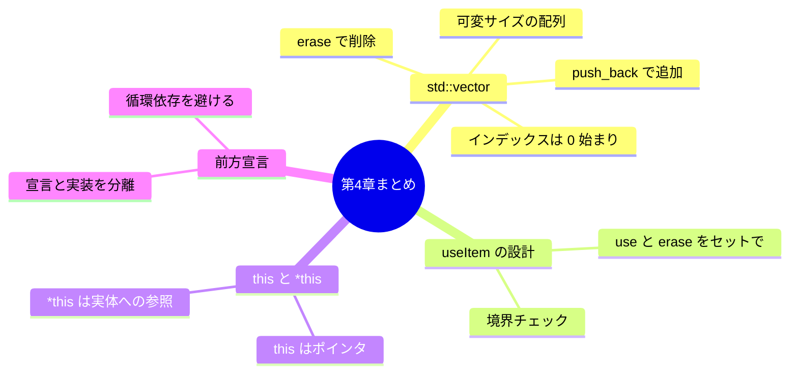

ここで一度立ち止まって考えよう。

今の `Player` は `std::vector<Herb>` を持っている。
これで「ハーブを複数持てる」ようになった。

でも、**問題がある。**

> 「鍵（`Key`）のようなアイテムを追加したくなったら、どうする？」

`std::vector<Herb>` の中に `Key` は入らない。
`Herb` 専用のコンテナだからだ。

次の第5章では、この設計の「限界」に正面から向き合う。
