# 第6章：王道設計へ進化（ポリモーフィズム）

---

## 6-1 前章の問題を整理する

第5章の結論はこうだった。

> 「`GreenHerb`・`RedHerb`・`Key` を一つのコレクションで統一的に扱いたい。
> でも、型が違うから `std::vector<Herb>` に全部は入らない。」

必要なのは「**種類は違っても、`use()` で統一的に扱える**」という仕組みだ。

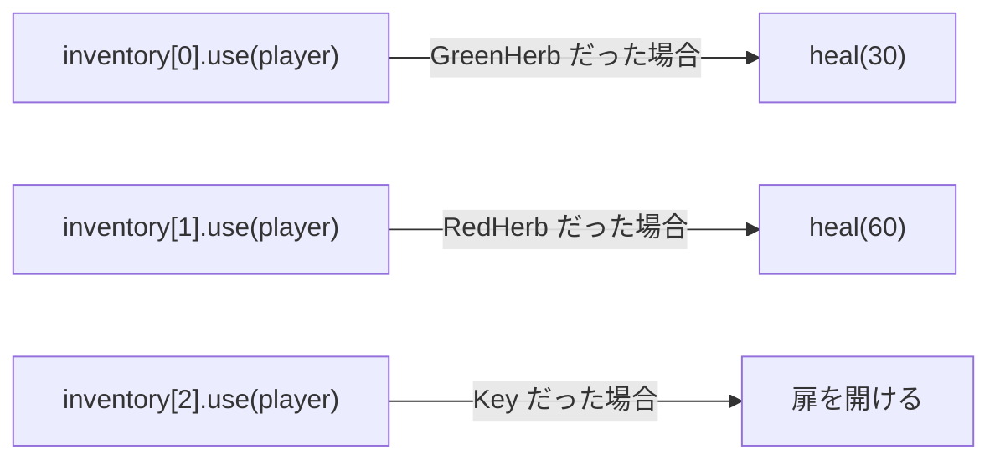

同じ `use()` の呼び出し方で、実際の動作が変わる。
これを **ポリモーフィズム（多態性）** と呼ぶ。

---

## 6-2 共通インターフェースを作る

`GreenHerb`・`RedHerb`・`Key` に共通するのは何か？
**「`use()` が呼べる」** ということだけだ。

この「共通の約束」を表すクラスを作る。

```cpp
class Item {
public:
    virtual void use(Player& player) = 0;
    virtual ~Item() = default;
};
```

2行しかない。でもこれが全体の設計を支える土台になる。

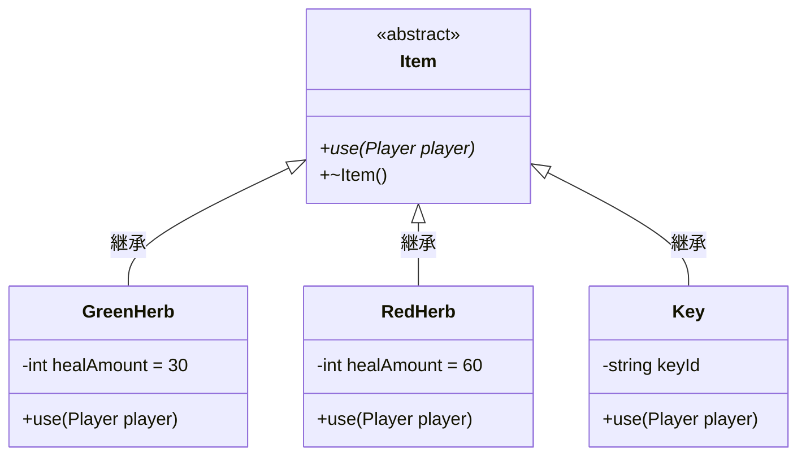

`<<abstract>>` は「直接オブジェクトを作れないクラス」を意味する。
`*` は「純粋仮想関数（派生クラスで必ず実装する）」を表している。

---

## 6-3 3つのキーワードを理解する

### `virtual`

関数に `virtual` をつけると、**「どの実装を呼ぶかを実行時に決める」** という意味になる。

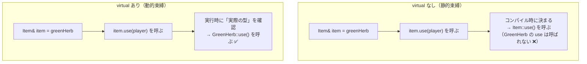

### `= 0`（純粋仮想関数）

`virtual void use(Player& player) = 0;` の `= 0` は
「この関数はここでは実装しない。派生クラスが必ず実装せよ」という宣言だ。

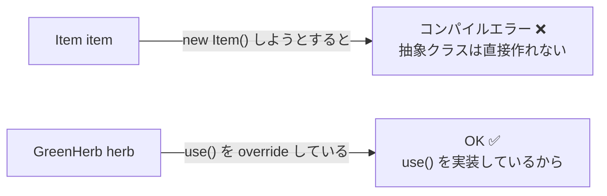

### `virtual ~Item() = default`（仮想デストラクタ）

これは後で詳しく説明する（6-8節）。
今は「必ず書く」とだけ覚えておいてよい。

---

## 6-4 vtable：仮想関数のしくみ

`virtual` をつけると、なぜ「実行時に正しい実装が呼ばれる」のか。

C++ は各クラスに **vtable（仮想関数テーブル）** を持たせる。
vtable は「この関数はどこにあるか」を記録した表だ。

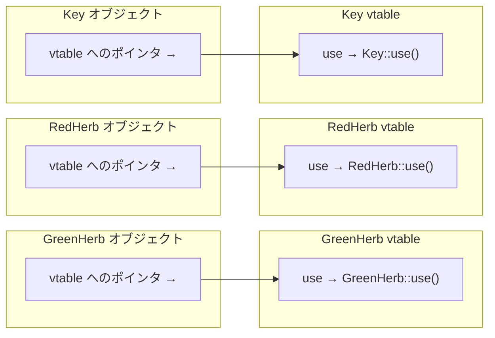

`item.use(player)` が呼ばれると：
1. `item` が持つ vtable ポインタを辿る
2. vtable の `use` エントリを見る
3. そこに書かれた関数アドレスへジャンプする

**オブジェクトの「実際の型」が何かは、vtable を見れば分かる。**

---

## 6-5 継承と `override` の書き方

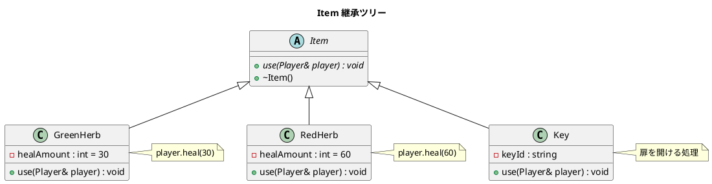

各派生クラスで `override` キーワードを使う。

```cpp
class GreenHerb : public Item {
public:
    void use(Player& player) override;  // ← override を必ずつける
private:
    int healAmount = 30;
};
```

`override` をつけると、基底クラスの仮想関数と**シグネチャが一致しているかをコンパイラが確認**してくれる。
スペルミスや引数の型間違いをその場で検出できる。

---

## 6-6 ポリモーフィズムの実演

`Item&` で受け取れば、どの派生クラスのオブジェクトでも同じコードで扱える。

```cpp
void useItem(Item& item, Player& player) {
    item.use(player);   // 実際の型に応じた use() が呼ばれる
}
```

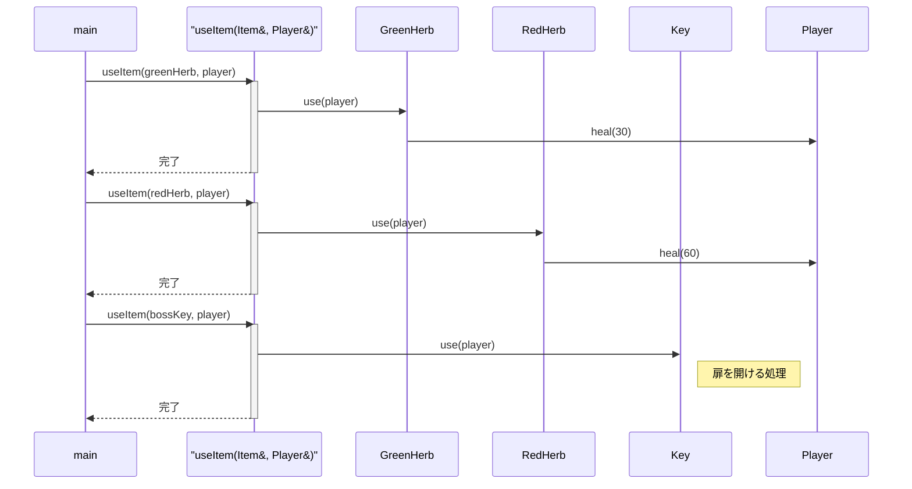

`useItem()` 関数は `GreenHerb` も `RedHerb` も `Key` も知らない。
`Item&` としか知らない。それでも正しい `use()` が呼ばれる。

**これがポリモーフィズムの本質だ。**

---

## 6-7 継承前後の設計比較

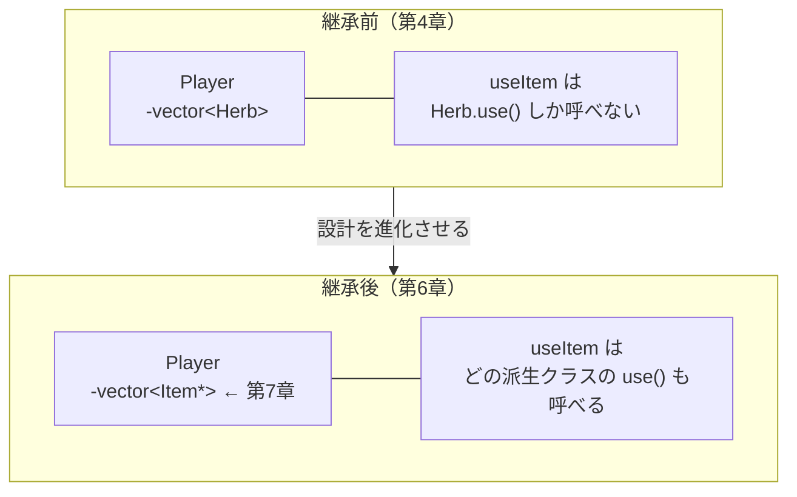

第7章で `vector<Item*>` を正しく扱うための **スマートポインタ** を学ぶ。
第6章では「`Item&` で統一的に扱える」という概念を固めておこう。

---

## 6-8 仮想デストラクタが必要な理由

`Item* item = new GreenHerb();` として後で `delete item;` するケースを考える。

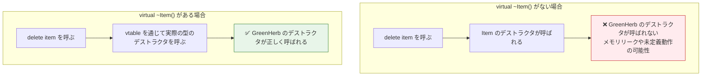

基底クラスのポインタ（`Item*`）で `delete` するとき、
デストラクタが `virtual` でないと **派生クラスのデストラクタが呼ばれない**。

ルールはシンプルだ。

> **継承の起点となるクラスには、必ず `virtual ~ClassName() = default;` を書く。**

---

## 6-9 実装コード

### `Item.h`

```cpp
#pragma once

class Player;

class Item {
public:
    virtual void use(Player& player) = 0;
    virtual ~Item() = default;
};
```

### `GreenHerb.h`

```cpp
#pragma once
#include "Item.h"

class GreenHerb : public Item {
public:
    void use(Player& player) override;
private:
    int healAmount = 30;
};
```

### `GreenHerb.cpp`

```cpp
#include "GreenHerb.h"
#include "Player.h"

void GreenHerb::use(Player& player) {
    player.heal(healAmount);
}
```

### `RedHerb.h`

```cpp
#pragma once
#include "Item.h"

class RedHerb : public Item {
public:
    void use(Player& player) override;
private:
    int healAmount = 60;
};
```

### `RedHerb.cpp`

```cpp
#include "RedHerb.h"
#include "Player.h"

void RedHerb::use(Player& player) {
    player.heal(healAmount);
}
```

### `Key.h`

```cpp
#pragma once
#include <string>
#include "Item.h"

class Key : public Item {
public:
    explicit Key(std::string id) : keyId(std::move(id)) {}
    void use(Player& player) override;
private:
    std::string keyId;
};
```

### `Key.cpp`

```cpp
#include "Key.h"
#include <iostream>

void Key::use(Player& /* player */) {
    std::cout << "[" << keyId << "] を使った。扉が開いた。" << std::endl;
}
```

### `main.cpp`（ポリモーフィズムの確認）

```cpp
#include <iostream>
#include "Player.h"
#include "GreenHerb.h"
#include "RedHerb.h"
#include "Key.h"

std::string conditionName(Condition c) {
    switch (c) {
        case Condition::Fine:   return "Fine";
        case Condition::Middle: return "Middle";
        case Condition::Danger: return "Danger";
    }
    return "Unknown";
}

// Item& で受け取る共通関数
void useItem(Item& item, Player& player) {
    item.use(player);
}

void printStatus(const Player& p) {
    std::cout << "HP: " << p.getHp() << "/" << p.getMaxHp()
              << "  [" << conditionName(p.getCondition()) << "]"
              << std::endl;
}

int main() {
    Player    player;
    GreenHerb greenHerb;
    RedHerb   redHerb;
    Key       bossKey("ボスルームの鍵");

    player.damage(80);
    printStatus(player);    // HP: 20/100  [Danger]

    useItem(greenHerb, player);
    printStatus(player);    // HP: 50/100  [Middle]

    useItem(redHerb, player);
    printStatus(player);    // HP: 100/100  [Fine] ← 上限で止まる

    useItem(bossKey, player);
    // → [ボスルームの鍵] を使った。扉が開いた。

    return 0;
}
```

**期待される出力：**
```
HP: 20/100  [Danger]
HP: 50/100  [Middle]
HP: 100/100  [Fine]
[ボスルームの鍵] を使った。扉が開いた。
```

---

## 6-10 設計の全体像（第6章時点）

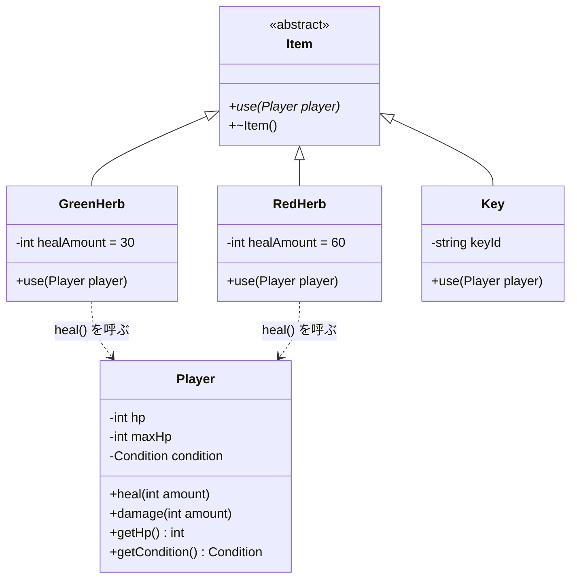

---

## 6-11 確認問題

1. `virtual` キーワードを関数につけることで、何が変わるか。
   「静的束縛」と「動的束縛」という言葉を使って説明せよ。

2. 次のコードはコンパイルできるか。できない場合、なぜか。
   ```cpp
   Item item;
   ```

3. `override` キーワードを書かなくても動作することがある。
   では、なぜ書いたほうがよいのか？

4. 次の `MixedHerb` クラスを完成させよ。
   動作は「30 回復 + 毒状態を解除」とする（`Player::removePoison()` が存在すると仮定する）。
   ```cpp
   class MixedHerb : public Item {
   public:
       void use(Player& player) override;
   private:
       int healAmount = 30;
   };
   ```

5. `virtual ~Item() = default;` を書かないと、どんな問題が起きる可能性があるか？

---

## まとめ

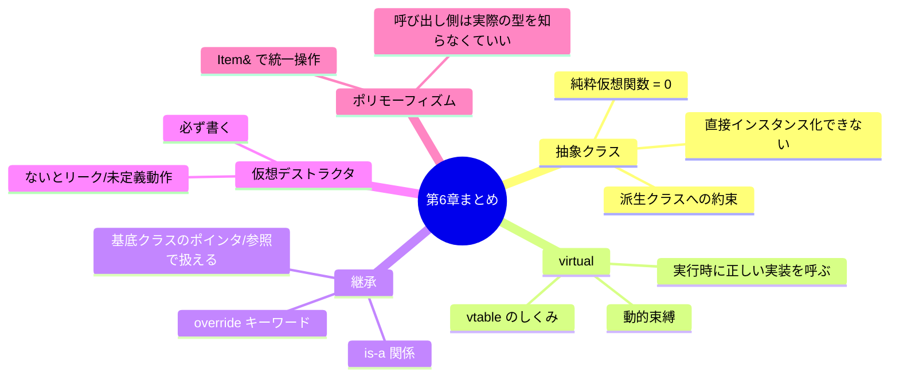

`Item&` で「統一的に `use()` を呼べる」ことが確認できた。

次の問いはこれだ。

> **「`std::vector` にこれらを入れたい。でも参照は vector に入らない。どうする？」**

第7章では **スマートポインタ**（`std::unique_ptr`）を使い、
異種アイテムを一つのベクターで管理する方法を学ぶ。
そして C++ の「所有権」という重要概念に踏み込む。
