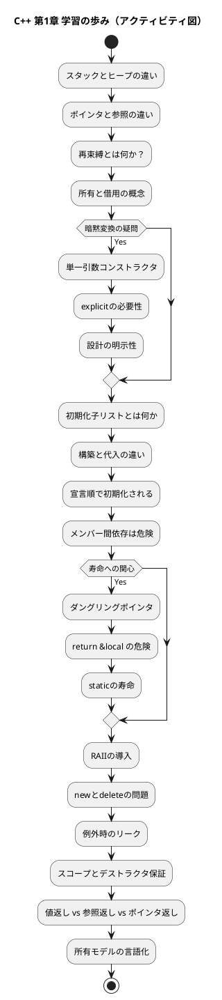
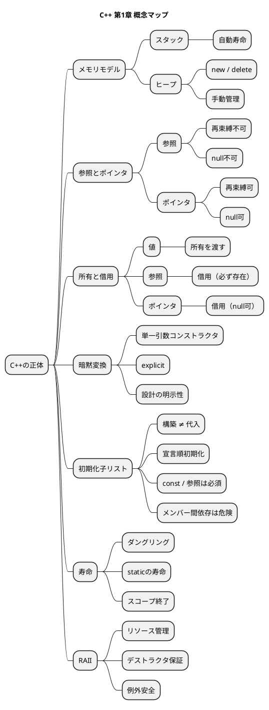

# C++ 第1章 学習の軌跡

これまでの学習における思考の遷移と、習得した概念の構造を整理したドキュメントです。

---

## 1. 学習の歩み（アクティビティ図）
どのような順序で疑問が解決され、理解が深まったかを可視化しています。

---

## 2. 概念構造マップ（Mind Map）
習得した技術要素の相互関係を整理しています。

---

## 3. 学習の特徴と深化のプロセス
今回の学習は、単なる文法の習得ではなく、以下のステップで「C++の設計思想」にまで踏み込んでいるのが特徴です。

1.  **物理層（メモリ）**: スタックとヒープの違いから入る
2.  **論理層（参照/ポインタ）**: エイリアスか変数か、再束縛の可否
3.  **インターフェース層（設計の明示性）**: `explicit` や引数設計
4.  **構築層（初期化順序）**: 初期化子リストとメンバー依存の危険性
5.  **時間軸層（寿命）**: スコープ、寿命、ダングリングポインタ
6.  **管理層（RAII）**: リソース管理の自動化と例外安全
7.  **哲学層（所有モデル）**: 「所有」か「借用」かの言語化

---

## 4. 現在の到達度（Chapter 1 チェックリスト）

*   **メモリモデル**: ◎ (スタック/ヒープの使い分け)
*   **初期化思想**: ◎ (初期化子リスト、構築と代入の違い)
*   **暗黙変換**: ◎ (`explicit` によるバグ抑止)
*   **寿命理解**: ◎ (ダングリングポインタ、スコープの意識)
*   **RAII基礎**: ◎ (デストラクタによる自動解放)
*   **所有権モデル**: ◯ (値/参照/ポインタによる意図の表明)
*   **スマートポインタ**: 未 (unique_ptr/shared_ptr 等、次段階の課題)
