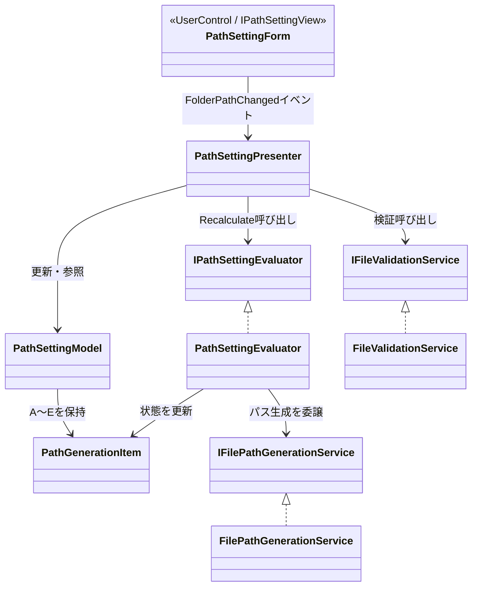
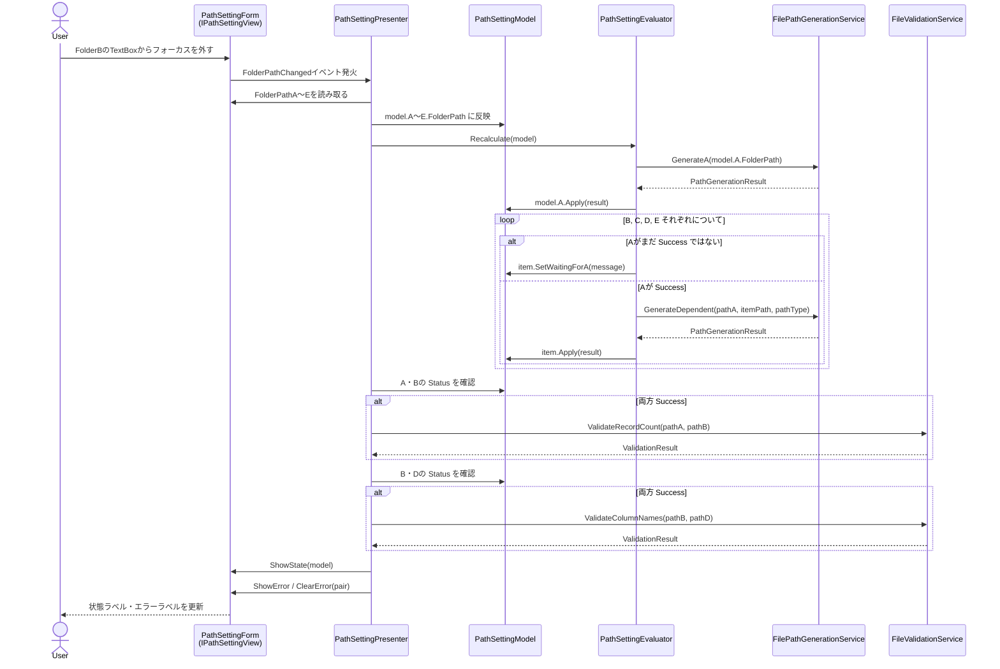
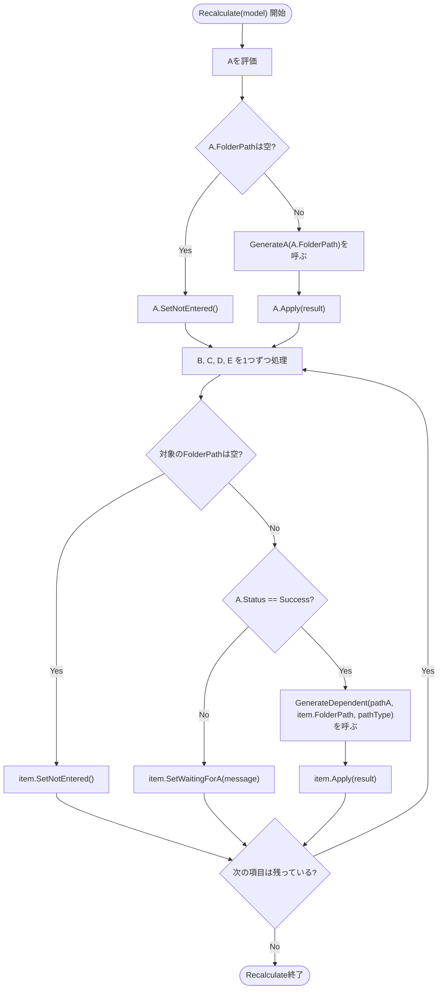

# Part6. 処理の流れ（シーケンス図とフローチャート）

Part5で書いたコードが、実際にどういう順番で・どのクラスからどのクラスへ処理が渡っていくのかを図で確認する。

## クラスの関係（おさらい）

まずは登場するクラスの関係を簡単におさらいする。詳しい役割はPart1〜4を参照。



矢印の向きに注目してほしい。`PathSettingForm`（View）は`PathSettingPresenter`を**知らない**。イベントを発火するだけで、誰が受け取っているかは関知しない。逆に`PathSettingPresenter`は`IPathSettingView`というインターフェース越しにしかViewを知らない。この「お互いに具体的な実装を知らない」関係が、MVPで単体テストしやすくなる理由だった。

## シーケンス図：入力欄が変更されたときの一連の流れ

FolderBのTextBoxからフォーカスが外れた（`Leave`）ケースを例に、実際の呼び出し順序を追う。**どの入力欄が変わっても呼ばれる処理は同じ**というのがPart2の結論だったので、この図はA〜Eどれが変わっても共通で成り立つ。



ポイントは3つ。

- `Evaluator`は`GenService`（パス生成）を呼ぶだけで、`Validator`（相関検証）とは一切やり取りしない（Part3の責務分離）
- 検証は「A・Bが両方Successになった後」だけ走る。片方でも未生成なら検証自体スキップされる
- 最後にまとめて`View`へ反映する。生成の途中経過をViewに逐一伝えることはしない

## フローチャート：Evaluator.Recalculateの判定ロジック

シーケンス図の中の「Evaluator」の中身を、もう少し詳しく分解する。これがPart1〜3で議論した「未入力・A待ち・生成成功」をどう判定するかの実体。



この図で確認してほしいのは、**「対象が空欄かどうか」を先に見て、それから「Aが成功しているかどうか」を見る**という順番。この順番を守っているから、「FolderCは空欄なのにA待ちと表示される」というおかしな状態が起きない（空欄なら真っ先に`NotEntered`で確定して終わる）。

## 具体例で図をなぞる：B→D→Aの順に入力した場合

Part2・Part5で扱った「B→D→Aの順に入力する」シナリオを、上のフローチャートに当てはめて指で追ってみる。

```text
①Bを入力 → Recalculate実行
   A: 空 → NotEntered
   B: 空でない、Aの状態はNotEntered(≠Success) → WaitingForA
   C, D, E: 空 → NotEntered

②Dを入力 → Recalculate実行
   A: 空 → NotEntered
   B: 空でない、Aの状態はNotEntered(≠Success) → WaitingForA（変化なし）
   D: 空でない、Aの状態はNotEntered(≠Success) → WaitingForA

③Aを入力 → Recalculate実行
   A: 空でない → GenerateA実行 → Success
   B: 空でない、Aの状態はSuccess → GenerateDependent実行 → Success
   D: 空でない、Aの状態はSuccess → GenerateDependent実行 → Success
```

③の時点で、BとDに対して「もう一度入力し直して」と要求する必要がないことが分かる。`Recalculate`が毎回A〜E全部を律儀に見直しているからこそ、Aが最後に来ても自動的に拾われる。これがPart2で「差分更新ではなく全体再評価にする」と決めた理由の、図で見た答え合わせになる。
