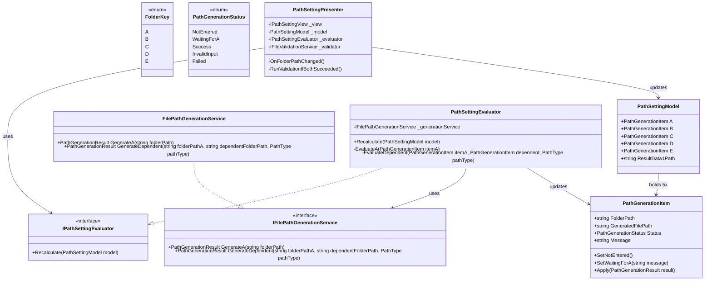

# WinFormsにおけるMVPアーキテクチャ設計（PathSetting・Generate分割）

WinFormsで「見た目は1枚のウィンドウだが、内部的には複数クラスに分かれている」アプリを作りたい場合を考える。

採用するアーキテクチャはMVP（Model-View-Presenter）。画面を役割ごとに以下の3区画に分ける。

- **MainForm** — ウィンドウ本体。各区画を配置するだけのコンポジションルート
- **PathSettingForm** — ファイルパス入力（FileA〜E、ResultData1）
- **GenerateForm** — 出力先・出力形式の設定とレポート生成

## 要件

PathSettingの入力欄には相関検証がある。

- FileA と FileB は「データ件数が一致」していないといけない
- FileB と FileD は「カラム名が一致」していないといけない

検証は該当する2つの入力欄が埋まったタイミングで走らせ、エラーはポップアップではなく画面内のラベルに赤文字で小さく表示する。

GenerateForm側はPathSettingForm側の入力（ファイルパスなど）を使って生成処理を行う。

## 設計方針

- PathSettingForm/GenerateForm は **UserControl** として実装し、MainForm に埋め込む（クラス名は "Form" でも実体は UserControl）
- ファイル内容の相関検証（件数一致・カラム名一致）は **専用のValidatorサービスクラス**に切り出す。UIから完全分離することでテストしやすくする
- GenerateForm が PathSettingForm の入力を使う際は、**共有Modelを両Presenterが参照**する疎結合構成にする（MainPresenterのような仲介役は置かない）

## クラス図

```mermaid
classDiagram
    class MainForm {
        -PathSettingForm _pathSettingView
        -GenerateForm _generateView
        -PathSettingModel _sharedModel
        -PathSettingPresenter _pathSettingPresenter
        -GeneratePresenter _generatePresenter
        +MainForm()
        -WireUpPresenters()
    }

    class IPathSettingView {
        <<interface>>
        +string FileAPath
        +string FileBPath
        +string FileCPath
        +string FileDPath
        +string FileEPath
        +string ResultData1Path
        +ShowError(FieldPair pair, string message)
        +ClearError(FieldPair pair)
        +event PathFieldChanged
    }

    class PathSettingForm {
        <<UserControl>>
        -TextBox txtFileA
        -TextBox txtFileB
        -TextBox txtFileC
        -TextBox txtFileD
        -TextBox txtFileE
        -TextBox txtResultData1
        -Label lblErrorAB
        -Label lblErrorBD
        +ShowError(FieldPair pair, string message)
        +ClearError(FieldPair pair)
    }
    PathSettingForm ..|> IPathSettingView

    class PathSettingPresenter {
        -IPathSettingView _view
        -PathSettingModel _model
        -IFileValidationService _validator
        +PathSettingPresenter(view, model, validator)
        -OnPathFieldChanged(FieldPair pair)
        -RunValidation(FieldPair pair)
    }
    PathSettingPresenter --> IPathSettingView : uses
    PathSettingPresenter --> PathSettingModel : updates
    PathSettingPresenter --> IFileValidationService : uses

    class PathSettingModel {
        +string FileAPath
        +string FileBPath
        +string FileCPath
        +string FileDPath
        +string FileEPath
        +string ResultData1Path
    }

    class IFileValidationService {
        <<interface>>
        +ValidationResult ValidateRecordCount(string pathA, string pathB)
        +ValidationResult ValidateColumnNames(string pathB, string pathD)
    }

    class FileValidationService {
        +ValidationResult ValidateRecordCount(string pathA, string pathB)
        +ValidationResult ValidateColumnNames(string pathB, string pathD)
    }
    FileValidationService ..|> IFileValidationService
    FileValidationService --> ValidationResult : returns

    class ValidationResult {
        +bool IsValid
        +string ErrorMessage
    }

    class IGenerateView {
        <<interface>>
        +string OutputDir
        +IEnumerable~string~ CheckedFileFormats
        +SetGenerateEnabled(bool enabled)
        +event GenerateRequested
    }

    class GenerateForm {
        <<UserControl>>
        -TextBox txtOutputDir
        -CheckedListBox clbFileFormat
        -Button btnGenerateReport
        +SetGenerateEnabled(bool enabled)
    }
    GenerateForm ..|> IGenerateView

    class GeneratePresenter {
        -IGenerateView _view
        -PathSettingModel _sharedModel
        -IReportGenerationService _reportService
        +GeneratePresenter(view, sharedModel, reportService)
        -OnGenerateRequested()
    }
    GeneratePresenter --> IGenerateView : uses
    GeneratePresenter --> PathSettingModel : reads
    GeneratePresenter --> IReportGenerationService : uses

    class IReportGenerationService {
        <<interface>>
        +Generate(PathSettingModel input, GenerateOptions options)
    }

    class ReportGenerationService {
        +Generate(PathSettingModel input, GenerateOptions options)
    }
    ReportGenerationService ..|> IReportGenerationService

    MainForm *-- PathSettingForm : embeds
    MainForm *-- GenerateForm : embeds
    MainForm --> PathSettingPresenter : creates
    MainForm --> GeneratePresenter : creates
    MainForm --> PathSettingModel : creates (shared)
```



## 設計のポイント

### View/Presenter/Model の役割分担

- `PathSettingForm`/`GenerateForm`（View）はコントロール配置とイベント発火のみを担当し、業務ロジックは持たない
- Presenterがイベントを受けて処理し、`IPathSettingView`/`IGenerateView` インターフェース越しに表示を更新する。ViewをインターフェースにしておくことでPresenterは実UIに依存せず単体テストできる
- `PathSettingModel` は単純なデータの入れ物（POCO）。PathSettingPresenterが更新し、GeneratePresenterが読み取り専用で参照する共有オブジェクト

### MainFormはコンポジションルート

MainFormは3つのUserControlと共有Modelを生成し、各Presenterへ配線するだけの役割にとどめる。MainForm自体には業務ロジックを書かない。

### 「2つの入力欄が埋まったら検証」の実現方法

- `PathSettingForm` は各TextBoxの変更時（`Leave`や`TextChanged`）に `PathFieldChanged` イベントを発火し、どのフィールドが変わったかを伝える
- `PathSettingPresenter.OnPathFieldChanged` で、変更されたフィールドに関係する検証ペア（A-B、B-D）を判定し、両方が空でなければ該当の検証のみを実行する
  - 例：FileBが変更された場合、(A,B)ペアと(B,D)ペアの両方をチェック対象にする
- 検証NGなら `View.ShowError(pair, message)` で該当ラベルに赤文字表示、OKなら `View.ClearError(pair)` でクリアする
- 検証ルールが増えてきた場合は `IPathValidationRule` のようなルールリスト構造への拡張も可能だが、現状のペア数（2つ）では条件分岐で十分にシンプル

### ファイル内容の検証をUIから分離する理由

- `FileValidationService` はファイルI/Oと業務ルール（件数比較・カラム名比較）だけを持ち、WinFormsに依存しない
- これによりファイルを用意すれば単体テストが書ける（UIを起動しなくても検証ロジックを確認できる）
- 将来ルールが増えても（例：FileC/FileEの整合性チェックなど）このクラスにメソッドを追加するだけで済む

### GenerateFormとPathSettingFormの連携

- `GeneratePresenter` はコンストラクタで共有 `PathSettingModel` の参照を受け取る
- 「生成」ボタン押下時に `_sharedModel` の各パスを読み取り、`IReportGenerationService.Generate` に渡す
- PathSettingForm側の変更を都度Generate側が監視する必要はなく、ボタン押下時に最新のModelを読むだけでよい

## 追加要件：フォルダパス自動生成とA依存関係

PathSettingの入力欄をFileA〜EからFolderA〜Eに変更し、フォルダパスから内部的にファイルパスを自動生成する仕様に発展させる。

- FolderA〜Eは好きなタイミング・順序で入力できる
- FolderAが入力されていないと、B〜Eに紐づくファイルパスは生成できない（Aに依存）
- Aが後から入力された場合、既に入力済みのB〜Eを使って自動的に生成する（入力し直しは不要）
- Aが後から変更・削除された場合も、B〜Eの生成結果を再計算する（古い生成結果を残さない）

### 「変更キーだけ再計算」ではなく「全体再評価」を選ぶ理由

最初に検討したのは、変更されたキーだけを対象に影響範囲を判定して個別に再生成する方式（Aが変わったらB〜Eを再生成、それ以外は自身だけ再生成）だった。今回の依存グラフ（AだけがB〜Eの共通の親）ではこれでも破綻しないが、依存関係が複雑化したときに「再計算漏れ」というバグを生みやすい。

対象は5件程度なので性能上のデメリットはほぼない。そこで、どの入力欄が変わっても**A〜E全体を毎回再評価し、条件を満たしたものだけ生成する**方式を採用する。「毎回全部を無条件に作り直す」わけではない点に注意——Aが空または不正な状態なら、B〜Eは「A待ち」のまま生成結果をクリアするだけで、入力値自体は保持し続ける。

### 状態はbool/nullではなく列挙型で持つ

生成結果の有無を`bool`や`null`の2値で表現しようとすると、次の違いを区別できない。

```csharp
public enum PathGenerationStatus
{
    NotEntered,   // 対象フォルダが未入力
    WaitingForA,  // Aが未入力/無効なので待機中
    Success,      // 生成成功
    InvalidInput, // 入力値が不正
    Failed        // 生成処理で失敗
}
```

「未入力」「A待ち」「入力不正」はUIに出すべきメッセージが違うため、それぞれ別の状態として扱う。各フォルダの入力値・生成結果・状態・メッセージは、1つの`PathGenerationItem`にまとめて持たせる。

```csharp
public class PathGenerationItem
{
    public string FolderPath { get; set; } = string.Empty;
    public string GeneratedFilePath { get; private set; } = string.Empty;
    public PathGenerationStatus Status { get; private set; } = PathGenerationStatus.NotEntered;
    public string Message { get; private set; } = string.Empty;

    public void SetNotEntered() { GeneratedFilePath = string.Empty; Status = PathGenerationStatus.NotEntered; Message = string.Empty; }
    public void SetWaitingForA(string message) { GeneratedFilePath = string.Empty; Status = PathGenerationStatus.WaitingForA; Message = message; }
    public void Apply(PathGenerationResult result) { GeneratedFilePath = result.FilePath; Status = result.Status; Message = result.Message; }
}
```

状態変更を専用メソッド（`SetWaitingForA`など）越しに行わせているのは、外部から`Status = Success`なのに`GeneratedFilePath`が空、のような矛盾状態を作れてしまわないようにするため。「Modelはロジックを持たない単純なPOCOであるべき」という考え方もあるが、それは絶対原則ではなく、オブジェクト自身の状態を自己防衛的に守れる設計の方が安全な場面も多い。

### 責務を4層に分離する

ここで一段階見落としやすい罠がある。「パスを組み立てる処理」と「A〜Eの依存関係を判定する処理」を同じクラスに詰め込んでしまうことだ。

```text
Bが入力済み、Aが未入力 → BはWaitingForA
```

これは単なるパス生成ロジックではなく、この画面固有の「Aは親、B〜Eは子」という依存関係のルールである。これをパス生成サービスに持たせると、サービスは次のように責務過多になる。

- 個別のパス生成
- A〜Eの入力状態管理
- 依存関係の判定
- 各項目の状態遷移

そこで責務を4層に分離する。

```text
PathSettingModel            … A〜EのPathGenerationItemを保持する共有データ（GenerateFormとも共有）
IFilePathGenerationService  … 1本のパスを組み立てるだけ。A〜Eの依存関係は知らない
IPathSettingEvaluator       … A〜Eの依存関係を判定し状態遷移を決める。IFilePathGenerationServiceを呼ぶ
PathSettingPresenter        … ViewとIPathSettingEvaluatorをつなぐだけ
```

`IPathSettingEvaluator`をインターフェース化しているのは、`IFileValidationService`や`IReportGenerationService`と同様、Presenterが依存するものは全てインターフェース越しにして単体テスト可能にするという、この設計全体の方針との一貫性のためである。



### Presenter側の流れ

```text
OnFolderPathChanged():
    model.A.FolderPath = view.FolderPathA   # Viewの入力値を状態モデルへ反映（A〜E全て）
    model.B.FolderPath = view.FolderPathB
    ... (C, D, E も同様)

    evaluator.Recalculate(model)            # A〜E全体を再評価。Evaluatorが依存関係を判定し、
                                             # 必要な箇所だけIFilePathGenerationServiceへ委譲する
    RunValidationIfBothSucceeded()          # 両方Status==Successになったペアだけ既存の検証を実行
    view.ShowState(model)                   # 状態・メッセージ・生成結果を画面へ反映
```

件数一致・カラム名一致の相関検証は、生の入力ではなく `PathGenerationItem.Status == Success` になった**生成後のファイルパス**を対象に実行する。両方が `Success` になったタイミングで `IFileValidationService` を呼び出す。
