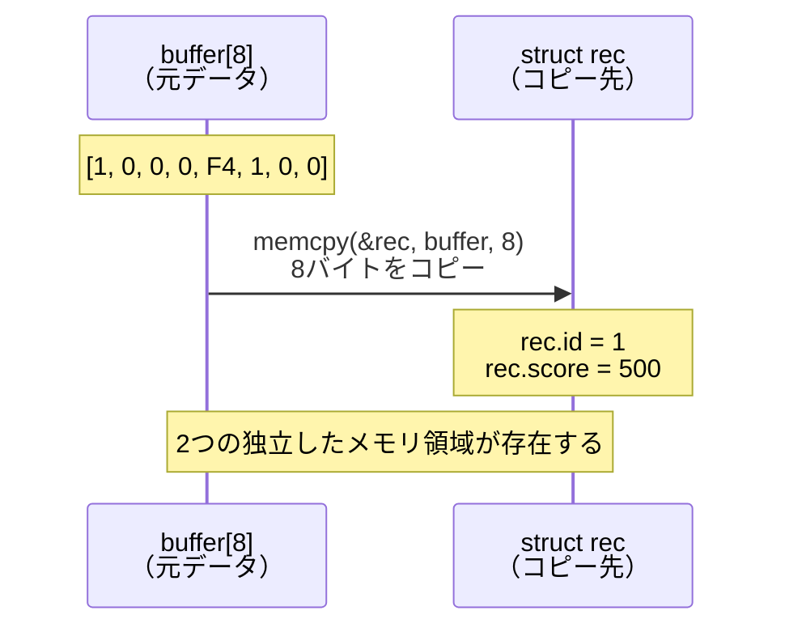
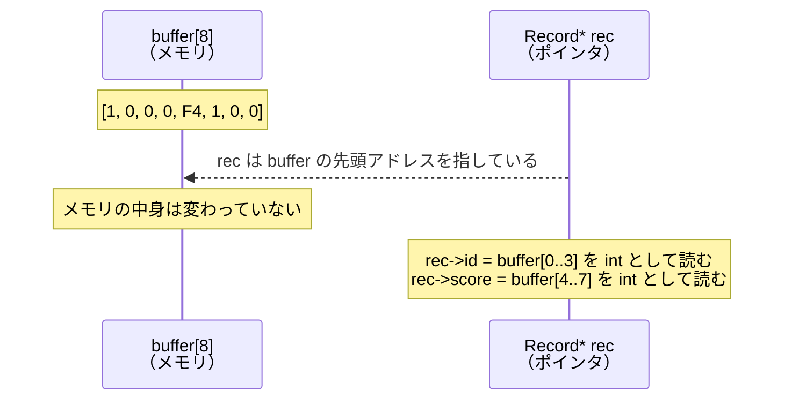
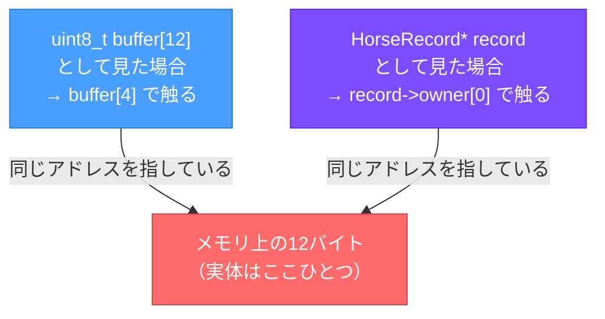
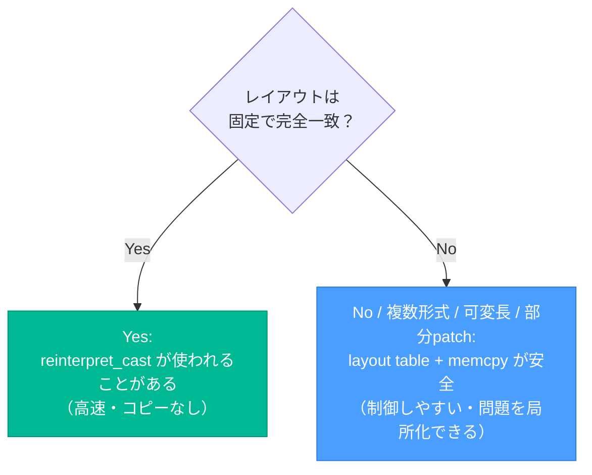
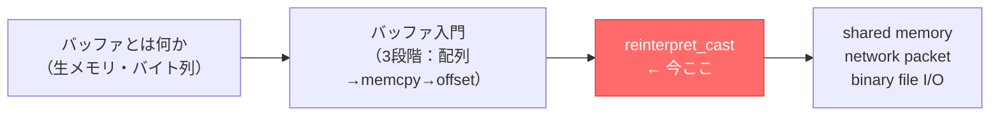

# reinterpret_cast——バイト列を構造体として「見る」

> 前提：「バッファとは何か」「バッファ入門（図解授業）」を読んでいること。  
> memcpy + offset でバイト列を読み書きする感覚があれば十分だ。  
> この記事は、その「次の扉」にある `reinterpret_cast` を丁寧に説明する。

---

## この記事が扱う問い

> 「`reinterpret_cast` で buffer を構造体として読めると聞いた。  
>  memcpy せずにそのまま流し込めるということ？」

概ね正しいが、言葉の精度を一段上げる必要がある。

**「流し込む」のではなく「見方を変える」。**

これが `reinterpret_cast` の本質だ。

---

## 第1章：memcpy との比較で理解する

まず、これまでの方法（memcpy）を思い出す。

```cpp
struct Record
{
    int id;
    int score;
};

uint8_t buffer[8] = { 1, 0, 0, 0, 0xF4, 1, 0, 0 };

Record rec;
std::memcpy(&rec, buffer, sizeof(Record));  // バッファの内容を構造体へコピー

std::cout << rec.id    << std::endl;  // 1
std::cout << rec.score << std::endl;  // 500
```

`memcpy` は **コピーを作る**。



次に `reinterpret_cast` を使う方法を見る。

```cpp
uint8_t buffer[8] = { 1, 0, 0, 0, 0xF4, 1, 0, 0 };

Record* rec = reinterpret_cast<Record*>(buffer);  // コピーしない

std::cout << rec->id    << std::endl;  // 1
std::cout << rec->score << std::endl;  // 500
```

`reinterpret_cast` は **コピーも変換もしない**。



メモリは 1 つしかない。見方だけが変わった。

---

## 第2章：具体例で動かす（HorseRecord）

競馬のバイナリデータを想定した例だ。

```cpp
#include <iostream>
#include <cstdint>

struct HorseRecord
{
    uint8_t birthday[4];   // 生年月日
    uint8_t owner[4];      // 馬主コード
    uint8_t jockey[4];     // 騎手コード
};

int main()
{
    uint8_t buffer[12] = {
        20, 24,  4, 25,   // birthday (index 0〜3)
         1,  2,  3,  4,   // owner    (index 4〜7)
        80, 81, 82, 83    // jockey   (index 8〜11)
    };

    // buffer の先頭アドレスを HorseRecord* として見る
    HorseRecord* record = reinterpret_cast<HorseRecord*>(buffer);

    std::cout << static_cast<int>(record->owner[0]) << std::endl;  // 1
    std::cout << static_cast<int>(record->owner[1]) << std::endl;  // 2
    std::cout << static_cast<int>(record->owner[2]) << std::endl;  // 3
    std::cout << static_cast<int>(record->owner[3]) << std::endl;  // 4

    return 0;
}
```

なぜこれが動くのか、メモリレイアウトで確認する。

```
buffer のレイアウト（12バイト）:

index:  0    1    2    3    4    5    6    7    8    9   10   11
      +----+----+----+----+----+----+----+----+----+----+----+----+
      | 20 | 24 |  4 | 25 |  1 |  2 |  3 |  4 | 80 | 81 | 82 | 83 |
      +----+----+----+----+----+----+----+----+----+----+----+----+

HorseRecord のレイアウト（12バイト）:

field:  birthday[0..3]    owner[0..3]      jockey[0..3]
      +----+----+----+----+----+----+----+----+----+----+----+----+
      | [0]| [1]| [2]| [3]| [0]| [1]| [2]| [3]| [0]| [1]| [2]| [3]|
      +----+----+----+----+----+----+----+----+----+----+----+----+
```

両者のレイアウトが一致しているため、`record->owner[0]` は `buffer[4]` を指す。

---

## 第3章：「見る」と「書き換える」は同じこと

`reinterpret_cast` でポインタを得たあと、書き込みもできる。

```cpp
record->owner[0] = 9;
record->owner[1] = 9;
record->owner[2] = 9;
record->owner[3] = 9;
```

これは実際には、

```cpp
buffer[4] = 9;
buffer[5] = 9;
buffer[6] = 9;
buffer[7] = 9;
```

と同じことだ。メモリは 1 つなので、どちらの「見方」から触っても同じ場所が変わる。



---

## 第4章：reinterpret_cast が安全に使える条件

`reinterpret_cast` は強力だが、条件が揃っていないと即座に壊れる。

### 安全の条件一覧

| # | 条件 | 守れていない場合の問題 |
| :---: | :--- | :--- |
| 1 | **buffer のサイズが構造体サイズ以上ある** | 構造体の範囲外を読み書きする（未定義動作） |
| 2 | **構造体のレイアウトが実際のバイナリ配置と一致している** | フィールドが別のバイトを指す（読み値が狂う） |
| 3 | **padding の影響を理解している** | レイアウトがズレる（下記参照） |
| 4 | **alignment が問題にならない** | バスエラーや未定義動作（アーキテクチャ依存） |
| 5 | **endian 差が問題にならない（または uint8_t 配列で回避している）** | 数値フィールドのバイト順が逆になる |
| 6 | **構造体に非 trivial なメンバが含まれていない** | `std::string` や `std::vector` を無理やり解釈すると即クラッシュ |

---

### padding の危険：具体例

```cpp
struct BadRecord
{
    uint8_t a;  // 1バイト
    int     b;  // 4バイト
};
```

見た目では 5 バイトに見える。しかし多くの環境では **padding が挿入されて 8 バイト** になる。

```
実際のメモリレイアウト（典型的な64ビット環境）:

+------+------+------+------+------+------+------+------+
|  a   | pad  | pad  | pad  |    b[0]  b[1]  b[2]  b[3] |
+------+------+------+------+------+------+------+------+
  [0]    [1]    [2]    [3]    [4]    [5]    [6]    [7]

sizeof(BadRecord) = 8  ← 5ではない
```

`uint8_t a` の直後に 3 バイトの padding が入り、`int b` が 4 バイト境界に揃えられる。

バイナリ仕様と `BadRecord` を使って `reinterpret_cast` すると、`b` の位置がズレて誤った値を読む。

---

### なぜ HorseRecord は安全なのか

```cpp
struct HorseRecord
{
    uint8_t birthday[4];
    uint8_t owner[4];
    uint8_t jockey[4];
};
```

全フィールドが `uint8_t` の配列なので、**1 バイト単位で連続して並ぶ**。
`uint8_t` には alignment 制約がなく、padding も入らない。

だからバイナリレイアウトを確実に制御したい場合、実務では

```cpp
uint8_t BIRTHDAY[4];
uint8_t OWNER[4];
uint8_t JOCKEY[4];
```

のように `uint8_t` 配列を大量に並べる形になる。これが現場のコードに多い理由だ。

---

## 第5章：reinterpret_cast vs memcpy の使い分け

### memcpy + offset（layout table 方式）

```cpp
uint32_t owner_code;
std::memcpy(&owner_code, &buffer[4], sizeof(uint32_t));
```

- コピーが発生する
- alignment の問題を自動的に回避できる
- 可変レイアウト・複数フォーマット・部分的な書き換えに向いている

### reinterpret_cast 方式

```cpp
HorseRecord* record = reinterpret_cast<HorseRecord*>(buffer);
std::cout << record->owner[0] << std::endl;
```

- コピーが発生しない（大量データを高速に扱える）
- レイアウトが完全に一致している場合のみ使える
- padding・alignment・endian の問題が全て自己責任になる



---

## 第6章：完全な動作確認コード

```cpp
#include <iostream>
#include <cstdint>

struct HorseRecord
{
    uint8_t birthday[4];
    uint8_t owner[4];
    uint8_t jockey[4];
};

int main()
{
    uint8_t buffer[12] = {
        20, 24,  4, 25,
         1,  2,  3,  4,
        80, 81, 82, 83
    };

    // reinterpret_cast で「見方」を変える
    HorseRecord* record = reinterpret_cast<HorseRecord*>(buffer);

    // 読む
    std::cout << "=== 読み取り ===" << std::endl;
    std::cout << "birthday[0] = " << static_cast<int>(record->birthday[0]) << std::endl;
    std::cout << "owner[0]    = " << static_cast<int>(record->owner[0])    << std::endl;
    std::cout << "jockey[0]   = " << static_cast<int>(record->jockey[0])   << std::endl;

    // 書く（buffer が直接変わる）
    record->owner[0] = 99;
    std::cout << "\n=== 書き込み後 ===" << std::endl;
    std::cout << "buffer[4] = " << static_cast<int>(buffer[4]) << std::endl;  // 99

    // サイズが一致していることを確認する
    std::cout << "\nsizeof(HorseRecord) = " << sizeof(HorseRecord) << std::endl;  // 12

    return 0;
}
```

実行結果：

```
=== 読み取り ===
birthday[0] = 20
owner[0]    = 1
jockey[0]   = 80

=== 書き込み後 ===
buffer[4] = 99

sizeof(HorseRecord) = 12
```

---

## まとめ

```
buffer = 生のバイト列
struct = そのバイト列の見取り図
reinterpret_cast = buffer をその struct として見る操作
```

核心はここだ。

> **`reinterpret_cast` はコピーも変換もしない。  
> メモリの中身はそのままで、「見方」だけを変えている。**

安全に使うための最短チェックリスト：

- [ ] `sizeof(構造体) <= buffer のサイズ` を確認した
- [ ] 全フィールドが `uint8_t` 配列で padding が入らない構造にした
- [ ] `std::string` や `std::vector` などの非 trivial なメンバを含んでいない
- [ ] endian が問題にならないことを確認した（または uint8_t 配列で逃げた）

---

## バッファシリーズの位置づけ



ここまで来ると、現場のバイナリ処理コードや通信プロトコルの実装が読めるようになる。
