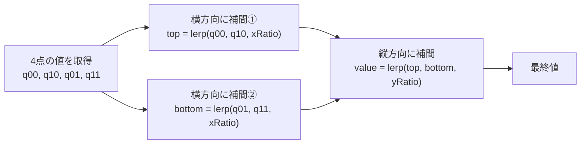
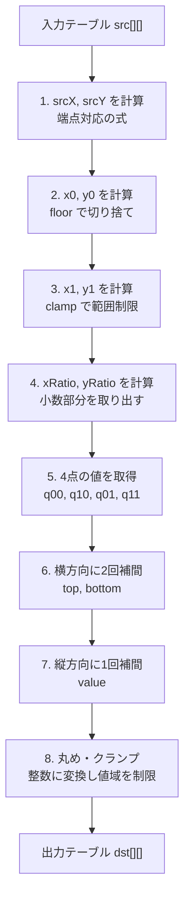
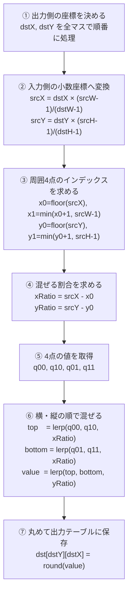

# バイリニア補間教材
## 高校生のための画像拡大アルゴリズム入門

---

## 1. 補間とは何か

「補間」とは、**すでにある値の間を埋める処理**のことだ。

たとえば、4つの値しかない短い数列を7つに伸ばしたいとする。
もともとない3つの値をどう作ればよいか？

```text
元データ（4個）
■    ■    ■    ■
0    10   30   50

拡大後（7個）― 最近傍補間（コピーする方法）
■    ■    ■    ■    ■    ■    ■
0    0    10   30   30   50   50
↑段差が出る

拡大後（7個）― バイリニア補間（混ぜる方法）
■    ■    ■    ■    ■    ■    ■
0    5    10   20   30   40   50
↑滑らかにつながる
```

| 方式 | 考え方 |
|------|--------|
| 最近傍補間 | 一番近い値を**コピー**する |
| バイリニア補間 | 周囲の値を**距離に応じて混ぜる** |

```text
ゴール
  補間 = 既にある値の間を「距離の割合」で埋める処理
```

---

## 2. 最近傍補間の復習

最近傍補間は、「自分に一番近い元の値をそのままコピーする」方式だ。

```text
元データ：A=12（位置0）, B=19（位置1）

拡大後の位置  →  元位置  →  使う値
──────────────────────────────────
  0.0          近いのはA    12
  0.2          近いのはA    12
  0.4          近いのはA    12
  0.5          境界         12（または19）
  0.6          近いのはB    19
  0.8          近いのはB    19
  1.0          近いのはB    19
```

位置が 0.49 から 0.50 に変わった瞬間、値が 12 から 19 に**飛ぶ**。
この「急な切り替わり」が**段差（ブロックノイズ）**の原因だ。

```text
12 12 12 12 | 19 19 19  ← 段差
           ↑
        ここで急変
```

> **最近傍補間が向く場面**：「はい/いいえ」のようなフラグ値やカテゴリ値。
> 滑らかな数値（補正値・センサー値）には粗い。

---

## 3. まず1次元の線形補間を理解する

**ペンキの混色**で考えてみよう。

- 黄色のペンキ（値=10）と青色のペンキ（値=20）がある
- 半分ずつ混ぜると中間の色（値=15）になる
- 黄色を多めにすると黄色寄り、青色を多めにすると青色寄り

```text
A=10                                   B=20
├──────────────────────────────────────┤
t=0     t=0.25    t=0.5    t=0.75    t=1
=10      =12.5    =15      =17.5    =20
```

`t` は「AからBへどれだけ近づいたか」を表す割合（0〜1）だ。

- `t=0` → 完全にAの側　→ 値=10
- `t=1` → 完全にBの側　→ 値=20
- `t=0.5` → ちょうど真ん中 → 値=15

```text
線形補間 = 左右2点を「距離の割合」で混ぜる
```

---

## 4. 線形補間の数式

混ぜる割合 `t` を使った式：

```text
value = A × (1 - t) + B × t
```

式を2つの部分に分けると意味がわかりやすい。

```text
      ┌─────────────────────┐  ┌─────────────┐
value = │ A × (1 - t)         │ + │ B × t       │
      │ Aの寄与分             │  │ Bの寄与分   │
      │ tが大きいほど小さくなる │  │ tが大きいほど│
      │                     │  │ 大きくなる  │
      └─────────────────────┘  └─────────────┘
```

A=10, B=20 のとき、t の値を変えた計算結果：

| t    | A × (1-t)     | B × t       | 合計 |
|------|---------------|-------------|------|
| 0    | 10 × 1.0 = 10 | 20 × 0.0 = 0  | **10** |
| 0.25 | 10 × 0.75 = 7.5 | 20 × 0.25 = 5 | **12.5** |
| 0.5  | 10 × 0.5 = 5   | 20 × 0.5 = 10 | **15** |
| 0.75 | 10 × 0.25 = 2.5 | 20 × 0.75 = 15 | **17.5** |
| 1    | 10 × 0.0 = 0   | 20 × 1.0 = 20 | **20** |

重要：`(1-t) + t = 1` なので、2つの割合の合計は常に1になる。
これは「AとBを合わせて100%の割合で混ぜる」という意味だ。

---

## 5. 画像やテーブルを拡大するとは何か

たとえば、3×1 の小さなデータを 5×1 に拡大するとはどういうことか？

```text
元データ（3個の点）
●──────●──────●
0      1      2    ← 座標（整数）

拡大後（5個の点）
●────●────●────●────●
0    1    2    3    4    ← 座標（整数）
```

拡大後の各点が、元データのどこに対応するかを考える。

```text
拡大後の点0 → 元データの 0.0
拡大後の点1 → 元データの 0.5   ← 小数！
拡大後の点2 → 元データの 1.0
拡大後の点3 → 元データの 1.5   ← 小数！
拡大後の点4 → 元データの 2.0
```

元データには「座標 0.5 の値」は存在しない。
この存在しない値を**補間で作り出す**のが、拡大処理のやること だ。

```text
拡大後の各マスは、元データ上の「小数位置」に対応する
```

---

## 6. 座標対応の考え方

拡大後の座標（`dstX`）から、元データ上の座標（`srcX`）を求める式は：

```text
srcX = dstX × (srcWidth - 1) / (dstWidth - 1)
```

### なぜ `-1` が出てくるのか？

ポイントは「点の数」ではなく「間の数」で比率を考えることだ。

```text
元データ（3幅）
●────●────●
0    1    2
↑間の数 = 2つ

拡大後（5幅）
●──●──●──●──●
0  1  2  3  4
↑間の数 = 4つ
```

「元の2つの間を、拡大後の4つの間に対応させる」ので比率は `2/4 = 0.5` だ。

**具体的な計算例**（srcWidth=3, dstWidth=5）：

| dstX | 計算 | srcX |
|------|------|------|
| 0 | 0 × 2/4 | **0.0** |
| 1 | 1 × 2/4 | **0.5** |
| 2 | 2 × 2/4 | **1.0** |
| 3 | 3 × 2/4 | **1.5** |
| 4 | 4 × 2/4 | **2.0** |

左端（dst=0 → src=0）と右端（dst=4 → src=2）がきちんと一致している。

---

## 7. 小数座標から周囲の点を探す

`srcX = 2.3` のとき、元データには座標 2.3 の値はない。
そこで、その**すぐ左の整数座標**と**すぐ右の整数座標**を探す。

```text
           srcX = 2.3
              ↓
─────────────────────────────
     2         2.3          3
     │          │           │
    x0=2       ★           x1=3
     │←xRatio→ │ ←(1-xRatio)→│
     │  = 0.3  │             │
─────────────────────────────

x0 = floor(srcX) = floor(2.3) = 2   ← 切り捨て
x1 = x0 + 1 = 3
xRatio = srcX - x0 = 2.3 - 2 = 0.3 ← 小数部分
```

同様に縦方向も：
```text
srcY = 4.7 → y0=4, y1=5, yRatio=0.7
```

**端での注意**：srcX が最大座標ちょうどの場合、`x1 = x0+1` が範囲外になる。
```text
srcX = 2.0（最大が2の場合）
x0 = 2
x1 = min(x0 + 1, srcWidth - 1) = min(3, 2) = 2  ← 同じ点に固定
```

---

## 8. バイリニア補間とは何か

**バイリニア（bilinear）** = bi（2方向）+ linear（線形）の合成語。
「2方向に線形補間する」という意味だ。



手順は3ステップ：
1. **上側2点**（q00, q10）を横方向に混ぜる → `top`
2. **下側2点**（q01, q11）を横方向に混ぜる → `bottom`
3. `top` と `bottom` を縦方向に混ぜる → `最終値`

```text
バイリニア補間 = 横方向の線形補間 + 縦方向の線形補間
```

---

## 9. バイリニア補間で使う4点

求めたい点 P（小数座標）の周囲にある4つの整数座標の点を使う。

```text
       x0         x1
        │          │
y0  ───q00────────q10───
        │          │
        │     P    │    ← P が求めたい小数座標の位置
        │          │
y1  ───q01────────q11───
        │          │

q00 = src[y0][x0]  ← 左上
q10 = src[y0][x1]  ← 右上
q01 = src[y1][x0]  ← 左下
q11 = src[y1][x1]  ← 右下
```

- `x0 = floor(srcX)` ← Pの左の整数座標
- `x1 = x0 + 1`      ← Pの右の整数座標
- `y0 = floor(srcY)` ← Pの上の整数座標
- `y1 = y0 + 1`      ← Pの下の整数座標

---

## 10. 横方向の補間

まず、上側2点（q00 と q10）を横方向に混ぜて `top` を求める。

```text
q00=40 ────────────────────── q10=80
         │←── xRatio=0.3 ──→│
              ↓
  top = 40 × (1-0.3) + 80 × 0.3
      = 40 × 0.7 + 80 × 0.3
      = 28 + 24
      = 52
```

次に、下側2点（q01 と q11）を横方向に混ぜて `bottom` を求める。

```text
q01=60 ────────────────────── q11=100
         │←── xRatio=0.3 ──→│
              ↓
  bottom = 60 × (1-0.3) + 100 × 0.3
         = 60 × 0.7 + 100 × 0.3
         = 42 + 30
         = 72
```

この2回の横補間で、「上側の中間値 top」と「下側の中間値 bottom」が得られた。

---

## 11. 縦方向の補間

`top=52` と `bottom=72` を縦方向に混ぜて最終値を求める。

```text
top=52
  │
  │←── yRatio=0.6 ──→│
  │                   │
  ↓                   ↓
  value = 52 × (1-0.6) + 72 × 0.6
        = 52 × 0.4 + 72 × 0.6
        = 20.8 + 43.2
        = 64
bottom=72
```

P の最終的な値は **64** だ。

全体の流れを図にまとめると：

```text
q00=40 ──── top=52 ────────┐
                           ├─ value=64
q01=60 ── bottom=72 ───────┘

q10=80 ─ (top に混ぜた)
q11=100 ─ (bottom に混ぜた)

↑ xRatio=0.3 で横に混ぜる      ↑ yRatio=0.6 で縦に混ぜる
```

---

## 12. バイリニア補間の全体式

### 分解して書く版

```text
top    = q00 × (1 - xRatio) + q10 × xRatio
bottom = q01 × (1 - xRatio) + q11 × xRatio
value  = top × (1 - yRatio) + bottom × yRatio
```

### 4点の重みとして見る版

展開すると、各点に「重み」が付いているとわかる：

```text
q00 の重み = (1 - xRatio) × (1 - yRatio)
q10 の重み =      xRatio  × (1 - yRatio)
q01 の重み = (1 - xRatio) ×      yRatio
q11 の重み =      xRatio  ×      yRatio

value = q00 × 重み(q00) + q10 × 重み(q10)
      + q01 × 重み(q01) + q11 × 重み(q11)
```

4つの重みを足すと必ず **1.0** になる（全部合わせて100%）。

### 面積アナロジー

`xRatio=0.3, yRatio=0.4` のとき、Pの位置で4つの長方形に分割できる。

```text
  q00 ──────────────────── q10
   │                        │
   │  D=(0.7×0.6)  C=(0.3×0.6)│ ↑ 1-yRatio=0.6
   │  = 0.42        = 0.18   │
   ├──────────────P──────────┤
   │  A=(0.7×0.4)  B=(0.3×0.4)│ ↑ yRatio=0.4
   │  = 0.28        = 0.12   │
  q01 ──────────────────── q11
   │←  1-xRatio=0.7 →│← xRatio=0.3 →│
```

各点の重み = **対角にある長方形の面積**：

| 点 | 対角の長方形 | 重み |
|-----|------------|------|
| q00 | 右下のB | (1-xRatio)×(1-yRatio)=0.42 |
| q10 | 左下のA | xRatio×(1-yRatio)=0.18 |
| q01 | 右上のD | (1-xRatio)×yRatio=0.28 |
| q11 | 左上のC | xRatio×yRatio=0.12 |

**直感**: P が q00 から遠ざかるほど、q00 の影響が小さくなる。
P が q11 に近いほど、q11 の影響が大きくなる。

---

## 13. 具体例：2×2 を 5×5 に拡大する

### 入力データ

```text
src[0][0]=  0    src[0][1]=100
src[1][0]=200    src[1][1]=300
```

座標変換式（srcW=2, dstW=5）：
```text
srcX = dstX × (2-1)/(5-1) = dstX × 0.25
srcY = dstY × (2-1)/(5-1) = dstY × 0.25
```

### 座標変換テーブル

| dstX/dstY | 0 | 1 | 2 | 3 | 4 |
|-----------|---|---|---|---|---|
| srcX/srcY | 0.00 | 0.25 | 0.50 | 0.75 | 1.00 |
| x0/y0     | 0    | 0    | 0    | 0    | 1(clamp) |
| xRatio/yRatio | 0.00 | 0.25 | 0.50 | 0.75 | 0.00 |

### 手計算例：dst(1, 1) の値を求める

```text
dstX=1, dstY=1
→ srcX=0.25, srcY=0.25
→ x0=0, x1=1, xRatio=0.25
→ y0=0, y1=1, yRatio=0.25

q00=src[0][0]=  0  (左上)
q10=src[0][1]=100  (右上)
q01=src[1][0]=200  (左下)
q11=src[1][1]=300  (右下)

top    =   0 × 0.75 + 100 × 0.25 =  0 + 25 = 25
bottom = 200 × 0.75 + 300 × 0.25 = 150 + 75 = 225

value  =  25 × 0.75 + 225 × 0.25 = 18.75 + 56.25 = 75
```

### 全25マスの結果

```text
dstY\dstX |   0     1     2     3     4
──────────┼────────────────────────────
    0     │   0    25    50    75   100
    1     │  50    75   100   125   150
    2     │ 100   125   150   175   200
    3     │ 150   175   200   225   250
    4     │ 200   225   250   275   300
```

左上が0、右下が300で、全体が滑らかにグラデーションしている。
4隅の値（0/100/200/300）は元データとぴったり一致している。

---

## 14. C++実装に必要な部品

バイリニア補間を実装するために必要な処理を整理する。



**実装チェックリスト：**

- [ ] `srcX = dstX * (srcW-1) / (dstW-1)` — 座標変換
- [ ] `x0 = (int)srcX` — 左の整数座標（切り捨て）
- [ ] `x1 = min(x0+1, srcW-1)` — 右の整数座標（端でclamp）
- [ ] `xRatio = srcX - x0` — 割合（0.0〜1.0）
- [ ] `q00 = src[y0][x0]` — 4点取得（4個）
- [ ] `top = q00*(1-xRatio) + q10*xRatio` — 上側横補間
- [ ] `bottom = q01*(1-xRatio) + q11*xRatio` — 下側横補間
- [ ] `value = top*(1-yRatio) + bottom*yRatio` — 縦補間
- [ ] `round(value)` — 四捨五入
- [ ] `clamp(value, 最小値, 最大値)` — 値域制限

---

## 15. C++コードを読む

### 学習用バイリニア補間関数

```cpp
#include <vector>
#include <algorithm>  // std::min, std::clamp
#include <cmath>      // std::round

// 2Dテーブルの (dy, dx) 位置にバイリニア補間した値を返す
int bilinear(
    const std::vector<std::vector<int>>& src,
    int srcH, int srcW,
    int dstH, int dstW,
    int dy, int dx)
{
    // ── 1. 出力座標 → 入力の小数座標 ──────────────────
    double srcX = (double)dx * (srcW - 1) / (dstW - 1);
    double srcY = (double)dy * (srcH - 1) / (dstH - 1);

    // ── 2. 周囲4点の整数インデックス ──────────────────
    int x0 = (int)srcX;                       // 左（切り捨て）
    int x1 = std::min(x0 + 1, srcW - 1);      // 右（端でclamp）
    int y0 = (int)srcY;                        // 上（切り捨て）
    int y1 = std::min(y0 + 1, srcH - 1);      // 下（端でclamp）

    // ── 3. 小数部（混ぜる割合）───────────────────────
    double xRatio = srcX - x0;   // 0.0〜1.0
    double yRatio = srcY - y0;   // 0.0〜1.0

    // ── 4. 4点の値を取得 ──────────────────────────────
    double q00 = src[y0][x0];   // 左上
    double q10 = src[y0][x1];   // 右上
    double q01 = src[y1][x0];   // 左下
    double q11 = src[y1][x1];   // 右下

    // ── 5. 横方向に2回混ぜる ──────────────────────────
    double top    = q00 * (1.0 - xRatio) + q10 * xRatio;
    double bottom = q01 * (1.0 - xRatio) + q11 * xRatio;

    // ── 6. 縦方向に1回混ぜる ──────────────────────────
    double value = top * (1.0 - yRatio) + bottom * yRatio;

    return static_cast<int>(std::round(value));
}
```

### 変数と数式の対応表

| コードの変数 | 数式での記号 | 意味 |
|-------------|-------------|------|
| `srcX` | 入力側のx小数座標 | dst座標を入力座標系に変換した値 |
| `x0` | x₀ | srcXの切り捨て（左の整数） |
| `x1` | x₁ | x0+1（右の整数、端でclamp） |
| `xRatio` | t_x | Pが左からどれだけ右に寄っているか |
| `q00` | f(x₀, y₀) | 左上の値 |
| `top` | lerp(q00, q10, t_x) | 上側の横補間結果 |
| `bottom` | lerp(q01, q11, t_x) | 下側の横補間結果 |
| `value` | lerp(top, bottom, t_y) | 最終補間結果 |

---

## 16. 12bit値との関係

センサーデータなどで使われる **12bit値**（0〜4095）を扱う場合の注意点。

### packed と unpacked

```text
12bit packed（1画素が12bit = 1.5バイト）
┌────────┬────────┬────────┐
│ AAAA AAAA │ AAAA BBBB │ BBBB BBBB │
└────────┴────────┴────────┘
  byte 0      byte 1      byte 2
  ↑ 2画素を3バイトに詰めた状態

uint16_t unpacked（1画素が16bit = 2バイト）
┌──────────────────┐
│ 0000 AAAA AAAA AAAA │
└──────────────────┘
  ↑ 12bit値を16bit変数に展開した状態
```

### バイリニア補間の前後でやること

```text
入力（12bit packed）
    ↓
①  uint16_t に展開する（0〜4095の整数として扱えるようにする）
    ↓
②  バイリニア補間を行う（uint16_t の値に対して計算）
    ↓
③  結果を 0〜4095 にクランプする（補間で範囲外に出ないようにする）
    ↓
④  12bit packed に戻す
    ↓
出力（12bit packed）
```

```cpp
// クランプの例
int result = static_cast<int>(std::round(value));
result = std::clamp(result, 0, 4095);  // 12bit の範囲に収める
```

> **なぜ packed のまま補間してはいけないのか？**
> packed 状態では2画素のビットが1つのバイト列に混在しているため、
> そのまま数値演算すると値が壊れる。
> 必ず unpacked（uint16_t）に戻してから補間する。

---

## 17. 最近傍補間との比較

| 観点 | 最近傍補間 | バイリニア補間 |
|------|-----------|--------------|
| 使う点数 | 1点（最も近い点） | 4点（周囲の点） |
| 値の作り方 | そのままコピー | 距離の割合で混ぜる |
| 結果の見た目 | 段差が出やすい | 滑らか |
| 実装の複雑さ | 簡単 | やや複雑 |
| 処理コスト | 低い | 少し高い |
| 向くデータ | フラグ・カテゴリ値 | 連続値・補正値 |
| 向かないデータ | 滑らかな補正値 | フラグ・カテゴリ値 |

**なぜシェーディング補正のような滑らかな補正値にバイリニアが使われるのか：**

補正値は「端から中心に向かって少しずつ変わる」ような連続的な値だ。
最近傍だと補正がブロック状になり補正の境界が画像に見えてしまうが、
バイリニアなら補正が滑らかにつながるため、補正後の画像が自然に見える。

---

## 18. 人工データで検証する

実装が正しく動いているか確認するために、計算結果を予測しやすい単純なデータで検証する。

### パターン1：全部同じ値

```text
入力（3×3, 全て 42）:
42 42 42
42 42 42
42 42 42

↓ 5×5 に拡大

期待出力（全て 42）:
42 42 42 42 42
42 42 42 42 42
42 42 42 42 42
42 42 42 42 42
42 42 42 42 42
```

**確認**: 全部同じ値なら、混ぜても同じ値になるはず。

### パターン2：横方向グラデーション

```text
入力（1×3 行ベクトル）:
0   100   200

↓ 1×5 に拡大

期待出力:
0   50   100   150   200
```

**確認**: 横方向にしか変化がないデータは、横方向補間だけで決まる。

### パターン3：縦方向グラデーション

```text
入力（3×1 列ベクトル）:
0
100
200

↓ 5×1 に拡大

期待出力:
0
50
100
150
200
```

**確認**: 縦方向にしか変化がないデータは、縦方向補間だけで決まる。

### パターン4：4隅の値が一致するか（端点対応）

```text
入力:
0   100
200  300

↓ 5×5 に拡大（節13と同じ）

期待する4隅:
dst[0][0]=0   dst[0][4]=100
dst[4][0]=200 dst[4][4]=300
```

**確認**: 4隅は元データと一致しなければならない。

### パターン5：等倍（縮尺なし）

```text
入力（3×3）と出力（3×3）が同じサイズ

期待: 出力 = 入力（値が変わらない）
```

**確認**: サイズが同じなら補間は何もしないはず。

---

## 19. よくあるバグ

実装時に引っかかりやすいバグを表にまとめる。

| 症状 | 原因 | 確認方法 |
|------|------|---------|
| 画像が上下反転する | `y0`, `y1` の順序を逆にした | パターン3で縦グラデーションを確認 |
| 画像が左右反転する | `x0`, `x1` の順序を逆にした | パターン2で横グラデーションを確認 |
| 端の値がズレる | `-1` を付け忘れた（`srcW` vs `srcW-1`） | 4隅が元データと一致するか確認 |
| 画像が斜めに歪む | `width` と `height` を逆に使った | 正方形でない入力で確認 |
| 値が巨大な数になる | `uint8_t` や `int8_t` のまま計算してオーバーフロー | `double` で計算しているか確認 |
| 端のピクセルが壊れる | `x1 = x0+1` が範囲外（clamping なし） | 出力右端・下端の値を確認 |
| 補間結果が壊れる | packed 状態のまま補間した | uint16_t に展開してから補間する |
| 補正値が 4096 を超える | 補間後にクランプしていない | 結果に `clamp(0, 4095)` を追加 |

---

## 20. 最終まとめ

バイリニア補間の全処理を7ステップでまとめる。



### 一枚でまとめる

```text
バイリニア補間 = 周囲4点を「面積」の重みで混ぜる処理

        q00 ─── q10           q00 に近いほど q00 の重みが大きい
         │   P   │            q11 に近いほど q11 の重みが大きい
        q01 ─── q11

重みの総和は常に 1.0

手順：
  1. dstX, dstY → srcX, srcY（小数座標へ変換）
  2. floor(srcX) → x0, x1    （周囲の整数座標）
  3. srcX - x0  → xRatio     （混ぜる割合）
  4. top    = lerp(q00, q10, xRatio)  （横補間×2）
  5. bottom = lerp(q01, q11, xRatio)
  6. value  = lerp(top, bottom, yRatio) （縦補間×1）
```

---

### 自分の言葉で説明してみよう

次の3問を、教材を見ずに答えてみよう。

**Q1** — `value = A × (1-t) + B × t` で、A=0, B=100, t=0.3 のとき value はいくつか？
（ヒント：割合で混ぜる）

**Q2** — srcWidth=4, dstWidth=7 のとき、`dstX=3` に対応する srcX はいくつか？
（ヒント：端点対応の式を使う）

**Q3** — バイリニア補間で使う4点の重みを全部足すと何になるか？また、それはなぜか？

<details>
<summary>答え</summary>

**A1**: `0 × 0.7 + 100 × 0.3 = 30`

**A2**: `srcX = 3 × (4-1)/(7-1) = 3 × 3/6 = 1.5`

**A3**: 常に **1.0**。4つの重みは `(1-xRatio)(1-yRatio) + xRatio(1-yRatio) + (1-xRatio)yRatio + xRatio·yRatio` で、これを展開すると `1` になる。「4点を合わせて100%の割合で混ぜる」ため。

</details>
