# バッファ入門（図解授業）——3段階でバイト列を扱う感覚を身につける

> 前提：C++ の変数・配列・構造体が何となく分かれば十分。  
> この記事は「バッファとは何か」をすでに読んだ人向けの、実践的な図解授業だ。  
> 3段階で少しずつ積み上げる。前の段階が分からないまま次に進まなくていい。

---

## 授業の地図


---

## 第1段階：バッファは「バイト列の箱」

### 1-1. 普通の変数とバッファを図で比べる

まず普通の変数を思い出す。

```cpp
int x = 10;
```

これはメモリ上の 4 バイトに `10` という値を入れた箱だ。

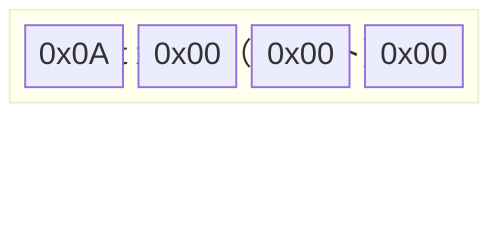

次に、バッファを見る。

```cpp
char buffer[8];
```

これは 8 バイト分を「まとめて確保した領域」だ。

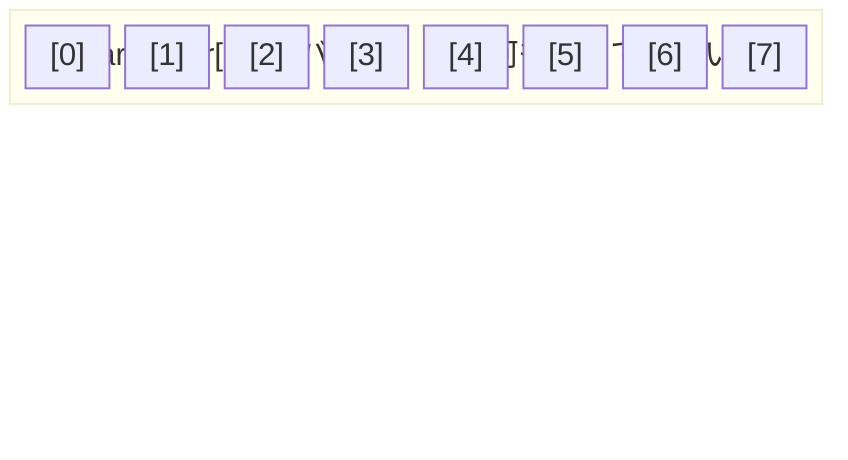

**違いはここだ。**

| | `int x` | `char buffer[8]` |
| :--- | :--- | :--- |
| **意味** | 「整数」として決まっている | ただの 8 バイト。解釈は使う側次第 |
| **アクセス** | `x` で直接 | `buffer[0]`〜`buffer[7]` で添字指定 |
| **用途** | 1つの値を持つ | 複数バイトをまとめて扱う作業スペース |

---

### 1-2. バイトとは何か

1 バイト = 8 ビット。0〜255 の値が入る最小単位だ。

メモリはこのバイトが連続して並んでいる。

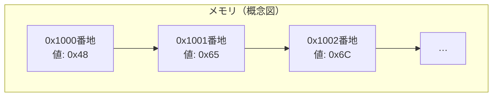

バッファは「このメモリ上の連続した領域」を名前で参照できるようにしたものだ。

---

### 1-3. 1バイトずつ書き込んで読んでみる

```cpp
#include <iostream>

int main()
{
    char buffer[8];

    buffer[0] = 'H';
    buffer[1] = 'e';
    buffer[2] = 'l';
    buffer[3] = 'l';
    buffer[4] = 'o';
    buffer[5] = '!';
    buffer[6] = '\0';
    buffer[7] = '\0';

    for (int i = 0; i < 8; i++)
    {
        std::cout << "buffer[" << i << "] = " << buffer[i] << std::endl;
    }
    return 0;
}
```

書き込み後のバッファの様子：

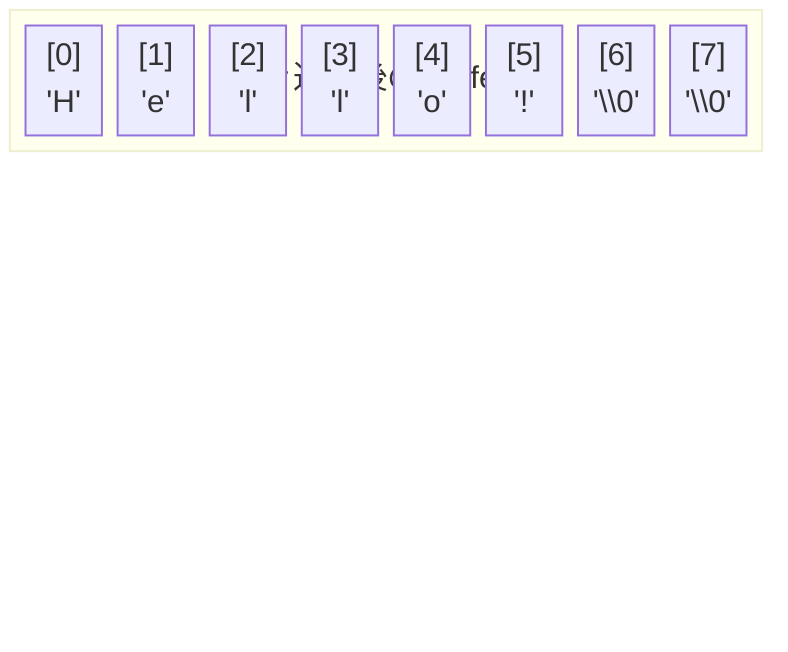

> **ここがポイント：**  
> バッファは「文字列を入れた箱」ではない。  
> `buffer` はただの 8 バイトの領域で、そこに文字コードを 1 個ずつ書いただけだ。  
> 「文字列として読める」のは、たまたま文字コードを入れたからにすぎない。

---

### 第1段階のまとめ

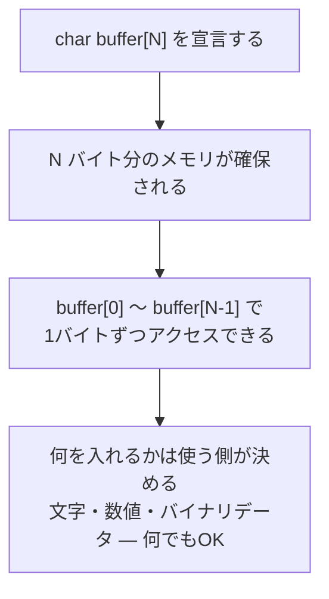

---

## 第2段階：構造体をバッファへ写す

### 2-1. 構造体のメモリレイアウトを図で見る

```cpp
struct Record
{
    int id;     // 4バイト
    int score;  // 4バイト
};
```

この構造体はメモリ上でこう並んでいる。

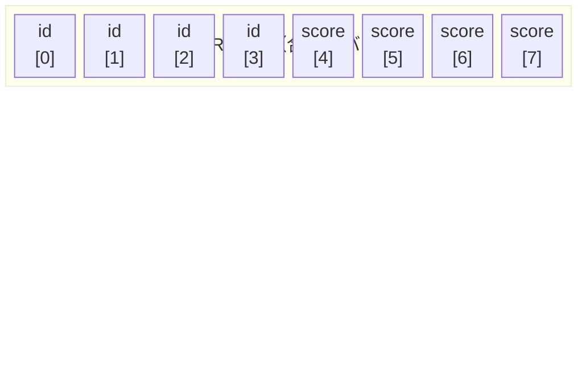

`id` が先頭 4 バイト、`score` がその次の 4 バイトを占める。  
構造体のフィールドは、宣言順に連続して並ぶ。

---

### 2-2. memcpy とは何か

`memcpy` は「メモリをそのままコピーする」関数だ。

```cpp
std::memcpy(コピー先のアドレス, コピー元のアドレス, バイト数);
```

構造体をバッファへコピーするときはこう書く。

```cpp
Record rec;
rec.id    = 1;
rec.score = 500;

char buffer[sizeof(Record)];             // Record と同じサイズのバッファ
std::memcpy(buffer, &rec, sizeof(Record)); // 中身をそのままバッファへコピー
```

コピーの流れを図で見ると：

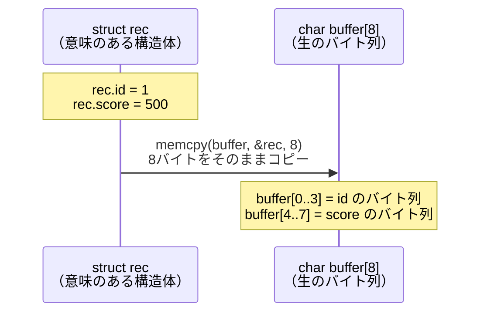

---

### 2-3. コピー後のバッファを1バイトずつ見る

`id = 1`、`score = 500` の場合、バッファの中身はこうなる（リトルエンディアン環境）。


- `[0]〜[3]` は `id = 1` のバイト表現
- `[4]〜[7]` は `score = 500 = 0x000001F4` のバイト表現（リトルエンディアンで `F4 01 00 00`）

確認できるコード：

```cpp
#include <iostream>
#include <iomanip>
#include <cstring>

struct Record
{
    int id;
    int score;
};

int main()
{
    Record rec;
    rec.id    = 1;
    rec.score = 500;

    char buffer[sizeof(Record)];
    std::memcpy(buffer, &rec, sizeof(Record));

    std::cout << "buffer bytes:" << std::endl;
    for (size_t i = 0; i < sizeof(Record); i++)
    {
        unsigned char b = static_cast<unsigned char>(buffer[i]);
        std::cout << "buffer[" << i << "] = 0x"
                  << std::hex << std::setw(2) << std::setfill('0')
                  << static_cast<int>(b) << std::endl;
    }
    return 0;
}
```

---

### 2-4. バッファから構造体へ戻す

逆方向も同じく `memcpy` でできる。

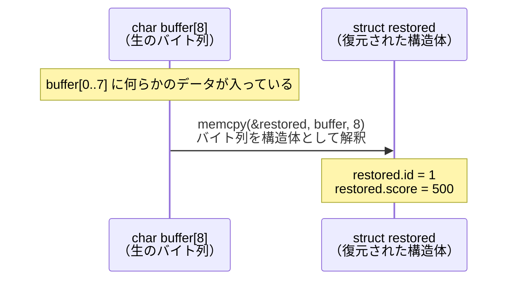

```cpp
Record restored;
std::memcpy(&restored, buffer, sizeof(Record));

std::cout << std::dec;
std::cout << "restored.id    = " << restored.id    << std::endl;
std::cout << "restored.score = " << restored.score << std::endl;
```

---

### 第2段階のまとめ

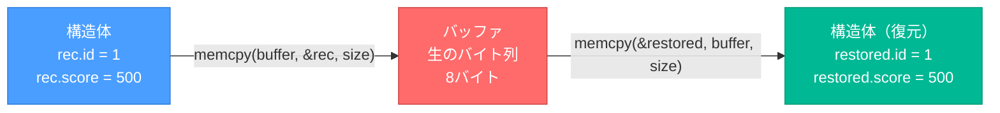

> **ここがポイント：**  
> 構造体とバッファは `memcpy` で行き来できる。  
> どちらも「同じバイト列」を表しているにすぎない。  
> 構造体は「人間が意味を与えた見方」、バッファは「機械が扱う生の姿」だ。

---

## 第3段階：offsetで読み書きする

### 3-1. offset とは何か

`offset` = **先頭から何バイト目か** を示す数値だ。

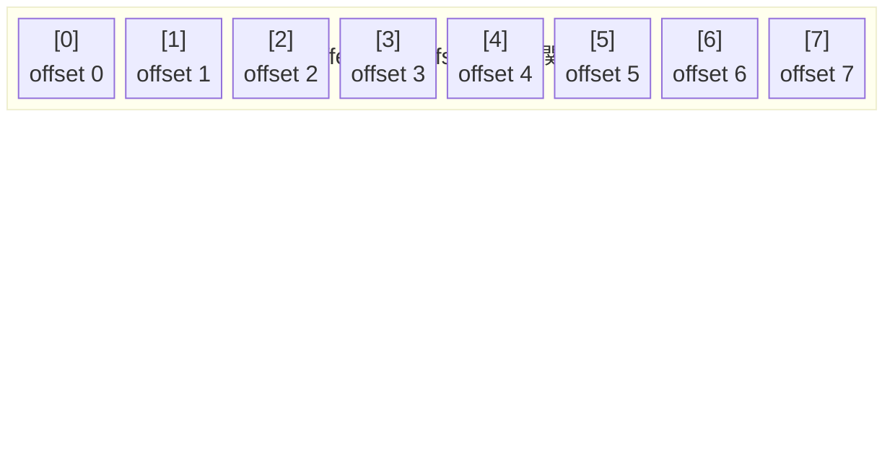

`buffer[i]` の `i` がそのまま offset だ。シンプル。

---

### 3-2. バイナリ仕様書の読み方

実務では「バイナリレイアウト仕様」という形でデータ構造が決まっていることがある。
構造体の定義がなく、仕様書に書かれた offset とサイズだけが手がかりになる。

```
パケット仕様（8バイト固定）：
  offset  0〜3 : command_id   （uint32_t、4バイト）
  offset  4〜7 : payload_len  （uint32_t、4バイト）
```

これをバッファで表すと：

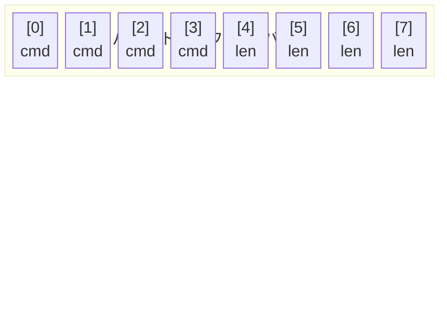

---

### 3-3. 特定 offset へ書き込む

```cpp
#include <iostream>
#include <iomanip>
#include <cstring>
#include <cstdint>

int main()
{
    uint8_t buffer[8] = {};  // 8バイト、ゼロ初期化

    // offset 0 に command_id = 42 を書き込む
    uint32_t command_id = 42;
    std::memcpy(&buffer[0], &command_id, sizeof(uint32_t));

    // offset 4 に payload_len = 256 を書き込む
    uint32_t payload_len = 256;
    std::memcpy(&buffer[4], &payload_len, sizeof(uint32_t));

    for (int i = 0; i < 8; i++)
    {
        std::cout << "buffer[" << i << "] = 0x"
                  << std::hex << std::setw(2) << std::setfill('0')
                  << static_cast<int>(buffer[i]) << std::endl;
    }
    return 0;
}
```

書き込み後のバッファ：

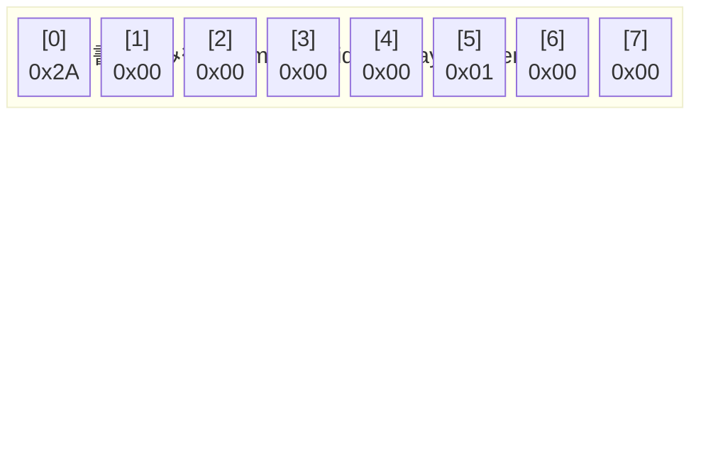

- `command_id = 42 = 0x2A` → `[0]〜[3]` に書かれる
- `payload_len = 256 = 0x00000100` → `[4]〜[7]` に書かれる（リトルエンディアンで `00 01 00 00`）

---

### 3-4. 特定 offset から読み出す

```cpp
// offset 0 から 4バイト読んで uint32_t として解釈する
uint32_t read_id;
std::memcpy(&read_id, &buffer[0], sizeof(uint32_t));

// offset 4 から 4バイト読んで uint32_t として解釈する
uint32_t read_len;
std::memcpy(&read_len, &buffer[4], sizeof(uint32_t));

std::cout << std::dec;
std::cout << "command_id  = " << read_id  << std::endl;  // 42
std::cout << "payload_len = " << read_len << std::endl;  // 256
```

読み出しの流れ：

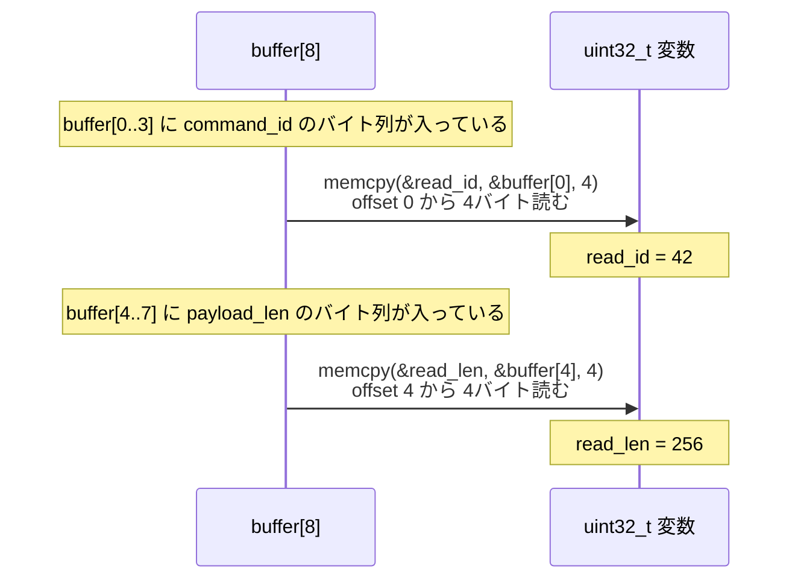

---

### 第3段階のまとめ

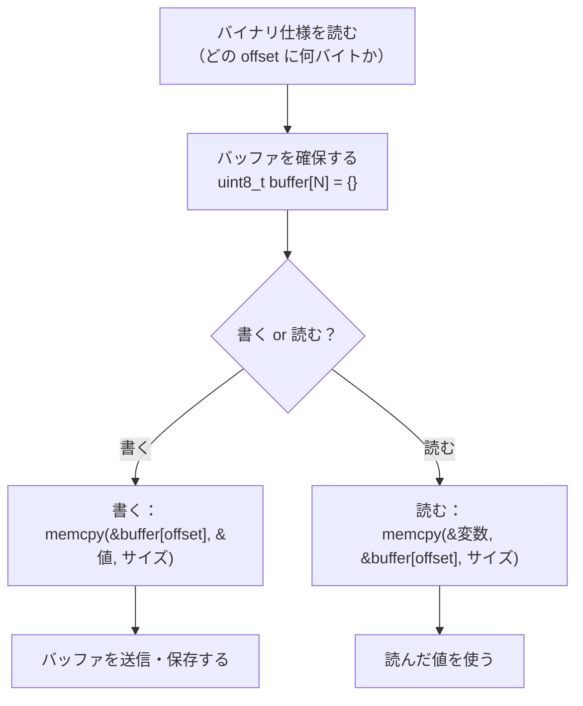

> **ここがポイント：**  
> 「構造体定義がない」「外部仕様しかない」「パケットを組み立てたい」  
> そういう場面では、最初から「生のバイト列」として扱うしかない。  
> offset + memcpy がその手段だ。

---

## 3段階の全体まとめ

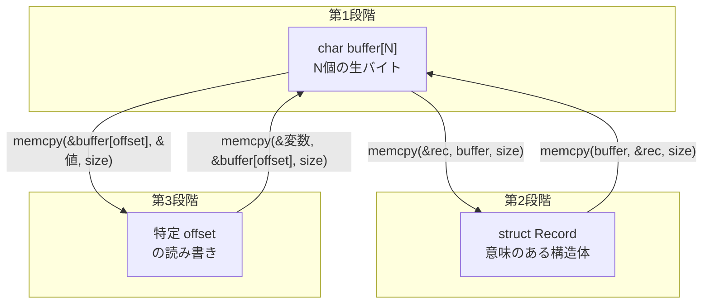

| 段階 | 学んだこと | 使う手段 |
| :---: | :--- | :--- |
| **第1段階** | バッファを確保して 1 バイトずつ触る | `char buffer[N]`、`buffer[i]` |
| **第2段階** | 構造体とバッファを行き来する | `std::memcpy(dst, src, size)` |
| **第3段階** | 仕様に従って特定 offset を読み書きする | `std::memcpy(&buffer[offset], ...)` |

---

## この先に何があるか

この 3 段階が分かると、次の扉が開く。

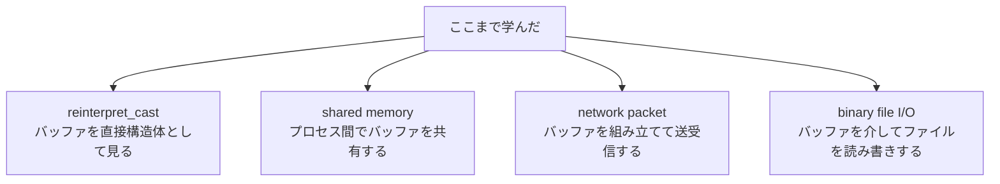

どれも「バッファはバイト列である」という感覚の上に乗っている。  
焦らず、この 3 段階で得た基礎を使い倒すのが先だ。
