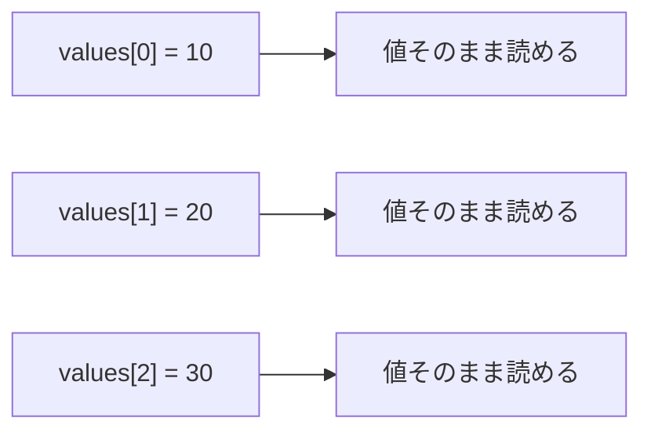
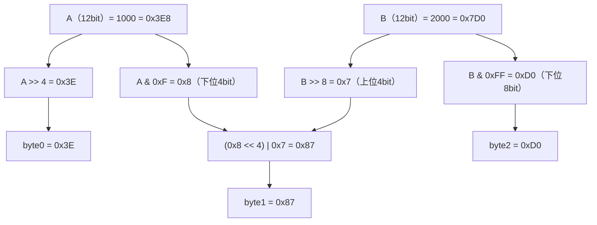
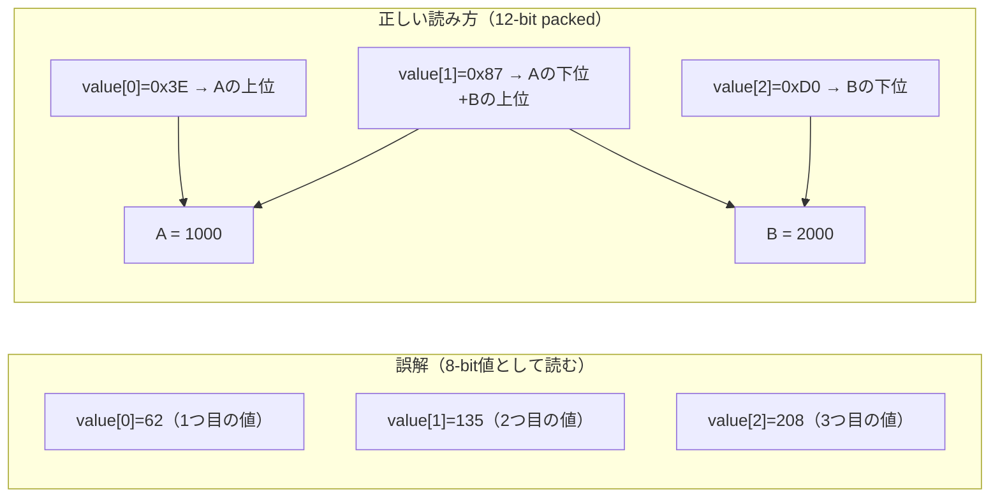
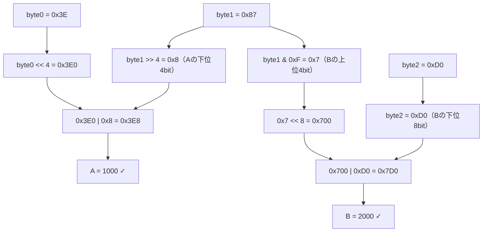
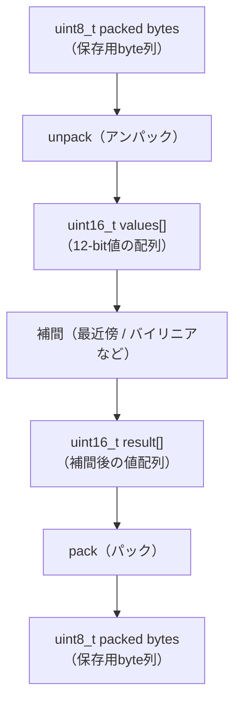
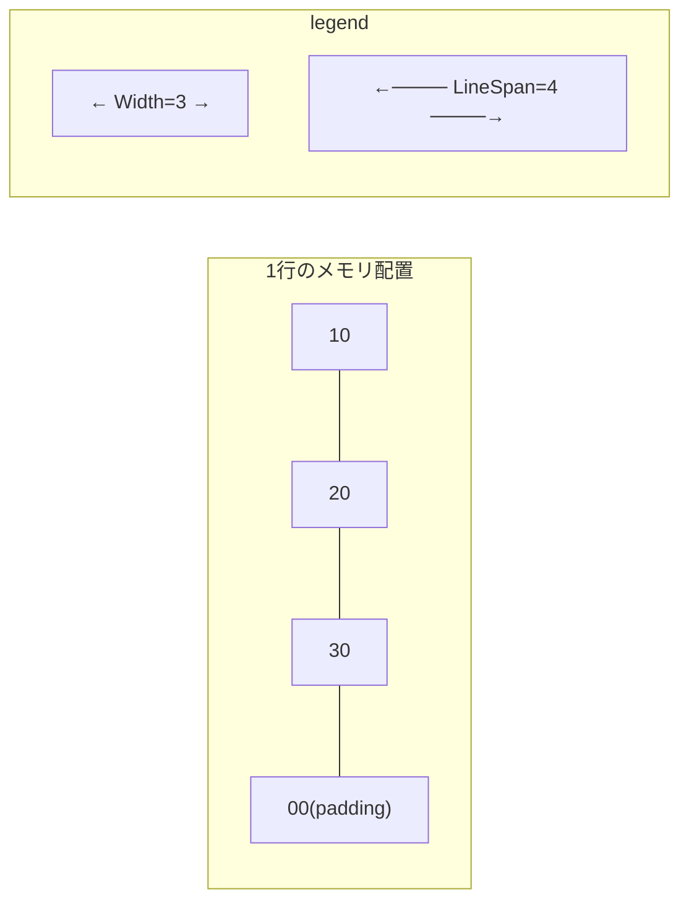
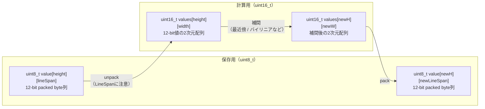
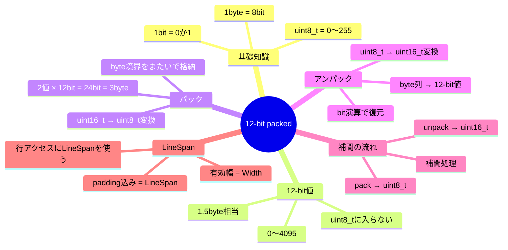

# 第8章：12-bitパックデータを理解する

副題：8bitの箱に12bitの値をどう保存するのか

---

## この章で学ぶこと

```text
8bitで1つの値を保存する普通の世界
↓
12bitで1つの値を表す世界
↓
でもファイルは8bit単位で保存される
↓
では12bit値をどう詰めるか
↓
詰めたものをどう戻すか
↓
なぜ補間前に戻す必要があるか
```

この章を読み終えたとき、次の文章を自分で説明できることを目指します。

> 12bit値は1byteに収まらないため、保存時には複数の値をbyte列に詰める。
> そのため、uint8_t配列に見えても、1要素が1つの値とは限らない。
> 補間処理では値そのものを扱う必要があるため、一度12bit値として取り出し、
> uint16_t配列として計算し、最後に再び12-bit packed形式へ戻す。

---

## 8-1. bitとbyteを理解する

コンピュータが扱える情報の最小単位は **bit（ビット）** です。
1bitは `0` か `1` の **どちらか1つ** だけを表せます。

```text
1bit = [0] または [1]
```

8bitをまとめたものを **byte（バイト）** と呼びます。
byteは「8個のスイッチが並んだ箱」とイメージできます。

```text
1byte（8bitの箱）：

[ b7 ][ b6 ][ b5 ][ b4 ][ b3 ][ b2 ][ b1 ][ b0 ]
  ↑                                           ↑
上位ビット                               下位ビット

各スイッチ（bit）は 0 か 1
```

C++では `uint8_t` が1byteを表す型です。

```text
uint8_t = 8bitの箱 = 0 〜 255 の整数が入る
```

```text
00000000（2進数） = 0（10進数）
11111111（2進数） = 255（10進数）
```

ビット数と表せる値の最大数の関係：

| bit数 | 組み合わせ数 | 値の範囲 |
|---|---|---|
| 1bit | 2通り（0, 1） | 0 〜 1 |
| 4bit | 16通り | 0 〜 15 |
| 8bit | 256通り | 0 〜 255 |

---

## 8-2. 8-bitの通常格納（1値 = 1byte）

まず最もシンプルなケースを見ます。

3つの値 `10`, `20`, `30` を保存したいとします。
これらはすべて 0〜255 の範囲に収まるため、それぞれ1byteで表せます。

```text
値:    10       20       30
       ↓         ↓        ↓
byte: [  10  ] [  20  ] [  30  ]
      byte[0]  byte[1]  byte[2]
```

```cpp
uint8_t values[3] = {10, 20, 30};
// values[0] = 10
// values[1] = 20
// values[2] = 30
```

この状態では、配列インデックスと値が1対1対応しています。



この「1配列要素 = 1つの値」という関係が、次のセクションで崩れます。

---

## 8-3. 12-bit値とは（0〜4095）

次に、より広い範囲の値を扱う **12-bit値** を導入します。

**12bitとは**、1つの値を **12個の0/1** で表すことです。

ビット数が多いほど、表せる値の範囲が広がります：

| 型 | bit数 | 値の範囲 |
|---|---|---|
| `uint8_t` | 8bit | 0 〜 255 |
| 12-bit値 | 12bit | 0 〜 4095 |
| `uint16_t` | 16bit | 0 〜 65535 |

12bit値を図で見ると：

```text
12bit値（1つ）：

[ b11][ b10][ b9 ][ b8 ][ b7 ][ b6 ][ b5 ][ b4 ][ b3 ][ b2 ][ b1 ][ b0 ]

0000 0000 0000（2進数） = 0
1111 1111 1111（2進数） = 4095
```

**重要：12bit値は `uint8_t` には入りきりません。**

```text
uint8_t の最大値  =  255
12bit の最大値    = 4095  ← uint8_t に入らない！
```

例えば、値 `1000` を保存したい場合：

```text
1000 > 255   → uint8_t には入らない
1000 ≤ 4095  → 12-bit なら入る
```

---

## 8-4. 12-bit = 1.5バイト相当

12bitをbyteに換算してみます。

```text
12bit ÷ 8bit = 1.5byte
```

つまり、12bit値1つを保存するには **1.5byteが必要** です。

```text
1byte分（8bit）  +  0.5byte分（4bit）  = 1.5byte = 12bit
[ b7 ][ b6 ][ b5 ][ b4 ][ b3 ][ b2 ][ b1 ][ b0 ]  [ b3 ][ b2 ][ b1 ][ b0 ]
←────────── 1byte ──────────→                       ←── 0.5byte ──→
```

しかし、ここで大きな問題があります。

```text
重要：「1.5byteの箱」は存在しない
```

コンピュータのメモリもファイルも、すべて **byte単位** で管理されます。

```text
メモリ・ファイルのイメージ：

byte0  byte1  byte2  byte3  byte4 ...
 □      □      □      □      □
（整数個のbyteしかない）
```

半分のbyteという概念は存在しないため、12-bit値を1つずつ保存しようとすると中途半端になります。

---

## 8-5. 2つの12-bit値を3バイトに詰める

「1.5byteの箱」がないなら、どうするか？

**2つの12-bit値をまとめて考える** ことで解決します。

```text
12bit × 2個 = 24bit = 3byte（ちょうど割り切れる）
```

3byteはbyteの整数倍なので、2個の12-bit値を3byteにぴったり収められます。

### ビット配置を見る

AとBという2つの12-bit値があるとします。

```text
A の12bit                 B の12bit
┌──────────────────────┬──────────────────────┐
│A11 A10  A9  A8  A7  A6  A5  A4  A3  A2  A1  A0│B11 B10  B9  B8  B7  B6  B5  B4  B3  B2  B1  B0│
└──────────────────────┴──────────────────────┘
```

これを8bitごとに区切ると：

```text
byte0（8bit）    byte1（8bit）    byte2（8bit）
┌──────────────┬──────────────┬──────────────┐
│A11 A10  A9  A8  A7  A6  A5  A4│A3  A2  A1  A0  B11 B10  B9  B8│ B7  B6  B5  B4  B3  B2  B1  B0│
└──────────────┴──────────────┴──────────────┘
 ↑ Aの上位8bit    ↑ Aの下位4bit     ↑ Bの下位8bit
                   + Bの上位4bit
```

各byteの内訳：

| byte | 内容 | bitの対応 |
|---|---|---|
| byte0 | Aの上位8bit | A[11] 〜 A[4] |
| byte1 | Aの下位4bit ＋ Bの上位4bit | A[3]〜A[0] ＋ B[11]〜B[8] |
| byte2 | Bの下位8bit | B[7] 〜 B[0] |

### パック（詰める）の式

```cpp
uint8_t byte0 = static_cast<uint8_t>(A >> 4);
uint8_t byte1 = static_cast<uint8_t>(((A & 0xF) << 4) | (B >> 8));
uint8_t byte2 = static_cast<uint8_t>(B & 0xFF);
```



数値例で確認（A=1000, B=2000）：

```text
A = 1000 = 0x3E8 = 0011 1110 1000
B = 2000 = 0x7D0 = 0111 1101 0000

byte0 = A >> 4              = 0x3E  （0011 1110）
byte1 = (A & 0xF)<<4 | B>>8 = 0x87  （1000 0111）
byte2 = B & 0xFF            = 0xD0  （1101 0000）
```

---

## 8-6. uint8_t配列は「1要素=1値」ではない

8-5の内容を踏まえて、重要な認識を作ります。

次のような `uint8_t` 配列を見たとき、どう解釈しますか？

```cpp
uint8_t value[3] = {0x3E, 0x87, 0xD0};
```

**よくある誤解：**

```text
value[0] = 1つ目の値  → 62
value[1] = 2つ目の値  → 135
value[2] = 3つ目の値  → 208
```

**12-bit packedとして正しく読むと：**

```text
value[0] = Aの上位8bit（A >> 4 の結果）
value[1] = Aの下位4bit + Bの上位4bit
value[2] = Bの下位8bit（B & 0xFF の結果）
↓ アンパックすると
A = 1000
B = 2000
```



`uint8_t` 配列だけ見ても、それが「1要素=1値」なのか「12-bit packed」なのかは **型情報だけでは分かりません**。
データの仕様（フォーマット情報）を知る必要があります。

---

## 8-7. 12-bitパックデータをアンパックする

保存されたbyte列から元の12-bit値を取り出すことを **アンパック（unpack）** と呼びます。

```text
byte列（保存用）  →  12-bit値（計算用）
```

### アンパックの式

```cpp
uint16_t A = static_cast<uint16_t>((byte0 << 4) | (byte1 >> 4));
uint16_t B = static_cast<uint16_t>(((byte1 & 0xF) << 8) | byte2);
```



検証：

```text
A = (byte0 << 4) | (byte1 >> 4)
  = (0x3E << 4)  | (0x87 >> 4)
  = 0x3E0        | 0x8
  = 0x3E8
  = 1000 ✓

B = ((byte1 & 0xF) << 8) | byte2
  = ((0x87 & 0xF) << 8)  | 0xD0
  = (0x7 << 8)           | 0xD0
  = 0x700                | 0xD0
  = 0x7D0
  = 2000 ✓
```

元の値が完全に復元できています。

---

## 8-8. なぜuint16_tが必要か

12-bit値（最大4095）を変数として保持するには、どの型を使うべきでしょうか？

```text
uint8_t の最大値  =   255
12-bit の最大値   =  4095  ← uint8_t に入らない！
uint16_t の最大値 = 65535  ← 余裕で入る
```

| 型 | bit数 | 最大値 | 12-bit値を格納できるか |
|---|---|---|---|
| `uint8_t` | 8bit | 255 | ✗（4095が入らない） |
| `uint16_t` | 16bit | 65535 | ✓（余裕を持って入る） |

アンパック後の12-bit値は `uint16_t` に格納します。

```text
保存するとき  →  uint8_t 配列（12-bit packed）
計算するとき  →  uint16_t 配列（普通の整数として計算）
```


---

## 8-9. 補間はアンパック後の値に対して行う

**補間**とは、既知の値から未知の値を推定する処理です。

```text
例：100 と 200 の間を4等分したいとき
→ 100, 133, 167, 200
```

これは「値そのもの」に対して行う計算です。

### 正しくない例（packed状態で補間）

packed byte列の各byteは「12-bit値の断片」です。
断片同士を補間しても、意味のある値は得られません。

```text
byte1 = 0x87 ← これは「Aの下位4bit + Bの上位4bit」の混在
この値を補間しても意味がない
```

### 正しい流れ



**補間はuint16_tの値配列に対して行う。packed byte列に対しては行わない。**

---

## 8-10. 補間後に再パックする

補間後の `uint16_t` 配列を、再び `uint8_t` の12-bit packed形式へ戻すことを **パック（pack）** と呼びます。

### パックの式（再掲）

```cpp
uint8_t byte0 = static_cast<uint8_t>(A >> 4);
uint8_t byte1 = static_cast<uint8_t>(((A & 0xF) << 4) | (B >> 8));
uint8_t byte2 = static_cast<uint8_t>(B & 0xFF);
```

バイリニア補間では、中間値が `float` になります。
`uint16_t` へ変換するときは **切り捨て** が起きます。

```cpp
float interpolated = bilinear(src, u, v);        // 浮動小数点の結果
uint16_t value = static_cast<uint16_t>(interpolated); // 小数点以下は切り捨て
```

この切り捨ては情報の微小な損失ですが、画像処理などの実用では一般的に許容されます。

---

## 8-11. LineSpanとパディングを理解する

実際のデータは2次元（行×列）で管理されることが多いです。

3×3の値があるとします：

```text
10  20  30
40  50  60
70  80  90
```

コンピュータのメモリではこれを1本のbyte列として保存します：

```text
10 20 30 40 50 60 70 80 90
```

ここで、多くのシステムは各行の末尾に **padding（余白byte）** を追加します。
これはメモリのアライメント（境界整合）のためです。

```text
padding あり：

10 20 30 [00] | 40 50 60 [00] | 70 80 90 [00]
←  width=3  → |←  width=3  → |←  width=3  →
←── lineSpan=4 ──→←── lineSpan=4 ──→←── lineSpan=4 ──→
```

| 用語 | 意味 |
|---|---|
| **Width** | 有効な値の横幅（padding を除く） |
| **LineSpan** | padding 込みの1行のbyte数 |



### LineSpanを使った行のアクセス

```cpp
const uint8_t* buf;        // データバッファの先頭
std::size_t lineSpan;      // 1行のbyte数（padding込み）

// row行目の先頭へのポインタ
const uint8_t* rowPtr = buf + row * lineSpan;  // lineSpan を使う（width ではない）
```

`width` ではなく `lineSpan` を使う理由：
padding を含んだ正しい行の先頭に進むためです。

---

## 8-12. 全体フローを1枚で整理する



役割の整理：

| データ形式 | 型 | 目的 |
|---|---|---|
| 12-bit packed byte列 | `uint8_t[]` | 保存・転送（コンパクトな形式） |
| 12-bit値配列 | `uint16_t[]` | 計算・補間（扱いやすい形式） |

**unpack と pack は「保存形式 ↔ 計算形式」の変換です。**
補間は必ず unpack 後（uint16_t 状態）で行います。

---

## 演習

### 演習1：8-bit値を配列に格納する

3つの値 `10`, `20`, `30` を `uint8_t` 配列に格納し、表示してください。

目的：1値 = 1byte の普通の世界を確認する。

```text
期待出力：
[演習1] 8-bit値の格納
  values[0] = 10
  values[1] = 20
  values[2] = 30
```

---

### 演習2：2つの12-bit値を3byteにパックする

`A = 1000`, `B = 2000` を `packPair` 関数でパックし、3つのbyteを16進数で表示してください。

目的：12-bit値がbyte境界をまたいで格納されることを実感する。

```text
期待出力：
[演習2] 12-bit packed: A=1000, B=2000
  byte0 = 0x3E
  byte1 = 0x87
  byte2 = 0xD0
```

---

### 演習3：3byteから12-bit値2個をアンパックする

演習2で作成した `{0x3E, 0x87, 0xD0}` を `unpackPair` 関数でアンパックし、`A` と `B` の値を確認してください。

目的：パック→アンパックで元の値が復元できることを確認する。

```text
期待出力：
[演習3] アンパック: {0x3E, 0x87, 0xD0}
  A = 1000
  B = 2000
```

---

### 演習4：2×2の12-bit値テーブルをアンパックする

次の2×2のテーブルを12-bit packedで保存し、アンパックして元の表に戻してください。

```text
入力テーブル：
  [0][0] = 0    [0][1] = 100
  [1][0] = 200  [1][1] = 300
```

目的：保存用byte列と計算用テーブルの違いを理解する。

```text
packed buffer（hex）:
  row0: 0x00 0x00 0x64
  row1: 0x0C 0x81 0x2C

期待出力（アンパック後）：
[演習4] 2×2テーブルのアンパック
  [0][0] =   0  [0][1] = 100
  [1][0] = 200  [1][1] = 300
```

---

### 演習5：アンパック後にバイリニア補間する

演習4のテーブルをアンパックし、バイリニア補間で5×5に拡大してください。

目的：補間はpacked byte列ではなく、uint16_t値に戻してから行うことを理解する。

```text
入力（2×2）:
     0   100
   200   300

期待出力（5×5）:
[演習5] バイリニア補間 2×2 → 5×5
    0.0   25.0   50.0   75.0  100.0
   50.0   75.0  100.0  125.0  150.0
  100.0  125.0  150.0  175.0  200.0
  150.0  175.0  200.0  225.0  250.0
  200.0  225.0  250.0  275.0  300.0
```

---

## 確認問題

**問1：** 12-bit値の最大値はいくつですか？また、なぜ `uint8_t` では格納できないのですか？

**問2：** 2つの12-bit値 `A=512`, `B=256` をパックしたとき、`byte0`, `byte1`, `byte2` の値（16進数）をそれぞれ求めてください。

**問3：** `uint8_t value[6]` という配列があります。これが12-bit packedデータだとすると、何個の12-bit値が格納されていますか？

**問4：** 補間処理を packed byte列に対して直接行うと、なぜ問題が起きるのですか？

**問5：** `Width = 5`、`LineSpan = 8` のデータがあります。3行目（0-indexed で row=2）の先頭byteは、バッファ先頭から何byte目にありますか？

---

## まとめ



### 確認問題の解答

- **問1：** 4095。8bit（最大255）より大きいため `uint8_t` に入らない。
- **問2：** A=512=0x200、B=256=0x100 → byte0=0x20、byte1=0x01、byte2=0x00
- **問3：** 6byte ÷ 3byte = 2ペア = **4個**（12-bit値2個で3byteを使う）
- **問4：** byte1のように複数の値の「断片」が混在しているため、断片同士を補間しても元の値の補間にならない。
- **問5：** `row × lineSpan = 2 × 8 = 16` byte目（0-indexed）
