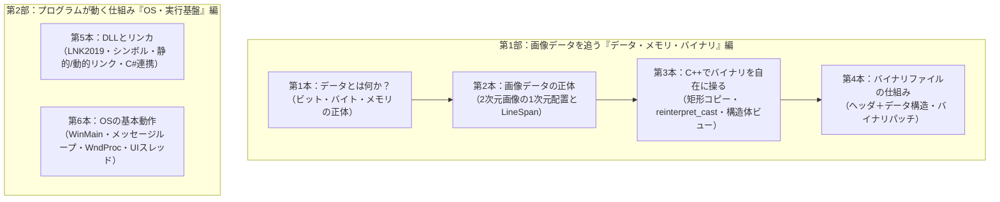

# 技術記事・社内資料（全6本）詳細構成案

今期目標（12月まで）である「コンピュータシステム基礎知識の学習と実務活用」に向けた、技術資料6本の詳細な章立て・ストーリー構成案です。

本構成では、**「画像データ」という身近で目に見える具体例を1本の軸（レール）に通し、ビット・バイトからファイル保存までを一直線に駆け抜ける【第1部】**と、**OS上でプログラムが動作・連携する仕組みを解説する【第2部】**の2部構成を採用しています。

---

## 【第1部】画像データを追う「データ・メモリ・バイナリ」編（全4本）

### 第1本：【基礎】データとは何か？——ビット・バイトから始まるメモリの正体
* **狙い**：
  * すべての土台となる「ビット」「バイト」「メモリ空間（アドレス）」の概念を腹落ちさせる。
  * 「int（4バイト）の2バイト目を書き換えると数値はどう変わる？」という実験を通じて、リトルエンディアンの並び順を直感的に理解する。
* **ベース資料**：
  * [01_bytes_and_int_memory.md](../articles/01_bytes_and_int_memory.md)
  * [バッファ入門（図解授業）——3段階でバイト列を扱う感覚を身につける.md](../articles/バッファ入門（図解授業）——3段階でバイト列を扱う感覚を身につける.md)
* **章立て案**：
  * **第1章：なぜ高級言語時代でも「メモリの形」を意識するのか？**
    * 実務での数値化けや通信バグの原因の多くは「メモリの見間違い」
  * **第2章：1バイトとは何か？（0〜255の箱と2進数）**
    * 0と1（1ビット）から8ビット（1バイト）ができる仕組み
    * 符号付き（signed）と符号なし（unsigned）の表現
  * **第3章：メモリとは「1バイトの箱が並んだ巨大なロッカー街」**
    * アドレスとは何か、メモリの1次元性
  * **第4章：実験：int 100 の2バイト目を書き換えると何が起きるか？**
    * リトルエンディアンの罠（人間の直感とCPUの並び順の違い）
  * **第5章：現場の落とし穴——境界アライメント（Alignment）とパディング**
    * CPUが奇数アドレスを嫌う理由、構造体サイズが見た目の合計と一致しない謎
  * **第6章：まとめ・実務チェックリスト**
    * デバッガでメモリダンプ（Memory View）を読むときの観察ポイント

---

### 第2本：【データ構造】画像データの正体——「2次元の絵」を「1次元メモリ」にどう並べるか？
* **狙い**：
  * 「画像も実はただの巨大なバイト配列である」という事実を解き明かす。
  * 画面処理で頻出する「画像が斜めに崩れる」「右端にノイズが乗る」トラブルを解決するため、データ構造の核心概念である **「LineSpan（ストライド/ピッチ）」** を図解する。
* **ベース資料**：
  * [画像の仕組み.md](../articles/画像の仕組み.md)
  * [LineSpanを考慮した左上配置コピーと座標系.md](../articles/LineSpanを考慮した左上配置コピーと座標系.md)
* **章立て案**：
  * **第1章：画像処理の現場で起きる「斜め歪み・ノイズ」の正体**
  * **第2章：画像データの最小単位（ピクセルとRGB）**
    * モノクロ（1バイト/画素）とカラー（3〜4バイト/画素）
  * **第3章：2次元画像を1次元メモリに折りたたむ**
    * 画面上の座標 `(x, y)` から1次元インデックスを算出する基本式：`index = y * width + x`
  * **第4章：「有効幅（Width）」と「LineSpan（Stride/Pitch）」の決定的な違い**
    * なぜ行の終端に余白（Padding）が入るのか？（4バイト/16バイト境界アライメント）
    * 正しいアドレス計算式：`offset = y * lineSpan + x * bytesPerPixel`
  * **第5章：トラブル実例——LineSpanを無視すると何が起きるか？**
    * 1ピクセルずれて全体が斜めに流れるメカニズムを図解
  * **第6章：まとめ——C#（BitmapData.Stride）とC++ネイティブバッファの共通法則**

---

### 第3本：【バイナリ操作】C++でバイナリを自在に操る——安全なコピーと「構造体ビュー」
* **狙い**：
  * メモリ上に展開された画像やバイト配列をC++でどう操作・解釈するか。
  * 「矩形領域のコピー」の実装と、無駄なコピーを排して生メモリを構造体として解釈する「ゼロコピー参照（`reinterpret_cast`）」の技術・注意点を整理する。
* **ベース資料**：
  * [LineSpanを考慮した左上配置コピーと座標系.md](../articles/LineSpanを考慮した左上配置コピーと座標系.md)
  * [reinterpret_cast——バイト列を構造体として「見る」.md](../articles/reinterpret_cast——バイト列を構造体として「見る」.md)
  * [バイナリを構造体へ.md](../articles/バイナリを構造体へ.md)
* **章立て案**：
  * **第1章：メモリ上の画像データを操作する2大アプローチ**
    * 「コピーして移す」か「見方を変えて直接読む」か
  * **第2章：実践：小さい画像を大きい画像の左上に配置する（安全な矩形コピー）**
    * 行ごとの `std::memcpy` ループとポインタ移動
    * バッファオーバーランを防ぐ境界判定ガード
  * **第3章：構造体ビューの思想——`memcpy` せずにそのまま解釈する**
    * `reinterpret_cast` の本質は「データを流し込む」のではなく「型というレンズを変える」こと
  * **第4章：現場の落とし穴——未定義動作（UB）を避けるための鉄則**
    * アライメント不一致によるCPU例外・クラッシュ
    * Strict Aliasing規則と `std::memcpy` / `std::bit_cast`（C++20）の使い分け
  * **第5章：安全な構造体ビューの設計パターン**
    * 固定長整数（`uint8_t`, `uint32_t` 等）の利用、パディング排除の設計
  * **第6章：まとめ・実務チェックリスト**

---

### 第4本：【ファイルフォーマット】バイナリファイルの仕組み——メモリのデータをそのままディスクに保存する
* **狙い**：
  * メモリの中のバイト列をディスクへ書き出したものが「バイナリファイル」であると位置づける。
  * ヘッダー（メタデータ）とデータ部（ペイロード）の構造を理解し、C++による読み込み・パッチ処理（バイナリ書き換え）を習得する。
* **ベース資料**：
  * [binary-patching-file-io.md](../articles/binary-patching-file-io.md)
  * [binary-patching-via-struct.md](../articles/binary-patching-via-struct.md)
  * [画像の仕組み.md](../articles/画像の仕組み.md)
* **章立て案**：
  * **第1章：バイナリファイルって何？ テキストファイル（JSON/CSV）との違い**
    * 「数値100」を保存するとき：テキストなら3バイト（'1','0','0'）、バイナリなら1バイト（0x64）
  * **第2章：バイナリファイルI/Oの基本作法**
    * なぜ `std::ios::binary` が必須なのか（改行コード自動変換の罠）
    * シーク（`seekg` / `seekp`）とファイルサイズの取得
  * **第3章：ファイルフォーマットの構造設計（ヘッダ＋データ）**
    * BMP等の画像ヘッダ構造（マジックナンバー、画像サイズ、オフセット）
  * **第4章：実践：バイナリファイルを読み込み、構造体経由でパッチして書き戻す**
    * `std::vector<uint8_t>` への一括読み込み → 構造体ビュー経由の編集 → 上書き保存
  * **第5章：現場の落とし穴——フォーマット互換性とデータ破損防止**
    * エンディアンの違い、破損検知（チェックサム）
  * **第6章：まとめ——独自ファイル仕様書を読むときのポイント**

---

## 【第2部】プログラムが動く仕組み「OS・実行基盤」編（全2本）

### 第5本：【実行基盤】DLLとリンカ——プログラムが部品として結合する仕組み
* **狙い**：
  * ビルドエラー「LNK2019」の診断手順から、コンパイラとリンカの責務分担を理解する。
  * 静的リンク（.lib）と動的リンク（.dll）の違い、C++ DLLを作成してC#等の別言語から呼び出す（P/Invoke）実務連携をマスターする。
* **ベース資料**：
  * [LNK2019リンカエラーの構造と診断.md](../articles/LNK2019リンカエラーの構造と診断.md)
* **章立て案**：
  * **第1章：「#include が通るのにビルドできない」LNK2019エラーの正体**
  * **第2章：ビルドプロセスの2大フェーズ（コンパイルとリンク）**
    * 宣言（.h）と実装（.cpp）、オブジェクトファイル（.obj）、名前マングリング
  * **第3章：静的ライブラリ（.lib）と動的ライブラリ（.dll）の違い**
    * プロセス起動時のロード（暗黙的リンク）と実行時ロード（`LoadLibrary`）
  * **第4章：DLLの作成と公開**
    * `__declspec(dllexport)` / `__declspec(dllimport)` の意味
    * なぜ `extern "C"` が必要なのか（名前マングリングの無効化）
  * **第5章：実務連携——C++ DLLをC#から呼び出す（P/Invokeの基本）**
    * `[DllImport]` の書き方、基本型と構造体のマーシャリング
  * **第6章：まとめ——リンクエラー・DLL読み込み失敗時の切り分けフローチャート**

---

### 第6本：【OS動作】OSの基本動作——メッセージループとイベント駆動アーキテクチャ
* **狙い**：
  * マウスやキーボードの入力がどのようにOSを介してアプリに届くのかを解明する。
  * Win32の `WinMain`、メッセージキュー、`WndProc` のライフサイクルを学び、UIフリーズ（応答なし）のメカニズムを腹落ちさせる。
* **ベース資料**：
  * [phase2_win32_skeleton.md](../windows-desktop/phase2_win32_skeleton.md)
  * [phase3_gui_parts.md](../windows-desktop/phase3_gui_parts.md)
* **章立て案**：
  * **第1章：ボタンをクリックした瞬間、OSの内部では何が起きているのか？**
  * **第2章：Windowsアプリの骨格（WinMain から始まるライフサイクル）**
    * ウィンドウクラス登録 → ウィンドウ生成（HWND） → ウィンドウ表示
  * **第3章：メッセージループの心臓部**
    * `GetMessage`（待機・取得）と `DispatchMessage`（配送）の永久ループ
  * **第4章：イベントを受け取る窓口（WndProc：ウィンドウプロシージャ）**
    * `WM_COMMAND`, `WM_PAINT`, `WM_DESTROY` の分岐処理
  * **第5章：実務への直結——なぜ重い処理をすると画面が「応答なし」になるのか？**
    * メッセージループが止まる＝OSとの連絡が途絶える現象の解説
    * UIスレッドとワーカースレッドの分離（非同期処理）の必然性
  * **第6章：まとめ——WinForms/WPF/Webにも共通するイベント駆動モデルの普遍性**

---

## 執筆・作成の進め方とスケジュール目安

| 月 | 対象記事 | 作業内容 |
|---|---|---|
| **10月** | **第1本（メモリ基礎）** **第2本（画像とLineSpan）** | 既存の `01_bytes_...` と `LineSpan...` をベースに社内資料化。図解を活かして早期に2本完成させる。 |
| **11月** | **第3本（C++バイナリ操作）** **第4本（バイナリファイル）** **第5本（DLL・リンカ）** | 第1部の完成（ファイル保存まで）。第5本（DLL）にC#連携のサンプルコードを加筆。 |
| **12月** | **第6本（OS動作・イベントループ）** **全体の総括・実務展開** | Win32の骨格解説を仕上げ、全6本を社内Wikiや勉強会へ展開・目標達成報告。 |
