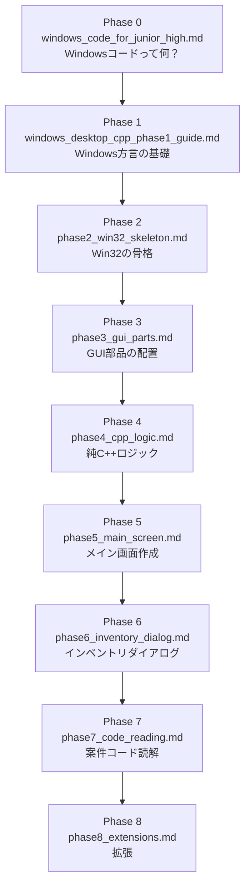

# Windowsデスクトップアプリ開発 学習資料 索引

## 資料一覧

| ファイル名 | 内容 | 対象 Phase |
|---|---|---|
| `windows_desktop_cpp_curriculum.md` | カリキュラム全体基準文書 | 全体 |
| `windows_code_for_junior_high.md` | Windowsコードとは何か（入門読み物） | Phase 0 |
| `windows_code_glossary.md` | 用語図鑑（辞書として使う） | Phase 0〜全体 |
| `windows_desktop_cpp_phase1_guide.md` | Phase 1: Windows方言の基礎 | Phase 1 |
| `phase2_win32_skeleton.md` | Phase 2: Win32の骨格 | Phase 2 |
| `phase3_gui_parts.md` | Phase 3: GUI部品の配置 | Phase 3 |
| `phase4_cpp_logic.md` | Phase 4: 純C++ロジック | Phase 4 |
| `phase5_main_screen.md` | Phase 5: メイン画面作成 | Phase 5 |
| `phase6_inventory_dialog.md` | Phase 6: インベントリダイアログ | Phase 6 |
| `phase7_code_reading.md` | Phase 7: 案件コード読解 | Phase 7 |
| `phase8_extensions.md` | Phase 8: 拡張 | Phase 8 |

---

## 学習の進め方

---

## 用語辞書の使い方

`windows_code_glossary.md` はコードを読んでいてわからない単語が出たときに参照します。
全部を読む必要はありません。

---

## カリキュラム完了条件

- バイオハザード風インベントリアプリが動作する
- メイン画面からインベントリダイアログを開ける
- アイテムを追加・使用・確認できる
- プレイヤーHPが画面上で更新される
- 実案件コードのWindows GUI処理を読んで追える
