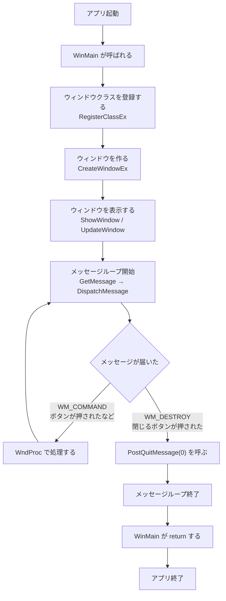
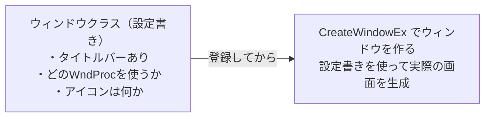
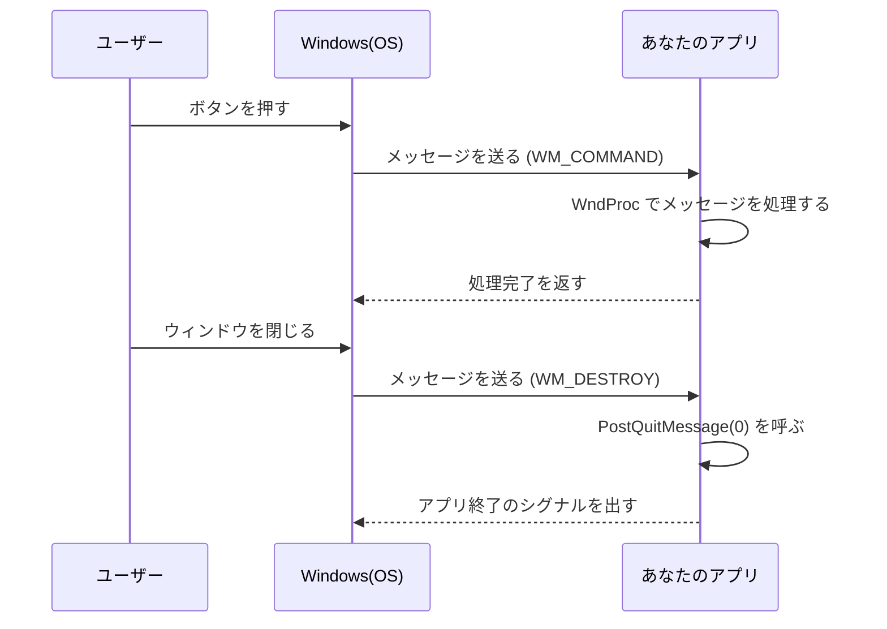
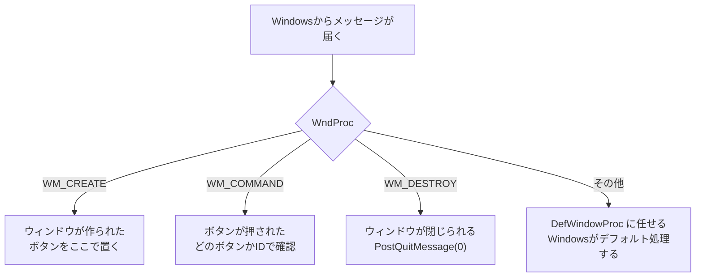
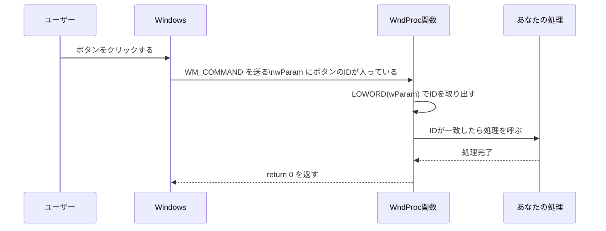
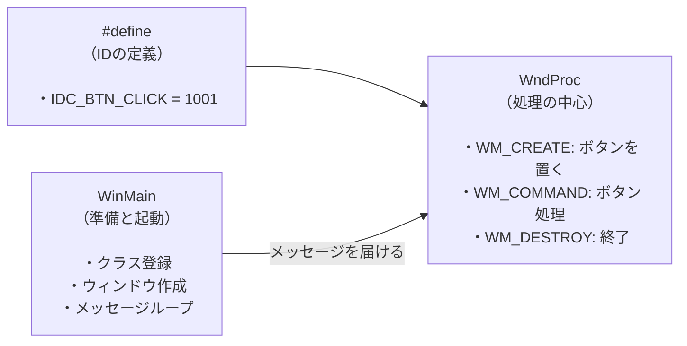
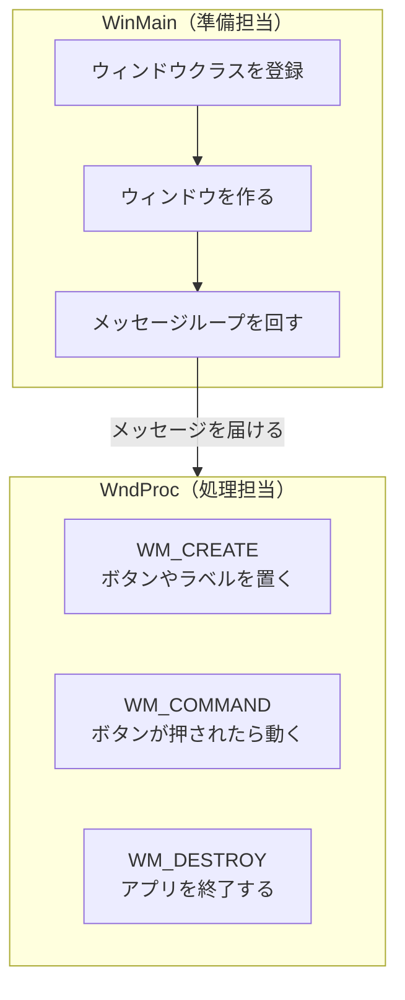

# Phase 2 実行手順書: Win32の骨格

## 0. この文書の位置づけ

この文書は、`Windowsデスクトップアプリ開発 学習カリキュラム` の **Phase 2: Win32の骨格** を実行するための詳細手順書です。

Phase 1 では、Windows特有の型名やマクロに慣れました。
Phase 2 では、**Windowsアプリがどのような流れで動いているか** を理解します。

---

## 1. このPhaseでやること

4つのことに集中します。

1. `WinMain` から始まるアプリの起動の流れを理解する
2. メッセージループの仕組みを理解する
3. `WndProc` がどんな役割をしているかを理解する
4. ボタン1個を持つ最小GUIアプリを自分で動かす

このPhaseが終わると、**Windowsアプリのコードを見たとき、どこに何が書いてあるかが追えるようになります**。

---

## 2. このPhaseのゴール

Phase 2 が終わったとき、次を言えることを目指します。

- `WinMain` はアプリが起動したときに最初に呼ばれる関数
- メッセージループは「Windowsからの連絡を待って受け取るくり返し処理」
- `WndProc` はWindowsから届いたメッセージを処理する場所
- ボタンが押されたときの処理がどこに来るかを説明できる

---

## 3. Windowsアプリの全体の流れ（大きな地図）

最初に、全体像を見てください。
細かいことはあとで説明するので、**まず流れだけ掴んでください**。



この図を見ながら、「アプリが起動してから終了するまでに何が起きているか」を頭に入れてください。

---

## 4. WinMain とは何か

### 4.1 C++で書く `main` 関数との違い

コンソールアプリでは、こう書きます。

```cpp
int main()
{
    // ここから始まる
}
```

Windowsデスクトップアプリでは、代わりに `WinMain` を使います。

```cpp
int WINAPI WinMain(
    HINSTANCE hInstance,      // このアプリ自身のハンドル
    HINSTANCE hPrevInstance,  // 昔の名残。常に nullptr
    LPSTR     lpCmdLine,      // コマンドライン引数（文字列）
    int       nCmdShow        // ウィンドウの表示方法
)
{
    // ここから始まる
}
```

`main` の代わりに `WinMain` から始まる、というだけです。
ゴールは同じで、**「アプリが始まったら最初に呼ばれる場所」** です。

### 4.2 引数の意味

| 引数名 | 意味 |
|---|---|
| `hInstance` | このアプリ自体を指すハンドル。後で使う |
| `hPrevInstance` | 昔のWindowsとの互換のため残っているが、常に `nullptr` |
| `lpCmdLine` | コマンドラインから渡された文字列 |
| `nCmdShow` | ウィンドウを最初どう表示するか（最大化、通常など） |

今の段階では、`hInstance` だけ覚えれば十分です。
他は「おまじない」として見ておいてください。

---

## 5. ウィンドウクラスとは何か

### 5.1 「クラス」という言葉の意味

ここでいう「クラス」は、C++のクラスとは別物です。
Windows用語の「ウィンドウクラス」は、**「このウィンドウはどういうウィンドウか」の設定書き** です。



### 5.2 ウィンドウクラスの登録コード

```cpp
WNDCLASSEX wc = {};                     // 設定書きを空で用意する
wc.cbSize        = sizeof(WNDCLASSEX);  // 構造体のサイズ（おまじない）
wc.lpfnWndProc   = WndProc;             // メッセージを処理する関数を登録
wc.hInstance     = hInstance;           // このアプリのハンドル
wc.lpszClassName = L"SampleWindow";     // このクラスの名前

RegisterClassEx(&wc);                   // Windowsに登録する
```

ポイントは1つだけです。

> **`wc.lpfnWndProc = WndProc;`**
> ここに「メッセージが届いたらこの関数を呼んでください」と登録しています。

---

## 6. メッセージループとは何か

### 6.1 なぜループが必要なのか

Windowsアプリは、ボタンを押したりキーボードを叩いたり、いろんな操作を受け取って動きます。
でも、プログラムはその操作がいつ来るかを事前に知ることができません。

そこで、こういう流れで動きます。



### 6.2 メッセージループのコード

```cpp
MSG msg = {};
while (GetMessage(&msg, nullptr, 0, 0))
{
    TranslateMessage(&msg);  // キー入力を文字に変換する（おまじない）
    DispatchMessage(&msg);   // WndProc にメッセージを渡す
}
```

`while` でグルグルとくり返しています。
`GetMessage` は「次のメッセージが来るまで待ちます」。
来たら `DispatchMessage` で `WndProc` に届けます。

`WM_QUIT`（アプリ終了のメッセージ）が来ると、`GetMessage` が `false` を返してループが終わります。

---

## 7. WndProc とは何か

### 7.1 WndProc の役割

`WndProc` は **Windowsからのメッセージを受け取って処理する関数** です。



### 7.2 WndProc の基本形

```cpp
LRESULT CALLBACK WndProc(HWND hwnd, UINT msg, WPARAM wParam, LPARAM lParam)
{
    switch (msg)
    {
    case WM_CREATE:
        // ウィンドウが作られた直後に1回呼ばれる
        // ここでボタンなどを置く
        return 0;

    case WM_COMMAND:
        // ボタンが押されたり、メニューが選ばれたりした
        // LOWORD(wParam) でどのボタンかを確認する
        return 0;

    case WM_DESTROY:
        // ウィンドウが閉じられるとき
        PostQuitMessage(0);
        return 0;
    }

    // 自分で処理しないメッセージはWindowsに任せる
    return DefWindowProc(hwnd, msg, wParam, lParam);
}
```

### 7.3 引数の意味

| 引数 | 意味 |
|---|---|
| `hwnd` | どのウィンドウへのメッセージか |
| `msg` | どんなメッセージか（`WM_CREATE`, `WM_COMMAND` など） |
| `wParam` | メッセージの追加情報その1（ボタンのIDなどが入る） |
| `lParam` | メッセージの追加情報その2（座標などが入ることも） |

---

## 8. ボタンが押されたときの流れ（詳細版）

ここは特に大事です。**ボタンを押したときに何が起きるか** を追います。



コードで書くとこうなります。

```cpp
#define IDC_BTN_DAMAGE 1001  // 「ダメージを与える」ボタンのID

case WM_COMMAND:
{
    WORD buttonId = LOWORD(wParam);  // 押されたボタンのIDを取り出す

    if (buttonId == IDC_BTN_DAMAGE)
    {
        // 「ダメージを与える」ボタンが押された
        MessageBox(hwnd, L"ダメージを与えました", L"通知", MB_OK);
    }
    return 0;
}
```

`LOWORD(wParam)` は、`wParam` の下位16ビットを取り出すマクロです。
ここにボタンのIDが入っています。

---

## 9. 実際に動かす: ボタン1個の最小GUIアプリ

### 9.1 プロジェクト作成

1. Visual Studio 2022 を起動する
2. **新しいプロジェクトの作成** を押す
3. **Windows デスクトップ アプリケーション** を選ぶ
4. プロジェクト名を `phase2_minimum_gui` にする
5. 作成する

### 9.2 サンプルコード全体

Visual Studioが自動生成したコードをすべて消して、次に置き換えます。

```cpp
#include <windows.h>

// ボタンのID
#define IDC_BTN_CLICK 1001

// WndProc の宣言（前方宣言）
LRESULT CALLBACK WndProc(HWND hwnd, UINT msg, WPARAM wParam, LPARAM lParam);

// アプリのエントリポイント
int WINAPI WinMain(
    HINSTANCE hInstance,
    HINSTANCE hPrevInstance,
    LPSTR     lpCmdLine,
    int       nCmdShow)
{
    // ウィンドウクラスを登録する
    WNDCLASSEX wc = {};
    wc.cbSize        = sizeof(WNDCLASSEX);
    wc.lpfnWndProc   = WndProc;
    wc.hInstance     = hInstance;
    wc.hbrBackground = (HBRUSH)(COLOR_WINDOW + 1);
    wc.lpszClassName = L"Phase2Window";

    if (!RegisterClassEx(&wc))
    {
        MessageBox(nullptr, L"ウィンドウクラスの登録に失敗しました", L"エラー", MB_OK);
        return 1;
    }

    // ウィンドウを作る
    HWND hwnd = CreateWindowEx(
        0,
        L"Phase2Window",        // 登録したクラス名
        L"Phase 2 最小GUIアプリ", // タイトルバーの文字
        WS_OVERLAPPEDWINDOW,    // 標準的なウィンドウスタイル
        CW_USEDEFAULT, CW_USEDEFAULT, 400, 200,  // 位置とサイズ
        nullptr, nullptr,
        hInstance,
        nullptr
    );

    if (!hwnd)
    {
        MessageBox(nullptr, L"ウィンドウの作成に失敗しました", L"エラー", MB_OK);
        return 1;
    }

    // ウィンドウを表示する
    ShowWindow(hwnd, nCmdShow);
    UpdateWindow(hwnd);

    // メッセージループ
    MSG msg = {};
    while (GetMessage(&msg, nullptr, 0, 0))
    {
        TranslateMessage(&msg);
        DispatchMessage(&msg);
    }

    return (int)msg.wParam;
}

// メッセージを処理する関数
LRESULT CALLBACK WndProc(HWND hwnd, UINT msg, WPARAM wParam, LPARAM lParam)
{
    switch (msg)
    {
    case WM_CREATE:
    {
        // ウィンドウが作られたとき、ボタンを置く
        CreateWindow(
            L"BUTTON",          // 部品の種類
            L"押してみよう",     // ボタンのラベル
            WS_CHILD | WS_VISIBLE | BS_PUSHBUTTON,
            50, 50, 150, 40,    // 位置(x, y)とサイズ(width, height)
            hwnd,
            (HMENU)IDC_BTN_CLICK,  // このボタンのID
            nullptr, nullptr
        );
        return 0;
    }

    case WM_COMMAND:
    {
        WORD buttonId = LOWORD(wParam);

        if (buttonId == IDC_BTN_CLICK)
        {
            // ボタンが押された
            MessageBox(hwnd, L"ボタンが押されました！", L"通知", MB_OK);
        }
        return 0;
    }

    case WM_DESTROY:
        PostQuitMessage(0);
        return 0;
    }

    return DefWindowProc(hwnd, msg, wParam, lParam);
}
```

### 9.3 コードの読み方

このコードは、次の3つに分かれています。



---

## 10. ビルドして動かす

### 10.1 ビルド手順

1. `Ctrl + Shift + B` でビルドする
2. エラーが出たら、エラーメッセージを確認する
3. ビルド成功したら `Ctrl + F5` で実行する

### 10.2 動作確認

- ウィンドウが表示される
- 「押してみよう」ボタンがある
- ボタンを押すとメッセージボックスが出る
- ×ボタンで閉じるとアプリが終了する

この4つが確認できれば成功です。

---

## 11. よくある詰まりポイント

### 11.1 「ウィンドウクラスの登録に失敗しました」と出る

`wc.lpszClassName` と `CreateWindowEx` の第2引数の文字列が一致しているか確認します。

```cpp
// 登録時
wc.lpszClassName = L"Phase2Window";

// 作成時（同じ文字列を使う）
HWND hwnd = CreateWindowEx(
    0,
    L"Phase2Window",  // ← ここが一致していないといけない
    ...
```

### 11.2 ウィンドウは出るがボタンが見えない

`WM_CREATE` の処理が正しいか確認します。
`CreateWindow` の第4引数（スタイル）に `WS_CHILD | WS_VISIBLE` が入っているか確認します。

```cpp
// WS_VISIBLE がないとボタンが見えない
WS_CHILD | WS_VISIBLE | BS_PUSHBUTTON
```

### 11.3 ×ボタンで閉じてもアプリが終わらない

`WM_DESTROY` で `PostQuitMessage(0)` を呼んでいるか確認します。

```cpp
case WM_DESTROY:
    PostQuitMessage(0);  // これがないと終わらない
    return 0;
```

---

## 12. この段階での理解の整理

Phase 2 を終えた段階で、次の構造が見えるようになっています。



- `WinMain` は準備係
- `WndProc` は受け取り係・処理係

この2役がわかれば、Windows GUIアプリのコードの大部分は追えます。

---

## 13. Phase 2 の確認課題

次の問いに自分の言葉で答えられるか確認します。

1. `WinMain` は何をする関数か
2. ウィンドウクラスの登録は何のために必要か
3. メッセージループはなぜループなのか
4. `WndProc` にはどんなものが渡ってくるか
5. ボタンが押されたとき、処理はどこで行うか
6. `WM_COMMAND` のとき、どのボタンが押されたかをどうやって確認するか
7. `DefWindowProc` は何のために呼ぶか
8. `PostQuitMessage(0)` がないとどうなるか

---

## 14. Phase 2 の成果物

このPhaseが終わったら、次の成果物を残します。

### 14.1 コード

- `phase2_minimum_gui/` プロジェクト（動作確認済み）

### 14.2 ノート（任意）

気づいたことや疑問をメモに書いておくと、後で見返したときに役立ちます。

- `WinMain` と `WndProc` の役割分担の図
- `WM_COMMAND` でのボタン識別の流れ

---

## 15. このPhaseでやってはいけないこと

- `WndProc` の中に長い処理を書きすぎる
- ウィンドウスタイルのフラグを全部調べようとする
- この時点でリソースエディタに進んでしまう

このPhaseは **「Windowsアプリがどう動いているか、骨格を理解する段階」** です。
細部に踏み込みすぎると、大事な流れが見えなくなります。

---

## 16. 次のPhaseへの接続

Phase 2 が終わったら、**Phase 3: GUI部品の配置** に進みます。

Phase 3 では、コードではなく **リソースエディタ** を使って、ダイアログやボタンを画面上で配置します。

Phase 2 で `WM_CREATE` の中に `CreateWindow` を書いてボタンを置きましたが、
Phase 3 以降は **Visual Studio のリソースエディタで画面を組む方法** に切り替えます。

| Phase 2 の方法 | Phase 3 以降の方法 |
|---|---|
| コードで `CreateWindow` を書く | リソースエディタで部品を配置する |
| 位置をピクセル数で指定 | ドラッグして配置 |
| シンプルで仕組みがわかりやすい | 実案件で多く使われるスタイル |

Phase 2 の方法を先に理解したことで、Phase 3 の「裏で何が起きているか」がわかるようになっています。
