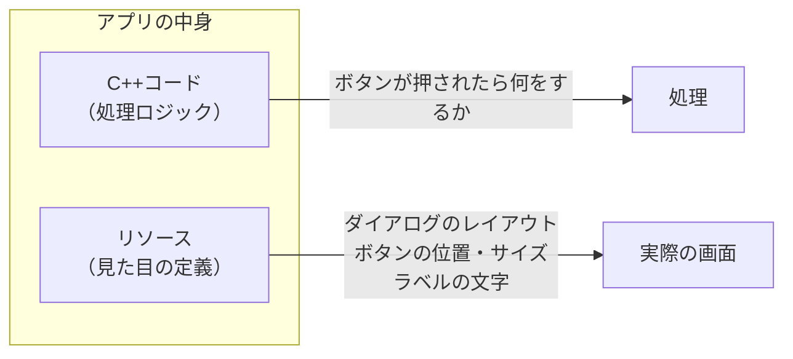
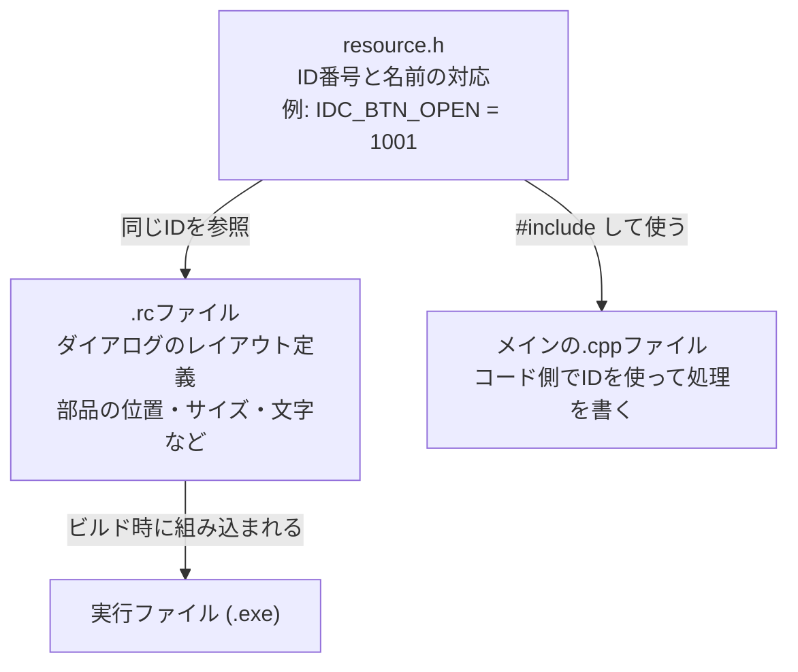
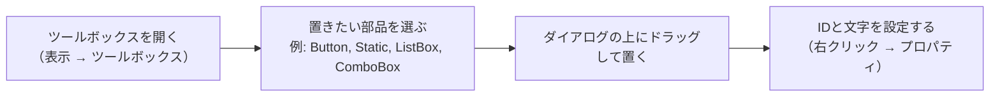
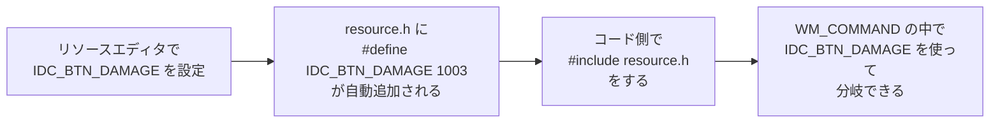
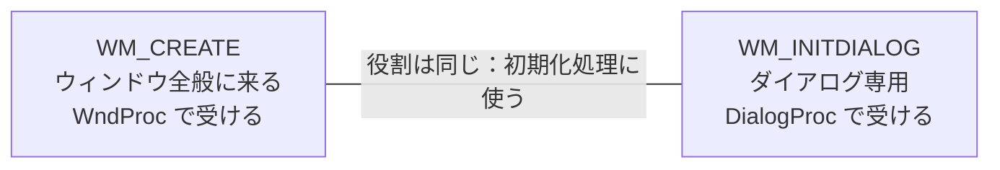

# Phase 3 実行手順書: GUI部品の配置

## 0. この文書の位置づけ

この文書は、`Windowsデスクトップアプリ開発 学習カリキュラム` の **Phase 3: GUI部品の配置** を実行するための詳細手順書です。

Phase 2 では、コードで `CreateWindow` を書いてボタンを置きました。
Phase 3 では、Visual Studio の **リソースエディタ** を使って、**画面部品をドラッグ&ドロップで配置する方法** を学びます。

---

## 1. このPhaseでやること

1. `.rc` ファイルと `resource.h` が何のためにあるかを理解する
2. リソースエディタでダイアログを作る
3. ダイアログにボタン・ラベル・リストボックス・コンボボックスを置く
4. コントロールIDをコードと結びつける

---

## 2. このPhaseのゴール

Phase 3 が終わったとき、次を言えることを目指します。

- `resource.h` はコントロールIDの番号と名前を対応させるファイル
- `.rc` ファイルはダイアログのレイアウトを定義するファイル
- リソースエディタで部品を配置すると、両方のファイルが自動で更新される
- コードの中でIDを使って、特定のコントロールにアクセスできる

---

## 3. 「リソース」とは何か

### 3.1 リソースの概念

Windowsアプリには、コードとは別に **「リソース」** というものがあります。

リソースとは、アプリの見た目に関する設定をまとめたものです。



### 3.2 リソースとして管理するもの

今回扱うのは次のものです。

| リソースの種類 | 意味 |
|---|---|
| ダイアログ (Dialog) | ボタンや入力欄をまとめた画面 |
| ボタン (Button) | クリックできる部品 |
| ラベル (Static) | 文字を表示するだけの部品 |
| リストボックス (ListBox) | 一覧を表示する部品 |
| コンボボックス (ComboBox) | プルダウンで選択する部品 |

---

## 4. ファイル構成の全体像

リソースエディタを使うと、次のファイルが作られます。



### 4.1 resource.h の中身（例）

```cpp
// resource.h
// リソースエディタが自動生成する。直接手書きしても良い。

#define IDD_MAIN_DIALOG    101   // ダイアログのID
#define IDC_LABEL_HP       1001  // 「HP」を表示するラベルのID
#define IDC_BTN_OPEN_MENU  1002  // 「メニューを開く」ボタンのID
#define IDC_BTN_DAMAGE     1003  // 「ダメージを与える」ボタンのID
#define IDC_COMBO_ITEMS    1004  // アイテム選択コンボボックスのID
#define IDC_BTN_ADD_ITEM   1005  // 「アイテム追加」ボタンのID
```

### 4.2 .rc ファイルの中身（例）

```rc
// リソースエディタが自動生成する。
// このファイルを直接読む必要はないが、構造を知っておくと助かる。

IDD_MAIN_DIALOG DIALOGEX 0, 0, 320, 200
CAPTION "バイオハザード風インベントリ"
BEGIN
    LTEXT    "HP: 100",  IDC_LABEL_HP,      10,  10, 100, 14
    PUSHBUTTON "メニューを開く", IDC_BTN_OPEN_MENU, 10,  30, 100, 24
    PUSHBUTTON "ダメージを与える", IDC_BTN_DAMAGE, 10,  60, 100, 24
    COMBOBOX IDC_COMBO_ITEMS, 10, 90, 120, 80, CBS_DROPDOWNLIST
    PUSHBUTTON "アイテム追加", IDC_BTN_ADD_ITEM, 140, 90, 80, 24
END
```

---

## 5. プロジェクト作成手順

### 5.1 プロジェクトの種類を選ぶ

1. Visual Studio 2022 を起動する
2. **新しいプロジェクトの作成** を押す
3. **Windows デスクトップ ウィザード** を選ぶ
4. プロジェクト名を `phase3_gui_parts` にする
5. 作成する
6. ウィザードが出たら **ダイアログ ベース** を選ぶ

ダイアログベースを選ぶと、最初から `.rc` と `resource.h` が入った状態で始まります。

---

## 6. リソースエディタの使い方

### 6.1 リソースエディタを開く

1. ソリューションエクスプローラーで `.rc` ファイルをダブルクリックする
2. リソースビューが開く
3. `Dialog` フォルダを展開する
4. ダイアログをダブルクリックすると、編集画面が開く

### 6.2 部品を配置する



### 6.3 各部品の配置方法

#### ボタン (Button)

1. ツールボックスから **Button** を選んでダイアログの上にドラッグ
2. 右クリック → **プロパティ**
3. `ID` を `IDC_BTN_OPEN_MENU` などに変更
4. `Caption`（文字）を「メニューを開く」などに変更

#### ラベル (Static Text)

1. ツールボックスから **Static Text** を選ぶ
2. 右クリック → **プロパティ**
3. `ID` を `IDC_LABEL_HP` などに変更
4. `Caption` を「HP: 100」などに変更

#### リストボックス (List Box)

1. ツールボックスから **List Box** を選ぶ
2. 右クリック → **プロパティ**
3. `ID` を `IDC_LIST_ITEMS` などに変更

#### コンボボックス (Combo Box)

1. ツールボックスから **Combo Box** を選ぶ
2. 右クリック → **プロパティ**
3. `ID` を `IDC_COMBO_ITEMS` などに変更
4. `Type` を `Drop List` に変更（値を選ぶだけにするため）

---

## 7. コントロールIDとコードの接続

### 7.1 IDの流れ



### 7.2 WM_COMMAND でのボタン処理

```cpp
#include "resource.h"

LRESULT CALLBACK WndProc(HWND hwnd, UINT msg, WPARAM wParam, LPARAM lParam)
{
    switch (msg)
    {
    case WM_COMMAND:
    {
        WORD id = LOWORD(wParam);

        switch (id)
        {
        case IDC_BTN_OPEN_MENU:
            MessageBox(hwnd, L"メニューを開きます", L"通知", MB_OK);
            break;

        case IDC_BTN_DAMAGE:
            MessageBox(hwnd, L"ダメージを与えます", L"通知", MB_OK);
            break;

        case IDC_BTN_ADD_ITEM:
            MessageBox(hwnd, L"アイテムを追加します", L"通知", MB_OK);
            break;
        }
        return 0;
    }

    case WM_DESTROY:
        PostQuitMessage(0);
        return 0;
    }

    return DefWindowProc(hwnd, msg, wParam, lParam);
}
```

---

## 8. コントロールを操作する関数

### 8.1 よく使う関数の一覧

| やりたいこと | 関数 | 例 |
|---|---|---|
| ラベルの文字を変える | `SetDlgItemText` | HP表示を更新する |
| コンボボックスに項目を追加 | `SendDlgItemMessage + CB_ADDSTRING` | アイテム名を追加する |
| コンボボックスで選ばれた項目を取得 | `SendDlgItemMessage + CB_GETCURSEL` | 何が選ばれているか取得 |
| リストボックスに項目を追加 | `SendDlgItemMessage + LB_ADDSTRING` | インベントリに追加 |
| リストボックスで選ばれた項目を取得 | `SendDlgItemMessage + LB_GETCURSEL` | 何が選ばれているか取得 |

### 8.2 ラベルの文字を変える

```cpp
// IDC_LABEL_HP のラベルの文字を変える
SetDlgItemText(hwnd, IDC_LABEL_HP, L"HP: 80");
```

`SetDlgItemText` は「このダイアログ(`hwnd`)の、このID(`IDC_LABEL_HP`)の部品の文字を変えて」という関数です。

### 8.3 コンボボックスに項目を追加する

```cpp
// IDC_COMBO_ITEMS に「グリーンハーブ」を追加する
SendDlgItemMessage(hwnd, IDC_COMBO_ITEMS, CB_ADDSTRING, 0, (LPARAM)L"グリーンハーブ");
SendDlgItemMessage(hwnd, IDC_COMBO_ITEMS, CB_ADDSTRING, 0, (LPARAM)L"応急スプレー");

// 最初の項目を選択状態にする
SendDlgItemMessage(hwnd, IDC_COMBO_ITEMS, CB_SETCURSEL, 0, 0);
```

### 8.4 コンボボックスで選ばれた項目を取得する

```cpp
// 選ばれているインデックス番号を取得する（0から始まる）
int selectedIndex = (int)SendDlgItemMessage(hwnd, IDC_COMBO_ITEMS, CB_GETCURSEL, 0, 0);

if (selectedIndex == CB_ERR)
{
    // 何も選ばれていない
    MessageBox(hwnd, L"アイテムを選んでください", L"確認", MB_OK);
}
else
{
    // selectedIndex 番目のアイテムが選ばれている
}
```

### 8.5 リストボックスに項目を追加する

```cpp
// IDC_LIST_ITEMS にアイテム名を追加する
SendDlgItemMessage(hwnd, IDC_LIST_ITEMS, LB_ADDSTRING, 0, (LPARAM)L"グリーンハーブ x1");
SendDlgItemMessage(hwnd, IDC_LIST_ITEMS, LB_ADDSTRING, 0, (LPARAM)L"応急スプレー x1");
```

### 8.6 リストボックスで選ばれた項目を取得する

```cpp
// 選ばれているインデックス番号を取得する
int selectedIndex = (int)SendDlgItemMessage(hwnd, IDC_LIST_ITEMS, LB_GETCURSEL, 0, 0);

if (selectedIndex == LB_ERR)
{
    MessageBox(hwnd, L"アイテムを選んでください", L"確認", MB_OK);
}
```

---

## 9. ダイアログプロシージャ（DialogProc）について

### 9.1 WndProc との違い

ダイアログを使う場合、`WndProc` の代わりに **`DialogProc`** を書くことがあります。

| 項目 | WndProc | DialogProc |
|---|---|---|
| 使う場所 | 通常のウィンドウ | ダイアログ |
| 戻り値 | `LRESULT` | `INT_PTR`（`BOOL` 相当） |
| 処理しなかったとき | `DefWindowProc` を呼ぶ | `FALSE` を返す |
| 呼び出す関数 | `CreateWindowEx` | `DialogBox` や `CreateDialog` |

### 9.2 DialogProc の基本形

```cpp
INT_PTR CALLBACK DialogProc(HWND hwndDlg, UINT msg, WPARAM wParam, LPARAM lParam)
{
    switch (msg)
    {
    case WM_INITDIALOG:
        // ダイアログが初期化されるとき（WM_CREATE の代わり）
        // コンボボックスやリストボックスに初期データを入れるのはここ
        return TRUE;

    case WM_COMMAND:
    {
        WORD id = LOWORD(wParam);

        switch (id)
        {
        case IDC_BTN_OPEN_MENU:
            // メニューを開く処理
            return TRUE;

        case IDCANCEL:
            // ×ボタン or キャンセルが押された
            EndDialog(hwndDlg, 0);
            return TRUE;
        }
        return FALSE;
    }
    }

    return FALSE;
}
```

### 9.3 WM_INITDIALOG と WM_CREATE の違い



ダイアログを使う場合は `WM_INITDIALOG` が来ます。
ウィンドウを使う場合は `WM_CREATE` が来ます。
役割はどちらも同じで、**「部品の初期設定をする場所」** です。

---

## 10. 画面構成の確認課題（実習）

### 10.1 作る画面

次の画面を作ってください。

```
+------------------------------------------+
|  Phase 3 練習画面                   [×] |
+------------------------------------------+
|                                           |
|  HP: 100                                  |
|                                           |
|  [メニューを開く]  [ダメージを与える]    |
|                                           |
|  アイテム: [グリーンハーブ    ▼]         |
|            [アイテムを追加する]           |
|                                           |
+------------------------------------------+
```

### 10.2 実習の手順

1. プロジェクトを作る（ダイアログベース）
2. リソースエディタで上の画面を組む
3. 各部品にIDを設定する（以下を参考）

| 部品 | ID | 表示文字 |
|---|---|---|
| ラベル | `IDC_LABEL_HP` | `HP: 100` |
| ボタン | `IDC_BTN_OPEN_MENU` | `メニューを開く` |
| ボタン | `IDC_BTN_DAMAGE` | `ダメージを与える` |
| コンボボックス | `IDC_COMBO_ITEMS` | （空） |
| ボタン | `IDC_BTN_ADD_ITEM` | `アイテムを追加する` |

4. コードに次を書く
   - `WM_INITDIALOG` でコンボボックスに「グリーンハーブ」「応急スプレー」を追加
   - `IDC_BTN_DAMAGE` が押されたら `SetDlgItemText` で HP を 80 に更新
   - `IDC_BTN_ADD_ITEM` が押されたら選択中のアイテムを `MessageBox` で表示

---

## 11. よくある詰まりポイント

### 11.1 コンボボックスが選択できない

`Type` プロパティが `Simple` になっていることがあります。
`Drop List` に変えると、一覧から選ぶだけの動作になります。

### 11.2 SetDlgItemText で文字が変わらない

ハンドルやIDが間違っている可能性があります。
`hwndDlg` と `hwnd` の混同に注意します。

### 11.3 resource.h が更新されない

保存してからビルドすると更新されます。
リソースエディタを開いたまま保存を忘れると反映されません。

---

## 12. Phase 3 の完了条件

次を満たしたら完了です。

- リソースエディタで画面を作れる
- ボタン、ラベル、リストボックス、コンボボックスを配置できる
- `resource.h` を見てどのIDが何の部品かわかる
- `WM_COMMAND` または `WM_INITDIALOG` でコントロールを操作できる

---

## 13. 次のPhaseへの接続

Phase 3 が終わったら、**Phase 4: 純C++ロジック** に進みます。

Phase 4 では、いったんGUIから離れて、
`Player`, `Item`, `Inventory` といったゲームのロジック部分を **コンソールアプリで** 作ります。

| Phase 3 | Phase 4 |
|---|---|
| 画面の見た目を作る | 中身のロジックを作る |
| リソースエディタ | C++クラス設計 |
| GUI部品の操作 | `vector`, `unique_ptr` |

Phase 4 でロジックが完成したら、Phase 5 でGUIと接続します。
これが「GUIとロジックの分離」の核心です。
