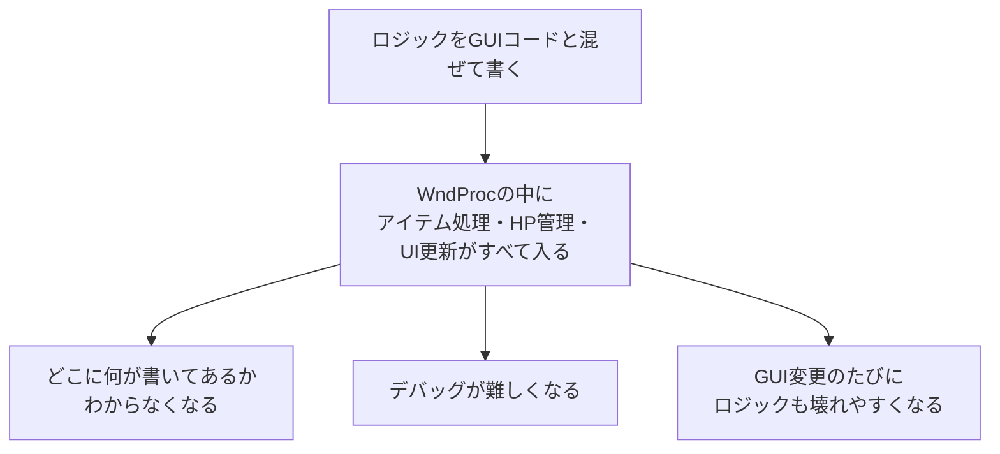
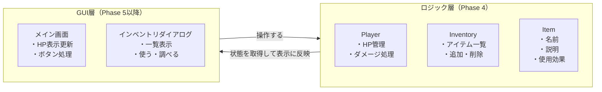
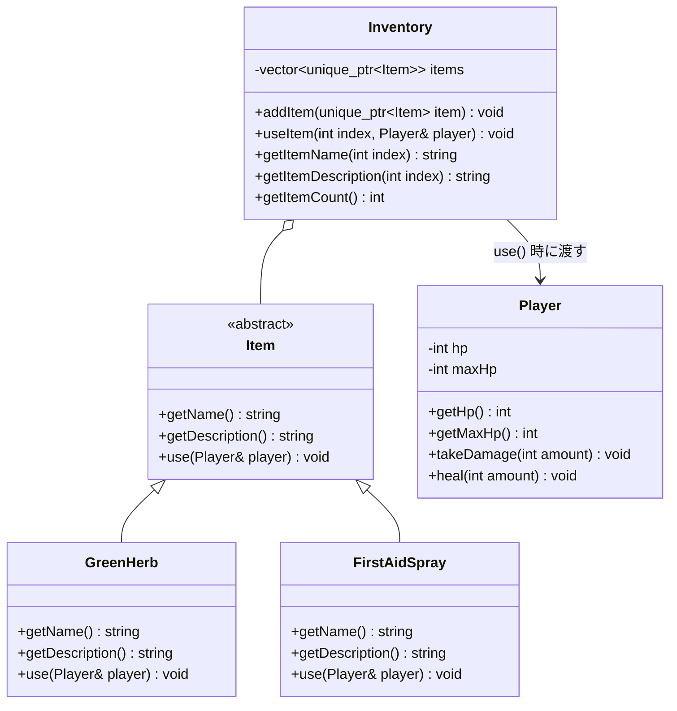
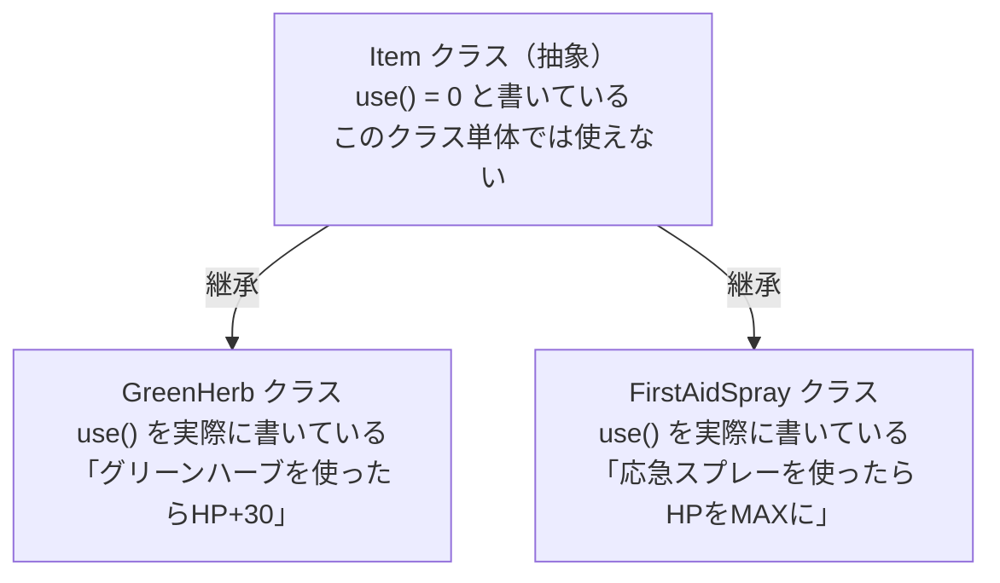
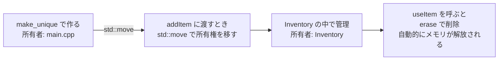

# Phase 4 実行手順書: 純C++ロジック

## 0. この文書の位置づけ

この文書は、`Windowsデスクトップアプリ開発 学習カリキュラム` の **Phase 4: 純C++ロジック** を実行するための詳細手順書です。

Phase 3 まではGUIの話が中心でした。
Phase 4 では、いったんGUIから完全に離れます。

**このPhaseでやることは、ゲームの中身（ロジック）をC++で作ること** です。
コンソールアプリとして作り、GUIとは切り離して動作確認します。

---

## 1. このPhaseでやること

1. `Item` クラス（アイテムの基底クラス）を作る
2. `GreenHerb`（グリーンハーブ）など具体的なアイテムを作る
3. `Player` クラス（HPを持つプレイヤー）を作る
4. `Inventory` クラス（アイテム一覧を管理する）を作る
5. コンソールで、アイテム追加・使用・削除が動くことを確認する

---

## 2. このPhaseのゴール

Phase 4 が終わったとき、次ができる状態を目指します。

- アイテムを追加できる
- アイテムを使うと効果が発動する（HP回復など）
- 使用後にアイテムが消える
- アイテムの説明を取得できる
- HPにダメージを与えられる

---

## 3. なぜGUIなしで作るのか

### 3.1 ロジックとGUIを混ぜると何が起きるか



### 3.2 分離するとどうなるか



GUIはロジックを「呼ぶ側」に徹します。
ロジックはGUIの存在を知らなくてよいです。

---

## 4. クラス設計の全体図



---

## 5. プロジェクト作成

1. Visual Studio 2022 を起動する
2. **新しいプロジェクトの作成** を押す
3. **コンソール アプリ** を選ぶ
4. プロジェクト名を `phase4_cpp_logic` にする
5. 作成する

このPhaseでは `windows.h` を使いません。
純粋なC++の機能だけで書きます。

---

## 6. Item クラスを作る

### 6.1 Item.h

プロジェクトに新しいヘッダファイルを追加します。
ファイル名は `Item.h` にします。

```cpp
// Item.h
#pragma once

#include <string>

// Item は抽象基底クラス
// 具体的なアイテム（グリーンハーブなど）は、このクラスを継承して作る
class Player;  // 前方宣言（Playerクラスの詳細はPlayer.hで定義）

class Item
{
public:
    // デストラクタは仮想関数にする（継承するクラスを正しく破棄するため）
    virtual ~Item() = default;

    // アイテムの名前を返す（継承先で必ず実装する）
    virtual std::wstring getName() const = 0;

    // アイテムの説明を返す（継承先で必ず実装する）
    virtual std::wstring getDescription() const = 0;

    // アイテムを使う（継承先で必ず実装する）
    // Playerに対して効果を与える
    virtual void use(Player& player) = 0;
};
```

### 6.2 `= 0` の意味

`= 0` がついている関数は **純粋仮想関数** と言います。
「このクラスを継承するクラスは、この関数を必ず書いてください」という意味です。



---

## 7. Player クラスを作る

### 7.1 Player.h

```cpp
// Player.h
#pragma once

class Player
{
public:
    Player();

    // HPを取得する
    int getHp() const;

    // 最大HPを取得する
    int getMaxHp() const;

    // ダメージを受ける
    void takeDamage(int amount);

    // HP回復する
    void heal(int amount);

    // 死亡しているか
    bool isDead() const;

private:
    int m_hp;
    int m_maxHp;
};
```

### 7.2 Player.cpp

```cpp
// Player.cpp
#include "Player.h"
#include <algorithm>  // std::min, std::max を使うため

Player::Player()
    : m_hp(100)
    , m_maxHp(100)
{
}

int Player::getHp() const
{
    return m_hp;
}

int Player::getMaxHp() const
{
    return m_maxHp;
}

void Player::takeDamage(int amount)
{
    m_hp -= amount;
    // HP が 0 を下回らないようにする
    if (m_hp < 0)
    {
        m_hp = 0;
    }
}

void Player::heal(int amount)
{
    m_hp += amount;
    // HP が最大値を超えないようにする
    if (m_hp > m_maxHp)
    {
        m_hp = m_maxHp;
    }
}

bool Player::isDead() const
{
    return m_hp <= 0;
}
```

---

## 8. 具体的なアイテムを作る

### 8.1 GreenHerb.h

```cpp
// GreenHerb.h
#pragma once

#include "Item.h"

class GreenHerb : public Item
{
public:
    std::wstring getName() const override;
    std::wstring getDescription() const override;
    void use(Player& player) override;
};
```

### 8.2 GreenHerb.cpp

```cpp
// GreenHerb.cpp
#include "GreenHerb.h"
#include "Player.h"

std::wstring GreenHerb::getName() const
{
    return L"グリーンハーブ";
}

std::wstring GreenHerb::getDescription() const
{
    return L"緑色のハーブ。使用するとHPが30回復する。";
}

void GreenHerb::use(Player& player)
{
    player.heal(30);
}
```

### 8.3 FirstAidSpray.h

```cpp
// FirstAidSpray.h
#pragma once

#include "Item.h"

class FirstAidSpray : public Item
{
public:
    std::wstring getName() const override;
    std::wstring getDescription() const override;
    void use(Player& player) override;
};
```

### 8.4 FirstAidSpray.cpp

```cpp
// FirstAidSpray.cpp
#include "FirstAidSpray.h"
#include "Player.h"

std::wstring FirstAidSpray::getName() const
{
    return L"応急スプレー";
}

std::wstring FirstAidSpray::getDescription() const
{
    return L"応急処置用スプレー。使用するとHPが全回復する。";
}

void FirstAidSpray::use(Player& player)
{
    player.heal(player.getMaxHp());  // 最大HPまで回復
}
```

---

## 9. Inventory クラスを作る

### 9.1 Inventory.h

```cpp
// Inventory.h
#pragma once

#include <vector>
#include <memory>
#include <string>

class Item;
class Player;

class Inventory
{
public:
    // アイテムを追加する
    // unique_ptr で所有権をInventoryに渡す
    void addItem(std::unique_ptr<Item> item);

    // 指定インデックスのアイテムを使う
    // 使用後、そのアイテムをインベントリから削除する
    void useItem(int index, Player& player);

    // 指定インデックスのアイテムの名前を返す
    std::wstring getItemName(int index) const;

    // 指定インデックスのアイテムの説明を返す
    std::wstring getItemDescription(int index) const;

    // アイテムの個数を返す
    int getItemCount() const;

    // 指定インデックスが範囲内かチェックする
    bool isValidIndex(int index) const;

private:
    std::vector<std::unique_ptr<Item>> m_items;
};
```

### 9.2 Inventory.cpp

```cpp
// Inventory.cpp
#include "Inventory.h"
#include "Item.h"
#include "Player.h"

void Inventory::addItem(std::unique_ptr<Item> item)
{
    m_items.push_back(std::move(item));
}

void Inventory::useItem(int index, Player& player)
{
    if (!isValidIndex(index))
    {
        return;
    }

    // アイテムを使う
    m_items[index]->use(player);

    // 使用後、インベントリから削除する
    m_items.erase(m_items.begin() + index);
}

std::wstring Inventory::getItemName(int index) const
{
    if (!isValidIndex(index))
    {
        return L"";
    }
    return m_items[index]->getName();
}

std::wstring Inventory::getItemDescription(int index) const
{
    if (!isValidIndex(index))
    {
        return L"";
    }
    return m_items[index]->getDescription();
}

int Inventory::getItemCount() const
{
    return static_cast<int>(m_items.size());
}

bool Inventory::isValidIndex(int index) const
{
    return index >= 0 && index < static_cast<int>(m_items.size());
}
```

### 9.3 `unique_ptr` と `move` について



`unique_ptr` は「所有者が1人だけ」のポインタです。
`std::move` を使うことで、所有権を `Inventory` に渡します。
`erase` すると、`unique_ptr` が自動的にメモリを解放します。

---

## 10. main.cpp でコンソールテストをする

```cpp
// main.cpp
#include <iostream>
#include <memory>
#include "Player.h"
#include "Inventory.h"
#include "GreenHerb.h"
#include "FirstAidSpray.h"

int main()
{
    // プレイヤーを作る
    Player player;
    std::wcout << L"初期HP: " << player.getHp() << L"\n";

    // インベントリを作る
    Inventory inventory;

    // アイテムを追加する
    inventory.addItem(std::make_unique<GreenHerb>());
    inventory.addItem(std::make_unique<FirstAidSpray>());
    inventory.addItem(std::make_unique<GreenHerb>());

    std::wcout << L"アイテム数: " << inventory.getItemCount() << L"\n";

    // アイテム一覧を表示する
    std::wcout << L"--- インベントリ ---\n";
    for (int i = 0; i < inventory.getItemCount(); ++i)
    {
        std::wcout << i << L": " << inventory.getItemName(i) << L"\n";
    }

    // ダメージを与える
    player.takeDamage(50);
    std::wcout << L"ダメージ後HP: " << player.getHp() << L"\n";

    // 0番のアイテム（グリーンハーブ）を使う
    std::wcout << L"0番のアイテムを使います: " << inventory.getItemName(0) << L"\n";
    inventory.useItem(0, player);
    std::wcout << L"使用後HP: " << player.getHp() << L"\n";
    std::wcout << L"使用後アイテム数: " << inventory.getItemCount() << L"\n";

    // 使用後のアイテム一覧を表示する
    std::wcout << L"--- 使用後のインベントリ ---\n";
    for (int i = 0; i < inventory.getItemCount(); ++i)
    {
        std::wcout << i << L": " << inventory.getItemName(i) << L"\n";
    }

    // 0番のアイテム（応急スプレー）を使う
    std::wcout << L"0番のアイテムを使います: " << inventory.getItemName(0) << L"\n";
    std::wcout << L"説明: " << inventory.getItemDescription(0) << L"\n";
    inventory.useItem(0, player);
    std::wcout << L"使用後HP: " << player.getHp() << L"\n";

    return 0;
}
```

### 10.1 期待される出力

```
初期HP: 100
アイテム数: 3
--- インベントリ ---
0: グリーンハーブ
1: 応急スプレー
2: グリーンハーブ
ダメージ後HP: 50
0番のアイテムを使います: グリーンハーブ
使用後HP: 80
使用後アイテム数: 2
--- 使用後のインベントリ ---
0: 応急スプレー
1: グリーンハーブ
0番のアイテムを使います: 応急スプレー
説明: 応急処置用スプレー。使用するとHPが全回復する。
使用後HP: 100
```

---

## 11. ファイル構成まとめ

```
phase4_cpp_logic/
├── main.cpp          ... テスト用エントリポイント
├── Item.h            ... アイテムの基底クラス（抽象）
├── Player.h          ... プレイヤークラスの宣言
├── Player.cpp        ... プレイヤークラスの実装
├── Inventory.h       ... インベントリクラスの宣言
├── Inventory.cpp     ... インベントリクラスの実装
├── GreenHerb.h       ... グリーンハーブの宣言
├── GreenHerb.cpp     ... グリーンハーブの実装
├── FirstAidSpray.h   ... 応急スプレーの宣言
└── FirstAidSpray.cpp ... 応急スプレーの実装
```

---

## 12. Phase 4 の確認課題

次の問いに答えられるか確認します。

1. `Item` が抽象クラスである理由は何か
2. `virtual ~Item() = default;` が必要な理由は何か
3. `unique_ptr` を使う理由は何か
4. `std::move` を書かないとどうなるか
5. アイテムを使用後に `erase` で削除するとき、後のインデックスはどうずれるか
6. `isValidIndex` で範囲チェックをしているのはなぜか

---

## 13. Phase 4 の完了条件

次を満たしたら完了です。

- コンソールアプリとしてビルドできる
- アイテムを追加できる
- アイテムを使うと HP が変化する
- 使用後にアイテムがインベントリから消える
- アイテムの説明を取得できる
- HP にダメージを与えられる

---

## 14. 次のPhaseへの接続

Phase 4 が終わったら、**Phase 5: メイン画面作成** に進みます。

Phase 5 では、このPhaseで作った `Player`, `Inventory`, `Item` を、GUI側と接続します。

| Phase 4 で作ったもの | Phase 5 での使われ方 |
|---|---|
| `Player::takeDamage` | 「ダメージを与える」ボタンを押したときに呼ぶ |
| `Inventory::addItem` | 「アイテム追加」ボタンを押したときに呼ぶ |
| `Player::getHp` | HPラベルを更新するときに呼ぶ |

GUIはロジックを「呼ぶだけ」です。
ロジック側はGUIのことを知らなくて大丈夫です。
