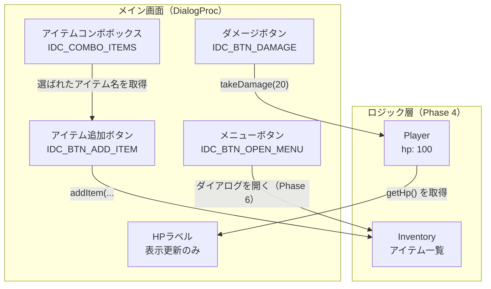
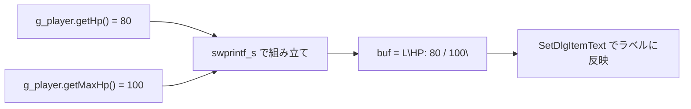
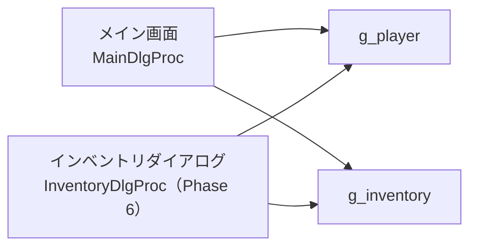

# Phase 5 実行手順書: メイン画面作成

## 0. この文書の位置づけ

この文書は、`Windowsデスクトップアプリ開発 学習カリキュラム` の **Phase 5: メイン画面作成** を実行するための詳細手順書です。

Phase 4 で作ったロジック（`Player`, `Inventory`, `Item`）を、いよいよ GUI と接続します。

---

## 1. このPhaseでやること

1. Phase 4 のロジックファイルをこのプロジェクトに組み込む
2. リソースエディタでメイン画面のダイアログを作る
3. HP表示ラベルを `Player::getHp()` で更新する
4. 「ダメージを与える」ボタンで `Player::takeDamage` を呼ぶ
5. コンボボックスからアイテムを選んで `Inventory::addItem` を呼ぶ
6. 「メニューを開く」ボタンを配置する（中身は Phase 6 で実装）

---

## 2. このPhaseのゴール

- ボタンを押すと HP が変化する
- ラベルに最新の HP が表示される
- コンボボックスからアイテムを選んで追加できる

---

## 3. 全体のデータの流れ



---

## 4. プロジェクト作成

### 4.1 プロジェクト作成手順

1. Visual Studio 2022 を起動する
2. **新しいプロジェクトの作成** → **Windows デスクトップ ウィザード**
3. プロジェクト名を `phase5_main_screen` にする
4. **ダイアログ ベース** を選んで作成

### 4.2 Phase 4 のファイルを追加する

Phase 4 で作ったファイルをこのプロジェクトにコピーします。

- `Item.h`
- `Player.h` / `Player.cpp`
- `Inventory.h` / `Inventory.cpp`
- `GreenHerb.h` / `GreenHerb.cpp`
- `FirstAidSpray.h` / `FirstAidSpray.cpp`

ソリューションエクスプローラーで右クリック → **追加 → 既存の項目** でプロジェクトに含めます。

---

## 5. リソースエディタでメイン画面を作る

### 5.1 配置する部品とID

| 部品の種類 | ID | 表示文字 |
|---|---|---|
| Static (ラベル) | `IDC_LABEL_HP` | `HP: 100` |
| Button | `IDC_BTN_OPEN_MENU` | `メニューを開く` |
| Button | `IDC_BTN_DAMAGE` | `ダメージを与える` |
| Combo Box | `IDC_COMBO_ITEMS` | （空） |
| Button | `IDC_BTN_ADD_ITEM` | `アイテムを追加する` |

### 5.2 画面レイアウトのイメージ

```
+----------------------------------------------+
|  バイオハザード風インベントリ           [×] |
+----------------------------------------------+
|                                               |
|  HP: 100                                      |
|                                               |
|  [メニューを開く]    [ダメージを与える]       |
|                                               |
|  アイテム: [グリーンハーブ          ▼]       |
|            [アイテムを追加する]               |
|                                               |
+----------------------------------------------+
```

---

## 6. resource.h の確認

リソースエディタで保存すると、`resource.h` に次のような内容が追加されます。

```cpp
// resource.h（一部）
#define IDD_MAIN_DIALOG    102
#define IDC_LABEL_HP       1001
#define IDC_BTN_OPEN_MENU  1002
#define IDC_BTN_DAMAGE     1003
#define IDC_COMBO_ITEMS    1004
#define IDC_BTN_ADD_ITEM   1005
```

コードの中で `#include "resource.h"` するだけで、これらのIDが使えるようになります。

---

## 7. DialogProc を書く

### 7.1 全体構造

メイン画面の処理は、すべて `DialogProc` の中に書きます。
ただし、実際のゲームロジックは `Player` や `Inventory` に任せます。

```cpp
// phase5_main_screen.cpp（メインのソースファイル）
#include <windows.h>
#include "resource.h"
#include "Player.h"
#include "Inventory.h"
#include "GreenHerb.h"
#include "FirstAidSpray.h"

// グローバル変数として Player と Inventory を持つ
// (※ Phase 6 で Inventory はダイアログとも共有するため)
static Player  g_player;
static Inventory g_inventory;

// HPラベルを最新のHP値で更新するヘルパー関数
static void UpdateHpLabel(HWND hwndDlg)
{
    // L"HP: " + HP数値の文字列を組み立てる
    wchar_t buf[64];
    swprintf_s(buf, L"HP: %d / %d", g_player.getHp(), g_player.getMaxHp());
    SetDlgItemText(hwndDlg, IDC_LABEL_HP, buf);
}

// メインダイアログのプロシージャ
INT_PTR CALLBACK MainDlgProc(HWND hwndDlg, UINT msg, WPARAM wParam, LPARAM lParam)
{
    switch (msg)
    {
    case WM_INITDIALOG:
    {
        // コンボボックスにアイテム名を追加する
        SendDlgItemMessage(hwndDlg, IDC_COMBO_ITEMS, CB_ADDSTRING, 0,
            (LPARAM)L"グリーンハーブ");
        SendDlgItemMessage(hwndDlg, IDC_COMBO_ITEMS, CB_ADDSTRING, 0,
            (LPARAM)L"応急スプレー");

        // 最初の項目を選択状態にする
        SendDlgItemMessage(hwndDlg, IDC_COMBO_ITEMS, CB_SETCURSEL, 0, 0);

        // HPラベルを初期化する
        UpdateHpLabel(hwndDlg);

        return TRUE;
    }

    case WM_COMMAND:
    {
        WORD id = LOWORD(wParam);

        switch (id)
        {
        case IDC_BTN_DAMAGE:
        {
            // ダメージを与える
            g_player.takeDamage(20);

            // HPラベルを更新する
            UpdateHpLabel(hwndDlg);

            if (g_player.isDead())
            {
                MessageBox(hwndDlg, L"プレイヤーが倒れました", L"ゲームオーバー", MB_OK);
            }
            return TRUE;
        }

        case IDC_BTN_ADD_ITEM:
        {
            // コンボボックスで選ばれているインデックスを取得する
            int selected = (int)SendDlgItemMessage(
                hwndDlg, IDC_COMBO_ITEMS, CB_GETCURSEL, 0, 0);

            if (selected == CB_ERR)
            {
                MessageBox(hwndDlg, L"アイテムを選んでください", L"確認", MB_OK);
                return TRUE;
            }

            // 選ばれたインデックスに応じてアイテムを追加する
            if (selected == 0)
            {
                g_inventory.addItem(std::make_unique<GreenHerb>());
            }
            else if (selected == 1)
            {
                g_inventory.addItem(std::make_unique<FirstAidSpray>());
            }

            MessageBox(hwndDlg, L"アイテムを追加しました", L"通知", MB_OK);
            return TRUE;
        }

        case IDC_BTN_OPEN_MENU:
        {
            // Phase 6 でインベントリダイアログを開く実装をする
            MessageBox(hwndDlg, L"（Phase 6 で実装します）", L"メニュー", MB_OK);
            return TRUE;
        }

        case IDCANCEL:
            EndDialog(hwndDlg, 0);
            return TRUE;
        }
        return FALSE;
    }
    }

    return FALSE;
}

// エントリポイント
int WINAPI WinMain(
    HINSTANCE hInstance,
    HINSTANCE hPrevInstance,
    LPSTR     lpCmdLine,
    int       nCmdShow)
{
    // メインダイアログを表示する
    DialogBox(hInstance, MAKEINTRESOURCE(IDD_MAIN_DIALOG), nullptr, MainDlgProc);
    return 0;
}
```

---

## 8. コードの重要なポイント解説

### 8.1 `swprintf_s` で文字列を組み立てる

```cpp
wchar_t buf[64];
swprintf_s(buf, L"HP: %d / %d", g_player.getHp(), g_player.getMaxHp());
SetDlgItemText(hwndDlg, IDC_LABEL_HP, buf);
```

`swprintf_s` は `printf` のワイド文字版です。
`%d` に数値を埋め込んだ文字列を作ります。



### 8.2 グローバル変数について

今回、`g_player` と `g_inventory` をグローバル変数として置いています。

```cpp
static Player    g_player;
static Inventory g_inventory;
```

理由は、メイン画面（Phase 5）とインベントリダイアログ（Phase 6）の両方から同じオブジェクトにアクセスする必要があるからです。



---

## 9. 動作確認

ビルドして実行し、次を確認します。

- ウィンドウが表示される
- HPラベルに「HP: 100 / 100」と表示される
- 「ダメージを与える」を押すと HP が 80 → 60 → ... と減る
- コンボボックスからアイテムを選んで「アイテムを追加する」を押すと追加メッセージが出る
- 「メニューを開く」を押すと「Phase 6 で実装します」と出る

---

## 10. よくある詰まりポイント

### 10.1 HPラベルが更新されない

`UpdateHpLabel` を `takeDamage` の後に呼んでいるか確認します。

### 10.2 コンボボックスに何も表示されない

`WM_INITDIALOG` の中で `CB_ADDSTRING` を送っているか確認します。
`WM_COMMAND` の中で送っても最初から選べません。

### 10.3 `make_unique` が使えない

`#include <memory>` を忘れていないか確認します。
また、C++14 以降が必要です。Visual Studio 2022 ではデフォルトで使えます。

---

## 11. Phase 5 の完了条件

- ダイアログが表示される
- HP表示が変化する
- アイテムを追加できる（メッセージ確認レベルで可）
- 「メニューを開く」ボタンが押せる

---

## 12. 次のPhaseへの接続

Phase 5 が終わったら、**Phase 6: インベントリダイアログ** に進みます。

Phase 6 では、「メニューを開く」ボタンで別のダイアログを開き、インベントリ一覧の表示・アイテムの使用・説明表示を実装します。
