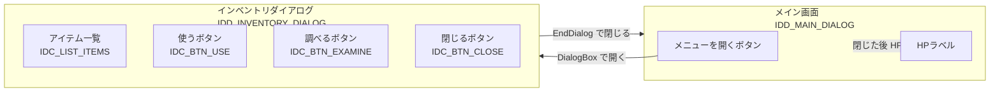
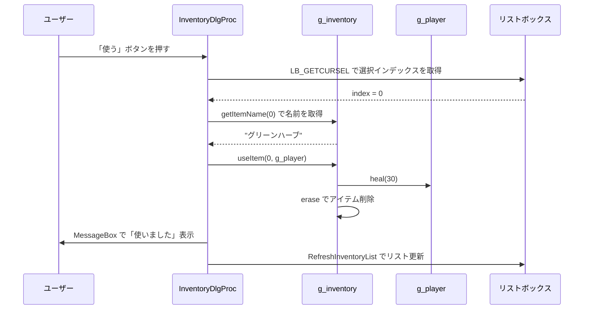
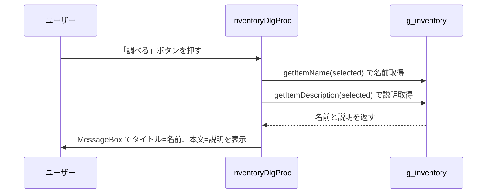
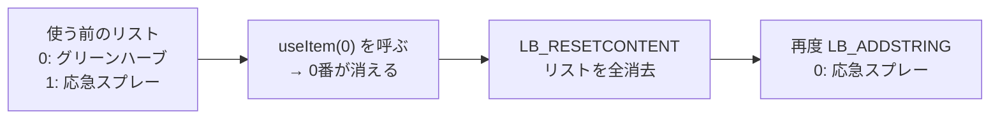
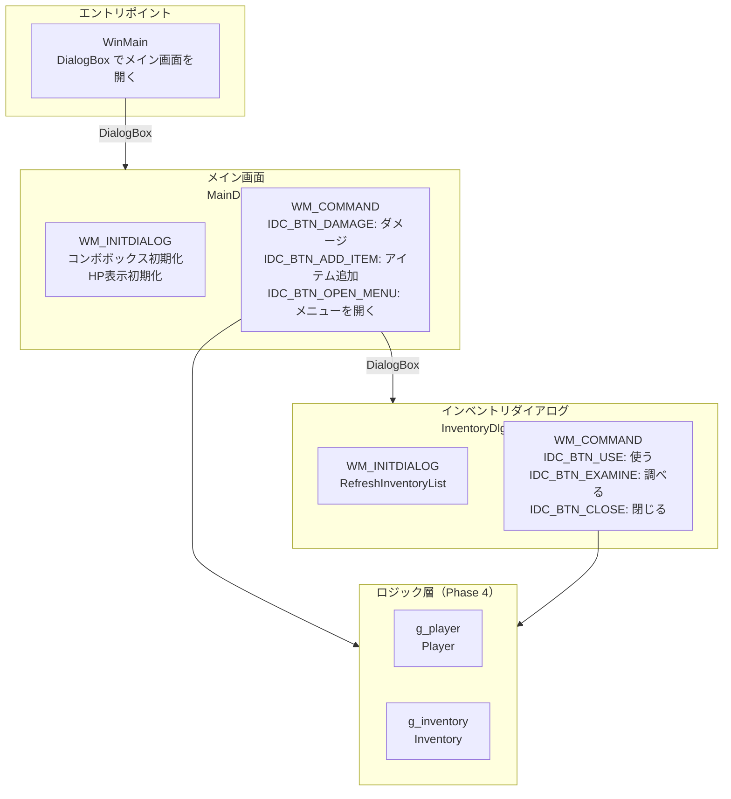

# Phase 6 実行手順書: インベントリダイアログ

## 0. この文書の位置づけ

この文書は、`Windowsデスクトップアプリ開発 学習カリキュラム` の **Phase 6: インベントリダイアログ** を実行するための詳細手順書です。

Phase 5 で「メニューを開く」ボタンを置いたので、
Phase 6 では **そのボタンを押したときに開くインベントリダイアログ** を実装します。

---

## 1. このPhaseでやること

1. インベントリダイアログのリソースをリソースエディタで作る
2. 「メニューを開く」ボタンでダイアログを開く処理を書く
3. ダイアログを開いたとき、インベントリの一覧をリストボックスに表示する
4. 「使う」ボタンで選択中のアイテムを使い、リストから消す
5. 「調べる」ボタンで選択中のアイテムの説明を表示する
6. ダイアログを閉じたらメイン画面の HP を更新する

---

## 2. このPhaseのゴール

- インベントリダイアログが開く
- アイテム一覧が表示される
- アイテムを使うと効果が発動し、一覧から消える
- アイテムを調べると説明が表示される
- ダイアログを閉じると HP ラベルが更新される

---

## 3. 2つのダイアログの関係



---

## 4. インベントリダイアログのリソースを作る

### 4.1 新しいダイアログを追加する

1. ソリューションエクスプローラーで `.rc` ファイルを右クリック
2. **追加 → リソース** を選ぶ
3. **Dialog** を選んで **新規** を押す
4. 新しいダイアログが作られる
5. ダイアログ自体を右クリック → **プロパティ** で `ID` を `IDD_INVENTORY_DIALOG` に変更

### 4.2 配置する部品とID

| 部品の種類 | ID | 表示文字 |
|---|---|---|
| List Box | `IDC_LIST_ITEMS` | （空） |
| Button | `IDC_BTN_USE` | `使う` |
| Button | `IDC_BTN_EXAMINE` | `調べる` |
| Button | `IDC_BTN_CLOSE` | `閉じる` |

### 4.3 画面レイアウトのイメージ

```
+------------------------------------------+
|  インベントリ                       [×] |
+------------------------------------------+
|                                           |
|  +----------------------------------+     |
|  | グリーンハーブ                   |     |
|  | 応急スプレー                     |     |
|  | グリーンハーブ                   |     |
|  |                                  |     |
|  +----------------------------------+     |
|                                           |
|  [使う]  [調べる]             [閉じる]   |
|                                           |
+------------------------------------------+
```

---

## 5. resource.h を確認する

リソースエディタで保存後、`resource.h` に次が追加されます。

```cpp
#define IDD_INVENTORY_DIALOG  103
#define IDC_LIST_ITEMS        1010
#define IDC_BTN_USE           1011
#define IDC_BTN_EXAMINE       1012
#define IDC_BTN_CLOSE         1013
```

---

## 6. インベントリダイアログのプロシージャを書く

### 6.1 InventoryDlgProc の全体

```cpp
// InventoryDlgProc
// g_player と g_inventory は phase5_main_screen.cpp のグローバル変数を参照する
extern Player    g_player;
extern Inventory g_inventory;

// リストボックスをインベントリの内容で更新するヘルパー関数
static void RefreshInventoryList(HWND hwndDlg)
{
    // リストボックスの内容をいったんすべて消す
    SendDlgItemMessage(hwndDlg, IDC_LIST_ITEMS, LB_RESETCONTENT, 0, 0);

    // インベントリの全アイテムをリストに追加する
    for (int i = 0; i < g_inventory.getItemCount(); ++i)
    {
        std::wstring name = g_inventory.getItemName(i);
        SendDlgItemMessage(hwndDlg, IDC_LIST_ITEMS, LB_ADDSTRING, 0,
            (LPARAM)name.c_str());
    }
}

INT_PTR CALLBACK InventoryDlgProc(HWND hwndDlg, UINT msg, WPARAM wParam, LPARAM lParam)
{
    switch (msg)
    {
    case WM_INITDIALOG:
    {
        // ダイアログを開いた直後にアイテム一覧を表示する
        RefreshInventoryList(hwndDlg);
        return TRUE;
    }

    case WM_COMMAND:
    {
        WORD id = LOWORD(wParam);

        switch (id)
        {
        case IDC_BTN_USE:
        {
            // 選択中のアイテムのインデックスを取得する
            int selected = (int)SendDlgItemMessage(
                hwndDlg, IDC_LIST_ITEMS, LB_GETCURSEL, 0, 0);

            if (selected == LB_ERR)
            {
                MessageBox(hwndDlg, L"アイテムを選んでください", L"確認", MB_OK);
                return TRUE;
            }

            // アイテムを使う（g_player に効果を与え、インベントリから削除）
            std::wstring itemName = g_inventory.getItemName(selected);
            g_inventory.useItem(selected, g_player);

            // 使用メッセージを表示する
            std::wstring msg = itemName + L" を使いました。";
            MessageBox(hwndDlg, msg.c_str(), L"使用", MB_OK);

            // リストを更新する（アイテムが消えた状態に）
            RefreshInventoryList(hwndDlg);
            return TRUE;
        }

        case IDC_BTN_EXAMINE:
        {
            // 選択中のアイテムのインデックスを取得する
            int selected = (int)SendDlgItemMessage(
                hwndDlg, IDC_LIST_ITEMS, LB_GETCURSEL, 0, 0);

            if (selected == LB_ERR)
            {
                MessageBox(hwndDlg, L"アイテムを選んでください", L"確認", MB_OK);
                return TRUE;
            }

            // アイテムの説明を表示する
            std::wstring name = g_inventory.getItemName(selected);
            std::wstring desc = g_inventory.getItemDescription(selected);
            MessageBox(hwndDlg, desc.c_str(), name.c_str(), MB_OK);
            return TRUE;
        }

        case IDC_BTN_CLOSE:
        case IDCANCEL:
        {
            // ダイアログを閉じる
            EndDialog(hwndDlg, 0);
            return TRUE;
        }
        }
        return FALSE;
    }
    }

    return FALSE;
}
```

---

## 7. メイン画面からダイアログを開く

Phase 5 で「（Phase 6 で実装します）」と書いておいた箇所を修正します。

```cpp
case IDC_BTN_OPEN_MENU:
{
    // インベントリダイアログを開く
    // DialogBox は閉じるまでブロックする（モーダルダイアログ）
    DialogBox(
        GetModuleHandle(nullptr),
        MAKEINTRESOURCE(IDD_INVENTORY_DIALOG),
        hwndDlg,
        InventoryDlgProc
    );

    // ダイアログが閉じた後、HPラベルを更新する
    // （アイテムを使ってHPが変わっている可能性があるため）
    UpdateHpLabel(hwndDlg);
    return TRUE;
}
```

---

## 8. 処理の全体の流れ（図解）

### 8.1 「使う」ボタンが押されたときの流れ



### 8.2 「調べる」ボタンが押されたときの流れ



---

## 9. `LB_RESETCONTENT` でリストをリセットする理由

アイテムを使うたびにリストを再構築するため、`LB_RESETCONTENT` で一度全部消してから書き直します。



---

## 10. モーダルダイアログとモードレスダイアログの違い

今回使っている `DialogBox` はモーダルダイアログです。

| 種類 | 関数 | 動作 |
|---|---|---|
| モーダル | `DialogBox` | ダイアログが閉じるまで元の画面が操作できない |
| モードレス | `CreateDialog` | ダイアログと元の画面を同時に操作できる |

今回はインベントリを「開いている間はメイン操作をブロックする」方針にするため、モーダルを使います。
バイオハザード風インベントリに合った動作です。

---

## 11. 動作確認

ビルドして次を確認します。

1. 「メニューを開く」でインベントリダイアログが開く
2. 事前に追加したアイテムがリストに表示される
3. アイテムを選んで「使う」を押すと使用メッセージが出てリストから消える
4. アイテムを選んで「調べる」を押すと説明が表示される
5. 「閉じる」でダイアログが閉じ、メイン画面の HP が更新されている

---

## 12. よくある詰まりポイント

### 12.1 リストが空のまま表示される

`WM_INITDIALOG` の中で `RefreshInventoryList` を呼んでいるか確認します。
`WM_CREATE` ではないことに注意です。

### 12.2 「使う」を押してもリストが更新されない

`useItem` の後に `RefreshInventoryList` を呼んでいるか確認します。

### 12.3 HPがダイアログを閉じても更新されない

`DialogBox` の呼び出しの直後に `UpdateHpLabel(hwndDlg)` を呼んでいるか確認します。
`DialogBox` はブロッキング呼び出しなので、ダイアログを閉じてから次の行が実行されます。

```cpp
DialogBox(...);          // ダイアログが閉じるまでここで待つ
UpdateHpLabel(hwndDlg);  // 閉じた後にここが実行される
```

---

## 13. Phase 6 の完了条件

- インベントリダイアログが開く
- アイテム一覧が表示される
- アイテムを使うと効果が発動し、リストから消える
- アイテムを調べると説明が表示される
- ダイアログを閉じると HP ラベルが更新される

---

## 14. 完成した全体の構造



---

## 15. 次のPhaseへの接続

Phase 6 でアプリの基本機能が完成しました。

次の **Phase 7: 案件コード読解** では、自分で作ったコードを離れて、実際の案件コードのような書き方を読む練習をします。

Phase 8 では、今のアプリをベースに、見た目や操作性を拡張する練習をします。
