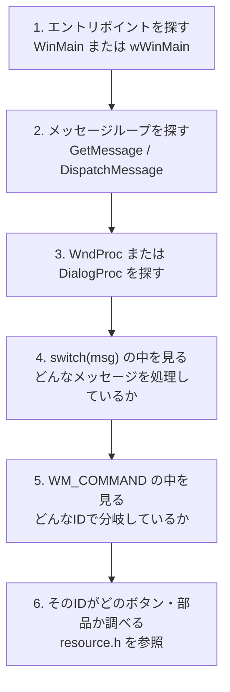
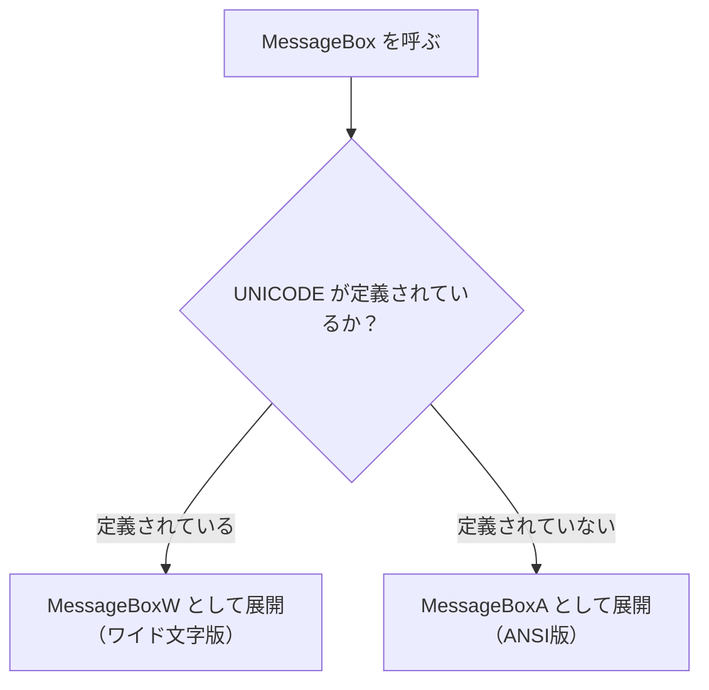
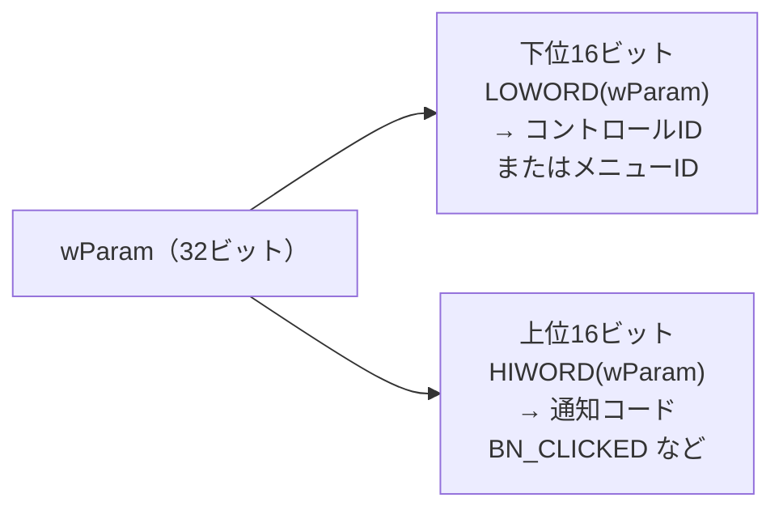
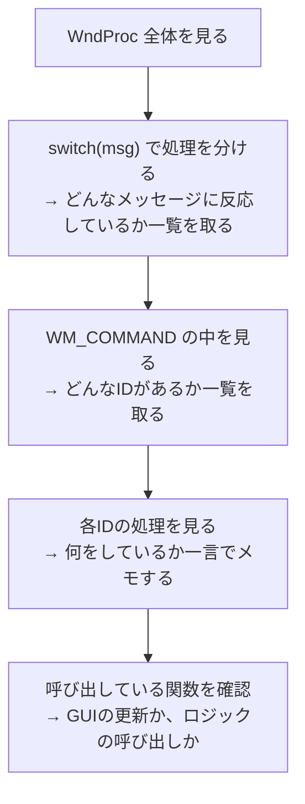

# Phase 7 実行手順書: 案件コード読解モード

## 0. この文書の位置づけ

この文書は、`Windowsデスクトップアプリ開発 学習カリキュラム` の **Phase 7: 案件コード読解モード** を実行するための詳細手順書です。

Phase 6 までで、自分でアプリを作りました。
Phase 7 では、**他人が書いたWindowsデスクトップのコードを読む練習** をします。

実際の案件に入ったとき、最初にすることは「既存のコードを読むこと」です。
このPhaseは、そのための地図を作るPhaseです。

---

## 1. このPhaseでやること

1. `typedef` の逆引きで型を追う
2. `#ifdef UNICODE` の影響を読む
3. `LOWORD(wParam)` / `HIWORD(wParam)` の意味を理解する
4. `IDC_〇〇`, `IDD_〇〇`, `IDR_〇〇` の命名規則を整理する
5. `WndProc` / `DialogProc` を「どこで何が起きているか」の観点で読む

---

## 2. このPhaseのゴール

- 見慣れない案件コードを見たとき、「どこに何が書いてあるか」を追える
- 読めない箇所を「意味不明」ではなく「未整理のWindows方言」として扱える
- 自分で用語辞書を作って整理できる

---

## 3. 読解の基本姿勢

### 3.1 全部を一度に理解しようとしない

案件コードは長いです。
最初から全行を理解しようとすると止まります。

次の順番で読むと、骨格が見えやすくなります。



---

## 4. `typedef` の逆引き

### 4.1 案件コードでよく見るパターン

案件コードでは、このような書き方が多く出ます。

```cpp
typedef void (*PFUNC_CALLBACK)(int, LPARAM);
typedef std::vector<HWND> HwndList;
typedef std::map<UINT, std::wstring> MessageMap;
```

最初は「何だこれ」と感じます。
でも、`typedef` の書き方はパターンが決まっています。

### 4.2 `typedef` の読み方

```
typedef [元の型] [別名];
```

つまり、**一番右が「新しい名前」** です。

```cpp
typedef void (*PFUNC_CALLBACK)(int, LPARAM);
//             ^^^^^^^^^^^^^^^^^^^^^^^^^^^^ 元の型（関数ポインタ型）
//                                          ^^^^^^^^^^^^^^^^ 別名

// 読み方: 「PFUNC_CALLBACK という名前をつけた。
//           中身は int と LPARAM を引数にとる void 型の関数ポインタだ」
```

実際の手順は次の通りです。

1. 一番右の名前が「何と呼ぶか」
2. それ以外が「何の型か」
3. 「何の型か」がわからなくても、「名前があるだけだ」と割り切る

### 4.3 practice: typedef を逆引きしてみる

次のコードを見て、何を定義しているか考えてください。

```cpp
typedef BOOL (WINAPI* PCHANGEWINDOWMESSAGEFILTEREX)(HWND, UINT, DWORD, PVOID);
```

**答えの読み方:**
- 右側: `PCHANGEWINDOWMESSAGEFILTEREX` という名前をつけた
- 左側: `HWND, UINT, DWORD, PVOID` を引数にとって `BOOL` を返す、Windows API 呼び出し規則の関数ポインタ型

「全部わからなくてもいい。『関数ポインタの typedef だ』とわかれば十分」という読み方をしてください。

---

## 5. `#ifdef UNICODE` の影響を読む

### 5.1 なぜ UNICODE 分岐があるのか

Windows API には同じ機能でも2種類のバージョンがあります。

| バージョン | 末尾 | 文字種 |
|---|---|---|
| ANSI版 | `A` (例: `MessageBoxA`) | char型（英語・ASCII） |
| ワイド文字版 | `W` (例: `MessageBoxW`) | wchar_t型（ユニコード） |

現代のWindowsコードでは、ほぼワイド文字版を使います。
`#ifdef UNICODE` は、どちらのバージョンに切り替えるかを制御しています。



### 5.2 案件コードでの読み方

案件コードに `#ifdef UNICODE` が出たら、こう読みます。

```cpp
#ifdef UNICODE
// ワイド文字版のコード
    std::wstring name = L"テスト";
#else
// ANSI版のコード
    std::string name = "test";
#endif
```

「今のプロジェクトで `UNICODE` が定義されているなら上の方が使われる、定義されていなければ下が使われる」という条件分岐です。

Visual Studio 2022 では、Windowsプロジェクトは基本的に `UNICODE` が定義された状態です。
そのため、`#ifdef UNICODE` の上側のコードが有効になります。

---

## 6. `LOWORD` / `HIWORD` を理解する

### 6.1 wParam の構造

`WM_COMMAND` が届いたとき、`wParam` には2つの情報が詰まっています。



### 6.2 使い方

```cpp
case WM_COMMAND:
{
    WORD controlId       = LOWORD(wParam);  // どのコントロールか
    WORD notificationCode = HIWORD(wParam);  // どんな操作か

    // ボタンのクリックは BN_CLICKED (= 0)
    if (controlId == IDC_BTN_DAMAGE && notificationCode == BN_CLICKED)
    {
        // ダメージを与える処理
    }
    return 0;
}
```

ボタンクリックの場合、`HIWORD(wParam)` は `BN_CLICKED`（= 0）になります。
多くの場合、`LOWORD(wParam)` だけ確認すれば十分です。

---

## 7. IDの命名規則を整理する

### 7.1 IDのプレフィックス

案件コードでは、IDには規則的な名前のパターンがあります。

| プレフィックス | 意味 | 例 |
|---|---|---|
| `IDC_` | Control（コントロール）のID | `IDC_BTN_OPEN`, `IDC_LIST_ITEMS` |
| `IDD_` | Dialog（ダイアログ）のID | `IDD_MAIN_DIALOG`, `IDD_ABOUT` |
| `IDM_` | Menu（メニュー）のID | `IDM_FILE_OPEN`, `IDM_EDIT_COPY` |
| `IDR_` | Resource（リソース全般）のID | `IDR_MAINFRAME`, `IDR_TOOLBAR1` |
| `IDS_` | String（文字列リソース）のID | `IDS_APP_TITLE`, `IDS_ERROR_MSG` |
| `IDI_` | Icon（アイコン）のID | `IDI_APP_ICON` |
| `IDB_` | Bitmap（ビットマップ画像）のID | `IDB_BACKGROUND` |

### 7.2 読み方の練習

次のコードを見て、何をしているか考えてください。

```cpp
case WM_COMMAND:
    switch (LOWORD(wParam))
    {
    case IDM_FILE_OPEN:
        // ファイルを開く
        break;
    case IDM_FILE_SAVE:
        // ファイルを保存する
        break;
    case IDM_EDIT_COPY:
        // コピーする
        break;
    case IDC_BTN_SUBMIT:
        // 送信ボタンが押された
        break;
    }
```

`IDM_` = メニュー操作、`IDC_` = ボタン（コントロール）操作という区別がつくと読みやすくなります。

---

## 8. WndProc / DialogProc を読む観点

### 8.1 長い WndProc を読むコツ

案件のコードでは、`WndProc` が何百行にもなることがあります。
次の観点で読むと、全体像が見えやすくなります。



### 8.2 読解メモの作り方

読んだコードは、次の形式でメモします。

```
ファイル名: MainWindow.cpp
関数名: WndProc

処理しているメッセージ:
- WM_CREATE     → ボタンやコンボボックスを配置している
- WM_COMMAND    → ボタン操作を処理している
- WM_DESTROY    → アプリを終了している

WM_COMMAND のID一覧:
- IDC_BTN_OPEN_FILE  → ファイルを開くダイアログを表示
- IDC_BTN_SAVE       → ファイルを保存する関数を呼んでいる
- IDC_BTN_EXIT       → PostQuitMessage を呼んでいる

よくわからない部分:
- GetModuleHandle(nullptr) → 調べる
- WS_EX_LAYERED         → レイヤードウィンドウのフラグらしい
```

「全部わかる」を目指すのではなく、**「わかる部分と未整理の部分を分ける」** ことが大事です。

---

## 9. 案件コード読解の実習

### 9.1 サンプル: 読解対象コード

次のコードを読んで、後の問いに答えてください。

```cpp
#include <windows.h>
#include "resource.h"

// アプリのタイトル（UNICODE 設定に応じて切り替わる）
#define APP_TITLE TEXT("業務管理ツール")

// 処理関数の前方宣言
LRESULT CALLBACK MainWndProc(HWND hwnd, UINT msg, WPARAM wParam, LPARAM lParam);
static void OnCreate(HWND hwnd, HINSTANCE hInstance);
static void OnCommand(HWND hwnd, WPARAM wParam);
static void OnDestroy(HWND hwnd);

// 各処理を分離した実装
LRESULT CALLBACK MainWndProc(HWND hwnd, UINT msg, WPARAM wParam, LPARAM lParam)
{
    HINSTANCE hInstance = (HINSTANCE)GetWindowLongPtr(hwnd, GWLP_HINSTANCE);

    switch (msg)
    {
    case WM_CREATE:   OnCreate(hwnd, hInstance);  return 0;
    case WM_COMMAND:  OnCommand(hwnd, wParam);    return 0;
    case WM_DESTROY:  OnDestroy(hwnd);            return 0;
    }
    return DefWindowProc(hwnd, msg, wParam, lParam);
}

static void OnCreate(HWND hwnd, HINSTANCE hInstance)
{
    CreateWindow(L"BUTTON", L"新規登録", WS_CHILD | WS_VISIBLE | BS_PUSHBUTTON,
        10, 10, 120, 30, hwnd, (HMENU)IDC_BTN_NEW, hInstance, nullptr);
    CreateWindow(L"BUTTON", L"検索", WS_CHILD | WS_VISIBLE | BS_PUSHBUTTON,
        140, 10, 80, 30, hwnd, (HMENU)IDC_BTN_SEARCH, hInstance, nullptr);
}

static void OnCommand(HWND hwnd, WPARAM wParam)
{
    switch (LOWORD(wParam))
    {
    case IDC_BTN_NEW:
        DialogBox(GetModuleHandle(nullptr), MAKEINTRESOURCE(IDD_NEW_DIALOG), hwnd, NewDlgProc);
        break;
    case IDC_BTN_SEARCH:
        MessageBox(hwnd, L"検索機能は未実装です", APP_TITLE, MB_OK | MB_ICONINFORMATION);
        break;
    }
}

static void OnDestroy(HWND hwnd)
{
    PostQuitMessage(0);
}
```

### 9.2 読解課題

1. このコードのエントリポイントはどこか（`WinMain` はどこ？）
2. `MainWndProc` は何のメッセージを処理しているか
3. ボタンは何個あるか、それぞれの名前は何か
4. `IDC_BTN_NEW` が押されたとき何が起きるか
5. `APP_TITLE` は何の定義か。`UNICODE` が定義されていたら何になるか
6. `OnCreate`, `OnCommand`, `OnDestroy` に分けているのはなぜか

### 9.3 模範的な読解メモ例

```
WndProc を3つの関数に分けて書いているパターン。
→ WndProc 自体は短く、switch で各関数を呼ぶだけ。
→ 処理の中身は OnCreate, OnCommand, OnDestroy に分散している。

ボタン:
- IDC_BTN_NEW    → 「新規登録」ダイアログを開く
- IDC_BTN_SEARCH → まだ未実装。MessageBox でお知らせしている。

APP_TITLE:
- TEXT マクロを使っている。
- UNICODE が有効なら L"業務管理ツール" に展開される。

GetModuleHandle(nullptr):
- 自分自身のアプリのインスタンスハンドルを取得している。
- WinMain で受け取る hInstance と同じ内容。
```

---

## 10. よく出る「読めなくなる」パターンと対処

### 10.1 `GWLP_HINSTANCE` など見慣れないフラグ

```cpp
HINSTANCE hInstance = (HINSTANCE)GetWindowLongPtr(hwnd, GWLP_HINSTANCE);
```

「`GWLP_HINSTANCE` って何？」と止まりやすいです。

対処: 「ウィンドウからアプリのインスタンスハンドルを取り出している」と一言でメモして先へ進む。

### 10.2 `MAKEINTRESOURCE`

```cpp
DialogBox(hInstance, MAKEINTRESOURCE(IDD_NEW_DIALOG), hwnd, NewDlgProc);
```

`MAKEINTRESOURCE` は数値IDをリソース識別子に変換するマクロです。

対処: 「ダイアログIDをDialogBoxに渡すためのおまじない」と覚えて先へ進む。

### 10.3 `MB_OK | MB_ICONINFORMATION`

```cpp
MessageBox(hwnd, L"...", L"タイトル", MB_OK | MB_ICONINFORMATION);
```

`|` でフラグを組み合わせています。
- `MB_OK` = OKボタンを表示
- `MB_ICONINFORMATION` = ℹ アイコンを表示

対処: 「フラグの組み合わせでMessageBoxの見た目を変えている」と読む。

---

## 11. 用語辞書を作る

このPhaseの成果物として、自分で読んだコードの用語辞書を作ります。

### 11.1 辞書の書き方（テンプレート）

```
## [用語名]
仲間: [型 / 関数 / マクロ / ID / フラグ]
一言: 〜
見た場面: [どのファイルのどの処理で見たか]
```

### 11.2 辞書サンプル

```
## MAKEINTRESOURCE
仲間: マクロ
一言: 数値IDをリソースとして渡せる形に変換する
見た場面: DialogBox の第2引数でダイアログIDを指定するとき

## GetModuleHandle(nullptr)
仲間: 関数
一言: 実行中のアプリ自身のインスタンスハンドルを取得する
見た場面: WinMain の hInstance を受け取れない場所で使う代替手段

## GWLP_HINSTANCE
仲間: フラグ（定数）
一言: GetWindowLongPtr に渡してインスタンスハンドルを取得する定数
見た場面: OnCreate の中でウィンドウから hInstance を取り出すとき

## MB_ICONINFORMATION
仲間: フラグ
一言: MessageBox に ℹ アイコンを表示させる
見た場面: MessageBox の第4引数で MB_OK と組み合わせて使う
```

---

## 12. Phase 7 の完了条件

- `typedef` を見て「型の別名だ」と判断できる
- `#ifdef UNICODE` を見て処理の分岐を追える
- `LOWORD(wParam)` でコントロールIDを取り出す処理が読める
- `IDC_`, `IDD_`, `IDM_` の区別がつく
- 読めなかった用語をメモして辞書に追加できる
- 「意味不明」ではなく「未整理」として処理できる

---

## 13. 次のPhaseへの接続

Phase 7 が終わったら、**Phase 8: 拡張** に進みます。

Phase 8 では、今のアプリに見た目や機能を追加します。
ただし、追加するときも「GUIとロジックの責務分離」を維持することが重要です。
