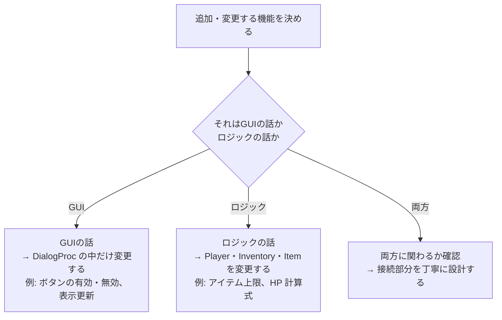
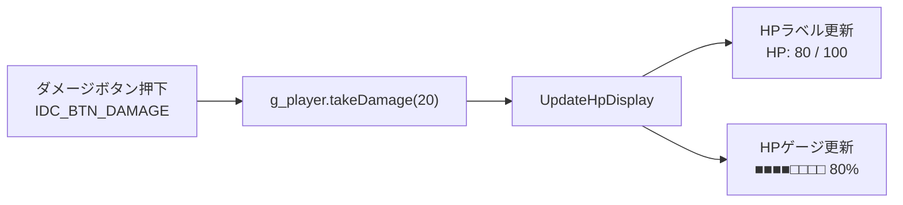
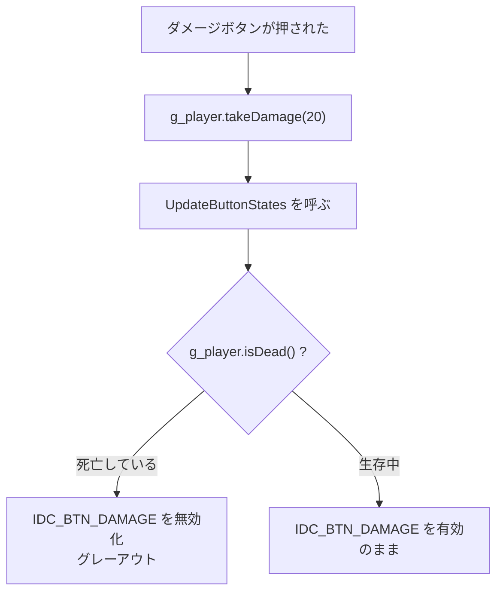
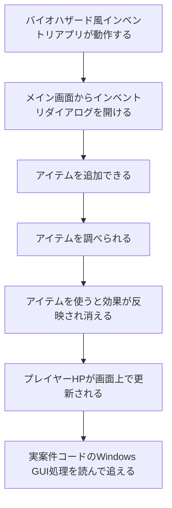

# Phase 8 実行手順書: 拡張

## 0. この文書の位置づけ

この文書は、`Windowsデスクトップアプリ開発 学習カリキュラム` の **Phase 8: 拡張** を実行するための詳細手順書です。

Phase 6 でアプリの基本機能が完成しました。
Phase 8 では、**基本を壊さずに、見た目や操作性を改善する練習** をします。

---

## 1. このPhaseでやること（候補）

次の中から、取り組みたいものを選んで実装します。
すべてやる必要はありません。

| 拡張内容 | 難易度 | 概要 |
|---|---|---|
| A. HPゲージ | ★★☆ | ProgressBar コントロールで HP を可視化 |
| B. ボタン有効・無効制御 | ★☆☆ | HP が 0 のとき「ダメージ」ボタンを無効化 |
| C. アイテムが 0 個のときの制御 | ★☆☆ | インベントリが空のとき「使う」を無効化 |
| D. ダブルクリックで使う | ★★☆ | リストボックスをダブルクリックしたら使う |
| E. アイテム数上限の設定 | ★★☆ | インベントリが満杯のとき追加を拒否 |

---

## 2. このPhaseのゴール

- 追加した機能が動作する
- GUIとロジックの責務分離が維持されている
- 既存の機能が壊れていない

---

## 3. 拡張の基本原則

拡張するときの判断軸は次の通りです。



---

## 4. 拡張 A: HPゲージ（ProgressBar）

### 4.1 ProgressBar を追加する

1. リソースエディタでメイン画面を開く
2. ツールボックスから **Progress Control** を選んでダイアログに配置する
3. IDを `IDC_PROGRESS_HP` にする
4. `resource.h` にIDが追加されたことを確認する

### 4.2 ProgressBar を操作するコード

```cpp
// WM_INITDIALOG でゲージの範囲を設定する
// 最小値 0、最大値 maxHp を設定
SendDlgItemMessage(hwndDlg, IDC_PROGRESS_HP,
    PBM_SETRANGE, 0, MAKELPARAM(0, g_player.getMaxHp()));

// HP が変わるたびにゲージを更新する関数
static void UpdateHpProgress(HWND hwndDlg)
{
    SendDlgItemMessage(hwndDlg, IDC_PROGRESS_HP,
        PBM_SETPOS, (WPARAM)g_player.getHp(), 0);
}
```

### 4.3 呼び出すタイミング

```cpp
// UpdateHpLabel を呼ぶ場所と同じ場所で UpdateHpProgress も呼ぶ
static void UpdateHpDisplay(HWND hwndDlg)
{
    UpdateHpLabel(hwndDlg);
    UpdateHpProgress(hwndDlg);
}
```



---

## 5. 拡張 B: ボタン有効・無効制御

### 5.1 EnableWindow で制御する

```cpp
// ボタンを無効化する（グレーアウト）
EnableWindow(GetDlgItem(hwndDlg, IDC_BTN_DAMAGE), FALSE);

// ボタンを有効化する
EnableWindow(GetDlgItem(hwndDlg, IDC_BTN_DAMAGE), TRUE);
```

### 5.2 HP が 0 のとき「ダメージ」ボタンを無効化する

```cpp
static void UpdateButtonStates(HWND hwndDlg)
{
    BOOL canDamage = g_player.isDead() ? FALSE : TRUE;
    EnableWindow(GetDlgItem(hwndDlg, IDC_BTN_DAMAGE), canDamage);
}
```



---

## 6. 拡張 C: アイテムが 0 個のときの制御

### 6.1 インベントリダイアログを開いたとき

アイテムが 0 個のとき、「使う」「調べる」ボタンを無効化します。

```cpp
static void UpdateInventoryButtons(HWND hwndDlg)
{
    BOOL hasItems = g_inventory.getItemCount() > 0 ? TRUE : FALSE;
    EnableWindow(GetDlgItem(hwndDlg, IDC_BTN_USE),     hasItems);
    EnableWindow(GetDlgItem(hwndDlg, IDC_BTN_EXAMINE), hasItems);
}
```

`WM_INITDIALOG` と、「使う」でアイテムが消えた後の両方で呼びます。

---

## 7. 拡張 D: ダブルクリックで「使う」

### 7.1 リストボックスのダブルクリックを受け取る

リストボックスをダブルクリックすると、`WM_COMMAND` に `LBN_DBLCLK` が来ます。

```cpp
case WM_COMMAND:
{
    WORD id               = LOWORD(wParam);
    WORD notificationCode = HIWORD(wParam);

    // リストボックスのダブルクリック
    if (id == IDC_LIST_ITEMS && notificationCode == LBN_DBLCLK)
    {
        // 「使う」ボタンと同じ処理を行う
        // ... （IDC_BTN_USE の処理をここでも呼ぶ）
    }
    break;
}
```

### 7.2 処理の重複を避けるヘルパー関数

「使う」の処理を関数に切り出すと、ボタンとダブルクリックの両方で使えます。

```cpp
// アイテムを使う処理を独立した関数にする
static void UseSelectedItem(HWND hwndDlg)
{
    int selected = (int)SendDlgItemMessage(
        hwndDlg, IDC_LIST_ITEMS, LB_GETCURSEL, 0, 0);

    if (selected == LB_ERR)
    {
        MessageBox(hwndDlg, L"アイテムを選んでください", L"確認", MB_OK);
        return;
    }

    std::wstring itemName = g_inventory.getItemName(selected);
    g_inventory.useItem(selected, g_player);

    std::wstring msg = itemName + L" を使いました。";
    MessageBox(hwndDlg, msg.c_str(), L"使用", MB_OK);

    RefreshInventoryList(hwndDlg);
    UpdateInventoryButtons(hwndDlg);
}

// 呼び出し側
case IDC_BTN_USE:
    UseSelectedItem(hwndDlg);
    return TRUE;

// ダブルクリック側
if (id == IDC_LIST_ITEMS && notificationCode == LBN_DBLCLK)
{
    UseSelectedItem(hwndDlg);
    return TRUE;
}
```

---

## 8. 拡張 E: アイテム数上限の設定

### 8.1 Inventory にアイテム上限を追加する

これはロジック層の変更です。`Inventory.h` と `Inventory.cpp` を修正します。

```cpp
// Inventory.h に追加
class Inventory
{
public:
    // アイテムの最大所持数
    static constexpr int MAX_ITEMS = 8;

    // アイテムを追加する。上限を超える場合は false を返す
    bool addItem(std::unique_ptr<Item> item);

    // アイテムが満杯かどうかを返す
    bool isFull() const;

    // ... 他のメンバは変わらない
};
```

```cpp
// Inventory.cpp の addItem を修正
bool Inventory::addItem(std::unique_ptr<Item> item)
{
    if (isFull())
    {
        return false;  // 追加失敗
    }
    m_items.push_back(std::move(item));
    return true;  // 追加成功
}

bool Inventory::isFull() const
{
    return static_cast<int>(m_items.size()) >= MAX_ITEMS;
}
```

### 8.2 GUI 側での対応

```cpp
case IDC_BTN_ADD_ITEM:
{
    // ... アイテムを選ぶ処理

    bool added = false;
    if (selected == 0)
    {
        added = g_inventory.addItem(std::make_unique<GreenHerb>());
    }
    else if (selected == 1)
    {
        added = g_inventory.addItem(std::make_unique<FirstAidSpray>());
    }

    if (added)
    {
        MessageBox(hwndDlg, L"アイテムを追加しました", L"通知", MB_OK);
    }
    else
    {
        MessageBox(hwndDlg, L"インベントリが満杯です", L"通知", MB_OK | MB_ICONWARNING);
    }
    return TRUE;
}
```

---

## 9. 拡張するときの注意点

### 9.1 「壊していないか」を確認する

拡張するたびに、既存の機能が動くか確認します。

- ダメージボタンが正常に動くか
- アイテム追加が正常に動くか
- アイテム使用が正常に動くか
- アイテム説明表示が正常に動くか

### 9.2 ロジックの変更はコンソールで先にテストする

Inventory の `addItem` を変更したなら、Phase 4 で作ったコンソールテストコードで先に動作を確認します。
GUIを通してテストするより、コンソールで単体テストする方が速く確実です。

---

## 10. Phase 8 の完了条件

取り組んだ拡張に対して、次を満たせば完了です。

- 追加した機能が動作する
- GUIとロジックの責務分離が維持されている
- 既存の機能が壊れていない

---

## 11. カリキュラム全体の完了条件

Phase 8 まで終わったら、カリキュラム全体の完了確認をします。



すべて達成できたら、**カリキュラム完了** です。

---

## 12. 完了後の次のステップ（参考）

カリキュラム完了後、次に進める候補です。

| テーマ | 概要 |
|---|---|
| MFC の入門 | Win32の土台の上で、MFC のクラス構造を読む |
| Visual Studio デバッガの活用 | ブレークポイント、ウォッチ、コールスタックを使う |
| リファクタリング | WndProc を複数の関数に分割してすっきりさせる |
| 実案件コードの読解 | 実際の現場コードを、用語辞書を使いながら読む |
