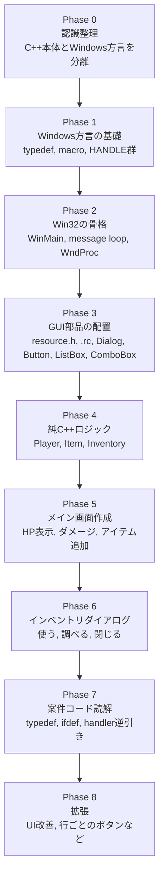

# Windowsデスクトップアプリ開発 学習カリキュラム

## 0. このドキュメントの目的

このドキュメントは、C++でのWindowsデスクトップアプリ開発を学習するための**基準文書**である。  
今後の学習は原則として本ドキュメントに準じて進める。

今回の学習で必要なのは、C++言語そのものをゼロから学び直すことではない。  
目的は、**Windowsデスクトップアプリ独特のコードと流儀を読めるようになり、簡単なGUIアプリを自力で作れるようになること**である。

---

## 1. 背景整理

次の案件で扱うC++は、組み込み系ではなく、**Windowsデスクトップアプリ開発のC++**である。  
そのため、通常のC++学習だけでは不足する領域がある。

特に次のような要素に慣れる必要がある。

- ボタンなどのウィンドウ部品をどう配置するか
- イベント通知をどう受け取るか
- ハンドラをどこに書くか
- `HWND`, `DWORD`, `UINT`, `WPARAM`, `LPARAM`, `LRESULT`, `VOID` などのWindows特有の型名
- `#define`, `#ifdef`, `#ifndef` などのプリプロセッサマクロ
- `resource.h`, `.rc`, ダイアログリソースなどのWindowsデスクトップアプリ特有の構成

重要なのは、これらは「C++がわからない」のではなく、**Windowsデスクトップ開発の方言がまだ未学習**だという点である。

この認識を誤ると、不要な焦りが生まれる。  
今回の学習は、C++本体とWindows方言を切り分けて攻略する。

---

## 2. 学習の最終目標（GOAL）

### 2.1 作成するアプリ

**バイオハザード風インベントリアプリ（簡易版）** を作成する。

### 2.2 アプリ仕様

#### メイン画面

- プレイヤーの体力を表示する
- 「メニューを開く」ボタンがある
- 「アイテムを追加する」操作がある
  - 追加するアイテムはプルダウン（コンボボックス）から選択する
- 「プレイヤーにダメージを与える」ボタンがある

#### インベントリ画面（メニューダイアログ）

- プレイヤーの持ち物一覧が表示される
- 選択中のアイテムに対して以下の操作ができる
  - 「使う」
  - 「調べる」
- 「使う」を押すとアイテムの効果が発動し、使用後はインベントリから消える
- 「調べる」を押すとアイテム説明が表示される

### 2.3 今回はやらないこと

今回の学習では、意図的に範囲を絞る。  
以下は対象外とする。

- ItemBox の実装
- 複雑なドラッグ操作
- 本格的なグリッド型UI
- 行ごとに個別ボタンを動的配置する高度なGUI
- 複雑な画像描画やアニメーション
- 保存／読み込み機能

理由は単純で、最初から範囲を広げると、**本質である「Windows GUIの流れ」と「C++ロジックの分離」よりも、見た目の実装に引っ張られるから**である。

---

## 3. 学習方針

### 3.1 方針の中心

この学習では、以下の2つを明確に分離する。

#### A. 純C++で表現するロジック

- Player
- Item
- Inventory
- アイテム使用時の効果
- 使用後に消える挙動

#### B. Windowsデスクトップアプリ固有のGUI層

- ボタン配置
- ラベル表示
- ダイアログ表示
- メッセージ通知
- コントロールID
- ハンドラ

### 3.2 なぜ分けるのか

GUIコードと業務ロジックを混ぜると、次の問題が起こる。

- 何がWindows特有の処理なのか見えなくなる
- C++としての設計力が育たない
- デバッグが難しくなる
- 案件コードを読むときに構造を見失う

したがって、**GUIは入力と表示、ロジックはPlayer / Inventory側**という分担を原則とする。

### 3.3 学習対象の優先順位

優先順位は次の通り。

1. Windows GUIの骨格を理解する
2. Windows独特の型やマクロに慣れる
3. リソースエディタで画面部品を配置する
4. C++クラス設計とGUIを接続する
5. 最後に見た目や拡張を行う

---

## 4. 採用する実装方針

### 4.1 今回の実装スタイル

今回は、**Win32 API + リソースエディタ** を前提に進める。

理由は以下の通り。

- Windowsデスクトップ案件で見かける基礎に直結しやすい
- `HWND`, `WPARAM`, `LPARAM`, `WM_COMMAND` などの実物に触れられる
- GUI配置をVisual Studio上で行える
- 今後MFC案件に入っても、土台の理解として役立つ

### 4.2 MFCについて

MFCは将来的に読む可能性があるが、本カリキュラムでは**最初からMFC前提にはしない**。  
まずはWindows GUIの基本構造を理解することを優先する。

理由は、MFCを先に覚えると、メッセージ処理やコントロールIDの意味を暗記で済ませてしまいやすいからである。

---

## 5. 到達目標

このカリキュラム完了時点で、以下ができる状態を目指す。

### 5.1 コード読解面

- `HWND`, `DWORD`, `UINT`, `WPARAM`, `LPARAM`, `LRESULT`, `VOID` を見て混乱しない
- `#define`, `#ifdef`, `#ifndef` の役割を理解できる
- `WndProc` や `DialogProc` の流れを追える
- `WM_COMMAND` を見て「ボタンやメニュー操作の通知だ」と判断できる
- コントロールIDとイベント処理の関係を理解できる

### 5.2 実装面

- ダイアログにボタン、ラベル、リストボックス、コンボボックスを配置できる
- ボタン押下で処理を分岐できる
- アイテム追加、使用、説明表示ができる
- プレイヤーHP表示を更新できる
- GUIコードと業務ロジックを分離できる

### 5.3 心理面

- Windowsデスクトップアプリのコードを見ても、完全な未知ではなくなる
- 「読めば追える」という感覚を持てる
- 焦りではなく、構造で整理して理解できる

---

## 6. 学習成果物

本カリキュラムでは、学習の途中で以下の成果物を作る。

### 6.1 コード成果物

- Windows型・マクロの練習コード
- ボタン1個だけの最小Win32アプリ
- リソースエディタで作ったダイアログ練習
- `Player`, `Item`, `Inventory` の純C++実装
- バイオハザード風インベントリアプリ本体

### 6.2 ドキュメント成果物

- Windows型・マクロ用語メモ
- メッセージ処理の流れ図
- GUI部品とID一覧
- 実案件コードの読解メモ
- 詰まりポイント一覧

---

## 7. カリキュラム全体マップ

---

## 8. 各Phaseの詳細

## Phase 0: 認識整理

### 目的

C++本体とWindowsデスクトップ開発固有の要素を切り分ける。

### 学習内容

- C++とWindows APIは別レイヤーであること
- Windowsコードに多い型名・マクロ・ハンドルの位置づけ
- メッセージ駆動という考え方

### 完了条件

次を言語化できること。

- `HWND` はウィンドウそのものではなく、識別用のハンドル
- `DWORD` はWindows流儀の型別名
- ボタン押下は関数直結ではなく通知メッセージで飛ぶ

---

## Phase 1: Windows方言の基礎

### 目的

案件コードに出てくる型名・マクロを見て、最低限意味が取れるようにする。

### 学習内容

- `typedef` と `using`
- `#define`, `#ifdef`, `#ifndef`
- `DWORD`, `UINT`, `WORD`, `BYTE`, `BOOL`, `VOID`
- `HWND`, `HINSTANCE`, `HMENU`
- `WPARAM`, `LPARAM`, `LRESULT`
- `UNICODE`, `TEXT()`, `L"文字列"`

### 完了条件

- 型別名とマクロの違いを説明できる
- Windows型を見て「型」「ハンドル」「メッセージ関連情報」のどれか判断できる

---

## Phase 2: Win32の骨格

### 目的

Windows GUIアプリがどのような流れで動いているかを理解する。

### 学習内容

- `WinMain` / `wWinMain`
- ウィンドウクラス登録
- ウィンドウ生成
- メッセージループ
- `WndProc`
- `WM_CREATE`, `WM_COMMAND`, `WM_DESTROY`

### 完了条件

- 最小GUIアプリを読める
- ボタンのクリック通知がどこで処理されるか説明できる

---

## Phase 3: GUI部品の配置

### 目的

Visual Studio上で、GUI部品を配置し、それをコードから扱えるようにする。

### 学習内容

- リソースエディタの使い方
- `.rc` と `resource.h` の役割
- ダイアログ作成
- `Button`, `Static`, `ListBox`, `ComboBox` の配置
- コントロールIDの付け方

### 完了条件

- ダイアログに部品を配置できる
- コントロールIDを使ってイベント処理に結びつけられる

---

## Phase 4: 純C++ロジック

### 目的

GUI抜きで、インベントリの振る舞いを完成させる。

### 学習内容

- `Player`
- `Item` 抽象基底クラス
- `GreenHerb`, `FirstAidSpray` などの具象アイテム
- `Inventory`
- `std::vector`
- `std::unique_ptr`
- 使用後削除の設計

### 完了条件

GUIなしで以下が動くこと。

- アイテム追加
- アイテム使用
- アイテム説明取得
- 使用後削除
- HP回復／ダメージ処理

---

## Phase 5: メイン画面作成

### 目的

アプリの入り口となる画面を完成させる。

### 学習内容

- HP表示ラベル
- 「メニューを開く」ボタン
- 「ダメージを与える」ボタン
- アイテム追加用コンボボックス
- 「アイテム追加」ボタン
- 画面更新の反映

### 完了条件

- HP表示が変化する
- ダメージを与えられる
- アイテムを追加できる

---

## Phase 6: インベントリダイアログ

### 目的

GOALアプリの中核機能を完成させる。

### 学習内容

- インベントリ一覧表示
- 選択中アイテムの取得
- 「使う」処理
- 「調べる」処理
- 使用後の一覧更新
- メイン画面への状態反映

### 完了条件

- ダイアログで持ち物一覧を確認できる
- アイテムを使うと効果が発動し、消える
- アイテム説明を表示できる

---

## Phase 7: 案件コード読解モード

### 目的

自作コードだけで終わらせず、実際の案件コードを読めるようにする。

### 学習内容

- `typedef` の逆引き
- `#ifdef UNICODE` の意味
- `LOWORD(wParam)` / `HIWORD(wParam)`
- `IDC_XXX`, `IDD_XXX`, `IDR_XXX`
- `WndProc` / `DialogProc` の読み方
- GUI更新と業務ロジックの分離の観点

### 完了条件

- 実案件コードの関数を見て、何をしているか段階的に追える
- 読めない箇所を「意味不明」ではなく「未整理のWindows方言」として扱える

---

## Phase 8: 拡張

### 目的

基本機能完成後に、見た目や操作性を改善する。

### 候補

- 行ごとの「使う」「調べる」ボタン
- アイコン表示
- HPゲージ
- ダブルクリック操作
- ボタン有効／無効制御
- UIレイアウト改善

### 完了条件

- 本質を壊さずに機能追加できる
- GUIとロジックの責務分離を維持できる

---

## 9. 具体的な学習順序（推奨）

### Day 1

- `typedef`, `using`
- `#define`, `#ifdef`
- Windows型の整理

### Day 2

- `WinMain`
- メッセージループ
- `WndProc`
- ボタン1個の最小アプリ

### Day 3

- リソースエディタ
- ダイアログ作成
- ボタン、ラベル、リストボックス、コンボボックス配置

### Day 4

- `Player`, `Item`, `Inventory` をコンソールで完成

### Day 5

- メイン画面作成
- HP表示
- ダメージ処理
- アイテム追加処理

### Day 6

- インベントリダイアログ作成
- 一覧表示
- 「調べる」処理

### Day 7

- 「使う」処理
- 使用後削除
- メイン画面反映

### Day 8

- 実案件コード読解
- 用語辞書化
- 不明点整理

---

## 10. 学習中のルール

### 10.1 ルール

- 最初から見た目を凝りすぎない
- GUIコードに業務ロジックを書き込みすぎない
- まず最小構成で動かす
- Windows特有の単語に圧倒されても、すべてを一度に覚えようとしない
- 読めないものは「未整理の用語」としてメモする

### 10.2 禁止事項

- `WndProc` にすべてのロジックを詰め込む
- UI改善を優先して基礎理解を飛ばす
- `windows.h` の用語を暗記だけで済ませる
- 最初からItemBoxや複雑なレイアウトに手を出す

---

## 11. 詰まりやすいポイント

### 11.1 想定される詰まり

- Windows型名が多くて、何が型で何が関数かわからなくなる
- ボタン押下の処理がどこに来るのか見失う
- `resource.h` と `.rc` の関係が見えない
- GUIとロジックの責務が混ざる
- `#ifdef UNICODE` などの条件分岐でコードが読みにくく感じる

### 11.2 対処方針

- 型／関数／マクロ／IDを分類して読む
- 「この処理は誰が呼ぶのか」を常に確認する
- 画面側は入力と表示、ロジック側は状態変化と割り切る
- 不明語はまとめて辞書化する

---

## 12. 用語の最低限メモ

- `HWND` : ウィンドウを識別するハンドル
- `DWORD` : Windows流儀の符号なし整数型名
- `UINT` : 符号なし整数
- `WPARAM` : メッセージ追加情報その1
- `LPARAM` : メッセージ追加情報その2
- `LRESULT` : メッセージ処理関数の戻り値
- `VOID` : `void`
- `WM_COMMAND` : ボタンやメニュー操作の通知
- `resource.h` : リソースID定義ファイル
- `.rc` : ダイアログやメニューなどのリソース定義ファイル

---

## 13. 本カリキュラムの完了条件

以下を満たしたら、本カリキュラム完了とする。

- バイオハザード風インベントリアプリが動作する
- メイン画面からインベントリダイアログを開ける
- アイテムを追加できる
- アイテムを調べられる
- アイテムを使うと効果が反映され、消える
- プレイヤーHPが画面上で更新される
- 実案件コードの基本的なWindows GUI処理を読んで追える

---

## 14. 次にやること

本ドキュメントを学習の基準文書として固定し、次フェーズでは以下を行う。

1. Phase 1 の詳細手順を作る  
2. Visual Studio 2022 での具体的な操作手順を書く  
3. 実際に最小サンプルを作って動かす  
4. 各Phaseごとに完了判定を記録する

---

## 15. 補足

今回の学習で感じた不安や恐怖は、能力不足の証拠ではない。  
それは単に、**C++そのものではなく、Windowsデスクトップアプリ開発という別レイヤーに初めて本格的に触れた反応**である。

ただし、それを軽視するべきでもない。  
Windowsデスクトップ開発には独特の流儀があり、専用の慣れが必要である。  
だからこそ、本カリキュラムでは焦って範囲を広げず、構造で整理して前進する。
